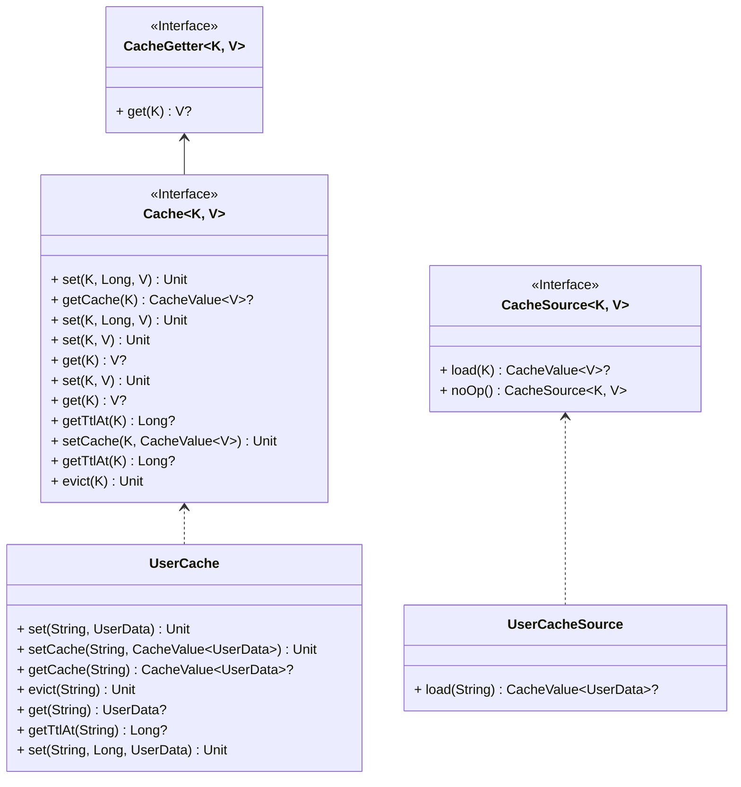
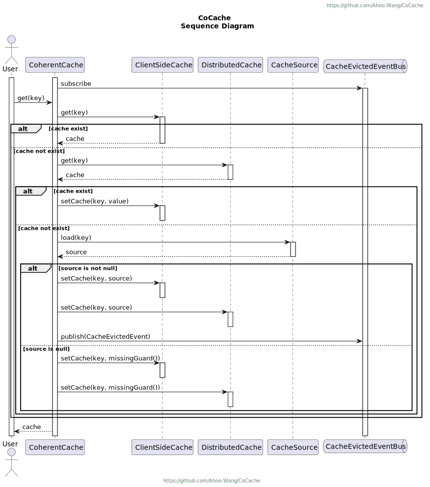
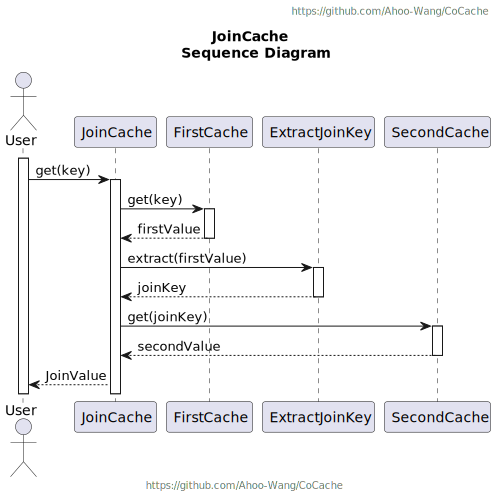

# CoCache
Level 2 Distributed Coherence Cache Framework

[](https://www.apache.org/licenses/LICENSE-2.0.html)
[](https://github.com/Ahoo-Wang/CoCache/releases)
[](https://maven-badges.herokuapp.com/maven-central/me.ahoo.cocache/cocache-core)
[](https://www.codacy.com/gh/Ahoo-Wang/CoCache/dashboard?utm_source=github.com&amp;utm_medium=referral&amp;utm_content=Ahoo-Wang/CoCache&amp;utm_campaign=Badge_Grade)
[](https://codecov.io/gh/Ahoo-Wang/CoCache)
[](https://github.com/Ahoo-Wang/CoCache)
[](https://deepwiki.com/Ahoo-Wang/CoCache)

## Architecture

<p align="center" style="text-align:center">
  
</p>

## Installation

> Use *Gradle(Kotlin)* to install dependencies

```kotlin
implementation("me.ahoo.cocache:cocache-spring-boot-starter")
```

> Use *Gradle(Groovy)* to install dependencies

```groovy
implementation 'me.ahoo.cocache:cocache-spring-boot-starter'
```

> Use *Maven* to install dependencies

```xml
<dependency>
    <groupId>me.ahoo.cocache</groupId>
    <artifactId>cocache-spring-boot-starter</artifactId>
    <version>${cocache.version}</version>
</dependency>
```

## Usage



```kotlin

/**
 * 定义缓存接口
 * 可选的配置
 */
@CoCache(keyPrefix = "user:", ttl = 120)
/**
 * 可选的配置
 */
@GuavaCache(
    maximumSize = 1000_000,
    expireUnit = TimeUnit.SECONDS,
    expireAfterAccess = 120
)
interface UserCache : Cache<String, User>

@EnableCoCache(caches = [UserCache::class])
@SpringBootApplication
class AppServer

/**
 * 可选的配置
 */
@Configuration
class UserCacheConfiguration {
    @Bean
    fun customizeUserClientSideCache(): ClientSideCache<User> {
        return MapClientSideCache()
    }

    @Bean
    fun customizeUserCacheSource(): CacheSource<String, User> {
        return CacheSource.noOp()
    }
}
```

## CoCache `Get` Sequence Diagram

<p align="center" style="text-align:center">
  
</p>

## JoinCache `Get` Sequence Diagram

<p align="center" style="text-align:center">
  
</p>