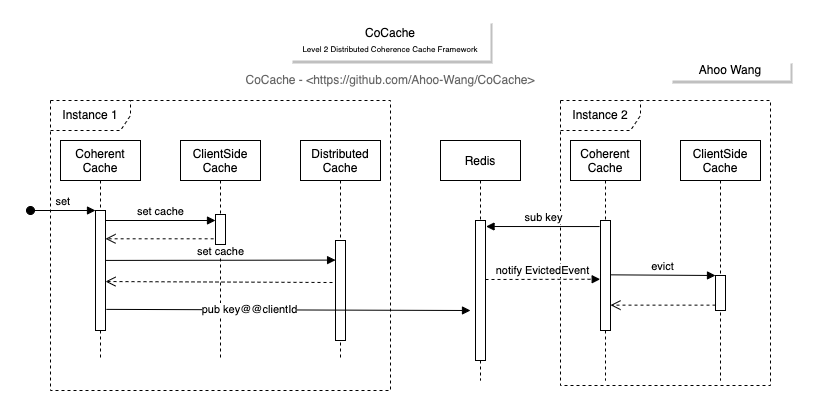
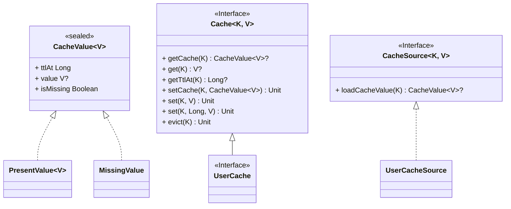
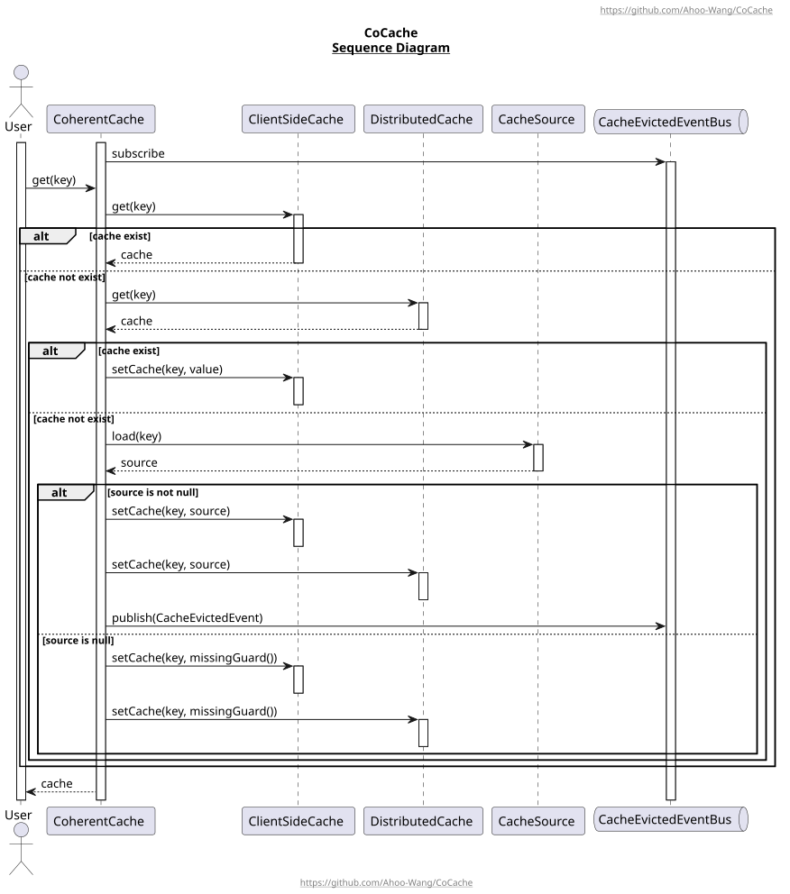
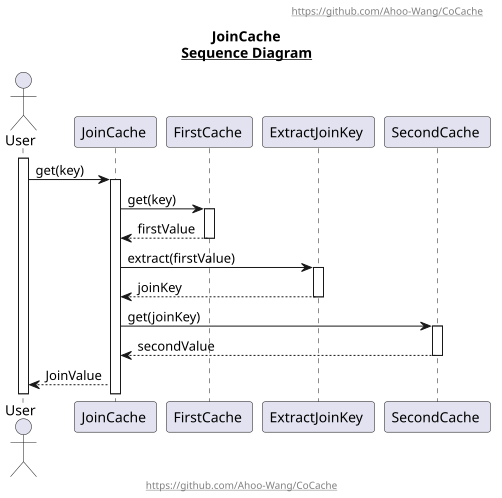

# CoCache
Level 2 Distributed Coherence Cache Framework

[](https://www.apache.org/licenses/LICENSE-2.0.html)
[](https://github.com/Ahoo-Wang/CoCache/releases)
[](https://central.sonatype.com/artifact/me.ahoo.cocache/cocache-core)
[](https://www.codacy.com/gh/Ahoo-Wang/CoCache/dashboard?utm_source=github.com&amp;utm_medium=referral&amp;utm_content=Ahoo-Wang/CoCache&amp;utm_campaign=Badge_Grade)
[](https://codecov.io/gh/Ahoo-Wang/CoCache)
[](https://github.com/Ahoo-Wang/CoCache/actions/workflows/ci.yml)
[](https://deepwiki.com/Ahoo-Wang/CoCache)

> [中文文档](https://cocache.ahoo.me/zh/) | [English Document](https://cocache.ahoo.me/)

## Architecture

<p align="center" style="text-align:center">
  
</p>

## Installation

> Use *Gradle(Kotlin)* to install dependencies

```kotlin
implementation("me.ahoo.cocache:cocache-spring-boot-starter")
```

> Use *Gradle(Groovy)* to install dependencies

```groovy
implementation 'me.ahoo.cocache:cocache-spring-boot-starter'
```

> Use *Maven* to install dependencies

```xml
<dependency>
    <groupId>me.ahoo.cocache</groupId>
    <artifactId>cocache-spring-boot-starter</artifactId>
    <version>${cocache.version}</version>
</dependency>
```

## Usage


```mermaid
classDiagram
direction BT
class Cache~K, V~ {
  <<Interface>>
  + getCache(K) CacheValue~V~?
  + get(K) V?
  + getTtlAt(K) Long?
  + setCache(K, CacheValue~V~) Unit
  + set(K, V) Unit
  + set(K, Long, V) Unit
  + evict(K) Unit
}
class CacheValue~V~ {
  <<sealed>>
  + ttlAt Long
  + value V?
  + isMissing Boolean
}
class PresentValue~V~
class MissingValue
class CacheSource~K, V~ {
  <<Interface>>
  + loadCacheValue(K) CacheValue~V~?
}
class UserCache {
  <<Interface>>
}
PresentValue~V~ ..|> CacheValue~V~
MissingValue ..|> CacheValue~V~
UserCache --|> Cache~K, V~
UserCacheSource ..|> CacheSource~K, V~
```

```kotlin
/**
 * Declare a cache interface; CoCache generates the implementation.
 * ttl/ttlAmplitude/missingTtl are seconds (defaults: 3600 / 60 / 60).
 */
@CoCache(keyPrefix = "user:", ttl = 120)
/**
 * Optional: L2 (Caffeine) settings. L2 is always bounded.
 */
@CaffeineCache(maximumSize = 1_000_000, expireAfterAccess = 120)
interface UserCache : Cache<String, User>

@EnableCoCache(caches = [UserCache::class])
@SpringBootApplication
class AppServer

/**
 * Optional customization. Stateful components are resolved by bean name
 * `{cacheName}.ClientSideCache | .DistributedCache | .KeyConverter`;
 * a CacheSource may also be resolved by its generic type.
 */
@Configuration
class UserCacheConfiguration {
    @Bean("UserCache.ClientSideCache")
    fun userClientSideCache(): ClientSideCache<User> {
        return CaffeineClientSideCache.build(maximumSize = 100_000)
    }

    @Bean
    fun userCacheSource(userRepository: UserRepository): CacheSource<String, User> {
        // returning null writes a negative cache for `missingTtl` seconds
        return CacheSource { id -> userRepository.findById(id)?.let { CacheValue.forever(it) } }
    }
}
```

## Consistency Guarantees

- **Bounded staleness**: values expire after `ttl` (finite by default); negative cache entries after `missingTtl`; every (re)subscription of the eviction channel clears L2, so lost pub/sub messages cannot leave L2 stale.
- **No lost invalidations**: concurrent loads are coalesced per key, and every write-back (L1 → L2 fill, source load) is discarded or undone if an eviction happened meanwhile — local or remote.
- **Write pattern**: update the data source first, then `evict(key)` (or `set` the new value).

See [`docs/architecture.md`](docs/architecture.md) for the full design and invariants.

## CoCache `Get` Sequence Diagram

<p align="center" style="text-align:center">
  
</p>

## JoinCache `Get` Sequence Diagram

<p align="center" style="text-align:center">
  
</p>
## Contributing

See [CONTRIBUTING.md](CONTRIBUTING.md) for the branching model, quality gates, and release process. Report security issues privately per [SECURITY.md](SECURITY.md).

## License

[Apache License 2.0](LICENSE)
