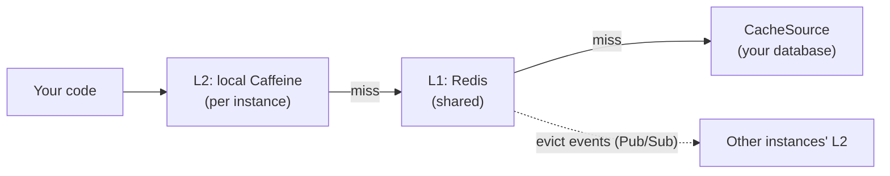

# CoCache

Level 2 Distributed Coherence Cache Framework

[](https://www.apache.org/licenses/LICENSE-2.0.html)
[](https://github.com/Ahoo-Wang/CoCache/releases)
[](https://central.sonatype.com/artifact/me.ahoo.cocache/cocache-core)
[](https://www.codacy.com/gh/Ahoo-Wang/CoCache/dashboard?utm_source=github.com&amp;utm_medium=referral&amp;utm_content=Ahoo-Wang/CoCache&amp;utm_campaign=Badge_Grade)
[](https://codecov.io/gh/Ahoo-Wang/CoCache)
[](https://github.com/Ahoo-Wang/CoCache/actions/workflows/ci.yml)
[](https://deepwiki.com/Ahoo-Wang/CoCache)

> **Documentation:** [English](https://cocache.ahoo.me/) | [中文](https://cocache.ahoo.me/zh/)

CoCache gives Spring Boot services local-memory read latency without serving stale data indefinitely. Each instance keeps an in-process copy (L2, Caffeine) in front of a shared copy (L1, Redis) in front of your data source. Writes and evicts on one instance tell every other instance to drop its local copy.


```mermaid
flowchart LR
    App["Your code"] --> L2["L2: local Caffeine<br>(per instance)"]
    L2 -- miss --> L1["L1: Redis<br>(shared)"]
    L1 -- miss --> Src["CacheSource<br>(your database)"]
    L1 -. "evict events (Pub/Sub)" .-> Peers["Other instances' L2"]
```

## Quick start

```kotlin
implementation("me.ahoo.cocache:cocache-spring-boot-starter:5.0.1")
implementation("org.springframework.boot:spring-boot-starter-data-redis")
```

```kotlin
@CoCache(keyPrefix = "user:", ttl = 120)          // seconds; defaults: ttl 3600, ttlAmplitude 60, missingTtl 60
interface UserCache : Cache<String, User>         // CoCache generates the implementation

@EnableCoCache(caches = [UserCache::class])
@SpringBootApplication
class AppServer

@Configuration
class UserCacheConfiguration {
    @Bean // loads on an L2 + L1 miss; null caches "not found" for missingTtl seconds
    fun userCacheSource(repo: UserRepository) =
        CacheSource<String, User> { id -> repo.findById(id)?.let { CacheValue.of(it, TtlAt.at(120)) } }
}

// usage
val user = userCache[id]              // L2 → L1 → CacheSource
userRepository.save(changed)          // write: update the source of truth first,
userCache.evict(changed.id)           // then evict — every instance drops its copy
```

The [Quick Start](https://cocache.ahoo.me/guide/quick-start) walks through each step.

## Guarantees

- **Bounded staleness.** Values expire after `ttl`, and negative entries after `missingTtl`. Every (re)subscription of the eviction channel clears L2, so lost Pub/Sub messages cannot leave L2 stale.
- **No lost invalidations.** Concurrent loads of a key are coalesced. A write-back that overlaps an invalidation is discarded or undone.
- **Not linearizable.** Peers see a change once the eviction event arrives. The cache-aside race in L1 is bounded by `ttl`.

[Consistency](https://cocache.ahoo.me/architecture/consistency) states the full model. The normative design and its invariants are in [`docs/architecture.md`](docs/architecture.md).

## Documentation map

| You want to… | Read |
|--------------|------|
| Use CoCache | [Guide](https://cocache.ahoo.me/guide/): introduction, quick start, configuration, JoinCache, Spring Cache, operations, changelog |
| Understand or extend it | [Architecture](https://cocache.ahoo.me/architecture/): design, consistency, SPI and TCK |
| Change CoCache itself | [`CONTRIBUTING.md`](CONTRIBUTING.md), then [`docs/architecture.md`](docs/architecture.md) |
| Work on it as an AI agent | [`AGENTS.md`](AGENTS.md) and the [`skills/cocache`](skills/cocache/SKILL.md) skill |

## Contributing

See [CONTRIBUTING.md](CONTRIBUTING.md). Report security issues privately per [SECURITY.md](SECURITY.md).

## License

[Apache License 2.0](LICENSE)
