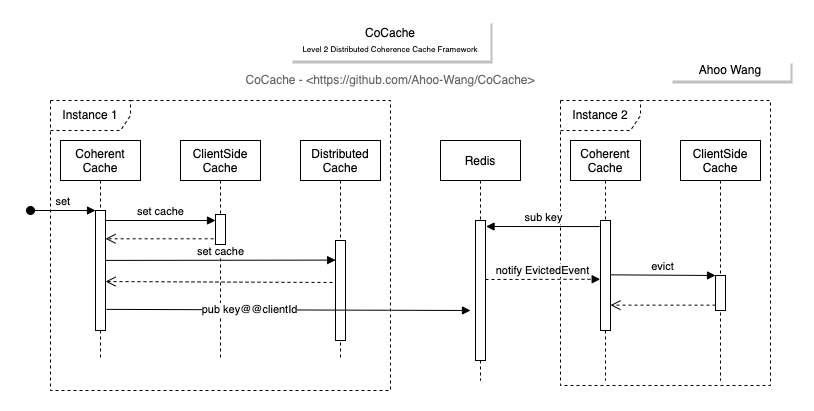

# CoCache
Level 2 Distributed Coherence Cache Framework

[](https://www.apache.org/licenses/LICENSE-2.0.html)
[](https://github.com/Ahoo-Wang/CoCache/releases)
[](https://maven-badges.herokuapp.com/maven-central/me.ahoo.cocache/cocache-core)
[](https://www.codacy.com/gh/Ahoo-Wang/CoCache/dashboard?utm_source=github.com&amp;utm_medium=referral&amp;utm_content=Ahoo-Wang/CoCache&amp;utm_campaign=Badge_Grade)
[](https://codecov.io/gh/Ahoo-Wang/CoCache)


## Architecture

<p align="center" style="text-align:center">
  
</p>

## Installation

> Use *Gradle(Kotlin)* to install dependencies

```kotlin
implementation("me.ahoo.cocache:cocache-spring-boot-starter")
```

> Use *Gradle(Groovy)* to install dependencies

```groovy
implementation 'me.ahoo.cocache:cocache-spring-boot-starter'
```

> Use *Maven* to install dependencies

```xml
<dependency>
    <groupId>me.ahoo.cocache</groupId>
    <artifactId>cocache-spring-boot-starter</artifactId>
    <version>${coapi.version}</version>
</dependency>
```

## Usage

```kotlin
@AutoConfiguration
class UserCacheAutoConfiguration {
    companion object {
        const val CACHE_KEY_PREFIX = "iam"
        const val USER_CACHE_BEAN_NAME = "userCache"
        const val USER_CACHE_SOURCE_BEAN_NAME = "${USER_CACHE_BEAN_NAME}Source"
    }

    @Bean
    @ConditionalOnMissingBean(name = [USER_CACHE_SOURCE_BEAN_NAME])
    fun userCacheSource(userClient: UserClient): CacheSource<String, UserData> {
        return UserCacheSource(userClient)
    }

    @Bean
    @ConditionalOnMissingBean
    fun userCache(
        @Qualifier(USER_CACHE_SOURCE_BEAN_NAME) cacheSource: CacheSource<String, UserData>,
        redisTemplate: StringRedisTemplate,
        cacheManager: CacheManager,
        clientIdGenerator: ClientIdGenerator
    ): UserCache {
        val clientId = clientIdGenerator.generate()
        val cacheKeyPrefix = "$CACHE_KEY_PREFIX:user:"
        val codecExecutor = ObjectToJsonCodecExecutor(UserData::class.java, redisTemplate, JsonSerializer)
        val distributedCaching: DistributedCache<UserData> = RedisDistributedCache(redisTemplate, codecExecutor)
        val delegate = cacheManager.getOrCreateCache(
            CacheConfig(
                cacheName = USER_CACHE_BEAN_NAME,
                clientId = clientId,
                keyConverter = ToStringKeyConverter(cacheKeyPrefix),
                distributedCaching = distributedCaching,
                cacheSource = cacheSource,
            ),
        )
        return UserCache(delegate)
    }
}
```

## CoCache `Get` Sequence Diagram

<p align="center" style="text-align:center">
  
</p>

## JoinCache `Get` Sequence Diagram

<p align="center" style="text-align:center">
  
</p>