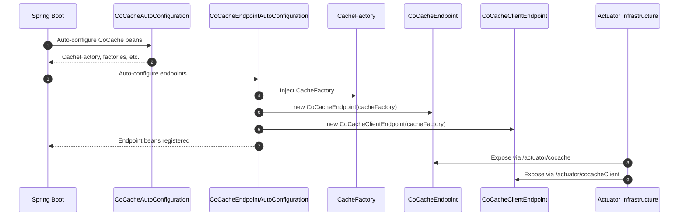
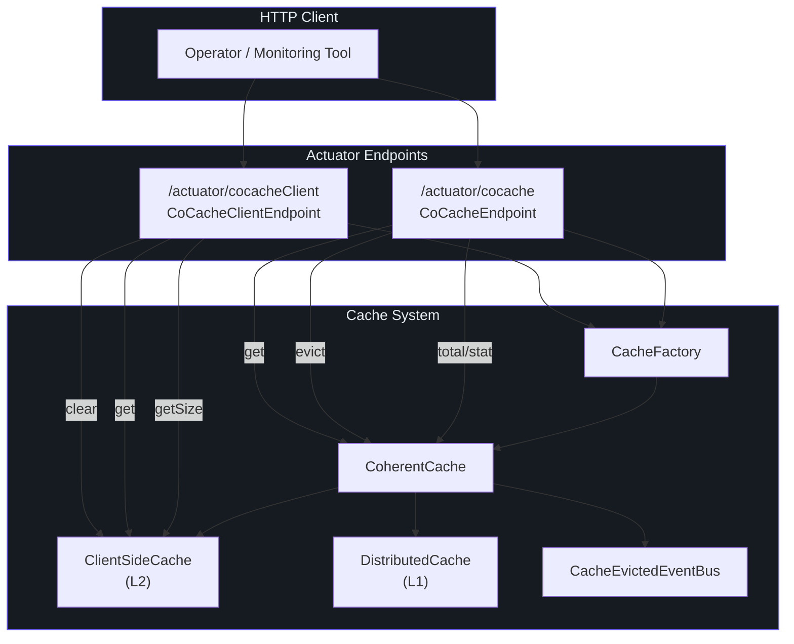
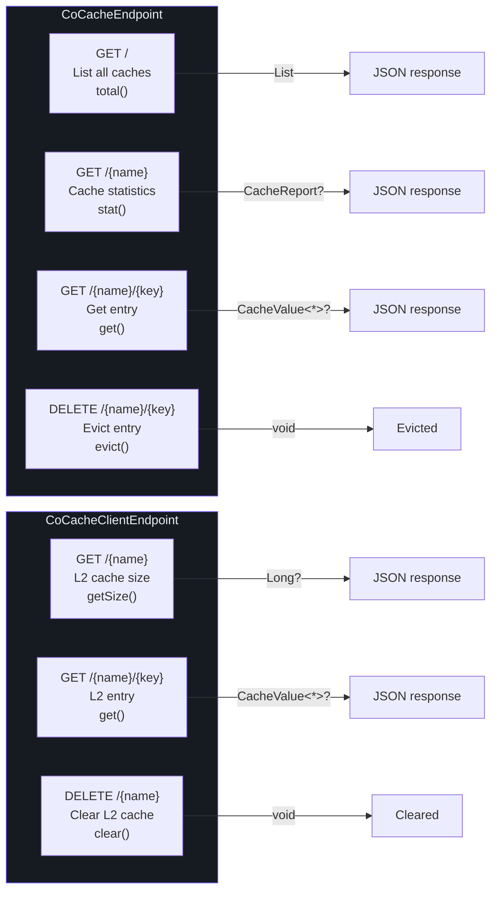

# Actuator Endpoints

CoCache exposes two Spring Boot Actuator endpoints for runtime monitoring and management of caches. These endpoints are auto-configured by `CoCacheEndpointAutoConfiguration` when Spring Boot Actuator is on the classpath.

## Endpoint Overview

| Endpoint ID | Class | URL | Purpose | Source |
|------------|-------|-----|---------|--------|
| `cocache` | `CoCacheEndpoint` | `/actuator/cocache` | Coherent cache management (total, stat, evict, get) | [CoCacheEndpoint.kt:27](https://github.com/Ahoo-Wang/CoCache/blob/main/cocache-spring-boot-starter/src/main/kotlin/me/ahoo/cache/spring/boot/starter/CoCacheEndpoint.kt#L27) |
| `cocacheClient` | `CoCacheClientEndpoint` | `/actuator/cocacheClient` | Client-side (L2) cache management (size, get, clear) | [CoCacheClientEndpoint.kt:24](https://github.com/Ahoo-Wang/CoCache/blob/main/cocache-spring-boot-starter/src/main/kotlin/me/ahoo/cache/spring/boot/starter/CoCacheClientEndpoint.kt#L24) |

Both endpoints extend `AbstractCoCacheEndpoint`, which provides a helper method for resolving `CoherentCache` instances from the `CacheFactory`.

## AbstractCoCacheEndpoint

Base class shared by both endpoint implementations.

| Aspect | Detail | Source |
|--------|--------|--------|
| **Abstract property** | `cacheFactory: CacheFactory` | -- |
| **Helper method** | `String.coherentCache(): CoherentCache<String, Any>?` | Extension on `String` that looks up a `CoherentCache` by name |
| **Source File** | -- | [AbstractCoCacheEndpoint.kt:19](https://github.com/Ahoo-Wang/CoCache/blob/main/cocache-spring-boot-starter/src/main/kotlin/me/ahoo/cache/spring/boot/starter/AbstractCoCacheEndpoint.kt#L19) |

## CoCacheEndpoint

The primary management endpoint for Coherent caches. Exposes operations to list all caches, inspect individual caches, evict entries, and retrieve values.

### Operations

#### total() -- List All Caches

| Aspect | Detail |
|--------|--------|
| **HTTP Method** | `GET` |
| **URL** | `/actuator/cocache` |
| **Annotation** | `@ReadOperation` |
| **Returns** | `List<CacheReport>` -- all registered `CoherentCache` instances |
| **Source** | [CoCacheEndpoint.kt:30](https://github.com/Ahoo-Wang/CoCache/blob/main/cocache-spring-boot-starter/src/main/kotlin/me/ahoo/cache/spring/boot/starter/CoCacheEndpoint.kt#L30) |

Filters the `CacheFactory.caches` map to only include entries where the value is a `CoherentCache`, then maps each to a `CacheReport`.

#### stat(name) -- Cache Statistics

| Aspect | Detail |
|--------|--------|
| **HTTP Method** | `GET` |
| **URL** | `/actuator/cocache/{name}` |
| **Annotation** | `@ReadOperation` |
| **Parameter** | `@Selector name: String` |
| **Returns** | `CacheReport?` -- cache details or `null` if not found |
| **Source** | [CoCacheEndpoint.kt:40](https://github.com/Ahoo-Wang/CoCache/blob/main/cocache-spring-boot-starter/src/main/kotlin/me/ahoo/cache/spring/boot/starter/CoCacheEndpoint.kt#L40) |

#### evict(name, key) -- Evict Cache Entry

| Aspect | Detail |
|--------|--------|
| **HTTP Method** | `DELETE` |
| **URL** | `/actuator/cocache/{name}/{key}` |
| **Annotation** | `@DeleteOperation` |
| **Parameters** | `@Selector name: String`, `@Selector key: String` |
| **Returns** | `void` |
| **Source** | [CoCacheEndpoint.kt:45](https://github.com/Ahoo-Wang/CoCache/blob/main/cocache-spring-boot-starter/src/main/kotlin/me/ahoo/cache/spring/boot/starter/CoCacheEndpoint.kt#L45) |

Evicts an entry from both L2 (client-side) and L1 (distributed) caches, and publishes a `CacheEvictedEvent` to invalidate the entry across all instances.

#### get(name, key) -- Get Cache Entry

| Aspect | Detail |
|--------|--------|
| **HTTP Method** | `GET` |
| **URL** | `/actuator/cocache/{name}/{key}` |
| **Annotation** | `@ReadOperation` |
| **Parameters** | `@Selector name: String`, `@Selector key: String` |
| **Returns** | `CacheValue<*>?` -- full cache value with TTL metadata, or `null` |
| **Source** | [CoCacheEndpoint.kt:50](https://github.com/Ahoo-Wang/CoCache/blob/main/cocache-spring-boot-starter/src/main/kotlin/me/ahoo/cache/spring/boot/starter/CoCacheEndpoint.kt#L50) |

### CacheReport Data Class

Detailed report of a Coherent cache's configuration and runtime state.

| Field | Type | Description | Source |
|-------|------|-------------|--------|
| `name` | `String` | Cache name | [CoCacheEndpoint.kt:55](https://github.com/Ahoo-Wang/CoCache/blob/main/cocache-spring-boot-starter/src/main/kotlin/me/ahoo/cache/spring/boot/starter/CoCacheEndpoint.kt#L55) |
| `clientId` | `String` | Distributed client ID of this instance | [CoCacheEndpoint.kt:56](https://github.com/Ahoo-Wang/CoCache/blob/main/cocache-spring-boot-starter/src/main/kotlin/me/ahoo/cache/spring/boot/starter/CoCacheEndpoint.kt#L56) |
| `clientSize` | `Long` | Number of entries in the L2 client-side cache | [CoCacheEndpoint.kt:57](https://github.com/Ahoo-Wang/CoCache/blob/main/cocache-spring-boot-starter/src/main/kotlin/me/ahoo/cache/spring/boot/starter/CoCacheEndpoint.kt#L57) |
| `keyConverter` | `String` | String representation of the key converter | [CoCacheEndpoint.kt:58](https://github.com/Ahoo-Wang/CoCache/blob/main/cocache-spring-boot-starter/src/main/kotlin/me/ahoo/cache/spring/boot/starter/CoCacheEndpoint.kt#L58) |
| `distributedCaching` | `String` | Fully qualified class name of the distributed cache implementation | [CoCacheEndpoint.kt:59](https://github.com/Ahoo-Wang/CoCache/blob/main/cocache-spring-boot-starter/src/main/kotlin/me/ahoo/cache/spring/boot/starter/CoCacheEndpoint.kt#L59) |
| `clientSideCaching` | `String` | Fully qualified class name of the client-side cache implementation | [CoCacheEndpoint.kt:60](https://github.com/Ahoo-Wang/CoCache/blob/main/cocache-spring-boot-starter/src/main/kotlin/me/ahoo/cache/spring/boot/starter/CoCacheEndpoint.kt#L60) |
| `cacheEvictedEventBus` | `String` | Fully qualified class name of the event bus implementation | [CoCacheEndpoint.kt:61](https://github.com/Ahoo-Wang/CoCache/blob/main/cocache-spring-boot-starter/src/main/kotlin/me/ahoo/cache/spring/boot/starter/CoCacheEndpoint.kt#L61) |
| `cacheSource` | `String` | Fully qualified class name of the cache source implementation | [CoCacheEndpoint.kt:62](https://github.com/Ahoo-Wang/CoCache/blob/main/cocache-spring-boot-starter/src/main/kotlin/me/ahoo/cache/spring/boot/starter/CoCacheEndpoint.kt#L62) |
| `keyFilter` | `String` | Fully qualified class name of the key filter implementation | [CoCacheEndpoint.kt:63](https://github.com/Ahoo-Wang/CoCache/blob/main/cocache-spring-boot-starter/src/main/kotlin/me/ahoo/cache/spring/boot/starter/CoCacheEndpoint.kt#L63) |

### Example Response

`GET /actuator/cocache`

```json
[
  {
    "name": "user-cache",
    "clientId": "192.168.1.10",
    "clientSize": 1523,
    "keyConverter": "ToStringKeyConverter(keyPrefix='cocache:user-cache:')",
    "distributedCaching": "me.ahoo.cache.spring.redis.RedisDistributedCache",
    "clientSideCaching": "me.ahoo.cache.client.CaffeineClientSideCache",
    "cacheEvictedEventBus": "me.ahoo.cache.spring.redis.RedisCacheEvictedEventBus",
    "cacheSource": "me.ahoo.cache.api.source.NoOpCacheSource",
    "keyFilter": "me.ahoo.cache.filter.NoOpKeyFilter"
  }
]
```

## CoCacheClientEndpoint

Client-side (L2) cache management endpoint. Provides visibility into the local in-memory cache on the current instance.

### Operations

#### getSize(name) -- Get Client Cache Size

| Aspect | Detail |
|--------|--------|
| **HTTP Method** | `GET` |
| **URL** | `/actuator/cocacheClient/{name}` |
| **Annotation** | `@ReadOperation` |
| **Parameter** | `@Selector name: String` |
| **Returns** | `Long?` -- number of entries in the L2 cache, or `null` if cache not found |
| **Source** | [CoCacheClientEndpoint.kt:32](https://github.com/Ahoo-Wang/CoCache/blob/main/cocache-spring-boot-starter/src/main/kotlin/me/ahoo/cache/spring/boot/starter/CoCacheClientEndpoint.kt#L32) |

#### get(name, key) -- Get Client Cache Entry

| Aspect | Detail |
|--------|--------|
| **HTTP Method** | `GET` |
| **URL** | `/actuator/cocacheClient/{name}/{key}` |
| **Annotation** | `@ReadOperation` |
| **Parameters** | `@Selector name: String`, `@Selector key: String` |
| **Returns** | `CacheValue<*>?` -- the L2 cache entry with TTL metadata, or `null` |
| **Source** | [CoCacheClientEndpoint.kt:37](https://github.com/Ahoo-Wang/CoCache/blob/main/cocache-spring-boot-starter/src/main/kotlin/me/ahoo/cache/spring/boot/starter/CoCacheClientEndpoint.kt#L37) |

The `key` parameter is converted to a string cache key using the cache's `KeyConverter` before lookup in the client-side cache.

#### clear(name) -- Clear Client Cache

| Aspect | Detail |
|--------|--------|
| **HTTP Method** | `DELETE` |
| **URL** | `/actuator/cocacheClient/{name}` |
| **Annotation** | `@DeleteOperation` |
| **Parameter** | `@Selector name: String` |
| **Returns** | `void` |
| **Source** | [CoCacheClientEndpoint.kt:43](https://github.com/Ahoo-Wang/CoCache/blob/main/cocache-spring-boot-starter/src/main/kotlin/me/ahoo/cache/spring/boot/starter/CoCacheClientEndpoint.kt#L43) |

Clears all entries from the L2 client-side cache on the current instance only. Does **not** affect the L1 distributed cache or other instances.

## Endpoint Auto-Configuration

### CoCacheEndpointAutoConfiguration

Registers both endpoint beans when Spring Boot Actuator is available.

| Aspect | Detail | Source |
|--------|--------|--------|
| **Conditions** | `@AutoConfiguration(after = [CoCacheAutoConfiguration::class])`, `@ConditionalOnClass(Endpoint::class)`, `@ConditionalOnCoCacheEnabled` | -- |
| **Source File** | -- | [CoCacheEndpointAutoConfiguration.kt:30](https://github.com/Ahoo-Wang/CoCache/blob/main/cocache-spring-boot-starter/src/main/kotlin/me/ahoo/cache/spring/boot/starter/CoCacheEndpointAutoConfiguration.kt#L30) |

| Bean | Type | Condition |
|------|------|-----------|
| `cocacheEndpoint` | `CoCacheEndpoint` | `@ConditionalOnMissingBean` |
| `coCacheClientEndpoint` | `CoCacheClientEndpoint` | `@ConditionalOnMissingBean` |

### Endpoint Registration Flow



## Endpoint Architecture

The following diagram shows how the two endpoints relate to the cache layers:



## Endpoint Operations Summary

The following diagram summarizes all operations available across both endpoints:



## CoherentCache vs Client Endpoint Usage

| Scenario | Endpoint | Operation | URL |
|----------|----------|-----------|-----|
| Monitor all caches | CoCacheEndpoint | `total()` | `GET /actuator/cocache` |
| Inspect single cache config | CoCacheEndpoint | `stat(name)` | `GET /actuator/cocache/{name}` |
| Debug a specific cache entry | CoCacheEndpoint | `get(name, key)` | `GET /actuator/cocache/{name}/{key}` |
| Force evict across all instances | CoCacheEndpoint | `evict(name, key)` | `DELETE /actuator/cocache/{name}/{key}` |
| Check L2 memory usage | CoCacheClientEndpoint | `getSize(name)` | `GET /actuator/cocacheClient/{name}` |
| Inspect local L2 entry | CoCacheClientEndpoint | `get(name, key)` | `GET /actuator/cocacheClient/{name}/{key}` |
| Flush local L2 only | CoCacheClientEndpoint | `clear(name)` | `DELETE /actuator/cocacheClient/{name}` |

## Enabling Endpoints

By default, Spring Boot Actuator endpoints are not exposed over HTTP. Add the following to your `application.yml`:

```yaml
management:
  endpoints:
    web:
      exposure:
        include: cocache, cocacheClient
```

Or expose all endpoints:

```yaml
management:
  endpoints:
    web:
      exposure:
        include: "*"
```

## Configuration Properties

| Property | Type | Default | Description | Source |
|----------|------|---------|-------------|--------|
| `cocache.enabled` | `Boolean` | `true` | Master switch for CoCache auto-configuration (including endpoints) | [CoCacheProperties.kt:24](https://github.com/Ahoo-Wang/CoCache/blob/main/cocache-spring-boot-starter/src/main/kotlin/me/ahoo/cache/spring/boot/starter/CoCacheProperties.kt#L24) |

To disable CoCache (and its endpoints):

```yaml
cocache:
  enabled: false
```

## Custom Endpoints

To customize the endpoint beans, simply declare your own `@Bean` methods in a configuration class. The `@ConditionalOnMissingBean` annotations on the default beans ensure your custom implementations take precedence:

```kotlin
@Configuration
class CustomEndpointConfig {

    @Bean
    fun cocacheEndpoint(cacheFactory: CacheFactory): CoCacheEndpoint {
        // Custom logic before/after
        return CoCacheEndpoint(cacheFactory)
    }
}
```

## Related Pages

- [API Overview](./index.md) -- Architecture overview and module organization
- [Core Interfaces](./core-interfaces.md) -- Detailed reference for all core interfaces
- [Annotations](./annotations.md) -- Complete annotation reference
- [Spring Integration](./spring-integration.md) -- Spring and Spring Boot integration API
