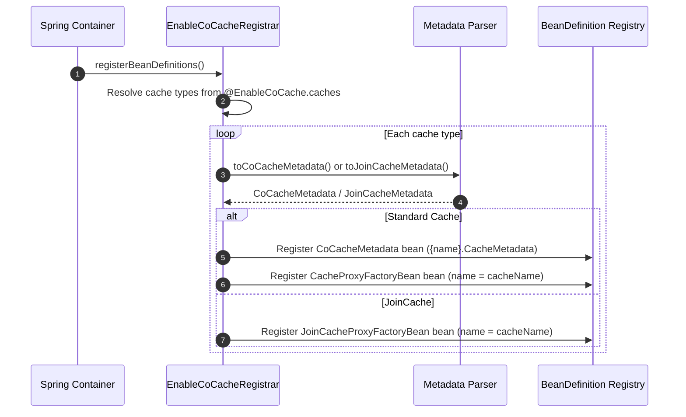
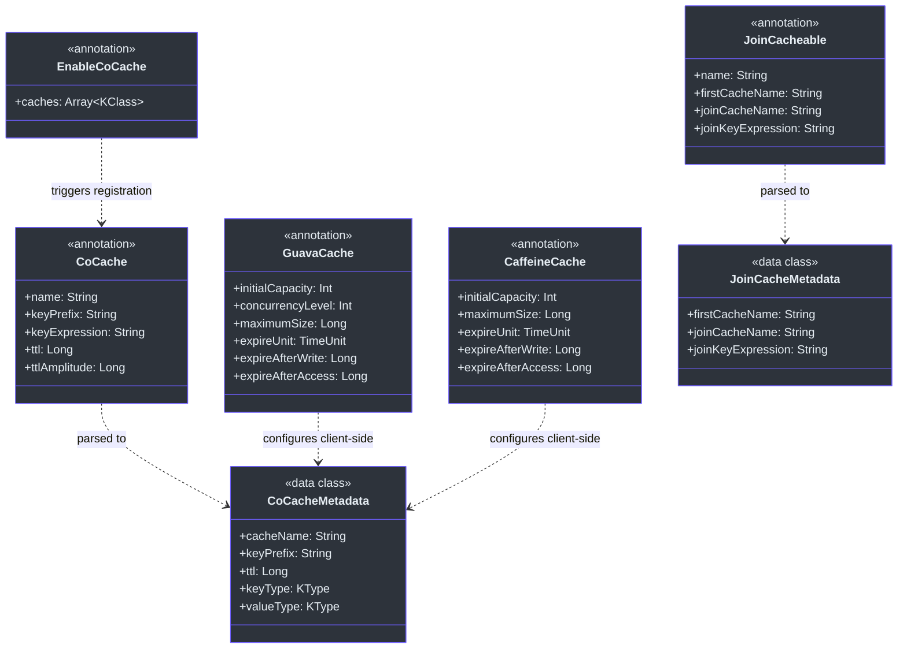
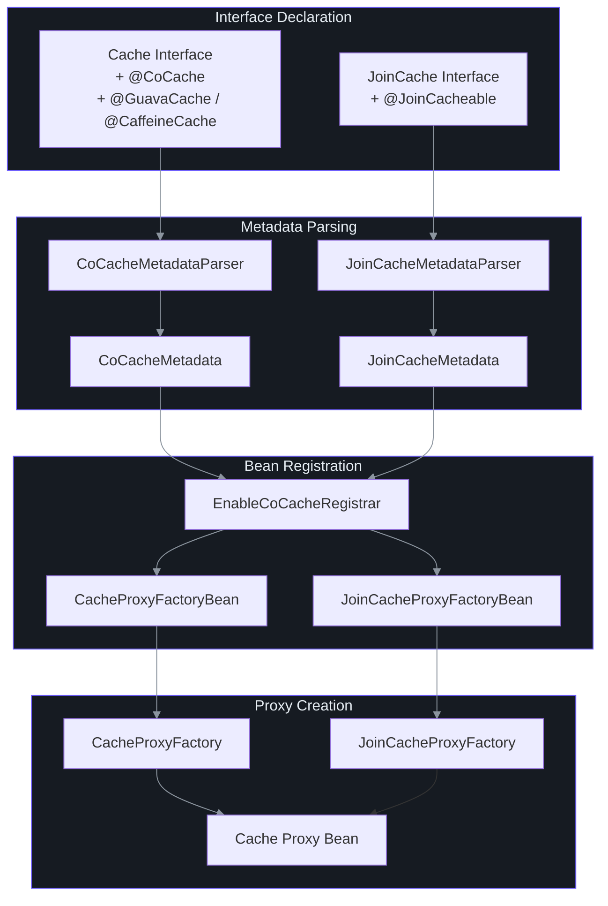

# Annotations Reference

CoCache uses annotations for declarative cache configuration. Annotations are defined in the `cocache-api` module (for cache-level configuration) and the `cocache-spring`/`cocache-spring-boot-starter` modules (for framework integration).

## @CoCache

Marks a cache interface for proxy-based cache creation. This is the primary annotation for defining a standard coherent cache.

| Parameter | Type | Default | Description | Source |
|-----------|------|---------|-------------|--------|
| `name` | `String` | `""` (uses interface simple name) | Logical cache name, used for bean registration and event routing | [CoCache.kt:30](https://github.com/Ahoo-Wang/CoCache/blob/main/cocache-api/src/main/kotlin/me/ahoo/cache/api/annotation/CoCache.kt#L30) |
| `keyPrefix` | `String` | `""` (auto-generated as `cocache:{cacheName}:`) | Prefix prepended to all cache keys in the distributed store | [CoCache.kt:31](https://github.com/Ahoo-Wang/CoCache/blob/main/cocache-api/src/main/kotlin/me/ahoo/cache/api/annotation/CoCache.kt#L31) |
| `keyExpression` | `String` | `""` | SpEL template expression for key generation (e.g., `"#{id}"`) | [CoCache.kt:35](https://github.com/Ahoo-Wang/CoCache/blob/main/cocache-api/src/main/kotlin/me/ahoo/cache/api/annotation/CoCache.kt#L35) |
| `ttl` | `Long` | `Long.MAX_VALUE` (forever) | Default time-to-live in seconds | [CoCache.kt:36](https://github.com/Ahoo-Wang/CoCache/blob/main/cocache-api/src/main/kotlin/me/ahoo/cache/api/annotation/CoCache.kt#L36) |
| `ttlAmplitude` | `Long` | `10` | Random jitter range (in seconds) added to TTL to prevent thundering herd expiration | [CoCache.kt:37](https://github.com/Ahoo-Wang/CoCache/blob/main/cocache-api/src/main/kotlin/me/ahoo/cache/api/annotation/CoCache.kt#L37) |

**Companion Constants**:

| Constant | Value | Description |
|----------|-------|-------------|
| `COCACHE` | `"cocache"` | Base property prefix for configuration |
| `DEFAULT_TTL` | `Long.MAX_VALUE` | Default TTL (forever) |
| `DEFAULT_TTL_AMPLITUDE` | `10L` | Default TTL jitter range |

### Usage Example

```kotlin
@CoCache(
    name = "user-cache",
    keyPrefix = "app:user:",
    ttl = 3600,        // 1 hour
    ttlAmplitude = 30  // +/- 30 seconds jitter
)
interface UserCache : Cache<String, User>
```

With SpEL key expression for non-string keys:

```kotlin
@CoCache(
    name = "order-cache",
    keyPrefix = "app:order:",
    keyExpression = "#{orderId}",
    ttl = 1800
)
interface OrderCache : Cache<OrderId, Order>
```

## @GuavaCache

Configures a Guava-based `ClientSideCache` implementation. When present on a cache interface, `DefaultClientSideCacheFactory` creates a `GuavaClientSideCache` instead of the default `MapClientSideCache`.

| Parameter | Type | Default | Description | Source |
|-----------|------|---------|-------------|--------|
| `initialCapacity` | `Int` | `-1` (unset) | Initial capacity of the Guava cache | [GuavaCache.kt:29](https://github.com/Ahoo-Wang/CoCache/blob/main/cocache-api/src/main/kotlin/me/ahoo/cache/api/annotation/GuavaCache.kt#L29) |
| `concurrencyLevel` | `Int` | `-1` (unset) | Number of segments for concurrent access | [GuavaCache.kt:30](https://github.com/Ahoo-Wang/CoCache/blob/main/cocache-api/src/main/kotlin/me/ahoo/cache/api/annotation/GuavaCache.kt#L30) |
| `maximumSize` | `Long` | `-1` (unset) | Maximum number of entries before eviction | [GuavaCache.kt:31](https://github.com/Ahoo-Wang/CoCache/blob/main/cocache-api/src/main/kotlin/me/ahoo/cache/api/annotation/GuavaCache.kt#L31) |
| `expireUnit` | `TimeUnit` | `TimeUnit.SECONDS` | Time unit for expiration durations | [GuavaCache.kt:32](https://github.com/Ahoo-Wang/CoCache/blob/main/cocache-api/src/main/kotlin/me/ahoo/cache/api/annotation/GuavaCache.kt#L32) |
| `expireAfterWrite` | `Long` | `-1` (unset) | Duration after write before entry expires | [GuavaCache.kt:33](https://github.com/Ahoo-Wang/CoCache/blob/main/cocache-api/src/main/kotlin/me/ahoo/cache/api/annotation/GuavaCache.kt#L33) |
| `expireAfterAccess` | `Long` | `-1` (unset) | Duration after last access before entry expires | [GuavaCache.kt:34](https://github.com/Ahoo-Wang/CoCache/blob/main/cocache-api/src/main/kotlin/me/ahoo/cache/api/annotation/GuavaCache.kt#L34) |

### Usage Example

```kotlin
@CoCache(name = "user-cache", ttl = 3600)
@GuavaCache(
    maximumSize = 10_000,
    expireAfterAccess = 300,
    expireUnit = TimeUnit.SECONDS
)
interface UserCache : Cache<String, User>
```

## @CaffeineCache

Configures a Caffeine-based `ClientSideCache` implementation. When present on a cache interface, `DefaultClientSideCacheFactory` creates a `CaffeineClientSideCache`.

| Parameter | Type | Default | Description | Source |
|-----------|------|---------|-------------|--------|
| `initialCapacity` | `Int` | `-1` (unset) | Initial capacity of the Caffeine cache | [CaffeineCache.kt:30](https://github.com/Ahoo-Wang/CoCache/blob/main/cocache-api/src/main/kotlin/me/ahoo/cache/api/annotation/CaffeineCache.kt#L30) |
| `maximumSize` | `Long` | `-1` (unset) | Maximum number of entries before eviction | [CaffeineCache.kt:31](https://github.com/Ahoo-Wang/CoCache/blob/main/cocache-api/src/main/kotlin/me/ahoo/cache/api/annotation/CaffeineCache.kt#L31) |
| `expireUnit` | `TimeUnit` | `TimeUnit.SECONDS` | Time unit for expiration durations | [CaffeineCache.kt:32](https://github.com/Ahoo-Wang/CoCache/blob/main/cocache-api/src/main/kotlin/me/ahoo/cache/api/annotation/CaffeineCache.kt#L32) |
| `expireAfterWrite` | `Long` | `-1` (unset) | Duration after write before entry expires | [CaffeineCache.kt:33](https://github.com/Ahoo-Wang/CoCache/blob/main/cocache-api/src/main/kotlin/me/ahoo/cache/api/annotation/CaffeineCache.kt#L33) |
| `expireAfterAccess` | `Long` | `-1` (unset) | Duration after last access before entry expires | [CaffeineCache.kt:34](https://github.com/Ahoo-Wang/CoCache/blob/main/cocache-api/src/main/kotlin/me/ahoo/cache/api/annotation/CaffeineCache.kt#L34) |

### Usage Example

```kotlin
@CoCache(name = "product-cache", ttl = 7200)
@CaffeineCache(
    maximumSize = 50_000,
    expireAfterWrite = 600,
    expireUnit = TimeUnit.SECONDS
)
interface ProductCache : Cache<String, Product>
```

## @GuavaCache vs @CaffeineCache Comparison

| Feature | @GuavaCache | @CaffeineCache |
|---------|-------------|----------------|
| `concurrencyLevel` | Supported | Not supported |
| `initialCapacity` | Supported | Supported |
| `maximumSize` | Supported | Supported |
| `expireAfterWrite` | Supported | Supported |
| `expireAfterAccess` | Supported | Supported |
| `expireUnit` | Supported | Supported |
| Underlying library | Google Guava | Caffeine |
| Async refresh | No | Native support (not yet exposed) |

## @JoinCacheable

Marks a cache interface as a JoinCache, composing two cached values.

| Parameter | Type | Default | Description | Source |
|-----------|------|---------|-------------|--------|
| `name` | `String` | `""` (uses interface simple name) | Logical cache name | [JoinCacheable.kt:24](https://github.com/Ahoo-Wang/CoCache/blob/main/cocache-api/src/main/kotlin/me/ahoo/cache/api/annotation/JoinCacheable.kt#L24) |
| `firstCacheName` | `String` | `""` | Name of the primary cache to read from | [JoinCacheable.kt:25](https://github.com/Ahoo-Wang/CoCache/blob/main/cocache-api/src/main/kotlin/me/ahoo/cache/api/annotation/JoinCacheable.kt#L25) |
| `joinCacheName` | `String` | `""` | Name of the secondary cache for joined values | [JoinCacheable.kt:26](https://github.com/Ahoo-Wang/CoCache/blob/main/cocache-api/src/main/kotlin/me/ahoo/cache/api/annotation/JoinCacheable.kt#L26) |
| `joinKeyExpression` | `String` | `""` | SpEL expression to extract the join key from the first value | [JoinCacheable.kt:27](https://github.com/Ahoo-Wang/CoCache/blob/main/cocache-api/src/main/kotlin/me/ahoo/cache/api/annotation/JoinCacheable.kt#L27) |

### Usage Example

```kotlin
@JoinCacheable(
    name = "user-order-cache",
    firstCacheName = "user-cache",
    joinCacheName = "order-cache",
    joinKeyExpression = "#{orderId}"
)
interface UserOrderCache : JoinCache<String, User, String, Order>
```

## @EnableCoCache

Spring-specific annotation that triggers the registration of cache proxy bean definitions. Applied to a `@Configuration` class.

| Parameter | Type | Default | Description | Source |
|-----------|------|---------|-------------|--------|
| `caches` | `Array<KClass<out Cache<*, *>>>` | `[]` | Cache interfaces to register as Spring beans | [EnableCoCache.kt:22](https://github.com/Ahoo-Wang/CoCache/blob/main/cocache-spring/src/main/kotlin/me/ahoo/cache/spring/EnableCoCache.kt#L22) |

### Usage Example

```kotlin
@EnableCoCache(caches = [UserCache::class, ProductCache::class])
@Configuration
class CacheConfiguration
```

### Registration Flow

When `@EnableCoCache` is processed, `EnableCoCacheRegistrar` performs the following steps:



## @ConditionalOnCoCacheEnabled

Spring Boot auto-configuration condition that enables or disables CoCache based on the `cocache.enabled` property.

| Attribute | Value | Source |
|-----------|-------|--------|
| **Property key** | `cocache.enabled` | [ConditionalOnCoCacheEnabled.kt:23](https://github.com/Ahoo-Wang/CoCache/blob/main/cocache-spring-boot-starter/src/main/kotlin/me/ahoo/cache/spring/boot/starter/ConditionalOnCoCacheEnabled.kt#L23) |
| **Default** | `true` (enabled when property is absent) | [ConditionalOnCoCacheEnabled.kt:23](https://github.com/Ahoo-Wang/CoCache/blob/main/cocache-spring-boot-starter/src/main/kotlin/me/ahoo/cache/spring/boot/starter/ConditionalOnCoCacheEnabled.kt#L23) |

### Configuration

```yaml
# application.yml
cocache:
  enabled: true  # Set to false to disable CoCache entirely
```

## Annotation Inheritance and Composition

Annotations in CoCache follow an inheritance model where cache interface annotations are combined with client-side cache configuration annotations:



## Annotation Processing Pipeline

The following diagram shows how annotations flow through the system from interface declaration to a working cache proxy:



## Complete Example

A full configuration using all available annotations:

```kotlin
// Define a standard cache with Guava client-side caching
@CoCache(
    name = "user-cache",
    keyPrefix = "myapp:user:",
    ttl = 3600,
    ttlAmplitude = 30
)
@GuavaCache(
    maximumSize = 10_000,
    expireAfterWrite = 600
)
interface UserCache : Cache<String, User> {
    // Methods inherited from Cache<K, V>:
    // - get(key): User?
    // - set(key, value)
    // - evict(key)
    // - getCache(key): CacheValue<User>?
}

// Define a cache with Caffeine client-side caching
@CoCache(
    name = "order-cache",
    keyPrefix = "myapp:order:",
    keyExpression = "#{orderId}",
    ttl = 1800
)
@CaffeineCache(maximumSize = 50_000)
interface OrderCache : Cache<OrderId, Order>

// Define a join cache composing user and order data
@JoinCacheable(
    name = "user-order-cache",
    firstCacheName = "user-cache",
    joinCacheName = "order-cache",
    joinKeyExpression = "#{orderId}"
)
interface UserOrderCache : JoinCache<String, User, String, Order>

// Spring configuration
@EnableCoCache(caches = [UserCache::class, OrderCache::class, UserOrderCache::class])
@Configuration
class CacheConfiguration
```

## Related Pages

- [API Overview](./index.md) -- Architecture overview and module organization
- [Core Interfaces](./core-interfaces.md) -- Detailed reference for all core interfaces
- [Spring Integration](./spring-integration.md) -- Spring and Spring Boot integration API
- [Actuator Endpoints](./actuator.md) -- Monitoring and management endpoints
