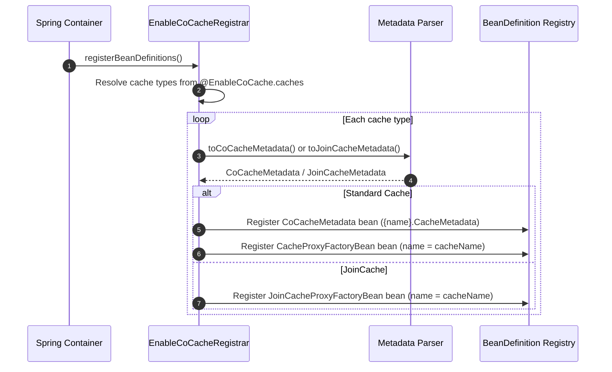
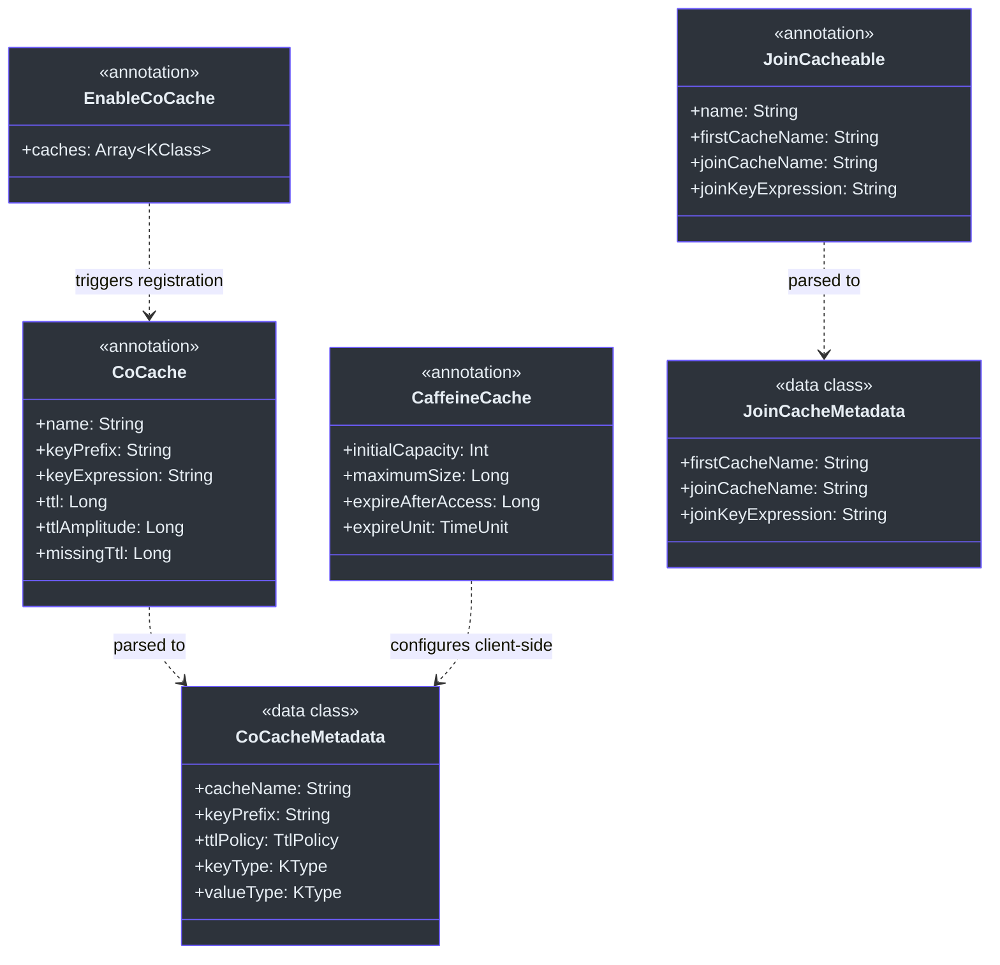
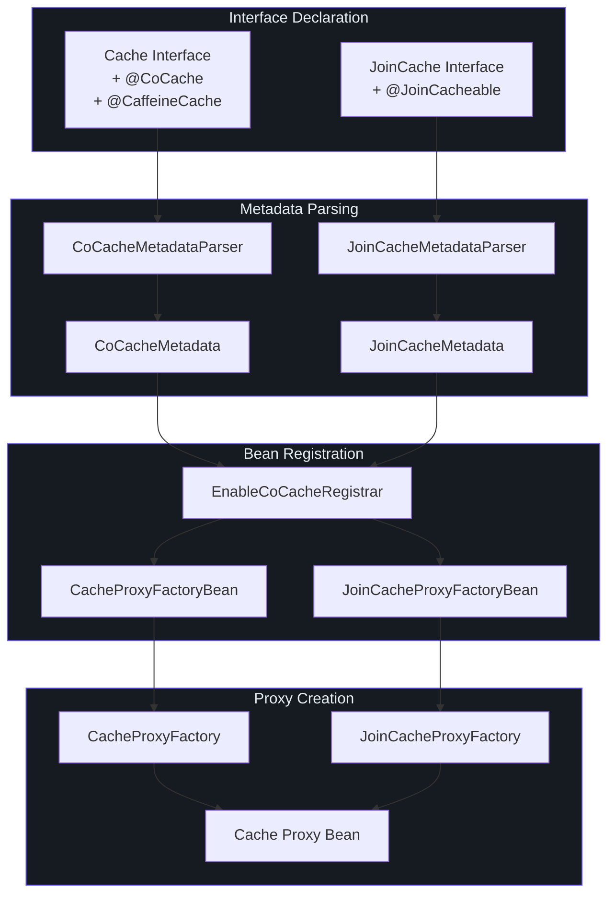

# Annotations Reference

CoCache uses annotations for declarative cache configuration. Annotations are defined in the `cocache-api` module (for cache-level configuration) and the `cocache-spring`/`cocache-spring-boot-starter` modules (for framework integration).

## @CoCache

Marks a cache interface for proxy-based cache creation. This is the primary annotation for defining a standard coherent cache.

| Parameter | Type | Default | Description | Source |
|-----------|------|---------|-------------|--------|
| `name` | `String` | `""` (interface simple name) | Logical cache name: bean name, event channel, component-bean prefix | [CoCache.kt](https://github.com/Ahoo-Wang/CoCache/blob/main/cocache-api/src/main/kotlin/me/ahoo/cache/api/annotation/CoCache.kt) |
| `keyPrefix` | `String` | `""` (→ `cocache:{cacheName}:`) | Storage-key prefix; Spring placeholders are resolved | [CoCache.kt](https://github.com/Ahoo-Wang/CoCache/blob/main/cocache-api/src/main/kotlin/me/ahoo/cache/api/annotation/CoCache.kt) |
| `keyExpression` | `String` | `""` | SpEL template for the key (e.g. `"#{id}"`); empty → `key.toString()` | [CoCache.kt](https://github.com/Ahoo-Wang/CoCache/blob/main/cocache-api/src/main/kotlin/me/ahoo/cache/api/annotation/CoCache.kt) |
| `ttl` | `Long` | `3600` | Value TTL in seconds. Finite by default so any inconsistency self-heals; `TtlAt.FOREVER` disables expiry | [CoCache.kt](https://github.com/Ahoo-Wang/CoCache/blob/main/cocache-api/src/main/kotlin/me/ahoo/cache/api/annotation/CoCache.kt) |
| `ttlAmplitude` | `Long` | `60` | Random jitter (± seconds) on value TTL, prevents cache avalanche | [CoCache.kt](https://github.com/Ahoo-Wang/CoCache/blob/main/cocache-api/src/main/kotlin/me/ahoo/cache/api/annotation/CoCache.kt) |
| `missingTtl` | `Long` | `60` | Negative-cache TTL in seconds (no jitter); newly created rows stay invisible at most this long | [CoCache.kt](https://github.com/Ahoo-Wang/CoCache/blob/main/cocache-api/src/main/kotlin/me/ahoo/cache/api/annotation/CoCache.kt) |

**Companion Constants**:

| Constant | Value | Description |
|----------|-------|-------------|
| `COCACHE` | `"cocache"` | Base property prefix for configuration |
| `DEFAULT_TTL` | `3600` | Default value TTL |
| `DEFAULT_TTL_AMPLITUDE` | `60` | Default TTL jitter |
| `DEFAULT_MISSING_TTL` | `60` | Default negative-cache TTL |

### Usage Example

```kotlin
@CoCache(
    name = "user-cache",
    keyPrefix = "app:user:",
    ttl = 3600,        // 1 hour
    ttlAmplitude = 30  // +/- 30 seconds jitter
)
interface UserCache : Cache<String, User>
```

With SpEL key expression for non-string keys:

```kotlin
@CoCache(
    name = "order-cache",
    keyPrefix = "app:order:",
    keyExpression = "#{orderId}",
    ttl = 1800
)
interface OrderCache : Cache<OrderId, Order>
```

## @CaffeineCache

Configures the default L2 (`CaffeineClientSideCache`). Without the annotation all defaults apply. Entries always expire at their own `ttlAt`, so no write-expiry setting is needed.

| Parameter | Type | Default | Description | Source |
|-----------|------|---------|-------------|--------|
| `initialCapacity` | `Int` | `-1` (unset) | Initial capacity | [CaffeineCache.kt](https://github.com/Ahoo-Wang/CoCache/blob/main/cocache-api/src/main/kotlin/me/ahoo/cache/api/annotation/CaffeineCache.kt) |
| `maximumSize` | `Long` | `10000` | Maximum entries; L2 is always bounded | [CaffeineCache.kt](https://github.com/Ahoo-Wang/CoCache/blob/main/cocache-api/src/main/kotlin/me/ahoo/cache/api/annotation/CaffeineCache.kt) |
| `expireAfterAccess` | `Long` | `0` (disabled) | Idle eviction since last access (capped by `ttlAt`) | [CaffeineCache.kt](https://github.com/Ahoo-Wang/CoCache/blob/main/cocache-api/src/main/kotlin/me/ahoo/cache/api/annotation/CaffeineCache.kt) |
| `expireUnit` | `TimeUnit` | `SECONDS` | Unit for `expireAfterAccess` | [CaffeineCache.kt](https://github.com/Ahoo-Wang/CoCache/blob/main/cocache-api/src/main/kotlin/me/ahoo/cache/api/annotation/CaffeineCache.kt) |

### Usage Example

```kotlin
@CoCache(name = "product-cache", ttl = 7200)
@CaffeineCache(maximumSize = 50_000, expireAfterAccess = 600)
interface ProductCache : Cache<String, Product>
```

To replace L2 entirely, declare a bean named `{cacheName}.ClientSideCache`.

## @JoinCacheable

Marks a cache interface as a JoinCache, composing two cached values.

| Parameter | Type | Default | Description | Source |
|-----------|------|---------|-------------|--------|
| `name` | `String` | `""` (uses interface simple name) | Logical cache name | [JoinCacheable.kt:24](https://github.com/Ahoo-Wang/CoCache/blob/main/cocache-api/src/main/kotlin/me/ahoo/cache/api/annotation/JoinCacheable.kt#L24) |
| `firstCacheName` | `String` | `""` | Name of the primary cache to read from | [JoinCacheable.kt:25](https://github.com/Ahoo-Wang/CoCache/blob/main/cocache-api/src/main/kotlin/me/ahoo/cache/api/annotation/JoinCacheable.kt#L25) |
| `joinCacheName` | `String` | `""` | Name of the secondary cache for joined values | [JoinCacheable.kt:26](https://github.com/Ahoo-Wang/CoCache/blob/main/cocache-api/src/main/kotlin/me/ahoo/cache/api/annotation/JoinCacheable.kt#L26) |
| `joinKeyExpression` | `String` | `""` | SpEL expression to extract the join key from the first value | [JoinCacheable.kt:27](https://github.com/Ahoo-Wang/CoCache/blob/main/cocache-api/src/main/kotlin/me/ahoo/cache/api/annotation/JoinCacheable.kt#L27) |

### Usage Example

```kotlin
@JoinCacheable(
    name = "user-order-cache",
    firstCacheName = "user-cache",
    joinCacheName = "order-cache",
    joinKeyExpression = "#{orderId}"
)
interface UserOrderCache : JoinCache<String, User, String, Order>
```

## @EnableCoCache

Spring-specific annotation that triggers the registration of cache proxy bean definitions. Applied to a `@Configuration` class.

| Parameter | Type | Default | Description | Source |
|-----------|------|---------|-------------|--------|
| `caches` | `Array<KClass<out Cache<*, *>>>` | `[]` | Cache interfaces to register as Spring beans | [EnableCoCache.kt:22](https://github.com/Ahoo-Wang/CoCache/blob/main/cocache-spring/src/main/kotlin/me/ahoo/cache/spring/EnableCoCache.kt#L22) |

### Usage Example

```kotlin
@EnableCoCache(caches = [UserCache::class, ProductCache::class])
@Configuration
class CacheConfiguration
```

### Registration Flow

When `@EnableCoCache` is processed, `EnableCoCacheRegistrar` performs the following steps:


```mermaid
sequenceDiagram
autonumber
    participant SC as Spring Container
    participant R as EnableCoCacheRegistrar
    participant MD as Metadata Parser
    participant BD as BeanDefinition Registry

    SC->>R: registerBeanDefinitions()
    R->>R: Resolve cache types from @EnableCoCache.caches
    loop Each cache type
        R->>MD: toCoCacheMetadata() or toJoinCacheMetadata()
        MD-->>R: CoCacheMetadata / JoinCacheMetadata
        alt Standard Cache
            R->>BD: Register CoCacheMetadata bean ({name}.CacheMetadata)
            R->>BD: Register CacheProxyFactoryBean bean (name = cacheName)
        else JoinCache
            R->>BD: Register JoinCacheProxyFactoryBean bean (name = cacheName)
        end
    end
```

## @ConditionalOnCoCacheEnabled

Spring Boot auto-configuration condition that enables or disables CoCache based on the `cocache.enabled` property.

| Attribute | Value | Source |
|-----------|-------|--------|
| **Property key** | `cocache.enabled` | [ConditionalOnCoCacheEnabled.kt:23](https://github.com/Ahoo-Wang/CoCache/blob/main/cocache-spring-boot-starter/src/main/kotlin/me/ahoo/cache/spring/boot/starter/ConditionalOnCoCacheEnabled.kt#L23) |
| **Default** | `true` (enabled when property is absent) | [ConditionalOnCoCacheEnabled.kt:23](https://github.com/Ahoo-Wang/CoCache/blob/main/cocache-spring-boot-starter/src/main/kotlin/me/ahoo/cache/spring/boot/starter/ConditionalOnCoCacheEnabled.kt#L23) |

### Configuration

```yaml
# application.yml
cocache:
  enabled: true  # Set to false to disable CoCache entirely
```

## Annotation Inheritance and Composition

Annotations in CoCache follow an inheritance model where cache interface annotations are combined with client-side cache configuration annotations:


```mermaid
classDiagram
    direction TB

    class CoCache {
        <<annotation>>
        +name: String
        +keyPrefix: String
        +keyExpression: String
        +ttl: Long
        +ttlAmplitude: Long
        +missingTtl: Long
    }
    class CaffeineCache {
        <<annotation>>
        +initialCapacity: Int
        +maximumSize: Long
        +expireAfterAccess: Long
        +expireUnit: TimeUnit
    }
    class JoinCacheable {
        <<annotation>>
        +name: String
        +firstCacheName: String
        +joinCacheName: String
        +joinKeyExpression: String
    }
    class EnableCoCache {
        <<annotation>>
        +caches: Array~KClass~
    }
    class CoCacheMetadata {
        <<data class>>
        +cacheName: String
        +keyPrefix: String
        +ttlPolicy: TtlPolicy
        +keyType: KType
        +valueType: KType
    }
    class JoinCacheMetadata {
        <<data class>>
        +firstCacheName: String
        +joinCacheName: String
        +joinKeyExpression: String
    }

    CoCache ..> CoCacheMetadata : parsed to
    CaffeineCache ..> CoCacheMetadata : configures client-side
    JoinCacheable ..> JoinCacheMetadata : parsed to
    EnableCoCache ..> CoCache : triggers registration

    style CoCache fill:#2d333b,stroke:#6d5dfc,color:#e6edf3
    style CaffeineCache fill:#2d333b,stroke:#6d5dfc,color:#e6edf3
    style JoinCacheable fill:#2d333b,stroke:#6d5dfc,color:#e6edf3
    style EnableCoCache fill:#2d333b,stroke:#6d5dfc,color:#e6edf3
    style CoCacheMetadata fill:#2d333b,stroke:#6d5dfc,color:#e6edf3
    style JoinCacheMetadata fill:#2d333b,stroke:#6d5dfc,color:#e6edf3
```

## Annotation Processing Pipeline

The following diagram shows how annotations flow through the system from interface declaration to a working cache proxy:


```mermaid
graph TB
    subgraph Declaration["Interface Declaration"]
        style Declaration fill:#161b22,stroke:#6d5dfc,color:#e6edf3
        CI["Cache Interface<br>+ @CoCache<br>+ @CaffeineCache"]
        JCI["JoinCache Interface<br>+ @JoinCacheable"]
    end

    subgraph Parsing["Metadata Parsing"]
        style Parsing fill:#161b22,stroke:#6d5dfc,color:#e6edf3
        CMP["CoCacheMetadataParser"]
        JCMP["JoinCacheMetadataParser"]
        CMD["CoCacheMetadata"]
        JCMD["JoinCacheMetadata"]
    end

    subgraph Registration["Bean Registration"]
        style Registration fill:#161b22,stroke:#6d5dfc,color:#e6edf3
        REG["EnableCoCacheRegistrar"]
        CPFB["CacheProxyFactoryBean"]
        JCPFB["JoinCacheProxyFactoryBean"]
    end

    subgraph Factory["Proxy Creation"]
        style Factory fill:#161b22,stroke:#6d5dfc,color:#e6edf3
        CPF["CacheProxyFactory"]
        JCPF["JoinCacheProxyFactory"]
        PROXY["Cache Proxy Bean"]
    end

    CI --> CMP
    JCI --> JCMP
    CMP --> CMD
    JCMP --> JCMD
    CMD --> REG
    JCMD --> REG
    REG --> CPFB
    REG --> JCPFB
    CPFB --> CPF
    JCPFB --> JCPF
    CPF --> PROXY
    JCPF --> PROXY

```

## Complete Example

A full configuration using all available annotations:

```kotlin
// Define a standard cache with a sized L2
@CoCache(
    name = "user-cache",
    keyPrefix = "myapp:user:",
    ttl = 3600,
    ttlAmplitude = 30,
    missingTtl = 30
)
@CaffeineCache(maximumSize = 10_000, expireAfterAccess = 600)
interface UserCache : Cache<String, User> {
    // Methods inherited from Cache<K, V>:
    // - get(key): User?
    // - set(key, value)
    // - evict(key)
    // - getCache(key): CacheValue<User>?
}

// Define a cache with Caffeine client-side caching
@CoCache(
    name = "order-cache",
    keyPrefix = "myapp:order:",
    keyExpression = "#{orderId}",
    ttl = 1800
)
@CaffeineCache(maximumSize = 50_000)
interface OrderCache : Cache<OrderId, Order>

// Define a join cache composing user and order data
@JoinCacheable(
    name = "user-order-cache",
    firstCacheName = "user-cache",
    joinCacheName = "order-cache",
    joinKeyExpression = "#{orderId}"
)
interface UserOrderCache : JoinCache<String, User, String, Order>

// Spring configuration
@EnableCoCache(caches = [UserCache::class, OrderCache::class, UserOrderCache::class])
@Configuration
class CacheConfiguration
```

## Related Pages

- [API Overview](./index.md) -- Architecture overview and module organization
- [Core Interfaces](./core-interfaces.md) -- Detailed reference for all core interfaces
- [Spring Integration](./spring-integration.md) -- Spring and Spring Boot integration API
- [Actuator Endpoints](./actuator.md) -- Monitoring and management endpoints
