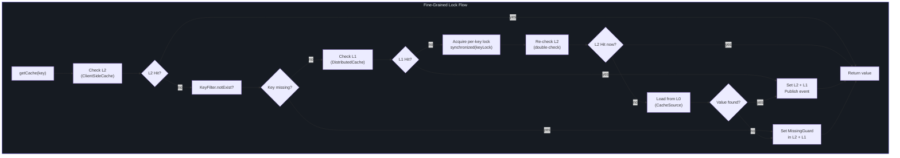
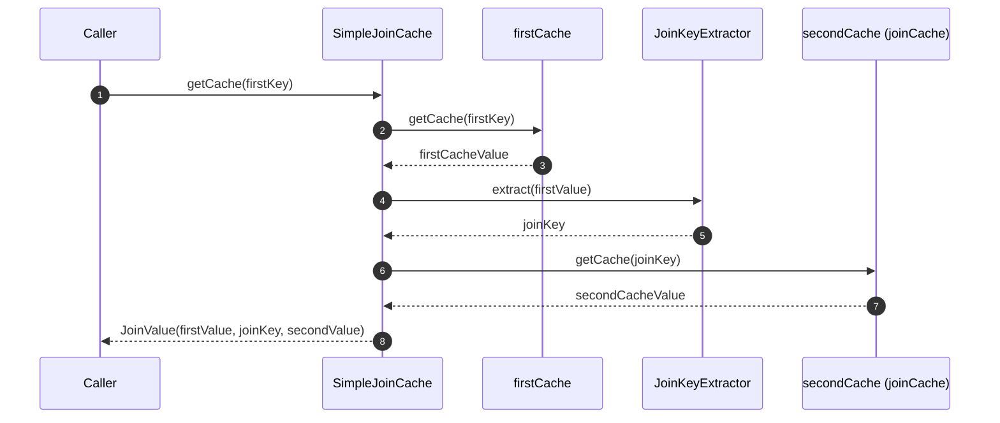
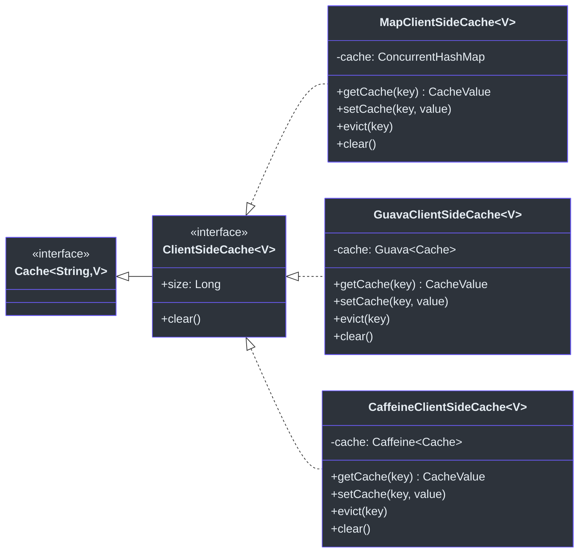
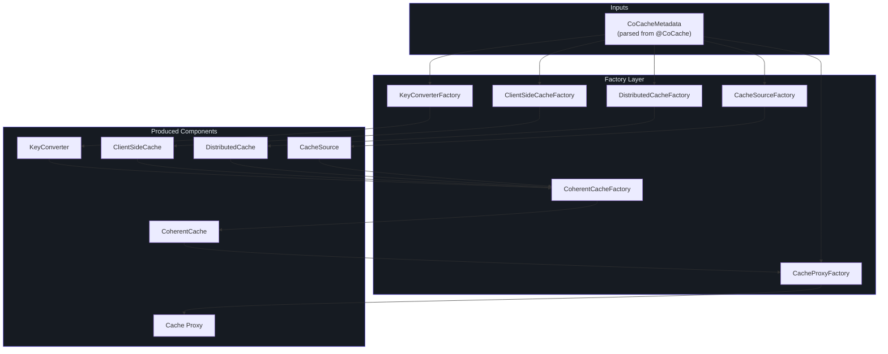

# Core Interfaces Reference

This page provides a comprehensive reference for every core interface in the CoCache framework. Interfaces are organized by module and functional area.

## Cache API Interfaces (cocache-api)

### Cache&lt;K, V&gt;

The root cache interface that combines read and write operations.

| Aspect | Detail | Source |
|--------|--------|--------|
| **Package** | `me.ahoo.cache.api` | -- |
| **Extends** | `CacheGetter<K, V>`, `CacheSetter<K, V>` | -- |
| **Type Parameters** | `K` -- cache key type, `V` -- cache value type | -- |
| **Source File** | -- | [Cache.kt:21](https://github.com/Ahoo-Wang/CoCache/blob/main/cocache-api/src/main/kotlin/me/ahoo/cache/api/Cache.kt#L21) |

```kotlin
interface Cache<K, V> : CacheGetter<K, V>, CacheSetter<K, V>
```

`Cache<K, V>` is a pure composition interface. All cache layers -- `ClientSideCache`, `DistributedCache`, `CoherentCache`, and `JoinCache` -- ultimately implement this interface.

### CacheGetter&lt;K, V&gt;

Read-only cache access interface.

| Method | Signature | Description | Source |
|--------|-----------|-------------|--------|
| `getCache` | `fun getCache(key: K): CacheValue<V>?` | Returns the full `CacheValue` wrapper (including TTL metadata) or `null` if absent | [CacheGetter.kt:21](https://github.com/Ahoo-Wang/CoCache/blob/main/cocache-api/src/main/kotlin/me/ahoo/cache/api/CacheGetter.kt#L21) |
| `get` | `operator fun get(key: K): V?` | Returns the unwrapped value or `null`. Strips TTL and missing-guard info | [CacheGetter.kt:29](https://github.com/Ahoo-Wang/CoCache/blob/main/cocache-api/src/main/kotlin/me/ahoo/cache/api/CacheGetter.kt#L29) |
| `getTtlAt` | `fun getTtlAt(key: K): Long?` | Returns the expiration timestamp (seconds) or `null` if key does not exist | [CacheGetter.kt:37](https://github.com/Ahoo-Wang/CoCache/blob/main/cocache-api/src/main/kotlin/me/ahoo/cache/api/CacheGetter.kt#L37) |

### CacheSetter&lt;K, V&gt;

Write and eviction interface.

| Method | Signature | Description | Source |
|--------|-----------|-------------|--------|
| `set` | `operator fun set(key: K, ttlAt: Long, value: V)` | Sets a value with an explicit expiration timestamp | [CacheSetter.kt:18](https://github.com/Ahoo-Wang/CoCache/blob/main/cocache-api/src/main/kotlin/me/ahoo/cache/api/CacheSetter.kt#L18) |
| `set` | `operator fun set(key: K, value: V)` | Sets a value using the cache's default TTL configuration | [CacheSetter.kt:20](https://github.com/Ahoo-Wang/CoCache/blob/main/cocache-api/src/main/kotlin/me/ahoo/cache/api/CacheSetter.kt#L20) |
| `setCache` | `fun setCache(key: K, value: CacheValue<V>)` | Sets a pre-constructed `CacheValue` (with TTL and missing-guard metadata) | [CacheSetter.kt:22](https://github.com/Ahoo-Wang/CoCache/blob/main/cocache-api/src/main/kotlin/me/ahoo/cache/api/CacheSetter.kt#L22) |
| `evict` | `fun evict(key: K)` | Removes the entry from the cache | [CacheSetter.kt:29](https://github.com/Ahoo-Wang/CoCache/blob/main/cocache-api/src/main/kotlin/me/ahoo/cache/api/CacheSetter.kt#L29) |

### CacheValue&lt;V&gt;

Wraps a cached value with TTL and missing-guard metadata.

| Property/Method | Type | Description | Source |
|-----------------|------|-------------|--------|
| `value` | `V` | The actual cached value | [CacheValue.kt:21](https://github.com/Ahoo-Wang/CoCache/blob/main/cocache-api/src/main/kotlin/me/ahoo/cache/api/CacheValue.kt#L21) |
| `ttlAt` | `Long` | Expiration timestamp in seconds (`ChronoUnit.SECONDS`) | [CacheValue.kt:28](https://github.com/Ahoo-Wang/CoCache/blob/main/cocache-api/src/main/kotlin/me/ahoo/cache/api/CacheValue.kt#L28) |
| `isMissingGuard` | `Boolean` | Whether this value is a placeholder for a missing key (prevents cache penetration) | [CacheValue.kt:30](https://github.com/Ahoo-Wang/CoCache/blob/main/cocache-api/src/main/kotlin/me/ahoo/cache/api/CacheValue.kt#L30) |

Extends `TtlAt`, inheriting `isForever`, `isExpired`, and `expiredDuration`.

**Default Implementation**: [DefaultCacheValue](https://github.com/Ahoo-Wang/CoCache/blob/main/cocache-core/src/main/kotlin/me/ahoo/cache/DefaultCacheValue.kt) -- companion object factory methods: `forever()`, `ttlAt()`, `missingGuard()`.

### TtlAt

Interface for time-to-live management based on absolute timestamps.

| Property | Type | Description | Source |
|----------|------|-------------|--------|
| `ttlAt` | `Long` | Absolute expiration time in seconds | [TtlAt.kt:23](https://github.com/Ahoo-Wang/CoCache/blob/main/cocache-api/src/main/kotlin/me/ahoo/cache/api/TtlAt.kt#L23) |
| `isForever` | `Boolean` | Whether this entry never expires | [TtlAt.kt:29](https://github.com/Ahoo-Wang/CoCache/blob/main/cocache-api/src/main/kotlin/me/ahoo/cache/api/TtlAt.kt#L29) |
| `isExpired` | `Boolean` | Whether the current time exceeds `ttlAt` | [TtlAt.kt:30](https://github.com/Ahoo-Wang/CoCache/blob/main/cocache-api/src/main/kotlin/me/ahoo/cache/api/TtlAt.kt#L30) |
| `expiredDuration` | `Duration` | Remaining time until expiration as a `java.time.Duration` | [TtlAt.kt:31](https://github.com/Ahoo-Wang/CoCache/blob/main/cocache-api/src/main/kotlin/me/ahoo/cache/api/TtlAt.kt#L31) |

**Default Implementation**: [ComputedTtlAt](https://github.com/Ahoo-Wang/CoCache/blob/main/cocache-core/src/main/kotlin/me/ahoo/cache/ComputedTtlAt.kt) -- provides static utility methods `at(ttl, amplitude)` and `isForever(ttl)`.

### NamedCache

Identifies a cache by its logical name.

| Property | Type | Description | Source |
|----------|------|-------------|--------|
| `cacheName` | `String` | The logical cache name, used for bean registration and event routing | [NamedCache.kt:21](https://github.com/Ahoo-Wang/CoCache/blob/main/cocache-api/src/main/kotlin/me/ahoo/cache/api/NamedCache.kt#L21) |

### ClientSideCache&lt;V&gt;

L2 client-side (in-process) cache interface.

| Aspect | Detail | Source |
|--------|--------|--------|
| **Extends** | `Cache<String, V>` | -- |
| **Key Type** | `String` (converted via `KeyConverter`) | -- |
| **Source File** | -- | [ClientSideCache.kt:22](https://github.com/Ahoo-Wang/CoCache/blob/main/cocache-api/src/main/kotlin/me/ahoo/cache/api/client/ClientSideCache.kt#L22) |

| Property/Method | Type | Description |
|-----------------|------|-------------|
| `size` | `Long` | Number of entries currently in the client-side cache |
| `clear` | `fun clear()` | Removes all entries from the local cache |

**Implementations**:

| Implementation | Description | Module |
|---------------|-------------|--------|
| `MapClientSideCache` | ConcurrentHashMap-backed, no eviction policy | [cocache-core](https://github.com/Ahoo-Wang/CoCache/blob/main/cocache-core/src/main/kotlin/me/ahoo/cache/client/MapClientSideCache.kt) |
| `GuavaClientSideCache` | Guava `Cache`-backed with configurable size/time eviction | [cocache-core](https://github.com/Ahoo-Wang/CoCache/blob/main/cocache-core/src/main/kotlin/me/ahoo/cache/client/GuavaClientSideCache.kt) |
| `CaffeineClientSideCache` | Caffeine `Cache`-backed with configurable size/time eviction | [cocache-core](https://github.com/Ahoo-Wang/CoCache/blob/main/cocache-core/src/main/kotlin/me/ahoo/cache/client/CaffeineClientSideCache.kt) |

### CacheSource&lt;K, V&gt;

L0 data source loader interface. Called when both L2 and L1 caches miss.

| Method | Signature | Description | Source |
|--------|-----------|-------------|--------|
| `loadCacheValue` | `fun loadCacheValue(key: K): CacheValue<V>?` | Loads a value from the underlying data source. Returns `null` if the key does not exist. May throw `TimeoutException` | [CacheSource.kt:24](https://github.com/Ahoo-Wang/CoCache/blob/main/cocache-api/src/main/kotlin/me/ahoo/cache/api/source/CacheSource.kt#L24) |

| Companion Method | Description |
|-----------------|-------------|
| `noOp()` | Returns a singleton `NoOpCacheSource` that always returns `null` |

**Default Implementation**: [NoOpCacheSource](https://github.com/Ahoo-Wang/CoCache/blob/main/cocache-api/src/main/kotlin/me/ahoo/cache/api/source/NoOpCacheSource.kt) -- object singleton, always returns `null`.

## Core Module Interfaces (cocache-core)

### DistributedCache&lt;V&gt;

L1 distributed (shared) cache interface.

| Aspect | Detail | Source |
|--------|--------|--------|
| **Extends** | `ComputedCache<String, V>`, `AutoCloseable` | -- |
| **Key Type** | `String` | -- |
| **Source File** | -- | [DistributedCache.kt:22](https://github.com/Ahoo-Wang/CoCache/blob/main/cocache-core/src/main/kotlin/me/ahoo/cache/distributed/DistributedCache.kt#L22) |

Extends `ComputedCache` for default `get()`, `set()`, and `getTtlAt()` implementations, and `AutoCloseable` for resource cleanup.

**Implementations**:

| Implementation | Description | Module |
|---------------|-------------|--------|
| `MockDistributedCache` | In-memory mock for testing | [cocache-core](https://github.com/Ahoo-Wang/CoCache/blob/main/cocache-core/src/main/kotlin/me/ahoo/cache/distributed/mock/MockDistributedCache.kt) |
| `RedisDistributedCache` | Redis-backed distributed cache using `StringRedisTemplate` | [cocache-spring-redis](https://github.com/Ahoo-Wang/CoCache/blob/main/cocache-spring-redis/src/main/kotlin/me/ahoo/cache/spring/redis/RedisDistributedCache.kt) |

### DistributedClientId

Identifies a cache client instance across the distributed system.

| Property | Type | Description | Source |
|----------|------|-------------|--------|
| `clientId` | `String` | Unique identifier for this cache client instance (used to avoid processing self-published events) | [DistributedClientId.kt:21](https://github.com/Ahoo-Wang/CoCache/blob/main/cocache-core/src/main/kotlin/me/ahoo/cache/distributed/DistributedClientId.kt#L21) |

Default client ID generators: `HostClientIdGenerator` (uses host address), `UUIDClientIdGenerator` (random UUID).

### ComputedCache&lt;K, V&gt;

Provides computed default implementations for `Cache` methods, bridging raw `CacheValue` access with user-friendly `get`/`set` operations.

| Aspect | Detail | Source |
|--------|--------|--------|
| **Extends** | `Cache<K, V>`, `TtlConfiguration` | -- |
| **Source File** | -- | [ComputedCache.kt:20](https://github.com/Ahoo-Wang/CoCache/blob/main/cocache-core/src/main/kotlin/me/ahoo/cache/ComputedCache.kt#L20) |

Key behaviors:
- `get(key)` -- calls `getCache(key)`, returns `null` if missing guard or expired
- `getTtlAt(key)` -- calls `getCache(key)`, returns `null` if missing guard
- `set(key, value)` -- creates `DefaultCacheValue` with default TTL + amplitude jitter
- `set(key, ttlAt, value)` -- creates `DefaultCacheValue` with explicit TTL

### CoherentCache&lt;K, V&gt;

The central interface for the Level 2 coherent cache, combining all cache concerns.

| Aspect | Detail | Source |
|--------|--------|--------|
| **Extends** | `ComputedCache<K, V>`, `DistributedClientId`, `NamedCache`, `CacheEvictedSubscriber` | -- |
| **Source File** | -- | [CoherentCache.kt:25](https://github.com/Ahoo-Wang/CoCache/blob/main/cocache-core/src/main/kotlin/me/ahoo/cache/consistency/CoherentCache.kt#L25) |

| Property | Type | Description |
|----------|------|-------------|
| `cacheEvictedEventBus` | `CacheEvictedEventBus` | Event bus for publishing/receiving eviction events |
| `clientSideCache` | `ClientSideCache<V>` | The L2 local cache |
| `distributedCache` | `DistributedCache<V>` | The L1 distributed cache |
| `keyFilter` | `KeyFilter` | Bloom filter for preventing cache penetration |
| `keyConverter` | `KeyConverter<K>` | Converts typed keys to string keys |
| `cacheSource` | `CacheSource<K, V>` | The L0 data source |

**Default Implementation**: [DefaultCoherentCache](https://github.com/Ahoo-Wang/CoCache/blob/main/cocache-core/src/main/kotlin/me/ahoo/cache/consistency/DefaultCoherentCache.kt) -- implements fine-grained locking to prevent cache stampede, missing guard caching to prevent cache penetration, and event-driven coherence.

### DefaultCoherentCache Fine-Grained Locking

The `DefaultCoherentCache.getCache()` method uses per-key locking to prevent cache stampede when multiple threads request the same missing key:



### CoherentCacheConfiguration&lt;K, V&gt;

Data class holding all configuration needed to create a `CoherentCache`.

| Property | Type | Default | Source |
|----------|------|---------|--------|
| `cacheName` | `String` | (required) | [CoherentCacheConfiguration.kt:27](https://github.com/Ahoo-Wang/CoCache/blob/main/cocache-core/src/main/kotlin/me/ahoo/cache/consistency/CoherentCacheConfiguration.kt#L27) |
| `clientId` | `String` | (required) | [CoherentCacheConfiguration.kt:28](https://github.com/Ahoo-Wang/CoCache/blob/main/cocache-core/src/main/kotlin/me/ahoo/cache/consistency/CoherentCacheConfiguration.kt#L28) |
| `keyConverter` | `KeyConverter<K>` | (required) | [CoherentCacheConfiguration.kt:29](https://github.com/Ahoo-Wang/CoCache/blob/main/cocache-core/src/main/kotlin/me/ahoo/cache/consistency/CoherentCacheConfiguration.kt#L29) |
| `distributedCache` | `DistributedCache<V>` | (required) | [CoherentCacheConfiguration.kt:30](https://github.com/Ahoo-Wang/CoCache/blob/main/cocache-core/src/main/kotlin/me/ahoo/cache/consistency/CoherentCacheConfiguration.kt#L30) |
| `clientSideCache` | `ClientSideCache<V>` | `MapClientSideCache()` | [CoherentCacheConfiguration.kt:31](https://github.com/Ahoo-Wang/CoCache/blob/main/cocache-core/src/main/kotlin/me/ahoo/cache/consistency/CoherentCacheConfiguration.kt#L31) |
| `cacheSource` | `CacheSource<K, V>` | `CacheSource.noOp()` | [CoherentCacheConfiguration.kt:32](https://github.com/Ahoo-Wang/CoCache/blob/main/cocache-core/src/main/kotlin/me/ahoo/cache/consistency/CoherentCacheConfiguration.kt#L32) |
| `keyFilter` | `KeyFilter` | `NoOpKeyFilter` | [CoherentCacheConfiguration.kt:33](https://github.com/Ahoo-Wang/CoCache/blob/main/cocache-core/src/main/kotlin/me/ahoo/cache/consistency/CoherentCacheConfiguration.kt#L33) |

## Cache Coherence Interfaces

### CacheEvictedEventBus

Publish-subscribe event bus for cache eviction events, ensuring distributed cache coherence.

| Method | Signature | Description | Source |
|--------|-----------|-------------|--------|
| `publish` | `fun publish(event: CacheEvictedEvent)` | Publishes an eviction event to all subscribers | [CacheEvictedEventBus.kt:20](https://github.com/Ahoo-Wang/CoCache/blob/main/cocache-core/src/main/kotlin/me/ahoo/cache/consistency/CacheEvictedEventBus.kt#L20) |
| `register` | `fun register(subscriber: CacheEvictedSubscriber)` | Registers a subscriber to receive eviction events | [CacheEvictedEventBus.kt:21](https://github.com/Ahoo-Wang/CoCache/blob/main/cocache-core/src/main/kotlin/me/ahoo/cache/consistency/CacheEvictedEventBus.kt#L21) |
| `unregister` | `fun unregister(subscriber: CacheEvictedSubscriber)` | Removes a subscriber from receiving events | [CacheEvictedEventBus.kt:22](https://github.com/Ahoo-Wang/CoCache/blob/main/cocache-core/src/main/kotlin/me/ahoo/cache/consistency/CacheEvictedEventBus.kt#L22) |

**Implementations**:

| Implementation | Scope | Description | Module |
|---------------|-------|-------------|--------|
| `GuavaCacheEvictedEventBus` | Single JVM | Uses Guava `EventBus` for in-process pub/sub | [cocache-core](https://github.com/Ahoo-Wang/CoCache/blob/main/cocache-core/src/main/kotlin/me/ahoo/cache/consistency/GuavaCacheEvictedEventBus.kt) |
| `NoOpCacheEvictedEventBus` | None | No-op singleton, events are discarded | [cocache-core](https://github.com/Ahoo-Wang/CoCache/blob/main/cocache-core/src/main/kotlin/me/ahoo/cache/consistency/NoOpCacheEvictedEventBus.kt) |
| `RedisCacheEvictedEventBus` | Distributed | Uses Redis Pub/Sub for cross-instance event propagation | [cocache-spring-redis](https://github.com/Ahoo-Wang/CoCache/blob/main/cocache-spring-redis/src/main/kotlin/me/ahoo/cache/spring/redis/RedisCacheEvictedEventBus.kt) |

### CacheEvictedSubscriber

Interface for components that react to cache eviction events.

| Method | Signature | Description | Source |
|--------|-----------|-------------|--------|
| `onEvicted` | `fun onEvicted(cacheEvictedEvent: CacheEvictedEvent)` | Called when a cache eviction event is received | [CacheEvictedSubscriber.kt:23](https://github.com/Ahoo-Wang/CoCache/blob/main/cocache-core/src/main/kotlin/me/ahoo/cache/consistency/CacheEvictedSubscriber.kt#L23) |

Extends `NamedCache` so subscribers know which cache they belong to.

### CacheEvictedEvent

Data class representing a cache eviction event.

| Property | Type | Description | Source |
|----------|------|-------------|--------|
| `cacheName` | `String` | Name of the cache from which the entry was evicted | [CacheEvictedEvent.kt:21](https://github.com/Ahoo-Wang/CoCache/blob/main/cocache-core/src/main/kotlin/me/ahoo/cache/consistency/CacheEvictedEvent.kt#L21) |
| `key` | `String` | The evicted cache key (string-converted) | [CacheEvictedEvent.kt:28](https://github.com/Ahoo-Wang/CoCache/blob/main/cocache-core/src/main/kotlin/me/ahoo/cache/consistency/CacheEvictedEvent.kt#L28) |
| `publisherId` | `String` | Client ID of the instance that published the event | [CacheEvictedEvent.kt:34](https://github.com/Ahoo-Wang/CoCache/blob/main/cocache-core/src/main/kotlin/me/ahoo/cache/consistency/CacheEvictedEvent.kt#L34) |

## JoinCache Interfaces (cocache-api)

### JoinCache&lt;K1, V1, K2, V2&gt;

Composes two cached values into a single `JoinValue` result.

| Aspect | Detail | Source |
|--------|--------|--------|
| **Extends** | `Cache<K1, JoinValue<V1, K2, V2>>` | -- |
| **Source File** | -- | [JoinCache.kt:23](https://github.com/Ahoo-Wang/CoCache/blob/main/cocache-api/src/main/kotlin/me/ahoo/cache/api/join/JoinCache.kt#L23) |

| Property/Method | Type | Description |
|-----------------|------|-------------|
| `joinKeyExtractor` | `JoinKeyExtractor<V1, K2>` | Extracts the join key from the first value |
| `evict` | `fun evict(firstKey: K1, joinKey: K2)` | Evicts entries from both the first and join caches |

### JoinValue&lt;V1, K2, V2&gt;

Result type combining a primary value with a joined secondary value.

| Property | Type | Description | Source |
|----------|------|-------------|--------|
| `firstValue` | `V1` | The primary cached value | [JoinValue.kt:16](https://github.com/Ahoo-Wang/CoCache/blob/main/cocache-api/src/main/kotlin/me/ahoo/cache/api/join/JoinValue.kt#L16) |
| `joinKey` | `K2` | The key used to look up the secondary value | [JoinValue.kt:17](https://github.com/Ahoo-Wang/CoCache/blob/main/cocache-api/src/main/kotlin/me/ahoo/cache/api/join/JoinValue.kt#L17) |
| `secondValue` | `V2?` | The joined secondary value (nullable if not found) | [JoinValue.kt:18](https://github.com/Ahoo-Wang/CoCache/blob/main/cocache-api/src/main/kotlin/me/ahoo/cache/api/join/JoinValue.kt#L18) |

**Default Implementation**: [DefaultJoinValue](https://github.com/Ahoo-Wang/CoCache/blob/main/cocache-core/src/main/kotlin/me/ahoo/cache/join/DefaultJoinValue.kt)

### JoinKeyExtractor&lt;V1, K2&gt;

Functional interface for extracting a join key from a primary value.

| Method | Signature | Description | Source |
|--------|-----------|-------------|--------|
| `extract` | `fun extract(firstValue: V1): K2` | Extracts the join key from the first cache value | [JoinKeyExtractor.kt:8](https://github.com/Ahoo-Wang/CoCache/blob/main/cocache-api/src/main/kotlin/me/ahoo/cache/api/join/JoinKeyExtractor.kt#L8) |

**Implementations**: `ExpJoinKeyExtractor` (SpEL expression-based, in cocache-core).

### JoinCache Flow

The JoinCache retrieval flow works by fetching the primary value, extracting the join key, and then fetching the secondary value:



## Key Filter Interfaces

### KeyFilter

Cache key filter interface, designed to adapt Bloom filters for preventing cache breakdown.

| Method | Signature | Description | Source |
|--------|-----------|-------------|--------|
| `notExist` | `fun notExist(key: String): Boolean` | Returns `true` if the key is definitely not in the data source | [KeyFilter.kt:22](https://github.com/Ahoo-Wang/CoCache/blob/main/cocache-core/src/main/kotlin/me/ahoo/cache/KeyFilter.kt#L22) |

**Implementations**:

| Implementation | Description | Module |
|---------------|-------------|--------|
| `NoOpKeyFilter` | Always returns `false` (no filtering) | [cocache-core](https://github.com/Ahoo-Wang/CoCache/blob/main/cocache-core/src/main/kotlin/me/ahoo/cache/filter/NoOpKeyFilter.kt) |
| `BloomKeyFilter` | Uses Guava `BloomFilter` for probabilistic key existence checking | [cocache-core](https://github.com/Ahoo-Wang/CoCache/blob/main/cocache-core/src/main/kotlin/me/ahoo/cache/filter/BloomKeyFilter.kt) |

### Client-Side Cache Implementations



## Key Converter Interfaces

### KeyConverter&lt;K&gt;

Converts typed cache keys to string keys for storage.

| Method | Signature | Description | Source |
|--------|-----------|-------------|--------|
| `toStringKey` | `fun toStringKey(sourceKey: K): String` | Converts a typed key to its string representation with prefix | [KeyConverter.kt:8](https://github.com/Ahoo-Wang/CoCache/blob/main/cocache-core/src/main/kotlin/me/ahoo/cache/converter/KeyConverter.kt#L8) |

**Implementations**:

| Implementation | Description | Source |
|---------------|-------------|--------|
| `ToStringKeyConverter<K>` | Simple `keyPrefix + sourceKey.toString()` | [ToStringKeyConverter.kt:20](https://github.com/Ahoo-Wang/CoCache/blob/main/cocache-core/src/main/kotlin/me/ahoo/cache/converter/ToStringKeyConverter.kt#L20) |
| `ExpKeyConverter<K>` | SpEL expression-based key generation with prefix | [ExpKeyConverter.kt:24](https://github.com/Ahoo-Wang/CoCache/blob/main/cocache-core/src/main/kotlin/me/ahoo/cache/converter/ExpKeyConverter.kt#L24) |

## MissingGuard

Prevents cache penetration by caching null/missing values with a sentinel marker.

| Constant/Extension | Description | Source |
|-------------------|-------------|--------|
| `STRING_VALUE = "_nil_"` | Sentinel string for missing values of type `String`, `Set`, or `Map` | [MissingGuard.kt:18](https://github.com/Ahoo-Wang/CoCache/blob/main/cocache-core/src/main/kotlin/me/ahoo/cache/MissingGuard.kt#L18) |
| `Any?.isMissingGuard` | Extension property checking if a value is a missing guard | [MissingGuard.kt:19](https://github.com/Ahoo-Wang/CoCache/blob/main/cocache-core/src/main/kotlin/me/ahoo/cache/MissingGuard.kt#L19) |

## Factory Interfaces

All factory interfaces follow a common pattern: accept `CoCacheMetadata` (or `JoinCacheMetadata`) and produce the corresponding cache component.

| Factory Interface | Produces | Source |
|-------------------|----------|--------|
| `CacheFactory` | Named `Cache` instances by name/type | [CacheFactory.kt:19](https://github.com/Ahoo-Wang/CoCache/blob/main/cocache-core/src/main/kotlin/me/ahoo/cache/CacheFactory.kt#L19) |
| `CoherentCacheFactory` | `CoherentCache` from `CoherentCacheConfiguration` | [CoherentCacheFactory.kt:16](https://github.com/Ahoo-Wang/CoCache/blob/main/cocache-core/src/main/kotlin/me/ahoo/cache/consistency/CoherentCacheFactory.kt#L16) |
| `CacheProxyFactory` | Proxy-based `Cache` implementations | [CacheProxyFactory.kt:19](https://github.com/Ahoo-Wang/CoCache/blob/main/cocache-core/src/main/kotlin/me/ahoo/cache/proxy/CacheProxyFactory.kt#L19) |
| `ClientSideCacheFactory` | `ClientSideCache<V>` instances | [ClientSideCacheFactory.kt:19](https://github.com/Ahoo-Wang/CoCache/blob/main/cocache-core/src/main/kotlin/me/ahoo/cache/client/ClientSideCacheFactory.kt#L19) |
| `DistributedCacheFactory` | `DistributedCache<V>` instances | [DistributedCacheFactory.kt:18](https://github.com/Ahoo-Wang/CoCache/blob/main/cocache-core/src/main/kotlin/me/ahoo/cache/distributed/DistributedCacheFactory.kt#L18) |
| `CacheSourceFactory` | `CacheSource<K, V>` instances | [CacheSourceFactory.kt:19](https://github.com/Ahoo-Wang/CoCache/blob/main/cocache-core/src/main/kotlin/me/ahoo/cache/source/CacheSourceFactory.kt#L19) |
| `KeyConverterFactory` | `KeyConverter<K>` instances | [KeyConverterFactory.kt:18](https://github.com/Ahoo-Wang/CoCache/blob/main/cocache-core/src/main/kotlin/me/ahoo/cache/converter/KeyConverterFactory.kt#L18) |
| `JoinKeyExtractorFactory` | `JoinKeyExtractor<V1, K2>` instances | [JoinKeyExtractorFactory.kt:19](https://github.com/Ahoo-Wang/CoCache/blob/main/cocache-core/src/main/kotlin/me/ahoo/cache/join/JoinKeyExtractorFactory.kt#L19) |
| `JoinCacheProxyFactory` | Proxy-based `JoinCache` implementations | [JoinCacheProxyFactory.kt:19](https://github.com/Ahoo-Wang/CoCache/blob/main/cocache-core/src/main/kotlin/me/ahoo/cache/join/proxy/JoinCacheProxyFactory.kt#L19) |

## Interface Relationship Diagram

The following diagram shows how the factory interfaces compose to produce a working cache:



## Related Pages

- [API Overview](./index.md) -- Architecture overview and module organization
- [Annotations](./annotations.md) -- Complete annotation reference
- [Spring Integration](./spring-integration.md) -- Spring and Spring Boot integration API
- [Actuator Endpoints](./actuator.md) -- Monitoring and management endpoints
