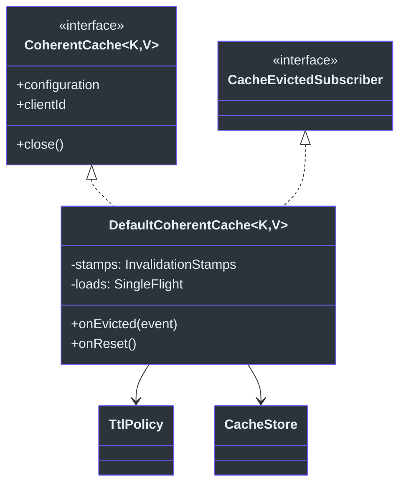
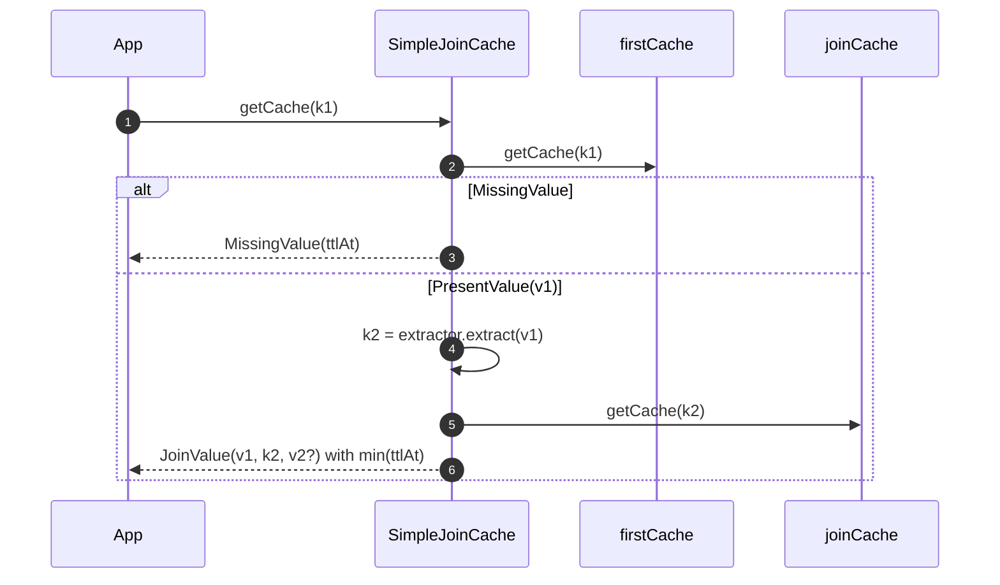

# Core Interfaces Reference

All user-facing interfaces and SPI live in `cocache-api` and have no runtime dependencies. `cocache-core` adds orchestration (`CoherentCache`, `TtlPolicy`) and default implementations.

## Cache API (cocache-api)

### Cache&lt;K, V&gt;

```kotlin
interface Cache<K, V> : CacheGetter<K, V>, CacheSetter<K, V>

interface CacheGetter<K, V> {
    fun getCache(key: K): CacheValue<V>?          // may be a MissingValue
    operator fun get(key: K): V?                  // null for absent, missing, or expired
    fun getTtlAt(key: K): Long?                   // null for absent, missing, or expired
}

interface CacheSetter<K, V> {
    fun setCache(key: K, value: CacheValue<V>)    // expired value == evict
    operator fun set(key: K, ttlAt: Long, value: V)
    operator fun set(key: K, value: V)            // uses the cache's own TTL policy; null → negative cache
    fun evict(key: K)
}
```

`get`, `getTtlAt` and `set(key, ttlAt, value)` have default implementations, so a `Cache` only needs `getCache`, `setCache`, `set(key, value)` and `evict`.

### CacheValue&lt;V&gt; (sealed)

```kotlin
sealed interface CacheValue<out V> : TtlAt {
    val value: V?          // null for MissingValue
    val isMissing: Boolean
    companion object {
        fun <V> of(value: V?, ttlAt: Long): CacheValue<V>   // null → MissingValue
        fun <V> forever(value: V?): CacheValue<V>
        fun <V> missing(ttlAt: Long = TtlAt.FOREVER): CacheValue<V>
    }
}
data class PresentValue<out V>(override val value: V, override val ttlAt: Long) : CacheValue<V>
data class MissingValue(override val ttlAt: Long) : CacheValue<Nothing>
```

The negative cache is an explicit state. No business value is ever interpreted as a negative entry, including strings or collections shaped like the Redis sentinel.

### TtlAt

`ttlAt` is an absolute epoch second; `TtlAt.FOREVER = Long.MAX_VALUE`. `isForever`, `isExpired` and `expiredDuration` are derived from it. Helpers: `TtlAt.currentTime()`, `TtlAt.at(ttl, amplitude = 0)` (relative → absolute, with jitter clamped to stay positive).

### CacheSource&lt;K, V&gt;

```kotlin
fun interface CacheSource<K, V> {
    fun loadCacheValue(key: K): CacheValue<V>?    // null → negative cache for missingTtl
    companion object { fun <K, V> noOp(): CacheSource<K, V> }
}
```

## Storage SPI (cocache-api)

### CacheStore&lt;V&gt;, ClientSideCache&lt;V&gt;, DistributedCache&lt;V&gt;

```kotlin
interface CacheStore<V> {
    fun getCache(key: String): CacheValue<V>?     // may return expired entries
    fun setCache(key: String, value: CacheValue<V>)
    fun evict(key: String)
}
interface ClientSideCache<V> : CacheStore<V> { val size: Long; fun clear() }
interface DistributedCache<V> : CacheStore<V>, AutoCloseable
```

Stores hold no TTL policy. Contract for `DistributedCache.getCache`: `null` means **miss**, so the caller reloads. Return a `MissingValue` only when the store really holds a negative record.

| Implementation | Tier | Source |
|----------------|------|--------|
| `CaffeineClientSideCache` | L2 (default, bounded; expired entries evicted on read) | [CaffeineClientSideCache.kt](https://github.com/Ahoo-Wang/CoCache/blob/main/cocache-core/src/main/kotlin/me/ahoo/cache/client/CaffeineClientSideCache.kt) |
| `MapClientSideCache` | L2 (unbounded, tests) | [MapClientSideCache.kt](https://github.com/Ahoo-Wang/CoCache/blob/main/cocache-core/src/main/kotlin/me/ahoo/cache/client/MapClientSideCache.kt) |
| `RedisDistributedCache` | L1 | [RedisDistributedCache.kt](https://github.com/Ahoo-Wang/CoCache/blob/main/cocache-spring-redis/src/main/kotlin/me/ahoo/cache/spring/redis/RedisDistributedCache.kt) |
| `InMemoryDistributedCache` | L1 (tests / single process) | [InMemoryDistributedCache.kt](https://github.com/Ahoo-Wang/CoCache/blob/main/cocache-core/src/main/kotlin/me/ahoo/cache/distributed/InMemoryDistributedCache.kt) |

### KeyConverter&lt;K&gt; and KeyFilter

```kotlin
fun interface KeyConverter<K> { fun toStringKey(sourceKey: K): String }
fun interface KeyFilter { fun notExist(key: String): Boolean; companion object { val NO_OP: KeyFilter } }
```

Built-ins: `ToStringKeyConverter(prefix)`, `ExpKeyConverter(prefix, "#{...}")` (compiled SpEL template), `BloomKeyFilter(guavaBloomFilter)`.

## Invalidation Channel SPI (cocache-api)

```kotlin
data class CacheEvictedEvent(val cacheName: String, val key: String, val publisherId: String)
interface CacheEvictedSubscriber : NamedCache {
    fun onEvicted(cacheEvictedEvent: CacheEvictedEvent)
    fun onReset()        // channel (re)subscribed: drop all local copies
}
interface CacheEvictedEventBus {
    fun publish(event: CacheEvictedEvent)
    fun register(subscriber: CacheEvictedSubscriber)
    fun unregister(subscriber: CacheEvictedSubscriber)
}
```

Implementations: `RedisCacheEvictedEventBus`, `LocalCacheEvictedEventBus`, `NoOpCacheEvictedEventBus`. See [Cache Coherence](../architecture/coherence.md).

## Orchestration (cocache-core)

### CoherentCache&lt;K, V&gt;

```kotlin
interface CoherentCache<K, V> : Cache<K, V>, NamedCache, AutoCloseable {
    val configuration: CoherentCacheConfiguration<K, V>
    val clientId: String
}

data class CoherentCacheConfiguration<K, V>(
    val cacheName: String,
    val clientId: String,
    val keyConverter: KeyConverter<K>,
    val distributedCache: DistributedCache<V>,
    val clientSideCache: ClientSideCache<V> = CaffeineClientSideCache.build(),
    val cacheSource: CacheSource<K, V> = CacheSource.noOp(),
    val keyFilter: KeyFilter = KeyFilter.NO_OP,
    val ttlPolicy: TtlPolicy = TtlPolicy()
)
```

`DefaultCoherentCache` is the implementation; create it via `DefaultCoherentCacheFactory(eventBus).create(configuration)`, which also registers it with the bus.


```mermaid
classDiagram
    class CoherentCache~K,V~ {
        <<interface>>
        +configuration
        +clientId
        +close()
    }
    class DefaultCoherentCache~K,V~ {
        -stamps: InvalidationStamps
        -loads: SingleFlight
        +onEvicted(event)
        +onReset()
    }
    class CacheEvictedSubscriber {
        <<interface>>
    }
    CoherentCache <|.. DefaultCoherentCache
    CacheEvictedSubscriber <|.. DefaultCoherentCache
    DefaultCoherentCache --> TtlPolicy
    DefaultCoherentCache --> CacheStore

    style CoherentCache fill:#2d333b,stroke:#6d5dfc,color:#e6edf3
    style DefaultCoherentCache fill:#2d333b,stroke:#6d5dfc,color:#e6edf3
    style CacheEvictedSubscriber fill:#2d333b,stroke:#6d5dfc,color:#e6edf3
    style TtlPolicy fill:#2d333b,stroke:#6d5dfc,color:#e6edf3
    style CacheStore fill:#2d333b,stroke:#6d5dfc,color:#e6edf3
```

### TtlPolicy

```kotlin
data class TtlPolicy(val ttl: Long = 3600, val ttlAmplitude: Long = 60, val missingTtl: Long = 60) {
    fun <V> toCacheValue(value: V?): CacheValue<V>   // value: ttl ± amplitude; null: missingTtl
    fun <V> missing(): CacheValue<V>
}
```

### SingleFlight&lt;K, R&gt;

`execute(key) { ... }` runs the block once per key at a time. Concurrent callers share its result or its original exception. Re-entering the same key on the same thread fails fast.

## JoinCache (cocache-api)

```kotlin
interface JoinCache<K1, V1, K2, V2> : Cache<K1, JoinValue<V1, K2, V2>> {
    val joinKeyExtractor: JoinKeyExtractor<V1, K2>
    fun evict(firstKey: K1, joinKey: K2)          // evicts both
}
data class JoinValue<V1, K2, V2>(val firstValue: V1, val joinKey: K2, val secondValue: V2?)
fun interface JoinKeyExtractor<V1, K2> { fun extract(firstValue: V1): K2 }
```


```mermaid
sequenceDiagram
autonumber
    participant App
    participant J as SimpleJoinCache
    participant F as firstCache
    participant S as joinCache

    App->>J: getCache(k1)
    J->>F: getCache(k1)
    alt MissingValue
        J-->>App: MissingValue(ttlAt)
    else PresentValue(v1)
        J->>J: k2 = extractor.extract(v1)
        J->>S: getCache(k2)
        J-->>App: JoinValue(v1, k2, v2?) with min(ttlAt)
    end
```

`SimpleJoinCache.evict(key)` evicts only the first cache, because the joined cache has its own lifecycle. `set(key, joinValue)` writes each component through its own cache's TTL policy.

## Factory Interfaces (cocache-core)

| Interface | Creates | Spring implementation |
|-----------|---------|-----------------------|
| `CacheProxyFactory` | `@CoCache` proxies | `DefaultCacheProxyFactory` |
| `JoinCacheProxyFactory` | `@JoinCacheable` proxies | `DefaultJoinCacheProxyFactory` |
| `CoherentCacheFactory` | `CoherentCache` | `DefaultCoherentCacheFactory` |
| `ClientSideCacheFactory` | L2 | `SpringClientSideCacheFactory` |
| `DistributedCacheFactory` | L1 | `RedisDistributedCacheFactory` |
| `KeyConverterFactory` | `KeyConverter` | `SpringKeyConverterFactory` |
| `CacheSourceFactory` | `CacheSource` | `SpringCacheSourceFactory` |
| `JoinKeyExtractorFactory` | `JoinKeyExtractor` | `SpringJoinKeyExtractorFactory` |

## Related Pages

- [API Overview](./index.md)
- [Annotations](./annotations.md)
- [Cache Layers](../architecture/cache-layers.md)
