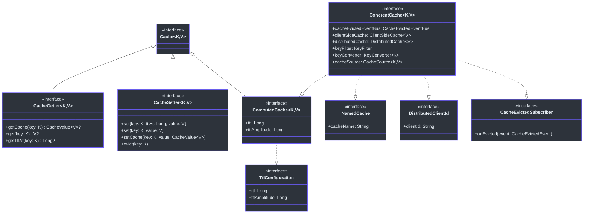
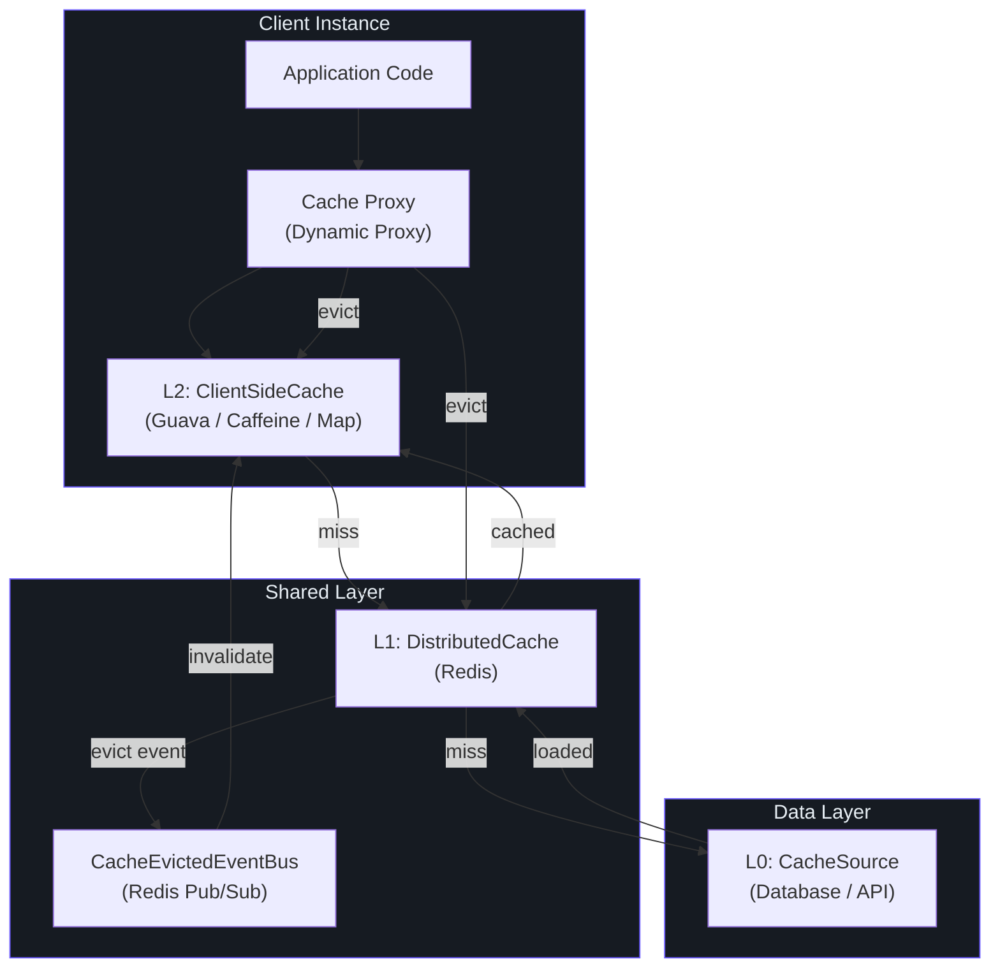
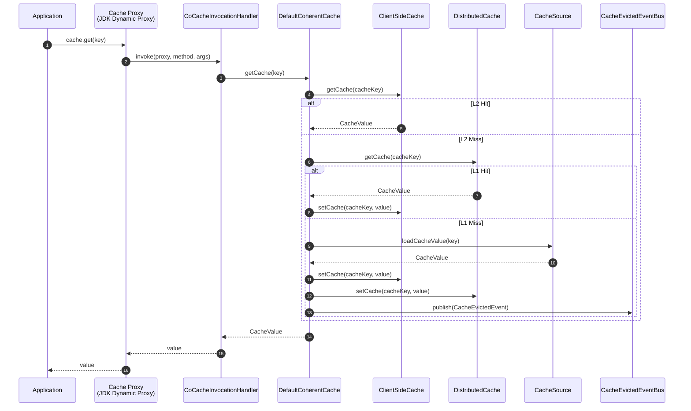
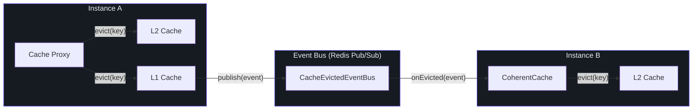
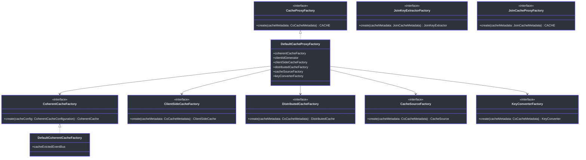

# CoCache API Overview

CoCache provides a **Level 2 Distributed Coherence Cache Framework** for Java/Kotlin applications. The API is organized across multiple modules, each responsible for a distinct layer of the caching architecture.

## Module Organization

The API surface is spread across the following modules, ordered from low-level to high-level:

| Module | Artifact | Purpose | Source |
|--------|----------|---------|--------|
| **cocache-api** | Core interfaces and annotations | Defines `Cache`, `CacheValue`, `ClientSideCache`, `CacheSource`, `JoinCache`, and all cache annotations | [cocache-api/src/main/kotlin/me/ahoo/cache/api](https://github.com/Ahoo-Wang/CoCache/blob/main/cocache-api/src/main/kotlin/me/ahoo/cache/api) |
| **cocache-core** | Default implementations | Provides `DefaultCoherentCache`, proxy-based caching, key converters, event bus, key filters | [cocache-core/src/main/kotlin/me/ahoo/cache](https://github.com/Ahoo-Wang/CoCache/blob/main/cocache-core/src/main/kotlin/me/ahoo/cache) |
| **cocache-spring** | Spring Framework integration | Factory beans, `@EnableCoCache`, Spring-aware factories for client-side/distributed caches | [cocache-spring/src/main/kotlin/me/ahoo/cache/spring](https://github.com/Ahoo-Wang/CoCache/blob/main/cocache-spring/src/main/kotlin/me/ahoo/cache/spring) |
| **cocache-spring-redis** | Redis distributed cache | `RedisDistributedCache`, `RedisCacheEvictedEventBus`, `RedisDistributedCacheFactory` | [cocache-spring-redis/src/main/kotlin/me/ahoo/cache/spring/redis](https://github.com/Ahoo-Wang/CoCache/blob/main/cocache-spring-redis/src/main/kotlin/me/ahoo/cache/spring/redis) |
| **cocache-spring-cache** | Spring Cache bridge | `CoCacheManager`, `CoSpringCache` adapters for Spring's `CacheManager` abstraction | [cocache-spring-cache/src/main/kotlin/me/ahoo/cache/spring/cache](https://github.com/Ahoo-Wang/CoCache/blob/main/cocache-spring-cache/src/main/kotlin/me/ahoo/cache/spring/cache) |
| **cocache-spring-boot-starter** | Spring Boot auto-configuration | `CoCacheAutoConfiguration`, actuator endpoints, properties binding | [cocache-spring-boot-starter/src/main/kotlin/me/ahoo/cache/spring/boot/starter](https://github.com/Ahoo-Wang/CoCache/blob/main/cocache-spring-boot-starter/src/main/kotlin/me/ahoo/cache/spring/boot/starter) |

## Interface Hierarchy

The CoCache API is built on a layered interface hierarchy. The following diagram shows the core type relationships:

## Cache Layer Architecture

CoCache implements a three-tier cache architecture with L2 (client-side), L1 (distributed), and L0 (data source):

## Key Packages

### cocache-api Packages

| Package | Description | Key Types |
|---------|-------------|-----------|
| `me.ahoo.cache.api` | Core cache abstractions | `Cache`, `CacheGetter`, `CacheSetter`, `CacheValue`, `TtlAt`, `NamedCache` |
| `me.ahoo.cache.api.client` | Client-side cache interface | `ClientSideCache` |
| `me.ahoo.cache.api.source` | Data source interface | `CacheSource`, `NoOpCacheSource` |
| `me.ahoo.cache.api.join` | Join cache abstractions | `JoinCache`, `JoinValue`, `JoinKeyExtractor` |
| `me.ahoo.cache.api.annotation` | Declarative cache annotations | `@CoCache`, `@GuavaCache`, `@CaffeineCache`, `@JoinCacheable` |

### cocache-core Packages

| Package | Description | Key Types |
|---------|-------------|-----------|
| `me.ahoo.cache` | Core implementations and interfaces | `ComputedCache`, `DefaultCacheValue`, `MissingGuard`, `KeyFilter`, `TtlConfiguration` |
| `me.ahoo.cache.consistency` | Cache coherence engine | `CoherentCache`, `DefaultCoherentCache`, `CacheEvictedEventBus`, `CacheEvictedEvent`, `CoherentCacheFactory` |
| `me.ahoo.cache.proxy` | Dynamic proxy-based caching | `CacheProxyFactory`, `DefaultCacheProxyFactory`, `CoCacheInvocationHandler`, `CoCacheProxy` |
| `me.ahoo.cache.client` | Client-side cache implementations | `MapClientSideCache`, `GuavaClientSideCache`, `CaffeineClientSideCache`, `ClientSideCacheFactory` |
| `me.ahoo.cache.distributed` | Distributed cache abstractions | `DistributedCache`, `DistributedClientId`, `DistributedCacheFactory` |
| `me.ahoo.cache.converter` | Key conversion utilities | `KeyConverter`, `ToStringKeyConverter`, `ExpKeyConverter`, `KeyConverterFactory` |
| `me.ahoo.cache.filter` | Cache key filters | `BloomKeyFilter`, `NoOpKeyFilter` |
| `me.ahoo.cache.source` | Cache source factories | `CacheSourceFactory` |
| `me.ahoo.cache.join` | Join cache implementation | `SimpleJoinCache`, `DefaultJoinValue`, `ExpJoinKeyExtractor`, `JoinKeyExtractorFactory` |
| `me.ahoo.cache.annotation` | Metadata parsers | `CoCacheMetadata`, `CoCacheMetadataParser`, `JoinCacheMetadata`, `JoinCacheMetadataParser` |

## Dynamic Proxy Architecture

CoCache uses JDK dynamic proxies to implement cache interfaces. The proxy intercepts all method calls and delegates to the underlying `CoherentCache`:

## Cache Eviction Flow

When a cache entry is evicted, the event is propagated across all client instances via the event bus:

## Factory Pattern

CoCache uses a **factory pattern** extensively to create cache components. All factories accept a `CoCacheMetadata` (parsed from annotations) and produce the corresponding cache component:

## Related Pages

- [Core Interfaces](./core-interfaces.md) -- Detailed reference for all core interfaces
- [Annotations](./annotations.md) -- Complete annotation reference
- [Spring Integration](./spring-integration.md) -- Spring and Spring Boot integration API
- [Actuator Endpoints](./actuator.md) -- Monitoring and management endpoints
