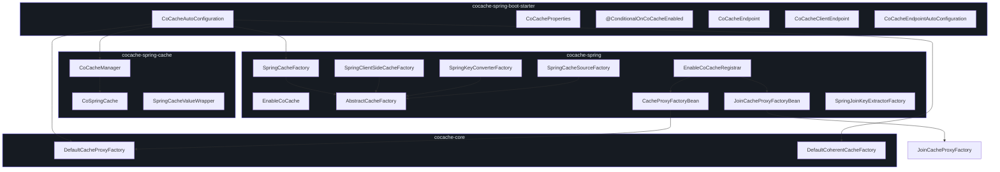
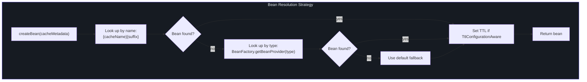
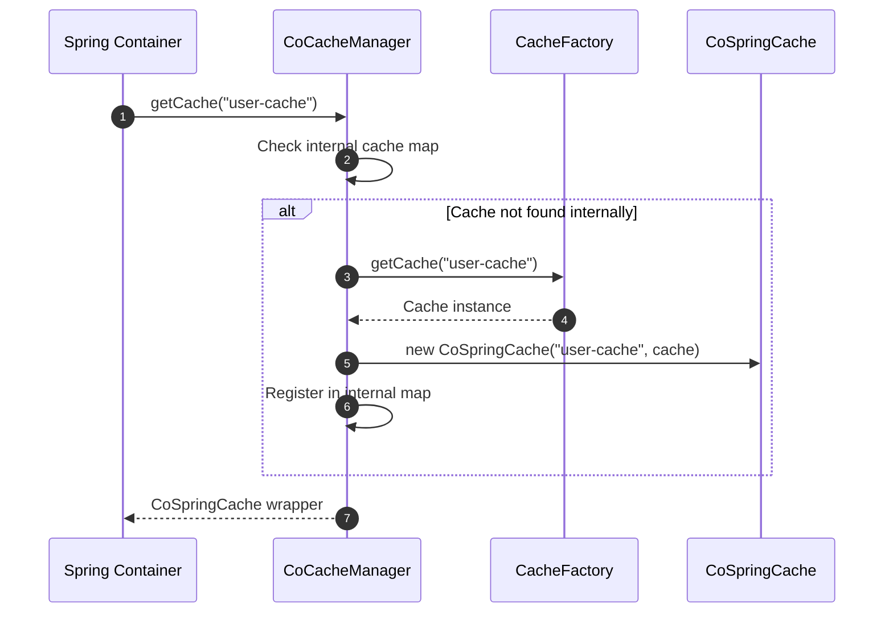
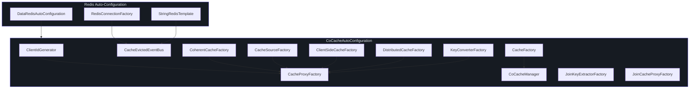

# Spring Integration API

CoCache provides deep integration with the Spring Framework through the `cocache-spring`, `cocache-spring-cache`, and `cocache-spring-boot-starter` modules. This page documents all Spring-specific components.

## Module Overview



## Factory Beans

### CacheProxyFactoryBean

Spring `FactoryBean` that creates proxy-based cache instances for `@CoCache`-annotated interfaces.

| Aspect | Detail | Source |
|--------|--------|--------|
| **Implements** | `FactoryBean<Cache<Any, Any>>`, `ApplicationContextAware` | -- |
| **Constructor** | `(cacheMetadata: CoCacheMetadata)` | -- |
| **Source File** | -- | [CacheProxyFactoryBean.kt:23](https://github.com/Ahoo-Wang/CoCache/blob/main/cocache-spring/src/main/kotlin/me/ahoo/cache/spring/proxy/CacheProxyFactoryBean.kt#L23) |

| Method | Returns | Description |
|--------|---------|-------------|
| `getObject()` | `Cache<Any, Any>` | Retrieves `CacheProxyFactory` from the application context and calls `create(cacheMetadata)` |
| `getObjectType()` | `Class<*>` | Returns the cache interface class (`cacheMetadata.proxyInterface.java`) |

### JoinCacheProxyFactoryBean

Spring `FactoryBean` that creates proxy-based join cache instances for `@JoinCacheable`-annotated interfaces.

| Aspect | Detail | Source |
|--------|--------|--------|
| **Implements** | `FactoryBean<JoinCache<Any, Any, Any, Any>>`, `ApplicationContextAware` | -- |
| **Constructor** | `(cacheMetadata: JoinCacheMetadata)` | -- |
| **Source File** | -- | [JoinCacheProxyFactoryBean.kt:23](https://github.com/Ahoo-Wang/CoCache/blob/main/cocache-spring/src/main/kotlin/me/ahoo/cache/spring/join/JoinCacheProxyFactoryBean.kt#L23) |

| Method | Returns | Description |
|--------|---------|-------------|
| `getObject()` | `JoinCache<Any, Any, Any, Any>` | Retrieves `JoinCacheProxyFactory` from the application context and calls `create(cacheMetadata)` |
| `getObjectType()` | `Class<*>` | Returns the join cache interface class |

## AbstractCacheFactory Pattern

The `AbstractCacheFactory` provides a template method pattern for creating cache components from Spring beans, with a named-bean-first lookup strategy and type-based fallback.

| Aspect | Detail | Source |
|--------|--------|--------|
| **Package** | `me.ahoo.cache.spring` | -- |
| **Source File** | -- | [AbstractCacheFactory.kt:21](https://github.com/Ahoo-Wang/CoCache/blob/main/cocache-spring/src/main/kotlin/me/ahoo/cache/spring/AbstractCacheFactory.kt#L21) |

### Bean Resolution Strategy



### Abstract Methods

| Method | Signature | Description |
|--------|-----------|-------------|
| `suffix` | `abstract val suffix: String` | Bean name suffix for this factory type |
| `getBeanType` | `abstract fun getBeanType(cacheMetadata: CoCacheMetadata): ResolvableType` | Returns the generic `ResolvableType` for bean lookup |
| `fallback` | `abstract fun fallback(cacheMetadata: CoCacheMetadata): Any` | Default component when no Spring bean is found |
| `getBeanProvider` | `open fun getBeanProvider(...)` | Type-based bean lookup with fallback provider |

## Spring Factory Implementations

All Spring factory implementations extend `AbstractCacheFactory` and follow the same named-bean-first resolution pattern.

### SpringClientSideCacheFactory

| Aspect | Detail | Source |
|--------|--------|--------|
| **Implements** | `ClientSideCacheFactory`, `AbstractCacheFactory` | -- |
| **Bean Name Suffix** | `.ClientSideCache` | -- |
| **Fallback** | `DefaultClientSideCacheFactory.create()` (uses `@GuavaCache`/`@CaffeineCache` annotations) | -- |
| **Source File** | -- | [SpringClientSideCacheFactory.kt:25](https://github.com/Ahoo-Wang/CoCache/blob/main/cocache-spring/src/main/kotlin/me/ahoo/cache/spring/client/SpringClientSideCacheFactory.kt#L25) |

### SpringKeyConverterFactory

| Aspect | Detail | Source |
|--------|--------|--------|
| **Implements** | `KeyConverterFactory`, `AbstractCacheFactory` | -- |
| **Bean Name Suffix** | `.KeyConverter` | -- |
| **Fallback** | `ExpKeyConverter` if `keyExpression` is set, otherwise `ToStringKeyConverter` with computed prefix | -- |
| **Source File** | -- | [SpringKeyConverterFactory.kt:27](https://github.com/Ahoo-Wang/CoCache/blob/main/cocache-spring/src/main/kotlin/me/ahoo/cache/spring/converter/SpringKeyConverterFactory.kt#L27) |

Special behavior: skips bean lookup when `keyType` is `String` (no conversion needed).

### SpringCacheSourceFactory

| Aspect | Detail | Source |
|--------|--------|--------|
| **Implements** | `CacheSourceFactory`, `AbstractCacheFactory` | -- |
| **Bean Name Suffix** | `.CacheSource` | -- |
| **Fallback** | `CacheSource.noOp()` | -- |
| **Source File** | -- | [SpringCacheSourceFactory.kt:24](https://github.com/Ahoo-Wang/CoCache/blob/main/cocache-spring/src/main/kotlin/me/ahoo/cache/spring/source/SpringCacheSourceFactory.kt#L24) |

### SpringJoinKeyExtractorFactory

| Aspect | Detail | Source |
|--------|--------|--------|
| **Implements** | `JoinKeyExtractorFactory` | -- |
| **Bean Name Suffix** | `.JoinKeyExtractor` | -- |
| **Fallback** | Uses `joinKeyExpression` SpEL if set, otherwise type-based bean lookup | -- |
| **Source File** | -- | [SpringJoinKeyExtractorFactory.kt:24](https://github.com/Ahoo-Wang/CoCache/blob/main/cocache-spring/src/main/kotlin/me/ahoo/cache/spring/join/SpringJoinKeyExtractorFactory.kt#L24) |

### SpringCacheFactory

The `CacheFactory` implementation that retrieves cache beans from the Spring `BeanFactory`.

| Aspect | Detail | Source |
|--------|--------|--------|
| **Implements** | `CacheFactory` | -- |
| **Constructor** | `(beanFactory: ListableBeanFactory)` | -- |
| **Source File** | -- | [SpringCacheFactory.kt:24](https://github.com/Ahoo-Wang/CoCache/blob/main/cocache-spring/src/main/kotlin/me/ahoo/cache/spring/SpringCacheFactory.kt#L24) |

| Method | Description |
|--------|-------------|
| `caches` | Returns all `Cache` beans from the application context via `getBeansOfType(Cache::class.java)` |
| `getCache(cacheName, cacheType)` | Retrieves a cache bean by name and type |
| `getCache(keyType, valueType)` | Retrieves a cache bean by generic key/value types using `ResolvableType` |

## Bean Naming Conventions

CoCache uses a consistent `{cacheName}.{Suffix}` naming pattern for optional customization beans. Register a Spring bean with the matching name to override the default.

| Bean Name Pattern | Factory | Purpose | Default Behavior |
|-------------------|---------|---------|-----------------|
| `{cacheName}.ClientSideCache` | `SpringClientSideCacheFactory` | L2 local cache | `DefaultClientSideCacheFactory.create()` |
| `{cacheName}.DistributedCache` | `RedisDistributedCacheFactory` | L1 distributed cache | Redis-backed `RedisDistributedCache` |
| `{cacheName}.CacheSource` | `SpringCacheSourceFactory` | L0 data source | `CacheSource.noOp()` |
| `{cacheName}.KeyConverter` | `SpringKeyConverterFactory` | Key conversion | `ToStringKeyConverter` or `ExpKeyConverter` |
| `{cacheName}.JoinKeyExtractor` | `SpringJoinKeyExtractorFactory` | Join key extraction | SpEL expression or type-based bean |
| `{cacheName}.CacheMetadata` | `EnableCoCacheRegistrar` | Parsed annotation metadata | Auto-generated |

### Customization Example

To provide a custom `ClientSideCache` for a specific cache:

```kotlin
@Configuration
class CustomCacheConfig {

    @Bean("user-cache.ClientSideCache")
    fun userClientSideCache(): ClientSideCache<User> {
        return CaffeineClientSideCache(
            Caffeine.newBuilder()
                .maximumSize(20_000)
                .expireAfterWrite(Duration.ofMinutes(10))
                .build()
        )
    }

    @Bean("user-cache.CacheSource")
    fun userCacheSource(userRepository: UserRepository): CacheSource<String, User> {
        return object : CacheSource<String, User> {
            override fun loadCacheValue(key: String): CacheValue<User>? {
                return userRepository.findById(key).map {
                    DefaultCacheValue.ttlAt(it, 3600)
                }.orElse(null)
            }
        }
    }
}
```

## CoCacheManager

Bridge between CoCache and Spring's `CacheManager` abstraction, enabling `@Cacheable` and other Spring Cache annotations.

| Aspect | Detail | Source |
|--------|--------|--------|
| **Extends** | `AbstractCacheManager` | -- |
| **Constructor** | `(cacheFactory: CacheFactory)` | -- |
| **Source File** | -- | [CoCacheManager.kt:21](https://github.com/Ahoo-Wang/CoCache/blob/main/cocache-spring-cache/src/main/kotlin/me/ahoo/cache/spring/cache/CoCacheManager.kt#L21) |

| Method | Returns | Description |
|--------|---------|-------------|
| `loadCaches()` | `Collection<SpringCache>` | Wraps all registered CoCache instances as `CoSpringCache` adapters |
| `getMissingCache(name)` | `SpringCache?` | Looks up a CoCache by name and wraps it if found; returns `null` otherwise |

### CoCacheManager Flow



## CoSpringCache

Adapter that wraps a CoCache `Cache` instance as a Spring `Cache` implementation.

| Aspect | Detail | Source |
|--------|--------|--------|
| **Implements** | `NamedCache`, `SpringCache`, `CacheDelegated<Cache<Any, Any?>>` | -- |
| **Constructor** | `(cacheName: String, delegate: Cache<Any, Any?>)` | -- |
| **Source File** | -- | [CoSpringCache.kt:27](https://github.com/Ahoo-Wang/CoCache/blob/main/cocache-spring-cache/src/main/kotlin/me/ahoo/cache/spring/cache/CoSpringCache.kt#L27) |

| Method | Spring Interface | Description |
|--------|-----------------|-------------|
| `getName()` | `Cache.getName()` | Returns the cache name |
| `getNativeCache()` | `Cache.getNativeCache()` | Returns the underlying CoCache instance |
| `get(key)` | `Cache.get(key)` | Returns a `SpringCacheValueWrapper` around the CoCache value |
| `get(key, type)` | `Cache.get(key, type)` | Returns the value cast to the specified type |
| `get(key, valueLoader)` | `Cache.get(key, valueLoader)` | Loads value via `Callable` if not cached, then stores it |
| `put(key, value)` | `Cache.put(key, value)` | Delegates to `delegate.set(key, value)` |
| `evict(key)` | `Cache.evict(key)` | Delegates to `delegate.evict(key)` |
| `clear()` | `Cache.clear()` | Clears the `ClientSideCache` (if `CoherentCache`, clears L2 only) |
| `retrieve(key)` | `Cache.retrieve(key)` | Async get via `CompletableFuture.supplyAsync` |
| `retrieve(key, valueLoader)` | `Cache.retrieve(key, valueLoader)` | Async get with `CompletableFuture` composition |

### Using with @Cacheable

Once `CoCacheManager` is registered, standard Spring Cache annotations work seamlessly:

```kotlin
@Service
class UserService(
    private val userRepository: UserRepository
) {
    @Cacheable(cacheNames = ["user-cache"], key = "#userId")
    fun getUser(userId: String): User {
        return userRepository.findById(userId).orElseThrow()
    }

    @CacheEvict(cacheNames = ["user-cache"], key = "#userId")
    fun deleteUser(userId: String) {
        userRepository.deleteById(userId)
    }
}
```

## EnableCoCacheRegistrar

The registrar that processes `@EnableCoCache` and registers `CacheProxyFactoryBean` / `JoinCacheProxyFactoryBean` definitions.

| Aspect | Detail | Source |
|--------|--------|--------|
| **Implements** | `ImportBeanDefinitionRegistrar` | -- |
| **Source File** | -- | [EnableCoCacheRegistrar.kt:31](https://github.com/Ahoo-Wang/CoCache/blob/main/cocache-spring/src/main/kotlin/me/ahoo/cache/spring/EnableCoCacheRegistrar.kt#L31) |

### Registration Logic

| Step | Action |
|------|--------|
| 1 | Resolve cache types from `@EnableCoCache.caches` attribute |
| 2 | Split into standard caches (not extending `JoinCache`) and join caches |
| 3 | For standard caches: parse `CoCacheMetadata`, register metadata bean + `CacheProxyFactoryBean` (marked as primary) |
| 4 | For join caches: parse `JoinCacheMetadata`, register `JoinCacheProxyFactoryBean` (marked as primary) |

## CoCacheAutoConfiguration

Spring Boot auto-configuration class that wires up all CoCache components.

| Aspect | Detail | Source |
|--------|--------|--------|
| **Condition** | `@ConditionalOnCoCacheEnabled`, `@AutoConfiguration(after = [DataRedisAutoConfiguration::class])` | -- |
| **Source File** | -- | [CoCacheAutoConfiguration.kt:66](https://github.com/Ahoo-Wang/CoCache/blob/main/cocache-spring-boot-starter/src/main/kotlin/me/ahoo/cache/spring/boot/starter/CoCacheAutoConfiguration.kt#L66) |

### Registered Beans

| Bean Name | Type | Condition | Description |
|-----------|------|-----------|-------------|
| `defaultHostClientIdGenerator` | `ClientIdGenerator` | No `ClientIdGenerator` or `HostAddressSupplier` bean exists | Uses host address as client ID |
| `cacheFactory` | `CacheFactory` | No existing bean | `SpringCacheFactory` backed by `ListableBeanFactory` |
| `coCacheManager` | `CoCacheManager` | Always | Spring Cache bridge |
| `cocacheRedisMessageListenerContainer` | `RedisMessageListenerContainer` | `RedisConnectionFactory` available | Redis pub/sub listener for eviction events |
| `cacheEvictedEventBus` | `CacheEvictedEventBus` | No existing bean | `RedisCacheEvictedEventBus` |
| `coherentCacheFactory` | `CoherentCacheFactory` | No existing bean | `DefaultCoherentCacheFactory` |
| `cacheSourceFactory` | `CacheSourceFactory` | No existing bean | `SpringCacheSourceFactory` |
| `clientSideCacheFactory` | `ClientSideCacheFactory` | No existing bean | `SpringClientSideCacheFactory` |
| `distributedCacheFactory` | `DistributedCacheFactory` | No existing bean | `RedisDistributedCacheFactory` |
| `keyConverterFactory` | `KeyConverterFactory` | No existing bean | `SpringKeyConverterFactory` |
| `cacheProxyFactory` | `CacheProxyFactory` | No existing bean | `DefaultCacheProxyFactory` |
| `joinKeyExtractorFactory` | `JoinKeyExtractorFactory` | No existing bean | `SpringJoinKeyExtractorFactory` |
| `joinCacheProxyFactory` | `JoinCacheProxyFactory` | No existing bean | `DefaultJoinCacheProxyFactory` |

### Auto-Configuration Dependency Graph



## Related Pages

- [API Overview](./index.md) -- Architecture overview and module organization
- [Core Interfaces](./core-interfaces.md) -- Detailed reference for all core interfaces
- [Annotations](./annotations.md) -- Complete annotation reference
- [Actuator Endpoints](./actuator.md) -- Monitoring and management endpoints
