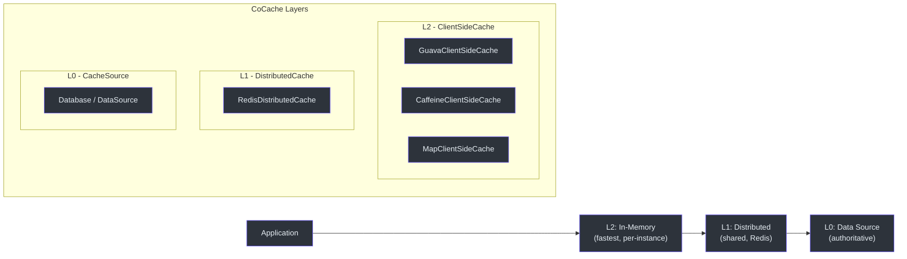
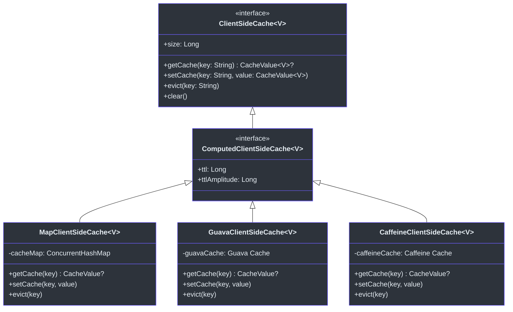
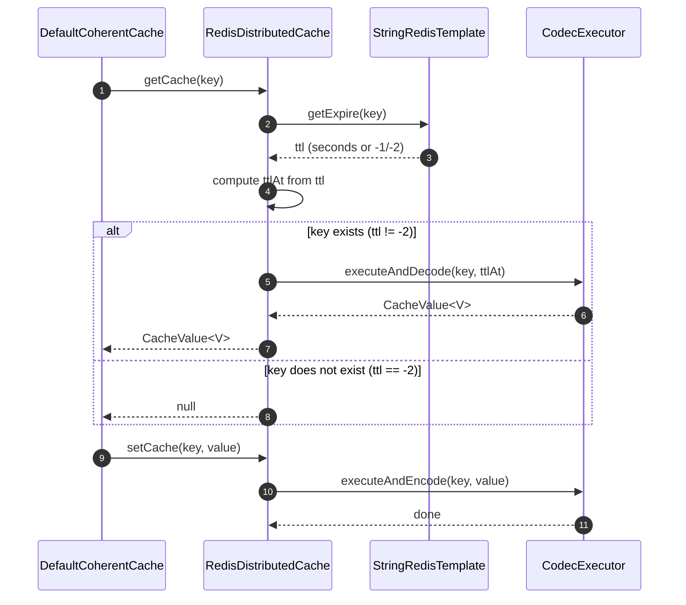
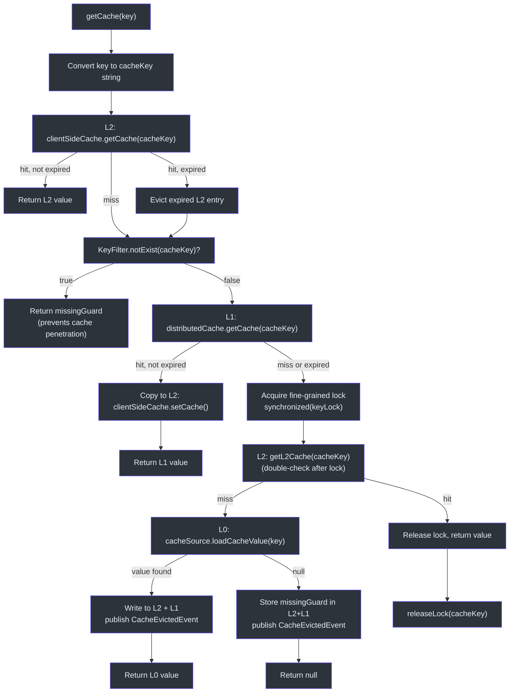

# Cache Layers Deep Dive

CoCache organizes data retrieval into three distinct layers, each with a specific role in the caching hierarchy. The `DefaultCoherentCache` class orchestrates all three layers, handling the read path, write path, and eviction flow with fine-grained locking and cache coherence event publication.

## Layer Overview



## L2 -- ClientSideCache (In-Memory, Per-Instance)

The L2 layer is the fastest cache tier. It stores `CacheValue<V>` entries directly in the JVM heap, keyed by `String`. Every application instance maintains its own independent L2 cache.

### Interface

The [`ClientSideCache<V>`](https://github.com/Ahoo-Wang/CoCache/blob/main/cocache-api/src/main/kotlin/me/ahoo/cache/api/client/ClientSideCache.kt#L22) interface extends `Cache<String, V>` and adds a `size` property and a `clear()` method:

```kotlin
interface ClientSideCache<V> : Cache<String, V> {
    val size: Long
    fun clear()
}
```

### Implementations

| Implementation | Backing Store | Configuration Annotation | Source |
|----------------|---------------|--------------------------|--------|
| [`MapClientSideCache`](https://github.com/Ahoo-Wang/CoCache/blob/main/cocache-core/src/main/kotlin/me/ahoo/cache/client/MapClientSideCache.kt#L24) | `ConcurrentHashMap` | Default (no annotation needed) | [MapClientSideCache.kt](https://github.com/Ahoo-Wang/CoCache/blob/main/cocache-core/src/main/kotlin/me/ahoo/cache/client/MapClientSideCache.kt#L24) |
| [`GuavaClientSideCache`](https://github.com/Ahoo-Wang/CoCache/blob/main/cocache-core/src/main/kotlin/me/ahoo/cache/client/GuavaClientSideCache.kt#L26) | Guava `Cache` | `@GuavaCache` | [GuavaClientSideCache.kt](https://github.com/Ahoo-Wang/CoCache/blob/main/cocache-core/src/main/kotlin/me/ahoo/cache/client/GuavaClientSideCache.kt#L26) |
| [`CaffeineClientSideCache`](https://github.com/Ahoo-Wang/CoCache/blob/main/cocache-core/src/main/kotlin/me/ahoo/cache/client/CaffeineClientSideCache.kt#L27) | Caffeine `Cache` | `@CaffeineCache` | [CaffeineClientSideCache.kt](https://github.com/Ahoo-Wang/CoCache/blob/main/cocache-core/src/main/kotlin/me/ahoo/cache/client/CaffeineClientSideCache.kt#L27) |

Both `GuavaClientSideCache` and `CaffeineClientSideCache` provide companion factory methods that read their respective annotations to configure `initialCapacity`, `maximumSize`, `expireAfterWrite`, `expireAfterAccess`, and other cache parameters. The `ClientSideCacheFactory` abstraction resolves which implementation to use at runtime based on the annotation present on the cache interface.



## L1 -- DistributedCache (Shared, Redis)

The L1 layer is a shared cache accessible by all application instances. Currently the primary implementation is `RedisDistributedCache`, which uses Spring Data Redis.

### Interface

The [`DistributedCache<V>`](https://github.com/Ahoo-Wang/CoCache/blob/main/cocache-core/src/main/kotlin/me/ahoo/cache/distributed/DistributedCache.kt#L22) interface extends `ComputedCache<String, V>` and `AutoCloseable`:

```kotlin
interface DistributedCache<V> : ComputedCache<String, V>, AutoCloseable
```

### RedisDistributedCache

[`RedisDistributedCache`](https://github.com/Ahoo-Wang/CoCache/blob/main/cocache-spring-redis/src/main/kotlin/me/ahoo/cache/spring/redis/RedisDistributedCache.kt#L28) uses a `StringRedisTemplate` and a `CodecExecutor` for serialization. On read, it first queries the Redis TTL via `getExpire(key)` to compute the local `ttlAt` timestamp, then fetches and decodes the value. This ensures the local representation carries the correct remaining TTL from Redis.



| Constant | Value | Meaning |
|----------|-------|---------|
| `FOREVER` | `-1` | Key exists but has no expiration |
| `NOT_EXIST` | `-2` | Key does not exist in Redis |

## L0 -- CacheSource (Data Source)

The L0 layer represents the authoritative data source (typically a database). It is the last resort when both L2 and L1 miss. The [`CacheSource<K, V>`](https://github.com/Ahoo-Wang/CoCache/blob/main/cocache-api/src/main/kotlin/me/ahoo/cache/api/source/CacheSource.kt#L24) interface defines a single method:

```kotlin
interface CacheSource<K, V> {
    fun loadCacheValue(key: K): CacheValue<V>?
}
```

When `loadCacheValue` returns `null`, `DefaultCoherentCache` stores a `missingGuard` value to prevent cache penetration. When it returns a value, the value is written to both L1 and L2, and a `CacheEvictedEvent` is published.

## Read Path -- getCache()

The complete read path is implemented in [`DefaultCoherentCache.getCache()`](https://github.com/Ahoo-Wang/CoCache/blob/main/cocache-core/src/main/kotlin/me/ahoo/cache/consistency/DefaultCoherentCache.kt#L89) and the helper [`getL2Cache()`](https://github.com/Ahoo-Wang/CoCache/blob/main/cocache-core/src/main/kotlin/me/ahoo/cache/consistency/DefaultCoherentCache.kt#L50):



### Key Implementation Details

**Fine-Grained Locking** -- The lock map at [line 47](https://github.com/Ahoo-Wang/CoCache/blob/main/cocache-core/src/main/kotlin/me/ahoo/cache/consistency/DefaultCoherentCache.kt#L47) uses `ConcurrentHashMap<String, Any>()` to store one lock object per cache key. The `getLock()` method at [line 78](https://github.com/Ahoo-Wang/CoCache/blob/main/cocache-core/src/main/kotlin/me/ahoo/cache/consistency/DefaultCoherentCache.kt#L78) uses `computeIfAbsent` for atomic lock creation. After the L0 load completes, `releaseLock()` at [line 84](https://github.com/Ahoo-Wang/CoCache/blob/main/cocache-core/src/main/kotlin/me/ahoo/cache/consistency/DefaultCoherentCache.kt#L84) removes the lock entry to prevent memory leaks.

**Double-Check After Lock** -- After acquiring the lock, `getL2Cache()` is called again at [line 104](https://github.com/Ahoo-Wang/CoCache/blob/main/cocache-core/src/main/kotlin/me/ahoo/cache/consistency/DefaultCoherentCache.kt#L104) to check if another thread already loaded the value while this thread was waiting for the lock. This prevents redundant L0 calls.

## Write Path -- setCache()

The write path at [`setCache()`](https://github.com/Ahoo-Wang/CoCache/blob/main/cocache-core/src/main/kotlin/me/ahoo/cache/consistency/DefaultCoherentCache.kt#L142) writes to both cache layers simultaneously and then publishes an eviction event:

```kotlin
override fun setCache(key: K, value: CacheValue<V>) {
    if (value.isExpired) {
        return
    }
    val cacheKey = keyConverter.toStringKey(key)
    setCache(cacheKey, value)                    // writes to L2 + L1
    cacheEvictedEventBus.publish(CacheEvictedEvent(cacheName, cacheKey, clientId))
}
```

The private `setCache(cacheKey, cacheValue)` at [line 137](https://github.com/Ahoo-Wang/CoCache/blob/main/cocache-core/src/main/kotlin/me/ahoo/cache/consistency/DefaultCoherentCache.kt#L137) writes to both layers:

```kotlin
private fun setCache(cacheKey: String, cacheValue: CacheValue<V>) {
    clientSideCache.setCache(cacheKey, cacheValue)   // L2
    distributedCache.setCache(cacheKey, cacheValue)   // L1
}
```

## Eviction Path -- evict()

The eviction path at [`evict()`](https://github.com/Ahoo-Wang/CoCache/blob/main/cocache-core/src/main/kotlin/me/ahoo/cache/consistency/DefaultCoherentCache.kt#L151) removes the entry from both layers and publishes an event:

```kotlin
override fun evict(key: K) {
    val cacheKey = keyConverter.toStringKey(key)
    clientSideCache.evict(cacheKey)                    // L2
    distributedCache.evict(cacheKey)                    // L1
    cacheEvictedEventBus.publish(CacheEvictedEvent(cacheName, cacheKey, clientId))
}
```

The event publication triggers remote instances to evict their own L2 caches for the same key. This is the core of CoCache's coherence mechanism. See [Cache Coherence](./coherence.md) for the full event flow.

## Layer Interaction Summary

```mermaid
graph TB
    subgraph "Write Path: setCache"

        W1["Write L2"] --> W2["Write L1"]
        W2 --> W3["Publish CacheEvictedEvent"]
    end

    subgraph "Eviction Path: evict"

        E1["Evict L2"] --> E2["Evict L1"]
        E2 --> E3["Publish CacheEvictedEvent"]
    end

    subgraph "Read Path: getCache"

        R1["Read L2"] --> R2["KeyFilter"]
        R2 --> R3["Read L1"]
        R3 --> R4["Lock + Load L0"]
        R4 --> R5["Write L2 + L1"]
        R5 --> R6["Publish CacheEvictedEvent"]
    end

    style W1 fill:#2d333b,stroke:#6d5dfc,color:#e6edf3
    style W2 fill:#2d333b,stroke:#6d5dfc,color:#e6edf3
    style W3 fill:#2d333b,stroke:#6d5dfc,color:#e6edf3
    style E1 fill:#2d333b,stroke:#6d5dfc,color:#e6edf3
    style E2 fill:#2d333b,stroke:#6d5dfc,color:#e6edf3
    style E3 fill:#2d333b,stroke:#6d5dfc,color:#e6edf3
    style R1 fill:#2d333b,stroke:#6d5dfc,color:#e6edf3
    style R2 fill:#2d333b,stroke:#6d5dfc,color:#e6edf3
    style R3 fill:#2d333b,stroke:#6d5dfc,color:#e6edf3
    style R4 fill:#2d333b,stroke:#6d5dfc,color:#e6edf3
    style R5 fill:#2d333b,stroke:#6d5dfc,color:#e6edf3
    style R6 fill:#2d333b,stroke:#6d5dfc,color:#e6edf3

```



## Source References

| File | Line(s) | Description |
|------|---------|-------------|
| [`DefaultCoherentCache.kt`](https://github.com/Ahoo-Wang/CoCache/blob/main/cocache-core/src/main/kotlin/me/ahoo/cache/consistency/DefaultCoherentCache.kt#L50) | 50-76 | `getL2Cache()` -- L2 + KeyFilter + L1 lookup |
| [`DefaultCoherentCache.kt`](https://github.com/Ahoo-Wang/CoCache/blob/main/cocache-core/src/main/kotlin/me/ahoo/cache/consistency/DefaultCoherentCache.kt#L89) | 89-135 | `getCache()` -- full read path with locking |
| [`DefaultCoherentCache.kt`](https://github.com/Ahoo-Wang/CoCache/blob/main/cocache-core/src/main/kotlin/me/ahoo/cache/consistency/DefaultCoherentCache.kt#L142) | 142-149 | `setCache()` -- write path (L2 + L1 + event) |
| [`DefaultCoherentCache.kt`](https://github.com/Ahoo-Wang/CoCache/blob/main/cocache-core/src/main/kotlin/me/ahoo/cache/consistency/DefaultCoherentCache.kt#L151) | 151-156 | `evict()` -- eviction path (L2 + L1 + event) |
| [`MapClientSideCache.kt`](https://github.com/Ahoo-Wang/CoCache/blob/main/cocache-core/src/main/kotlin/me/ahoo/cache/client/MapClientSideCache.kt#L24) | 24-50 | ConcurrentHashMap-backed L2 |
| [`GuavaClientSideCache.kt`](https://github.com/Ahoo-Wang/CoCache/blob/main/cocache-core/src/main/kotlin/me/ahoo/cache/client/GuavaClientSideCache.kt#L26) | 26-78 | Guava-backed L2 with annotation factory |
| [`CaffeineClientSideCache.kt`](https://github.com/Ahoo-Wang/CoCache/blob/main/cocache-core/src/main/kotlin/me/ahoo/cache/client/CaffeineClientSideCache.kt#L27) | 27-76 | Caffeine-backed L2 with annotation factory |
| [`CacheSource.kt`](https://github.com/Ahoo-Wang/CoCache/blob/main/cocache-api/src/main/kotlin/me/ahoo/cache/api/source/CacheSource.kt#L24) | 24-35 | L0 interface |
| [`DistributedCache.kt`](https://github.com/Ahoo-Wang/CoCache/blob/main/cocache-core/src/main/kotlin/me/ahoo/cache/distributed/DistributedCache.kt#L22) | 22 | L1 interface |
| [`RedisDistributedCache.kt`](https://github.com/Ahoo-Wang/CoCache/blob/main/cocache-spring-redis/src/main/kotlin/me/ahoo/cache/spring/redis/RedisDistributedCache.kt#L28) | 28-68 | Redis L1 implementation |
| [`ClientSideCache.kt`](https://github.com/Ahoo-Wang/CoCache/blob/main/cocache-api/src/main/kotlin/me/ahoo/cache/api/client/ClientSideCache.kt#L22) | 22-30 | L2 interface |
| [`KeyFilter.kt`](https://github.com/Ahoo-Wang/CoCache/blob/main/cocache-core/src/main/kotlin/me/ahoo/cache/KeyFilter.kt#L21) | 21-23 | Bloom filter adapter interface |
| [`CoherentCacheConfiguration.kt`](https://github.com/Ahoo-Wang/CoCache/blob/main/cocache-core/src/main/kotlin/me/ahoo/cache/consistency/CoherentCacheConfiguration.kt#L26) | 26-34 | Configuration with defaults |

## Related Pages

- [Architecture Overview](./index.md) -- high-level system architecture and module graph
- [Cache Coherence and Event Bus](./coherence.md) -- distributed invalidation mechanism
- [Proxy and Annotations](./proxy.md) -- declarative cache interface creation
