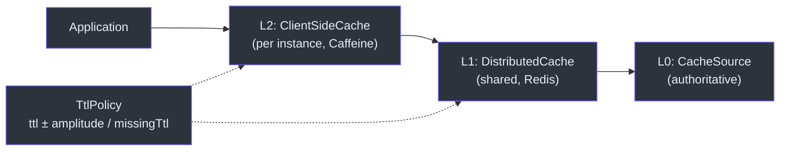
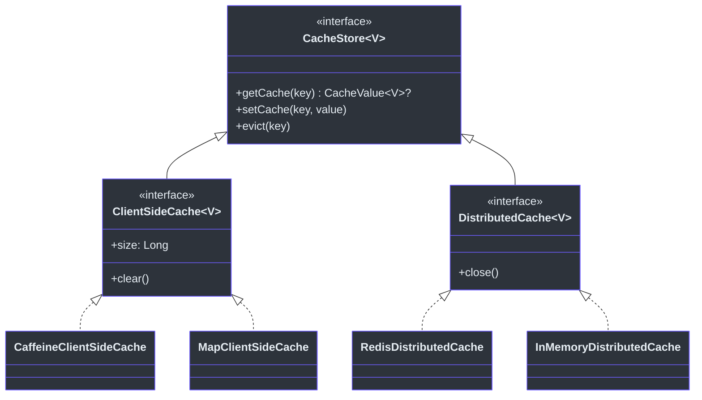
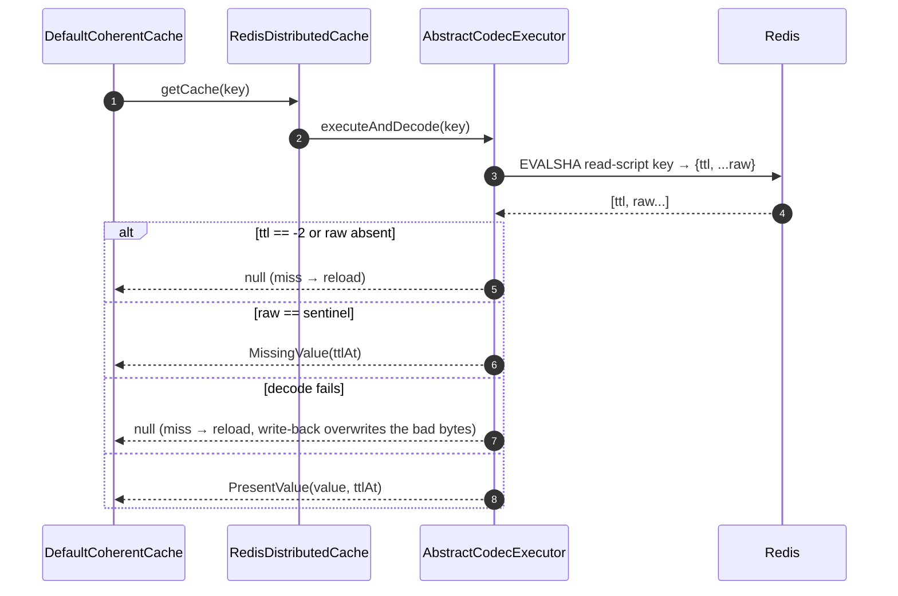
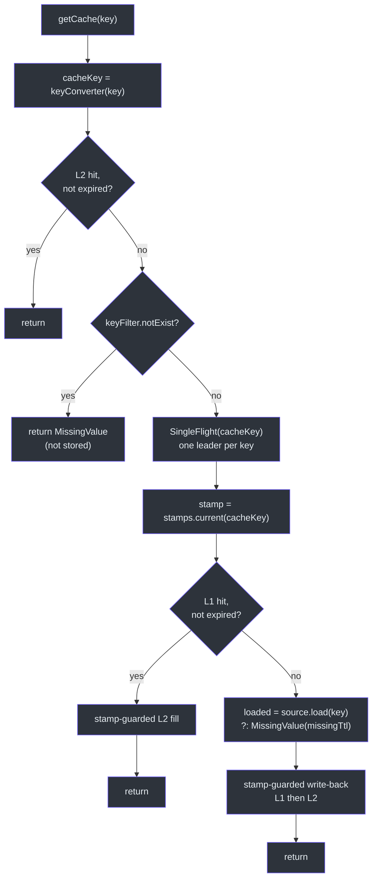

# Cache Layers Deep Dive

CoCache organizes data retrieval into three layers. Storage tiers are **pure stores**: they keep `CacheValue` entries by string key and hold no TTL policy. The orchestration layer, `DefaultCoherentCache`, owns the policy (`TtlPolicy`), coalesces loads per key, and guards every write-back against concurrent invalidation.

## Layer Overview


```mermaid
graph LR
    App["Application"] --> L2["L2: ClientSideCache<br>(per instance, Caffeine)"]
    L2 --> L1["L1: DistributedCache<br>(shared, Redis)"]
    L1 --> L0["L0: CacheSource<br>(authoritative)"]
    Policy["TtlPolicy<br>ttl ± amplitude / missingTtl"] -.-> L2
    Policy -.-> L1

    style App fill:#2d333b,stroke:#6d5dfc,color:#e6edf3
    style L2 fill:#2d333b,stroke:#6d5dfc,color:#e6edf3
    style L1 fill:#2d333b,stroke:#6d5dfc,color:#e6edf3
    style L0 fill:#2d333b,stroke:#6d5dfc,color:#e6edf3
    style Policy fill:#2d333b,stroke:#6d5dfc,color:#e6edf3
```

## The Storage Contract -- CacheStore

Both tiers implement [`CacheStore<V>`](https://github.com/Ahoo-Wang/CoCache/blob/main/cocache-api/src/main/kotlin/me/ahoo/cache/api/CacheStore.kt):

```kotlin
interface CacheStore<V> {
    fun getCache(key: String): CacheValue<V>?   // may return an expired entry; callers check
    fun setCache(key: String, value: CacheValue<V>)  // expired value == evict
    fun evict(key: String)
}
interface ClientSideCache<V> : CacheStore<V> { val size: Long; fun clear() }
interface DistributedCache<V> : CacheStore<V>, AutoCloseable
```

`CacheValue<V>` is sealed: `PresentValue(value, ttlAt)` or `MissingValue(ttlAt)` (negative cache). `ttlAt` is an absolute epoch second; the policy that produced it lives above the store.


```mermaid
classDiagram
    class CacheStore~V~ {
        <<interface>>
        +getCache(key) CacheValue~V~?
        +setCache(key, value)
        +evict(key)
    }
    class ClientSideCache~V~ {
        <<interface>>
        +size: Long
        +clear()
    }
    class DistributedCache~V~ {
        <<interface>>
        +close()
    }
    CacheStore <|-- ClientSideCache
    CacheStore <|-- DistributedCache
    ClientSideCache <|.. CaffeineClientSideCache
    ClientSideCache <|.. MapClientSideCache
    DistributedCache <|.. RedisDistributedCache
    DistributedCache <|.. InMemoryDistributedCache

    style CacheStore fill:#2d333b,stroke:#6d5dfc,color:#e6edf3
    style ClientSideCache fill:#2d333b,stroke:#6d5dfc,color:#e6edf3
    style DistributedCache fill:#2d333b,stroke:#6d5dfc,color:#e6edf3
    style CaffeineClientSideCache fill:#2d333b,stroke:#6d5dfc,color:#e6edf3
    style MapClientSideCache fill:#2d333b,stroke:#6d5dfc,color:#e6edf3
    style RedisDistributedCache fill:#2d333b,stroke:#6d5dfc,color:#e6edf3
    style InMemoryDistributedCache fill:#2d333b,stroke:#6d5dfc,color:#e6edf3
```

## L2 -- ClientSideCache

| Implementation | Behavior | Source |
|----------------|----------|--------|
| `CaffeineClientSideCache` (default) | Bounded (`maximumSize`, default 10 000); expired entries are evicted when read; optional `expireAfterAccess`. No per-entry `Expiry`: it writes node metadata on every read and stops a hot key from scaling | [CaffeineClientSideCache.kt](https://github.com/Ahoo-Wang/CoCache/blob/main/cocache-core/src/main/kotlin/me/ahoo/cache/client/CaffeineClientSideCache.kt) |
| `MapClientSideCache` | Unbounded `ConcurrentHashMap`, expired entries removed on read -- tests or small fixed key sets only | [MapClientSideCache.kt](https://github.com/Ahoo-Wang/CoCache/blob/main/cocache-core/src/main/kotlin/me/ahoo/cache/client/MapClientSideCache.kt) |

Configure the default L2 with [`@CaffeineCache`](../api/annotations.md#caffeinecache) or replace it with a bean named `{cacheName}.ClientSideCache`.

## L1 -- DistributedCache (Redis)

[`RedisDistributedCache`](https://github.com/Ahoo-Wang/CoCache/blob/main/cocache-spring-redis/src/main/kotlin/me/ahoo/cache/spring/redis/RedisDistributedCache.kt) delegates to a `CodecExecutor`. A read is **one round trip**: an atomic Lua script (EVALSHA on the shared connection) returns the TTL and the raw value together.


```mermaid
sequenceDiagram
autonumber
    participant CC as DefaultCoherentCache
    participant DC as RedisDistributedCache
    participant CE as AbstractCodecExecutor
    participant R as Redis

    CC->>DC: getCache(key)
    DC->>CE: executeAndDecode(key)
    CE->>R: EVALSHA read-script key → {ttl, ...raw}
    R-->>CE: [ttl, raw...]
    alt ttl == -2 or raw absent
        CE-->>CC: null (miss → reload)
    else raw == sentinel
        CE-->>CC: MissingValue(ttlAt)
    else decode fails
        CE-->>CC: null (miss → reload, write-back overwrites the bad bytes)
    else
        CE-->>CC: PresentValue(value, ttlAt)
    end
```

Rules:

- **An L1 miss is never a negative cache.** Only a stored sentinel decodes to `MissingValue`; an absent key or value reads as a miss.
- Writes clamp the remaining TTL to at least one second; a `FOREVER` value is written without expiry; an already expired value deletes the key.
- **Failure degradation:** `DataAccessException` on read → miss; on write/evict → `WARN`. Set `cocache.redis.strict-failure=true` to rethrow (see [Configuration](/guide/configuration#redis-failure-degradation)).

| Codec | Redis type | Negative-cache wire form |
|-------|------------|--------------------------|
| `StringToStringCodecExecutor` | String | `_nil_` |
| `ObjectToJsonCodecExecutor` (default) | String (JSON) | `_nil_` |
| `MapToHashCodecExecutor` / `ObjectToHashCodecExecutor` | Hash (atomic Lua write) | `{_nil_: <written-at>}` |
| `SetToSetCodecExecutor` | Set (atomic Lua write) | `{_nil_}` |

## L0 -- CacheSource

```kotlin
fun interface CacheSource<K, V> {
    fun loadCacheValue(key: K): CacheValue<V>?   // null → negative cache for missingTtl
}
```

## Read Path


```mermaid
flowchart TD
    Start["getCache(key)"] --> Convert["cacheKey = keyConverter(key)"]
    Convert --> L2{"L2 hit,<br>not expired?"}
    L2 -->|yes| RetL2["return"]
    L2 -->|no| Filter{"keyFilter.notExist?"}
    Filter -->|yes| RetMissing["return MissingValue<br>(not stored)"]
    Filter -->|no| Flight["SingleFlight(cacheKey)<br>one leader per key"]
    Flight --> Stamp["stamp = stamps.current(cacheKey)"]
    Stamp --> L1{"L1 hit,<br>not expired?"}
    L1 -->|yes| Fill["stamp-guarded L2 fill"] --> RetL1["return"]
    L1 -->|no| Load["loaded = source.load(key)<br>?: MissingValue(missingTtl)"]
    Load --> WB["stamp-guarded write-back<br>L1 then L2"] --> RetLoad["return"]

    style Start fill:#2d333b,stroke:#6d5dfc,color:#e6edf3
    style Convert fill:#2d333b,stroke:#6d5dfc,color:#e6edf3
    style L2 fill:#2d333b,stroke:#6d5dfc,color:#e6edf3
    style RetL2 fill:#2d333b,stroke:#6d5dfc,color:#e6edf3
    style Filter fill:#2d333b,stroke:#6d5dfc,color:#e6edf3
    style RetMissing fill:#2d333b,stroke:#6d5dfc,color:#e6edf3
    style Flight fill:#2d333b,stroke:#6d5dfc,color:#e6edf3
    style Stamp fill:#2d333b,stroke:#6d5dfc,color:#e6edf3
    style L1 fill:#2d333b,stroke:#6d5dfc,color:#e6edf3
    style Fill fill:#2d333b,stroke:#6d5dfc,color:#e6edf3
    style RetL1 fill:#2d333b,stroke:#6d5dfc,color:#e6edf3
    style Load fill:#2d333b,stroke:#6d5dfc,color:#e6edf3
    style WB fill:#2d333b,stroke:#6d5dfc,color:#e6edf3
    style RetLoad fill:#2d333b,stroke:#6d5dfc,color:#e6edf3
```

- **SingleFlight** ([SingleFlight.kt](https://github.com/Ahoo-Wang/CoCache/blob/main/cocache-core/src/main/kotlin/me/ahoo/cache/concurrent/SingleFlight.kt)) coalesces concurrent misses of the same key; followers share the leader's result or its **original exception**. Different keys never block each other. Re-entering the same key from inside `CacheSource` fails fast.
- **Stamp-guarded write-back** -- see [Cache Coherence](./coherence.md#write-back-protection). If an invalidation happens during the load, the loaded value is returned to the caller but not cached.
- A successful load does **not** broadcast an event: when L1 is empty, every other instance's L2 copy has already expired or been invalidated.

## Write and Eviction Paths

```kotlin
override fun setCache(key: K, value: CacheValue<V>) {   // expired value → evict(key)
    stamps.invalidate(cacheKey)        // abort in-flight loads of this key
    distributedCache.setCache(cacheKey, value)
    clientSideCache.setCache(cacheKey, value)
    publish(cacheKey)
}

override fun evict(key: K) {           // update the data source first, then evict
    stamps.invalidate(cacheKey)
    clientSideCache.evict(cacheKey)
    distributedCache.evict(cacheKey)
    publish(cacheKey)
}
```

`set(key, value)` builds the entry from the cache's `TtlPolicy`: `ttl ± ttlAmplitude` for a value, `missingTtl` for `null`.

## Source References

| Component | Source |
|-----------|--------|
| `DefaultCoherentCache` | [DefaultCoherentCache.kt](https://github.com/Ahoo-Wang/CoCache/blob/main/cocache-core/src/main/kotlin/me/ahoo/cache/consistency/DefaultCoherentCache.kt) |
| `TtlPolicy` | [TtlPolicy.kt](https://github.com/Ahoo-Wang/CoCache/blob/main/cocache-core/src/main/kotlin/me/ahoo/cache/TtlPolicy.kt) |
| `CacheValue` | [CacheValue.kt](https://github.com/Ahoo-Wang/CoCache/blob/main/cocache-api/src/main/kotlin/me/ahoo/cache/api/CacheValue.kt) |
| `AbstractCodecExecutor` | [AbstractCodecExecutor.kt](https://github.com/Ahoo-Wang/CoCache/blob/main/cocache-spring-redis/src/main/kotlin/me/ahoo/cache/spring/redis/codec/AbstractCodecExecutor.kt) |

## Related Pages

- [Architecture Overview](./index.md)
- [Cache Coherence and Event Bus](./coherence.md)
- [Proxy and Annotations](./proxy.md)
