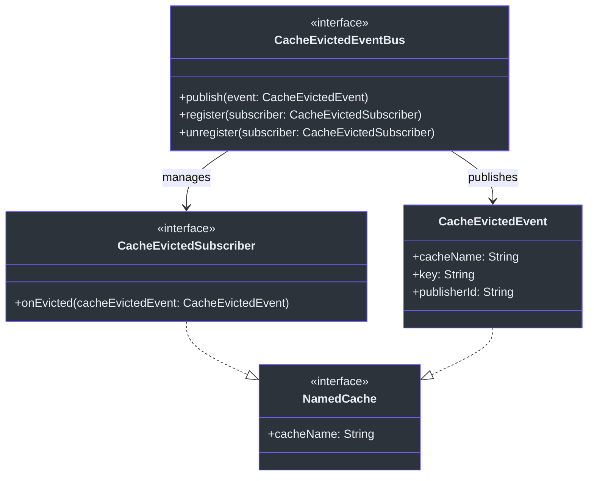
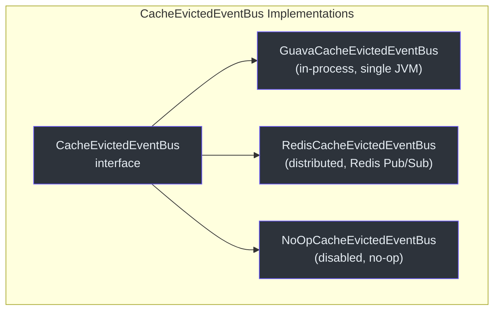
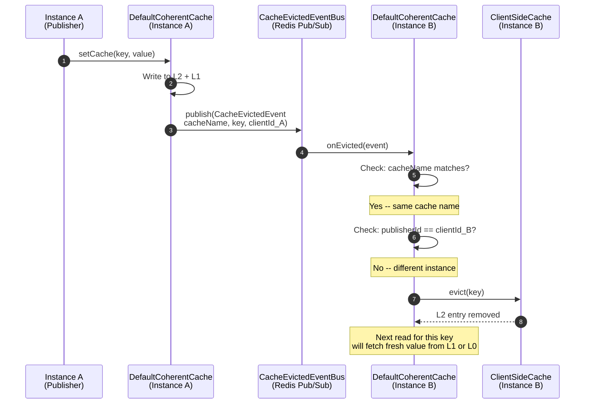
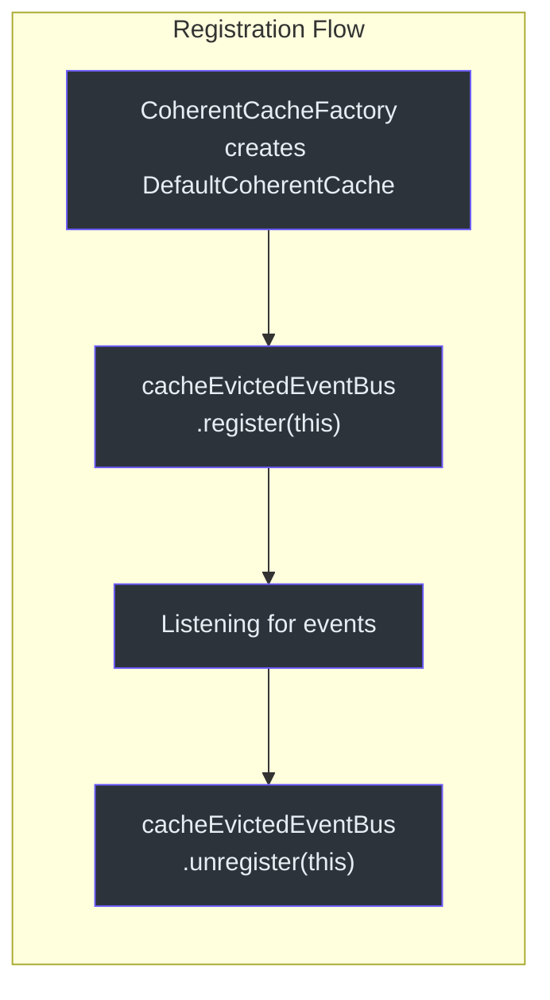

# Cache Coherence and Event Bus

Cache coherence is the defining feature of CoCache. When one application instance modifies or evicts a cache entry, all other instances must invalidate their local L2 caches to prevent stale reads. This is achieved through a publish-subscribe event bus pattern built around `CacheEvictedEvent`.

## Core Interfaces

The coherence system is defined by three interfaces in the `cocache-api` module:



| Interface | Source | Role |
|-----------|--------|------|
| [`CacheEvictedEventBus`](https://github.com/Ahoo-Wang/CoCache/blob/main/cocache-core/src/main/kotlin/me/ahoo/cache/consistency/CacheEvictedEventBus.kt#L20) | [CacheEvictedEventBus.kt](https://github.com/Ahoo-Wang/CoCache/blob/main/cocache-core/src/main/kotlin/me/ahoo/cache/consistency/CacheEvictedEventBus.kt#L20) | Publish/subscribe registry for eviction events |
| [`CacheEvictedSubscriber`](https://github.com/Ahoo-Wang/CoCache/blob/main/cocache-core/src/main/kotlin/me/ahoo/cache/consistency/CacheEvictedSubscriber.kt#L22) | [CacheEvictedSubscriber.kt](https://github.com/Ahoo-Wang/CoCache/blob/main/cocache-core/src/main/kotlin/me/ahoo/cache/consistency/CacheEvictedSubscriber.kt#L22) | Receives eviction notifications |
| [`CacheEvictedEvent`](https://github.com/Ahoo-Wang/CoCache/blob/main/cocache-core/src/main/kotlin/me/ahoo/cache/consistency/CacheEvictedEvent.kt#L21) | [CacheEvictedEvent.kt](https://github.com/Ahoo-Wang/CoCache/blob/main/cocache-core/src/main/kotlin/me/ahoo/cache/consistency/CacheEvictedEvent.kt#L21) | Carries `cacheName`, `key`, and `publisherId` |

The `CacheEvictedEvent` data class carries three fields:
- **`cacheName`** -- identifies which cache was affected (enables subscribers to filter by cache name)
- **`key`** -- the specific cache key that was modified or evicted
- **`publisherId`** -- the `clientId` of the instance that published the event (used for self-eviction filtering)

## Implementations

CoCache provides three `CacheEvictedEventBus` implementations, each suited to a different deployment scenario:



### GuavaCacheEvictedEventBus (In-Process)

[`GuavaCacheEvictedEventBus`](https://github.com/Ahoo-Wang/CoCache/blob/main/cocache-core/src/main/kotlin/me/ahoo/cache/consistency/GuavaCacheEvictedEventBus.kt#L25) wraps a Guava `EventBus` for in-process pub/sub. It is the default implementation used when no distributed event bus is configured. All `DefaultCoherentCache` instances within the same JVM share one `GuavaCacheEvictedEventBus`, so events propagate across caches in a single application.

```kotlin
class GuavaCacheEvictedEventBus(
    private val eventBus: EventBus = EventBus()
) : CacheEvictedEventBus {
    private val subscribers = ConcurrentHashMap<CacheEvictedSubscriber, CacheEvictedSubscriberAdapter>()

    override fun publish(event: CacheEvictedEvent) {
        eventBus.post(event)
    }

    override fun register(subscriber: CacheEvictedSubscriber) {
        subscribers.computeIfAbsent(subscriber) {
            CacheEvictedSubscriberAdapter(it).also { adapter ->
                eventBus.register(adapter)
            }
        }
    }
}
```

The adapter class [`CacheEvictedSubscriberAdapter`](https://github.com/Ahoo-Wang/CoCache/blob/main/cocache-core/src/main/kotlin/me/ahoo/cache/consistency/GuavaCacheEvictedEventBus.kt#L61) bridges between Guava's `@Subscribe` annotation and the `CacheEvictedSubscriber.onEvicted()` method. The subscriber map (`ConcurrentHashMap`) prevents duplicate registrations.

### RedisCacheEvictedEventBus (Distributed)

[`RedisCacheEvictedEventBus`](https://github.com/Ahoo-Wang/CoCache/blob/main/cocache-spring-redis/src/main/kotlin/me/ahoo/cache/spring/redis/RedisCacheEvictedEventBus.kt#L32) uses Redis Pub/Sub for cross-instance event propagation. When `publish()` is called, it sends the eviction message to a Redis channel named after the `cacheName`. All instances subscribed to that channel receive the notification.

```kotlin
class RedisCacheEvictedEventBus(
    private val redisTemplate: StringRedisTemplate,
    private val listenerContainer: RedisMessageListenerContainer
) : CacheEvictedEventBus {

    override fun publish(event: CacheEvictedEvent) {
        redisTemplate.convertAndSend(event.cacheName, EvictedEvents.asMessage(event.key, event.publisherId))
    }

    override fun register(subscriber: CacheEvictedSubscriber) {
        subscribers.computeIfAbsent(subscriber) {
            MessageListenerAdapter(it).also { listener ->
                listenerContainer.addMessageListener(listener, ChannelTopic(it.cacheName))
            }
        }
    }
}
```

### NoOpCacheEvictedEventBus (Disabled)

[`NoOpCacheEvictedEventBus`](https://github.com/Ahoo-Wang/CoCache/blob/main/cocache-core/src/main/kotlin/me/ahoo/cache/consistency/NoOpCacheEvictedEventBus.kt#L20) is a singleton that does nothing. It is useful for single-instance deployments or testing scenarios where coherence is not needed.

## EvictedEvents Codec

The [`EvictedEvents`](https://github.com/Ahoo-Wang/CoCache/blob/main/cocache-spring-redis/src/main/kotlin/me/ahoo/cache/spring/redis/codec/EvictedEvents.kt#L19) object handles encoding and decoding of Redis Pub/Sub messages. It uses `@@` as the delimiter to pack `key` and `clientId` into a single message body:

```kotlin
object EvictedEvents {
    private const val DELIMITER = "@@"

    fun fromMessage(message: Message): CacheEvictedEvent {
        val cacheName = message.channel.decodeToString()
        val msgBody = message.body.decodeToString()
        val clientIdWithKey = msgBody.split(DELIMITER.toRegex())
        require(2 == clientIdWithKey.size)
        return CacheEvictedEvent(cacheName, clientIdWithKey[0], clientIdWithKey[1])
    }

    fun asMessage(key: String, clientId: String): String {
        return key + DELIMITER + clientId
    }
}
```

The `cacheName` is encoded as the Redis channel name, while `key` and `clientId` are packed into the message body.

## Cross-Instance Invalidation Flow

The following diagram shows how a cache modification on Instance A propagates to Instance B:



## Self-Eviction Filtering

The [`onEvicted()`](https://github.com/Ahoo-Wang/CoCache/blob/main/cocache-core/src/main/kotlin/me/ahoo/cache/consistency/DefaultCoherentCache.kt#L158) handler in `DefaultCoherentCache` performs two critical checks before evicting the local L2 cache:

```kotlin
@Subscribe
override fun onEvicted(cacheEvictedEvent: CacheEvictedEvent) {
    // Filter 1: ignore events for different caches
    if (cacheEvictedEvent.cacheName != cacheName) {
        return
    }
    // Filter 2: ignore self-published events
    if (cacheEvictedEvent.publisherId == clientId) {
        return
    }
    // Only evict L2 for events from other instances
    clientSideCache.evict(cacheEvictedEvent.key)
}
```

**Why filter self-published events?** When Instance A calls `setCache()` or `evict()`, it already modifies its own L2 cache directly. Publishing the event and then receiving it back would cause a redundant L2 eviction (or worse, evict a value that was just written). The `publisherId == clientId` check at [line 169](https://github.com/Ahoo-Wang/CoCache/blob/main/cocache-core/src/main/kotlin/me/ahoo/cache/consistency/DefaultCoherentCache.kt#L169) prevents this.

**Why filter by cacheName?** A single application may have multiple `DefaultCoherentCache` instances (one per cache interface). All of them subscribe to the same event bus, so the cacheName check at [line 160](https://github.com/Ahoo-Wang/CoCache/blob/main/cocache-core/src/main/kotlin/me/ahoo/cache/consistency/DefaultCoherentCache.kt#L160) ensures each instance only reacts to events relevant to its own cache.

## Registration Lifecycle

When a `DefaultCoherentCache` is constructed, it registers itself as a subscriber with the event bus. The `@Subscribe` annotation on `onEvicted()` is recognized by Guava EventBus (for in-process mode) and the `MessageListenerAdapter` handles Redis Pub/Sub messages (for distributed mode).



## Comparison of EventBus Implementations

| Feature | GuavaCacheEvictedEventBus | RedisCacheEvictedEventBus | NoOpCacheEvictedEventBus |
|---------|--------------------------|--------------------------|--------------------------|
| Scope | Single JVM (in-process) | Cross-instance (distributed) | None |
| Transport | Guava EventBus | Redis Pub/Sub | N/A |
| Channel | N/A (direct method call) | `cacheName` as Redis channel | N/A |
| Serialization | None (object reference) | `EvictedEvents` codec (`key@@clientId`) | N/A |
| Dependencies | `cocache-core` only | `cocache-spring-redis` | `cocache-core` only |
| Source | [GuavaCacheEvictedEventBus.kt:25](https://github.com/Ahoo-Wang/CoCache/blob/main/cocache-core/src/main/kotlin/me/ahoo/cache/consistency/GuavaCacheEvictedEventBus.kt#L25) | [RedisCacheEvictedEventBus.kt:32](https://github.com/Ahoo-Wang/CoCache/blob/main/cocache-spring-redis/src/main/kotlin/me/ahoo/cache/spring/redis/RedisCacheEvictedEventBus.kt#L32) | [NoOpCacheEvictedEventBus.kt:20](https://github.com/Ahoo-Wang/CoCache/blob/main/cocache-core/src/main/kotlin/me/ahoo/cache/consistency/NoOpCacheEvictedEventBus.kt#L20) |

## Source References

| File | Line(s) | Description |
|------|---------|-------------|
| [`CacheEvictedEventBus.kt`](https://github.com/Ahoo-Wang/CoCache/blob/main/cocache-core/src/main/kotlin/me/ahoo/cache/consistency/CacheEvictedEventBus.kt#L20) | 20-24 | Core event bus interface |
| [`CacheEvictedEvent.kt`](https://github.com/Ahoo-Wang/CoCache/blob/main/cocache-core/src/main/kotlin/me/ahoo/cache/consistency/CacheEvictedEvent.kt#L21) | 21-39 | Event data class with cacheName, key, publisherId |
| [`CacheEvictedSubscriber.kt`](https://github.com/Ahoo-Wang/CoCache/blob/main/cocache-core/src/main/kotlin/me/ahoo/cache/consistency/CacheEvictedSubscriber.kt#L22) | 22-24 | Subscriber interface with onEvicted() |
| [`GuavaCacheEvictedEventBus.kt`](https://github.com/Ahoo-Wang/CoCache/blob/main/cocache-core/src/main/kotlin/me/ahoo/cache/consistency/GuavaCacheEvictedEventBus.kt#L25) | 25-66 | In-process Guava EventBus implementation |
| [`RedisCacheEvictedEventBus.kt`](https://github.com/Ahoo-Wang/CoCache/blob/main/cocache-spring-redis/src/main/kotlin/me/ahoo/cache/spring/redis/RedisCacheEvictedEventBus.kt#L32) | 32-71 | Distributed Redis Pub/Sub implementation |
| [`EvictedEvents.kt`](https://github.com/Ahoo-Wang/CoCache/blob/main/cocache-spring-redis/src/main/kotlin/me/ahoo/cache/spring/redis/codec/EvictedEvents.kt#L19) | 19-33 | Message codec for Redis Pub/Sub |
| [`DefaultCoherentCache.kt`](https://github.com/Ahoo-Wang/CoCache/blob/main/cocache-core/src/main/kotlin/me/ahoo/cache/consistency/DefaultCoherentCache.kt#L158) | 158-181 | onEvicted handler with self-eviction filtering |
| [`NoOpCacheEvictedEventBus.kt`](https://github.com/Ahoo-Wang/CoCache/blob/main/cocache-core/src/main/kotlin/me/ahoo/cache/consistency/NoOpCacheEvictedEventBus.kt#L20) | 20-24 | No-op implementation |

## Related Pages

- [Architecture Overview](./index.md) -- high-level system architecture
- [Cache Layers Deep Dive](./cache-layers.md) -- L0/L1/L2 read, write, and eviction paths
- [Proxy and Annotations](./proxy.md) -- declarative cache interface creation
