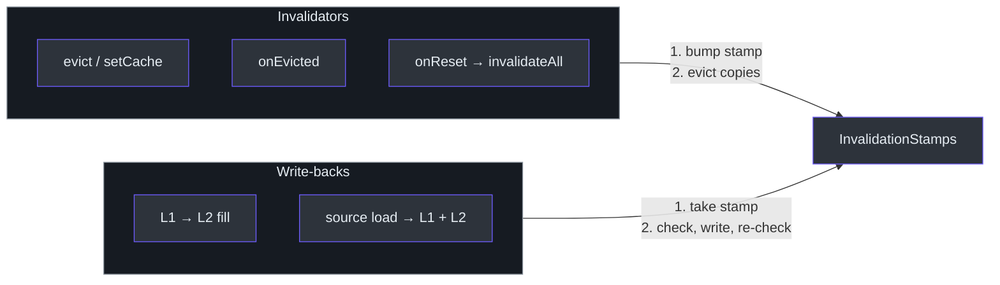

# Cache Coherence and Event Bus

Each instance holds its own L2. CoCache keeps those copies coherent with three mechanisms:

1. **Eviction events** -- every local write or eviction broadcasts a `CacheEvictedEvent`; other instances evict that key from L2.
2. **Stamp-guarded write-backs** -- a value read from L1 or loaded from the source is cached only if no invalidation of that key happened meanwhile.
3. **Reset on (re)subscription** -- whenever the event channel (re)subscribes, subscribers clear L2, because events sent while disconnected are lost.

Together with finite TTLs these bound how long any instance can serve a stale value.

## Core Interfaces

All three live in `cocache-api` (`me.ahoo.cache.api.consistency`).

```kotlin
data class CacheEvictedEvent(override val cacheName: String, val key: String, val publisherId: String) : NamedCache

interface CacheEvictedSubscriber : NamedCache {
    fun onEvicted(cacheEvictedEvent: CacheEvictedEvent)
    fun onReset()   // the channel (re)subscribed: drop every local copy
}

interface CacheEvictedEventBus {
    fun publish(event: CacheEvictedEvent)   // best effort, never blocks the caller on failure
    fun register(subscriber: CacheEvictedSubscriber)
    fun unregister(subscriber: CacheEvictedSubscriber)
}
```

| Interface | Role | Source |
|-----------|------|--------|
| `CacheEvictedEventBus` | Channel SPI; must call `onReset` on every (re)subscription | [CacheEvictedEventBus.kt](https://github.com/Ahoo-Wang/CoCache/blob/main/cocache-api/src/main/kotlin/me/ahoo/cache/api/consistency/CacheEvictedEventBus.kt) |
| `CacheEvictedSubscriber` | Receives `onEvicted` / `onReset` for its `cacheName` | [CacheEvictedSubscriber.kt](https://github.com/Ahoo-Wang/CoCache/blob/main/cocache-api/src/main/kotlin/me/ahoo/cache/api/consistency/CacheEvictedSubscriber.kt) |
| `CacheEvictedEvent` | `cacheName`, storage `key`, `publisherId` (= publisher's `clientId`) | [CacheEvictedEvent.kt](https://github.com/Ahoo-Wang/CoCache/blob/main/cocache-api/src/main/kotlin/me/ahoo/cache/api/consistency/CacheEvictedEvent.kt) |

## Implementations

| Feature | `RedisCacheEvictedEventBus` | `LocalCacheEvictedEventBus` | `NoOpCacheEvictedEventBus` |
|---------|-----------------------------|-----------------------------|----------------------------|
| Scope | Cross-instance | Single JVM | None (single instance) |
| Transport | Redis Pub/Sub, channel = `cacheName` | Direct call, routed by `cacheName` | -- |
| `onReset` | On every channel (re)subscription | On `register` | Never |
| Module | `cocache-spring-redis` | `cocache-core` | `cocache-core` |

### Redis Pub/Sub

- Message body: `key@@publisherId`. Decoding splits on the **last** `@@`, so keys may contain `@@`; a `publisherId` containing `@@` is rejected at publish time.
- Delivery is at most once. A failed publish logs a warning.
- The listener implements Spring Data Redis' `SubscriptionListener`. `RedisMessageListenerContainer` calls `onChannelSubscribed` after the initial subscription, after every reconnect, and whenever another listener is added to the same channel. CoCache maps each of these calls to `onReset`.

```mermaid
sequenceDiagram
autonumber
    participant A as Instance A
    participant R as Redis
    participant B as Instance B

    A->>A: evict(key): invalidate stamp, evict L2, evict L1
    A->>R: PUBLISH cacheName "key@@clientA"
    R-->>B: message
    B->>B: onEvicted: ignore if publisherId == own clientId
    B->>B: invalidate stamp, evict L2
    Note over R,B: connection lost; events in this window are dropped
    R-->>B: re-SUBSCRIBE confirmed
    B->>B: onReset: invalidate all stamps, clear L2
```

## Write-Back Protection

`InvalidationStamps` is a striped (4096) counter array keyed by the storage-key hash.


```mermaid
flowchart LR
    subgraph inv ["Invalidators"]
        E1["evict / setCache"]
        E2["onEvicted"]
        E3["onReset → invalidateAll"]
    end
    subgraph wb ["Write-backs"]
        W1["L1 → L2 fill"]
        W2["source load → L1 + L2"]
    end
    inv -->|"1. bump stamp<br>2. evict copies"| S["InvalidationStamps"]
    wb -->|"1. take stamp<br>2. check, write, re-check"| S

    style E1 fill:#2d333b,stroke:#6d5dfc,color:#e6edf3
    style E2 fill:#2d333b,stroke:#6d5dfc,color:#e6edf3
    style E3 fill:#2d333b,stroke:#6d5dfc,color:#e6edf3
    style W1 fill:#2d333b,stroke:#6d5dfc,color:#e6edf3
    style W2 fill:#2d333b,stroke:#6d5dfc,color:#e6edf3
    style S fill:#2d333b,stroke:#6d5dfc,color:#e6edf3
    style inv fill:#161b22,stroke:#8b949e,color:#e6edf3
    style wb fill:#161b22,stroke:#8b949e,color:#e6edf3
```

- Invalidators bump the stamp **before** evicting.
- Write-backs take the stamp **before** reading. They skip the write if the stamp has already changed, and they re-check after writing:
  - A source write-back that lost the race is undone in L1 and L2 and re-broadcast.
  - An L1 → L2 fill that lost the race is undone in L2.
- Because of this ordering, at least one side always removes the stale copy, however the two interleave.
- Readers also record the stamp before reading. A reader rejects a coalesced load that started before an invalidation it has already observed (e.g. its own `evict` followed by `get`) and reloads once, so a thread always reads its own writes.
- A stripe collision never affects correctness. It costs an extra skipped write-back; if it lands exactly between the write and the re-check, it also costs one extra L1 delete and broadcast.

This also closes the 4.x gap where a **local** `evict` did not stop an in-flight load on the same instance.

### The residual window

Instance A loads an old row → B updates the DB, deletes L1, publishes → A writes the old row to L1 before B's event arrives. A undoes its L2 once the event arrives, but the old value stays in L1 until it expires. This window exists in every cache-aside design, and it is why the default TTL is finite.

## Lifecycle

`DefaultCoherentCacheFactory.create` registers the cache with the bus. `close()` is idempotent: it unregisters from the bus and closes the distributed cache. Spring's `CacheProxyFactoryBean` calls `close()` on shutdown.

## Source References

| Component | Source |
|-----------|--------|
| `DefaultCoherentCache.onEvicted` / `onReset` | [DefaultCoherentCache.kt](https://github.com/Ahoo-Wang/CoCache/blob/main/cocache-core/src/main/kotlin/me/ahoo/cache/consistency/DefaultCoherentCache.kt) |
| `InvalidationStamps` | [InvalidationStamps.kt](https://github.com/Ahoo-Wang/CoCache/blob/main/cocache-core/src/main/kotlin/me/ahoo/cache/consistency/InvalidationStamps.kt) |
| `RedisCacheEvictedEventBus` | [RedisCacheEvictedEventBus.kt](https://github.com/Ahoo-Wang/CoCache/blob/main/cocache-spring-redis/src/main/kotlin/me/ahoo/cache/spring/redis/RedisCacheEvictedEventBus.kt) |
| `EvictedEvents` (wire codec) | [EvictedEvents.kt](https://github.com/Ahoo-Wang/CoCache/blob/main/cocache-spring-redis/src/main/kotlin/me/ahoo/cache/spring/redis/codec/EvictedEvents.kt) |
| `LocalCacheEvictedEventBus` | [LocalCacheEvictedEventBus.kt](https://github.com/Ahoo-Wang/CoCache/blob/main/cocache-core/src/main/kotlin/me/ahoo/cache/consistency/LocalCacheEvictedEventBus.kt) |

## Related Pages

- [Architecture Overview](./index.md)
- [Cache Layers Deep Dive](./cache-layers.md)
- [Proxy and Annotations](./proxy.md)
