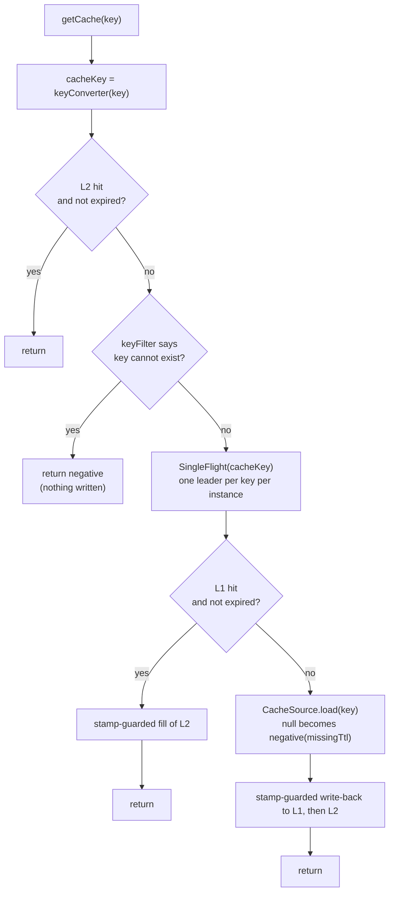

# Consistency

This page describes the read, write, and evict paths, and why they cannot lose an invalidation. The normative version is sections 4–6 of [`docs/architecture.md`](https://github.com/Ahoo-Wang/CoCache/blob/main/docs/architecture.md).

## Read path

- **Load coalescing.** Concurrent misses for one key on one instance share a single L1 read and source load. Waiters receive the leader's result, or its original exception. If a `CacheSource` reads its own key again on the same thread, it fails fast instead of deadlocking.
- **An L1 miss is never "not found".** If the key is absent, deleted mid-read, or its payload cannot be decoded, the read reloads from the source. Only a stored negative entry means "not found". A corrupted payload is not deleted on read. The reload's write-back overwrites it.
- **A successful load does not broadcast.** If L1 was empty, any copy in another instance's L2 has already expired, because L2 copies L1's `ttlAt`, or an eviction event has already removed it.
- **One round trip to Redis.** A Lua script returns the remaining TTL and the value atomically.

## Write and evict paths

| Operation | Steps |
|-----------|-------|
| `setCache(key, value)` | invalidate stamp → write L1 → write L2 → publish eviction event |
| `evict(key)` | invalidate stamp → evict L2 → evict L1 → publish eviction event |
| peer receives event | invalidate stamp → evict L2 (events from its own `clientId` are ignored) |
| channel (re)subscribed (`onReset`) | invalidate all stamps → clear L2 |

**Callers must update the data source first, then evict.** If the evict comes first, a concurrent read can reload the old row before the update commits.

## Invalidation stamps

Loads take time, and an invalidation can arrive in the middle of one. Without protection, this sequence leaves a stale value cached:

1. Reader A misses and starts loading. It reads the old row.
2. Writer B updates the row and evicts the key.
3. A finishes and writes the old row into the cache, after B's evict.

`InvalidationStamps` is a striped counter per key (4,096 stripes) that closes this gap:

- **Invalidators** (local `evict`/`setCache`, a peer's event, `onReset`) bump the stamp *before* they remove copies.
- **Write-backs** (L1 → L2 fill, source → L1 + L2) read the stamp before loading, check it again before writing, and check it once more after writing.
  - If the stamp changed before the write, the write is skipped.
  - If the stamp changed during the write, the write is undone. A source write-back evicts L1 and L2 and broadcasts. An L1 → L2 fill evicts only L2.

However the two sides interleave, one of them removes the stale copy. When two keys share a stripe, a write-back is occasionally skipped for nothing, which wastes work but is always safe.

**Read-your-writes.** A read records the stamp when it starts. If the shared load it joins started earlier than an invalidation this reader has already seen, the reader discards that result and loads once more. This holds even when the same thread evicted the key just before reading. It depends on `SingleFlight` deregistering a call *before* publishing its result, so the retry always starts a fresh load.

## Eviction channel

The default channel is Redis Pub/Sub:

- One channel per cache, named after the cache. The message is `key@@publisherId`, split on the last `@@`.
- **At-most-once delivery.** A failed publish is logged and dropped, and messages sent while an instance is disconnected are lost.
- **Reset on (re)subscribe.** Each time the listener container (re)subscribes, it calls `onReset`, and each subscribed cache clears its L2. This bounds staleness after any lost event. Registering a new listener on a channel also resubscribes it, which harmlessly resets that channel's existing listeners.

## What is guaranteed

| Property | Guarantee |
|----------|-----------|
| Staleness | Bounded by `ttl` for values and `missingTtl` for negative entries |
| Lost events | Cannot outlive a reconnect, because L2 is cleared on resubscribe |
| Load vs. invalidation | If an instance observes an invalidation while a load is in flight, the load's result is discarded or undone |
| Same instance after `evict`/`set` returns | Never serves the previous value |
| Peers after `evict`/`set` | Drop their copy when the event arrives, normally milliseconds later |

## What is not guaranteed

**The cache-aside race in L1.** Instance A loads an old row from the database. Instance B then updates the row, deletes the key from L1, and broadcasts. A writes the old row to L1 *before* B's event reaches it. When the event arrives, A undoes its L2 copy, but the old value in L1 stays until it expires. Meanwhile, any instance that misses L2 can copy it from L1. Every cache-aside design shares this window. CoCache bounds it with a finite `ttl`, and that is why the default `ttl` is one hour rather than forever.

**Linearizable reads.** Between B's write and the event's arrival, other instances may serve the previous value from L2.

**Cross-instance load exclusion.** Each instance coalesces its own loads. N instances that miss the same key at the same moment may each load it once.
