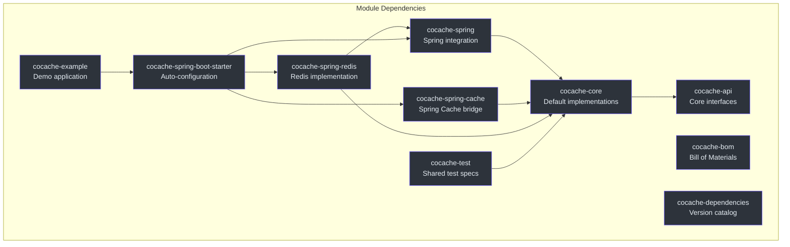
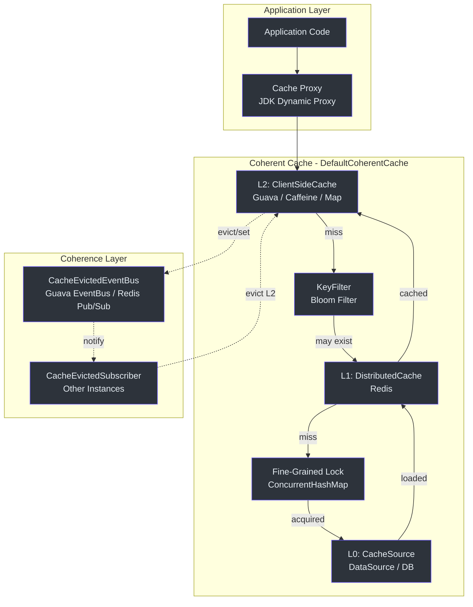
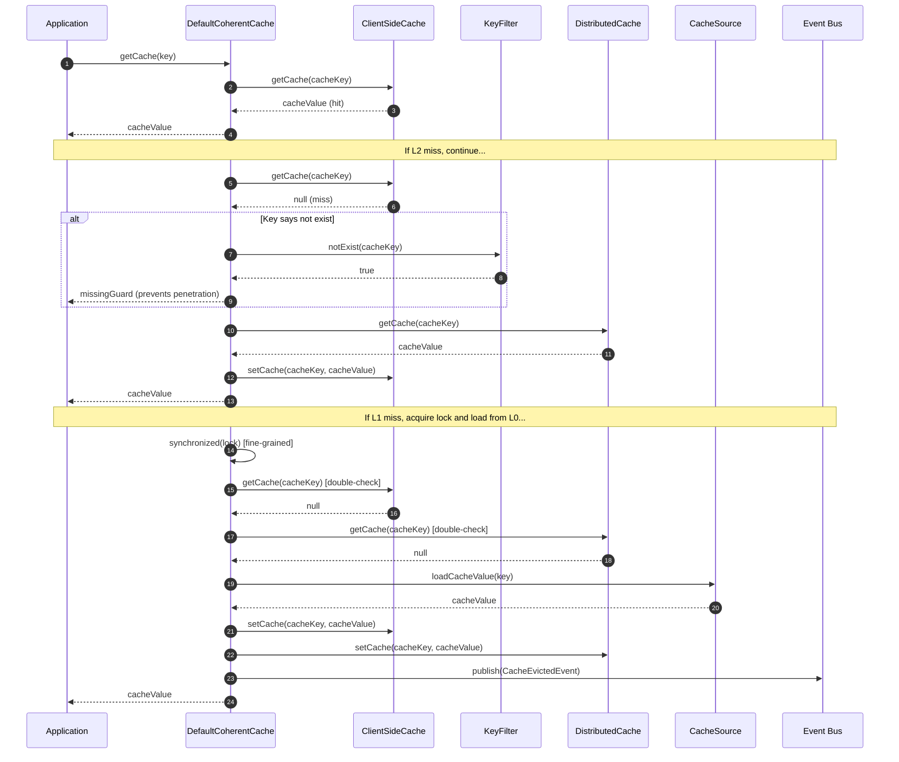

# Architecture Overview

CoCache is a **Level 2 Distributed Coherence Cache Framework** for Java/Kotlin. It implements a two-level caching architecture that combines a fast local in-memory cache (L2) with a shared distributed cache (L1) and an upstream data source (L0). Cache coherence across application instances is maintained through an event bus that publishes `CacheEvictedEvent` messages whenever cache entries are modified.

## Module Dependency Graph

The project is organized into 10 Gradle submodules, each with a clear responsibility:

The dependency flow is strictly layered: `cocache-api` defines interfaces at the bottom, `cocache-core` provides implementations, `cocache-spring` adds Spring Framework integration, and `cocache-spring-redis` / `cocache-spring-boot-starter` sit at the top for production use.

## High-Level System Architecture

CoCache organizes caching into three layers:

| Layer | Name | Role | Interface | Key Implementations |
|-------|------|------|-----------|---------------------|
| L0 | CacheSource | Upstream data source (DataSource/DB) | [`CacheSource<K, V>`](https://github.com/Ahoo-Wang/CoCache/blob/main/cocache-api/src/main/kotlin/me/ahoo/cache/api/source/CacheSource.kt#L24) | `NoOpCacheSource`, custom implementations |
| L1 | DistributedCache | Shared distributed cache | [`DistributedCache<V>`](https://github.com/Ahoo-Wang/CoCache/blob/main/cocache-core/src/main/kotlin/me/ahoo/cache/distributed/DistributedCache.kt#L22) | [`RedisDistributedCache`](https://github.com/Ahoo-Wang/CoCache/blob/main/cocache-spring-redis/src/main/kotlin/me/ahoo/cache/spring/redis/RedisDistributedCache.kt#L28) |
| L2 | ClientSideCache | Local in-memory cache | [`ClientSideCache<V>`](https://github.com/Ahoo-Wang/CoCache/blob/main/cocache-api/src/main/kotlin/me/ahoo/cache/api/client/ClientSideCache.kt#L22) | `MapClientSideCache`, `GuavaClientSideCache`, `CaffeineClientSideCache` |

## Cache Read Path

The read path flows L2 -> KeyFilter -> L1 -> Lock -> L0 with several optimization strategies:

## Key Design Decisions

### 1. Fine-Grained Locking

Rather than synchronizing on the entire cache instance, CoCache uses a per-key lock stored in a [`ConcurrentHashMap<String, Any>`](https://github.com/Ahoo-Wang/CoCache/blob/main/cocache-core/src/main/kotlin/me/ahoo/cache/consistency/DefaultCoherentCache.kt#L47). This prevents cache stampede (the "thundering herd" problem) while allowing concurrent access to different keys.

### 2. Missing Guard (Cache Penetration Prevention)

When a cache source returns `null` (key does not exist in the database), CoCache stores a special `missingGuard` cache value instead of leaving the key empty. This prevents repeated database queries for non-existent keys -- the well-known cache penetration problem. The `KeyFilter` interface (a Bloom filter adapter) provides an additional layer of defense by rejecting keys known not to exist before any cache lookup.

### 3. Event-Driven Coherence

Rather than relying on TTL expiration to eventually synchronize caches across instances, CoCache actively publishes `CacheEvictedEvent` through the `CacheEvictedEventBus`. Each `DefaultCoherentCache` subscribes to these events and evicts its local L2 cache when a peer modifies the same key. Self-published events are filtered out to avoid redundant local eviction. See [Cache Coherence](./coherence.md) for details.

### 4. Proxy-Based Declarative Caching

Cache interfaces are declared as Kotlin/Java interfaces annotated with `@CoCache`. At application startup, `EnableCoCacheRegistrar` parses these annotations, constructs `CoCacheMetadata`, and creates JDK dynamic proxies backed by `DefaultCoherentCache` instances. This allows cache configuration to be fully declarative. See [Proxy and Annotations](./proxy.md) for details.

### 5. TTL with Amplitude

Each cache entry carries a TTL plus a random `ttlAmplitude` offset. This jitter prevents synchronized expiration of many entries at once (the "cache avalanche" problem). The amplitude is added as a random value within `[-ttlAmplitude, +ttlAmplitude]`.

## Source References

| File | Line(s) | Description |
|------|---------|-------------|
| [`settings.gradle.kts`](https://github.com/Ahoo-Wang/CoCache/blob/main/settings.gradle.kts#L1) | 1-11 | Module declarations |
| [`build.gradle.kts`](https://github.com/Ahoo-Wang/CoCache/blob/main/build.gradle.kts#L1) | 1-219 | Root build config, JDK 17, Kotlin compiler flags |
| [`cocache-api/build.gradle.kts`](https://github.com/Ahoo-Wang/CoCache/blob/main/cocache-api/build.gradle.kts#L1) | 1 | No external dependencies (pure interfaces) |
| [`cocache-core/build.gradle.kts`](https://github.com/Ahoo-Wang/CoCache/blob/main/cocache-core/build.gradle.kts#L1) | 1-12 | Depends on `cocache-api`, Guava, Caffeine (compile-only) |
| [`cocache-spring/build.gradle.kts`](https://github.com/Ahoo-Wang/CoCache/blob/main/cocache-spring/build.gradle.kts#L1) | 1-3 | Depends on `cocache-core`, Spring Context |
| [`cocache-spring-redis/build.gradle.kts`](https://github.com/Ahoo-Wang/CoCache/blob/main/cocache-spring-redis/build.gradle.kts#L1) | 1-10 | Depends on `cocache-core`, `cocache-spring`, Jackson, Spring Data Redis |
| [`cocache-spring-boot-starter/build.gradle.kts`](https://github.com/Ahoo-Wang/CoCache/blob/main/cocache-spring-boot-starter/build.gradle.kts#L1) | 1-30 | Depends on `cocache-spring`, `cocache-spring-cache`, `cocache-spring-redis`, Spring Boot |
| [`DefaultCoherentCache.kt`](https://github.com/Ahoo-Wang/CoCache/blob/main/cocache-core/src/main/kotlin/me/ahoo/cache/consistency/DefaultCoherentCache.kt#L30) | 30-186 | Central coherent cache implementation |
| [`CoherentCache.kt`](https://github.com/Ahoo-Wang/CoCache/blob/main/cocache-core/src/main/kotlin/me/ahoo/cache/consistency/CoherentCache.kt#L25) | 25-32 | CoherentCache interface definition |
| [`CoherentCacheConfiguration.kt`](https://github.com/Ahoo-Wang/CoCache/blob/main/cocache-core/src/main/kotlin/me/ahoo/cache/consistency/CoherentCacheConfiguration.kt#L26) | 26-34 | Configuration data class with defaults |

## Related Pages

- [Cache Layers Deep Dive](./cache-layers.md) -- L0, L1, L2 layer details and read/write/evict paths
- [Cache Coherence and Event Bus](./coherence.md) -- distributed invalidation via CacheEvictedEventBus
- [Proxy and Annotations](./proxy.md) -- declarative caching with @CoCache and JDK dynamic proxies
