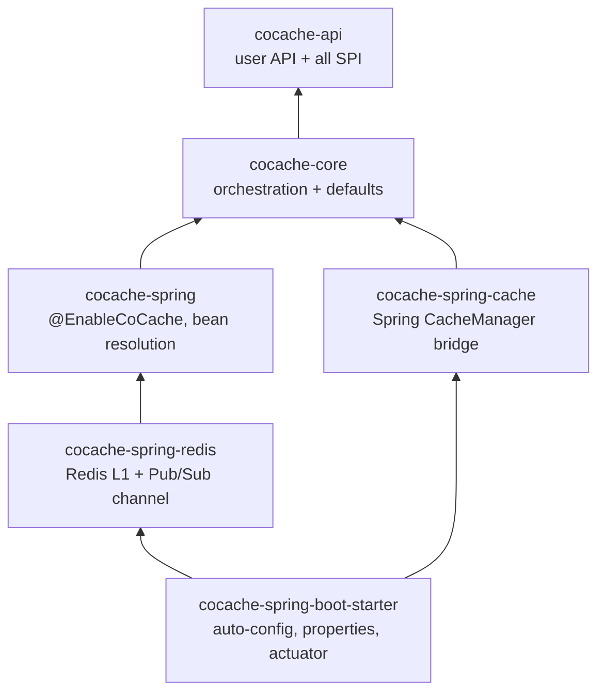
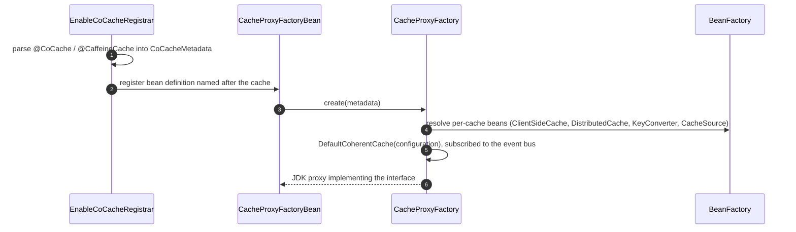

# Architecture

This page explains how CoCache is put together. The normative specification, with every invariant a change must preserve, is [`docs/architecture.md`](https://github.com/Ahoo-Wang/CoCache/blob/main/docs/architecture.md) in the repository (in Chinese). If this page and that document disagree, the document wins.

## Design goals

A two-level cache trades staleness for latency. Every design decision serves three goals:

| Goal | Means |
|------|-------|
| **G1 Bounded staleness.** Any inconsistency heals within a finite time. | Finite default TTLs. A separate short TTL for negative entries. L2 cleared whenever the eviction channel (re)subscribes. |
| **G2 No lost invalidations.** Concurrent loads and lost or reordered events cannot write an old value back. | Invalidation stamps guard every write-back. An L1 miss is never treated as "not found". |
| **G3 A cheap hit path.** An L2 hit costs near zero and scales with threads. An L1 hit is one round trip. | Bounded Caffeine with no per-entry expiry policy. A cached clock. One Lua read per L1 lookup. Per-key load coalescing. |

**Non-goals:** linearizable reads, and mutual exclusion of loads *across* instances. Each instance coalesces its own loads, and L1 absorbs the duplicates.

## Modules


```mermaid
flowchart BT
    api["cocache-api<br>user API + all SPI"]
    core["cocache-core<br>orchestration + defaults"]
    spring["cocache-spring<br>@EnableCoCache, bean resolution"]
    redis["cocache-spring-redis<br>Redis L1 + Pub/Sub channel"]
    scache["cocache-spring-cache<br>Spring CacheManager bridge"]
    starter["cocache-spring-boot-starter<br>auto-config, properties, actuator"]
    core --> api
    spring --> core
    redis --> spring
    scache --> core
    starter --> redis
    starter --> scache
```

| Module | Contains |
|--------|----------|
| `cocache-api` | `Cache`, the sealed `CacheValue`, `TtlAt`/`CacheClock`, and the SPI: `CacheStore` → `ClientSideCache` / `DistributedCache`, `CacheSource`, `KeyConverter`, `KeyFilter`, `CacheEvictedEventBus`, `JoinCache`. Also the annotations. No runtime dependencies. |
| `cocache-core` | `DefaultCoherentCache`, `TtlPolicy`, `SingleFlight`, `InvalidationStamps`, Caffeine/Map L2, in-memory L1, local/no-op event buses, the proxies, and `SimpleJoinCache` |
| `cocache-spring` | `@EnableCoCache`, the `FactoryBean`s, and resolution of components by bean name |
| `cocache-spring-redis` | `RedisDistributedCache`, codecs, and `RedisCacheEvictedEventBus` |
| `cocache-spring-cache` | `CoCacheManager` / `CoSpringCache` |
| `cocache-spring-boot-starter` | Auto-configuration, `CoCacheProperties`, and the actuator endpoints |
| `cocache-test` | Contract test suites (TCK) for new implementations |
| `cocache-bom` | Version alignment for all of the above |

Dependencies point one way. The starter also depends on `cocache-spring`. A new store or event channel depends only on `cocache-api`, and is verified with `cocache-test`.

## Responsibilities

- **Stores only store.** `CacheStore` gets and sets `CacheValue`s by string key. It knows nothing about TTLs or negative caching. Writing an entry that has already expired is the same as evicting it.
- **Policy lives above the stores.** `TtlPolicy` turns `ttl ± ttlAmplitude` into an absolute `ttlAt` for values, and `missingTtl` for negative entries. The stores only ever see `ttlAt`.
- **Orchestration** (`DefaultCoherentCache`) reads through the levels, coalesces loads, guards write-backs, and broadcasts invalidations.
- **The channel** (`CacheEvictedEventBus`) broadcasts invalidations on a best-effort basis, and calls `onReset` whenever its subscription is (re)established.

## Data model

```kotlin
sealed interface CacheValue<out V> : TtlAt      // ttlAt: absolute expiry, epoch seconds
data class PresentValue<V>(val value: V, val ttlAt: Long) : CacheValue<V>
data class MissingValue(val ttlAt: Long) : CacheValue<Nothing>   // explicit negative entry
```

- A negative entry is a **type**, not a magic value, so no business value can be mistaken for one. The Redis sentinel `_nil_` exists only in the Redis wire format.
- `CacheValue.of(null, ttlAt)` produces a `MissingValue`. `TtlAt.FOREVER` (`Long.MAX_VALUE`) never expires.
- The current time comes from `CacheClock`, a volatile second counter that a daemon thread refreshes every 100 ms. On the hit path this is cheaper than `System.currentTimeMillis()`, which does not scale with threads on some platforms.

## From interface to instance


```mermaid
sequenceDiagram
    autonumber
    participant R as EnableCoCacheRegistrar
    participant FB as CacheProxyFactoryBean
    participant PF as CacheProxyFactory
    participant B as BeanFactory
    R->>R: parse @CoCache / @CaffeineCache into CoCacheMetadata
    R->>FB: register bean definition named after the cache
    FB->>PF: create(metadata)
    PF->>B: resolve per-cache beans (ClientSideCache, DistributedCache, KeyConverter, CacheSource)
    PF->>PF: DefaultCoherentCache(configuration), subscribed to the event bus
    PF-->>FB: JDK proxy implementing the interface
```

The proxy implements your interface along with `CoherentCache`, `CacheDelegated`, and `CacheMetadataCapable`. Calls are dispatched by `CacheInvocationHandler`:

- `Cache` methods are forwarded to the `DefaultCoherentCache`. `InvocationTargetException` is unwrapped, so callers see the original exception.
- Default methods declared on your interface run as written, so you can add helpers to a cache interface.
- `equals`, `hashCode`, and `toString` use proxy identity.

When the Spring context closes, `CacheProxyFactoryBean` closes its cache. The cache unsubscribes from the channel and closes its L1. A JoinCache does not own its component caches, so closing it leaves them open.

## Next

- [Consistency](./consistency.md): the read, write, and evict paths, and what they guarantee.
- [Extending CoCache](./extending.md): implementing a store, a channel, or a source.
