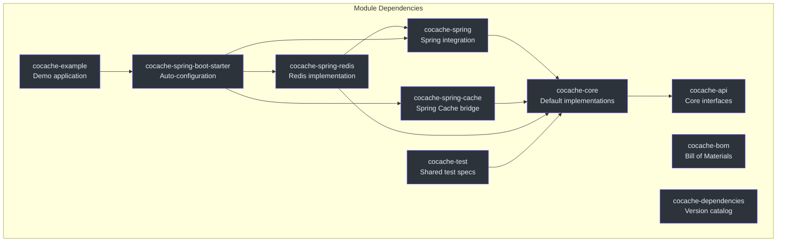
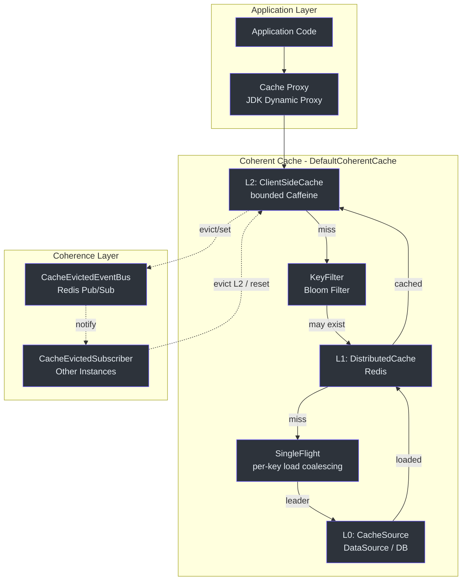
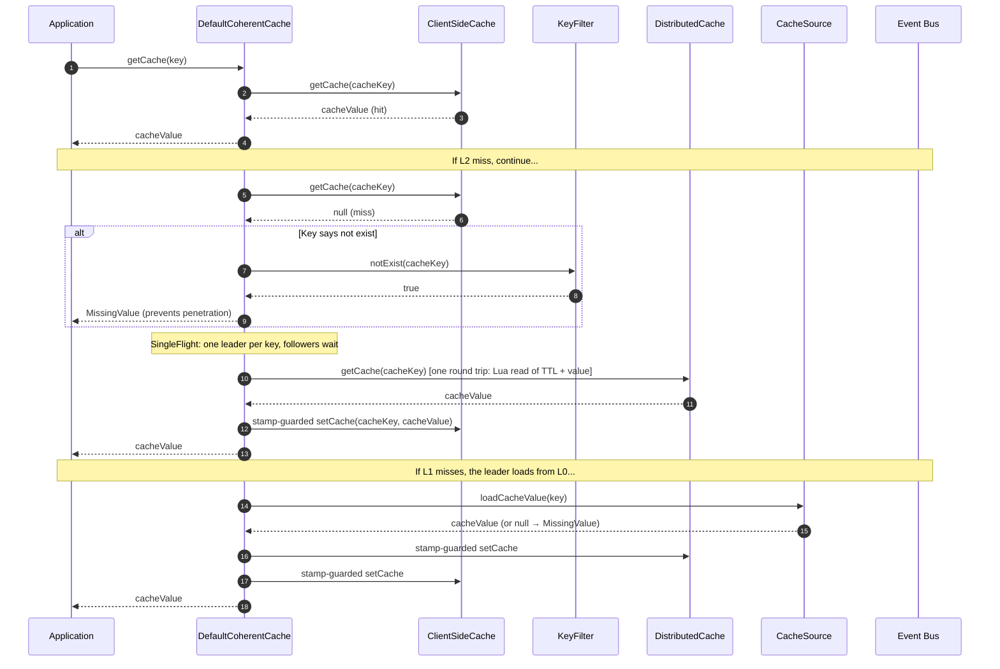

# Architecture Overview

CoCache is a **Level 2 Distributed Coherence Cache Framework** for Java/Kotlin. It implements a two-level caching architecture that combines a fast local in-memory cache (L2) with a shared distributed cache (L1) and an upstream data source (L0). Cache coherence across application instances is maintained through an event bus that publishes `CacheEvictedEvent` messages whenever cache entries are modified.

## Module Dependency Graph

The project is organized into 10 Gradle submodules, each with a clear responsibility:

```mermaid
graph TD
    subgraph sg_10 ["Module Dependencies"]

        api["cocache-api<br>Core interfaces"]
        core["cocache-core<br>Default implementations"]
        spring["cocache-spring<br>Spring integration"]
        springCache["cocache-spring-cache<br>Spring Cache bridge"]
        springRedis["cocache-spring-redis<br>Redis implementation"]
        springBoot["cocache-spring-boot-starter<br>Auto-configuration"]
        test["cocache-test<br>Shared test specs"]
        bom["cocache-bom<br>Bill of Materials"]
        deps["cocache-dependencies<br>Version catalog"]
        example["cocache-example<br>Demo application"]
    end

    core --> api
    spring --> core
    springCache --> core
    springRedis --> core
    springRedis --> spring
    springBoot --> spring
    springBoot --> springCache
    springBoot --> springRedis
    test --> core
    example --> springBoot

    style api fill:#2d333b,stroke:#6d5dfc,color:#e6edf3
    style core fill:#2d333b,stroke:#6d5dfc,color:#e6edf3
    style spring fill:#2d333b,stroke:#6d5dfc,color:#e6edf3
    style springCache fill:#2d333b,stroke:#6d5dfc,color:#e6edf3
    style springRedis fill:#2d333b,stroke:#6d5dfc,color:#e6edf3
    style springBoot fill:#2d333b,stroke:#6d5dfc,color:#e6edf3
    style test fill:#2d333b,stroke:#6d5dfc,color:#e6edf3
    style bom fill:#2d333b,stroke:#6d5dfc,color:#e6edf3
    style deps fill:#2d333b,stroke:#6d5dfc,color:#e6edf3
    style example fill:#2d333b,stroke:#6d5dfc,color:#e6edf3

```

The dependency flow is strictly layered: `cocache-api` defines interfaces at the bottom, `cocache-core` provides implementations, `cocache-spring` adds Spring Framework integration, and `cocache-spring-redis` / `cocache-spring-boot-starter` sit at the top for production use.

## High-Level System Architecture

CoCache organizes caching into three layers:

```mermaid
graph TB
    subgraph sg_11 ["Application Layer"]

        App["Application Code"]
        Proxy["Cache Proxy<br>JDK Dynamic Proxy"]
    end

    subgraph sg_12 ["Coherent Cache - DefaultCoherentCache"]

        L2["L2: ClientSideCache<br>bounded Caffeine"]
        KF["KeyFilter<br>Bloom Filter"]
        L1["L1: DistributedCache<br>Redis"]
        Lock["SingleFlight<br>per-key load coalescing"]
        L0["L0: CacheSource<br>DataSource / DB"]
    end

    subgraph sg_13 ["Coherence Layer"]

        EventBus["CacheEvictedEventBus<br>Redis Pub/Sub"]
        Subscriber["CacheEvictedSubscriber<br>Other Instances"]
    end

    App --> Proxy
    Proxy --> L2
    L2 -->|miss| KF
    KF -->|may exist| L1
    L1 -->|miss| Lock
    Lock -->|leader| L0
    L0 -->|loaded| L1
    L1 -->|cached| L2

    L2 -.->|evict/set| EventBus
    EventBus -.->|notify| Subscriber
    Subscriber -.->|"evict L2 / reset"| L2

    style App fill:#2d333b,stroke:#6d5dfc,color:#e6edf3
    style Proxy fill:#2d333b,stroke:#6d5dfc,color:#e6edf3
    style L2 fill:#2d333b,stroke:#6d5dfc,color:#e6edf3
    style KF fill:#2d333b,stroke:#6d5dfc,color:#e6edf3
    style L1 fill:#2d333b,stroke:#6d5dfc,color:#e6edf3
    style Lock fill:#2d333b,stroke:#6d5dfc,color:#e6edf3
    style L0 fill:#2d333b,stroke:#6d5dfc,color:#e6edf3
    style EventBus fill:#2d333b,stroke:#6d5dfc,color:#e6edf3
    style Subscriber fill:#2d333b,stroke:#6d5dfc,color:#e6edf3

```

| Layer | Name | Role | Interface | Key Implementations |
|-------|------|------|-----------|---------------------|
| L0 | CacheSource | Upstream data source (DataSource/DB) | [`CacheSource<K, V>`](https://github.com/Ahoo-Wang/CoCache/blob/main/cocache-api/src/main/kotlin/me/ahoo/cache/api/source/CacheSource.kt) | `CacheSource.noOp()`, custom implementations |
| L1 | DistributedCache | Shared distributed store | [`DistributedCache<V>`](https://github.com/Ahoo-Wang/CoCache/blob/main/cocache-api/src/main/kotlin/me/ahoo/cache/api/distributed/DistributedCache.kt) | [`RedisDistributedCache`](https://github.com/Ahoo-Wang/CoCache/blob/main/cocache-spring-redis/src/main/kotlin/me/ahoo/cache/spring/redis/RedisDistributedCache.kt), `InMemoryDistributedCache` |
| L2 | ClientSideCache | Local in-memory store | [`ClientSideCache<V>`](https://github.com/Ahoo-Wang/CoCache/blob/main/cocache-api/src/main/kotlin/me/ahoo/cache/api/client/ClientSideCache.kt) | `CaffeineClientSideCache` (default), `MapClientSideCache` |

## Cache Read Path

The read path flows L2 -> KeyFilter -> SingleFlight { L1 -> L0 }:

```mermaid
sequenceDiagram
autonumber
    participant App as Application
    participant CC as DefaultCoherentCache
    participant L2 as ClientSideCache
    participant KF as KeyFilter
    participant L1 as DistributedCache
    participant L0 as CacheSource
    participant EB as Event Bus

    App->>CC: getCache(key)
    CC->>L2: getCache(cacheKey)
    L2-->>CC: cacheValue (hit)
    CC-->>App: cacheValue

    Note over App,EB: If L2 miss, continue...
    CC->>L2: getCache(cacheKey)
    L2-->>CC: null (miss)

    alt Key says not exist
        CC->>KF: notExist(cacheKey)
        KF-->>CC: true
        CC-->>App: MissingValue (prevents penetration)
    end

    Note over CC: SingleFlight: one leader per key, followers wait
    CC->>L1: getCache(cacheKey) [one round trip: Lua read of TTL + value]
    L1-->>CC: cacheValue
    CC->>L2: stamp-guarded setCache(cacheKey, cacheValue)
    CC-->>App: cacheValue

    Note over App,EB: If L1 misses, the leader loads from L0...
    CC->>L0: loadCacheValue(key)
    L0-->>CC: cacheValue (or null → MissingValue)
    CC->>L1: stamp-guarded setCache
    CC->>L2: stamp-guarded setCache
    CC-->>App: cacheValue
```

## Key Design Decisions

### 1. Per-Key Load Coalescing

`SingleFlight` lets exactly one thread per key read L1 and load the source; concurrent callers share its result or its original exception. Unlike striped locks, unrelated keys never block each other. This prevents cache stampede (the "thundering herd" problem).

### 2. Explicit Negative Cache (Cache Penetration Prevention)

When a cache source returns `null`, CoCache stores a `MissingValue` with its own short `missingTtl` (default 60s), so non-existent keys stop hitting the database without hiding newly created rows for long. `CacheValue` is sealed (`PresentValue` | `MissingValue`), so no business value can be mistaken for a negative entry. An L1 miss is never treated as negative. The `KeyFilter` interface (a Bloom filter adapter) rejects keys known not to exist before any lookup.

### 3. Event-Driven Coherence

CoCache actively publishes `CacheEvictedEvent` through the `CacheEvictedEventBus`; peers evict their L2 for that key. Every write-back is guarded by invalidation stamps so a concurrent eviction (local or remote) is never overwritten by a stale value, and every (re)subscription of the channel clears L2 so lost messages cannot leave stale copies. See [Cache Coherence](./coherence.md) for details.

### 4. Proxy-Based Declarative Caching

Cache interfaces are declared as Kotlin/Java interfaces annotated with `@CoCache`. At application startup, `EnableCoCacheRegistrar` parses these annotations, constructs `CoCacheMetadata`, and creates JDK dynamic proxies backed by `DefaultCoherentCache` instances. This allows cache configuration to be fully declarative. See [Proxy and Annotations](./proxy.md) for details.

### 5. TTL with Amplitude

Each value carries a TTL (default 3600s -- finite so any residual inconsistency self-heals) plus a random offset within `[-ttlAmplitude, +ttlAmplitude]` (default 60s). The jitter prevents synchronized expiration of many entries at once (the "cache avalanche" problem). The policy lives in `TtlPolicy`; storage tiers only see the resulting absolute `ttlAt`.

## Source References

| File | Line(s) | Description |
|------|---------|-------------|
| [`settings.gradle.kts`](https://github.com/Ahoo-Wang/CoCache/blob/main/settings.gradle.kts#L1) | 1-11 | Module declarations |
| [`build.gradle.kts`](https://github.com/Ahoo-Wang/CoCache/blob/main/build.gradle.kts#L1) | 1-219 | Root build config, JDK 17, Kotlin compiler flags |
| [`cocache-api/build.gradle.kts`](https://github.com/Ahoo-Wang/CoCache/blob/main/cocache-api/build.gradle.kts#L1) | 1 | No external dependencies (pure interfaces) |
| [`cocache-core/build.gradle.kts`](https://github.com/Ahoo-Wang/CoCache/blob/main/cocache-core/build.gradle.kts#L1) | 1-12 | Depends on `cocache-api`, Caffeine, Spring Expression; Guava compile-only (BloomKeyFilter) |
| [`cocache-spring/build.gradle.kts`](https://github.com/Ahoo-Wang/CoCache/blob/main/cocache-spring/build.gradle.kts#L1) | 1-3 | Depends on `cocache-core`, Spring Context |
| [`cocache-spring-redis/build.gradle.kts`](https://github.com/Ahoo-Wang/CoCache/blob/main/cocache-spring-redis/build.gradle.kts#L1) | 1-10 | Depends on `cocache-core`, `cocache-spring`, Jackson, Spring Data Redis |
| [`cocache-spring-boot-starter/build.gradle.kts`](https://github.com/Ahoo-Wang/CoCache/blob/main/cocache-spring-boot-starter/build.gradle.kts#L1) | 1-30 | Depends on `cocache-spring`, `cocache-spring-cache`, `cocache-spring-redis`, Spring Boot |
| [`DefaultCoherentCache.kt`](https://github.com/Ahoo-Wang/CoCache/blob/main/cocache-core/src/main/kotlin/me/ahoo/cache/consistency/DefaultCoherentCache.kt#L30) | 30-186 | Central coherent cache implementation |
| [`CoherentCache.kt`](https://github.com/Ahoo-Wang/CoCache/blob/main/cocache-core/src/main/kotlin/me/ahoo/cache/consistency/CoherentCache.kt#L25) | 25-32 | CoherentCache interface definition |
| [`CoherentCacheConfiguration.kt`](https://github.com/Ahoo-Wang/CoCache/blob/main/cocache-core/src/main/kotlin/me/ahoo/cache/consistency/CoherentCacheConfiguration.kt#L26) | 26-34 | Configuration data class with defaults |

## Related Pages

- [Cache Layers Deep Dive](./cache-layers.md) -- L0, L1, L2 layer details and read/write/evict paths
- [Cache Coherence and Event Bus](./coherence.md) -- distributed invalidation via CacheEvictedEventBus
- [Proxy and Annotations](./proxy.md) -- declarative caching with @CoCache and JDK dynamic proxies
