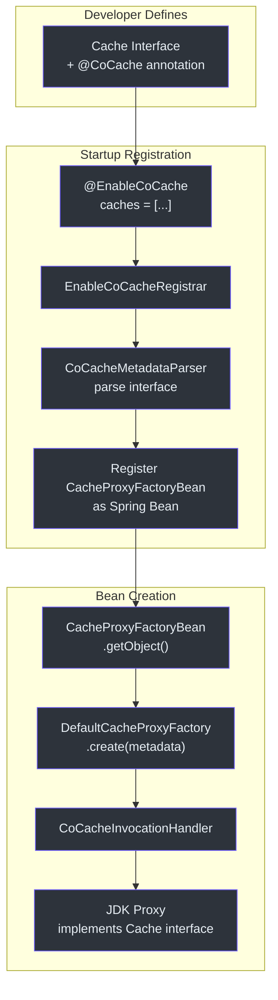
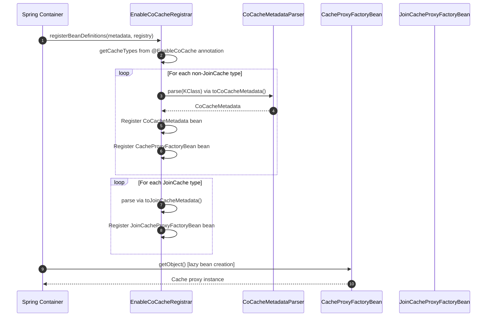
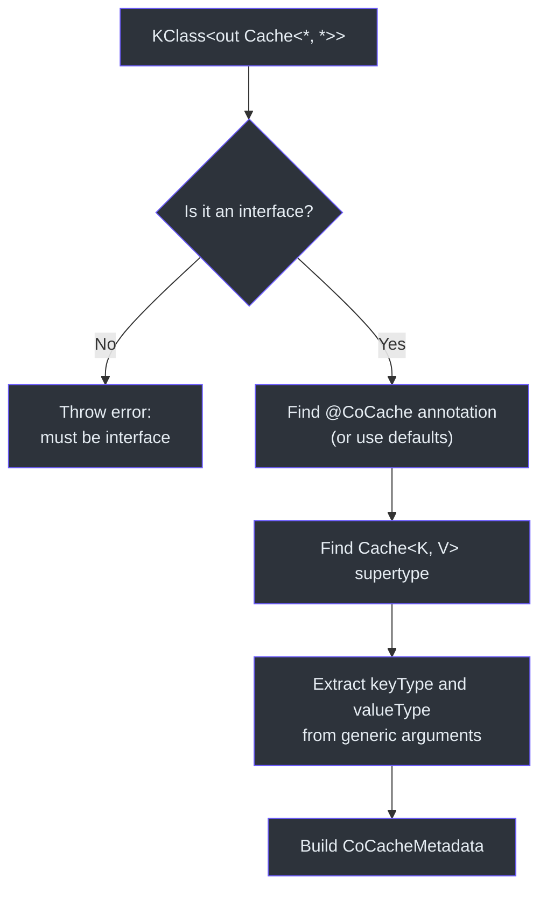
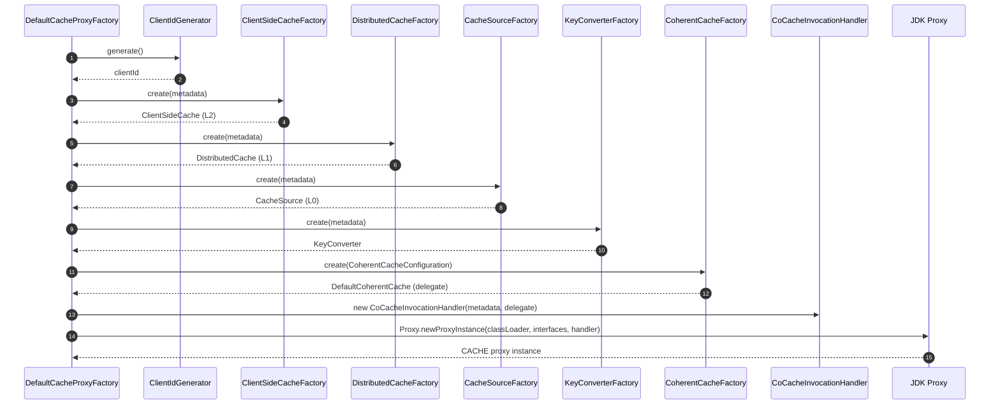
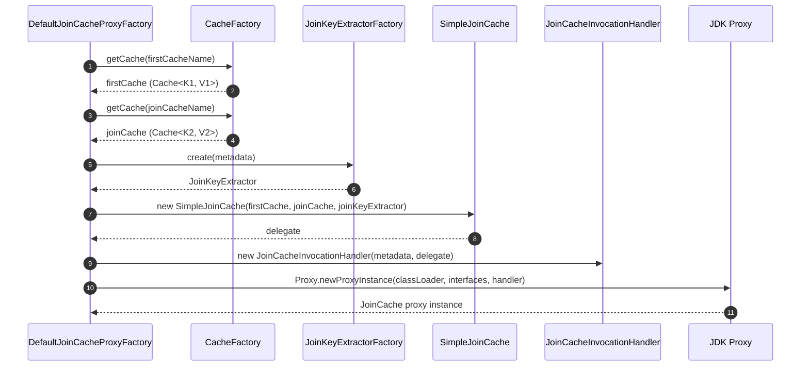
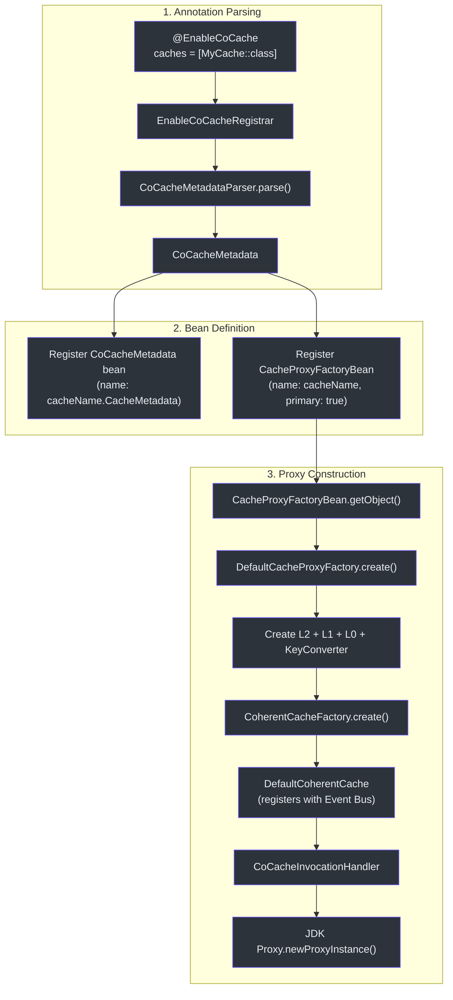

# Proxy and Annotation System

CoCache uses a declarative, annotation-driven approach to cache configuration. Developers define cache interfaces annotated with `@CoCache`, and the framework automatically creates JDK dynamic proxy implementations backed by `DefaultCoherentCache`. This system eliminates boilerplate cache wiring and allows cache behavior to be configured entirely through annotations.

## Overview



## The @EnableCoCache Annotation

The entry point is [`@EnableCoCache`](https://github.com/Ahoo-Wang/CoCache/blob/main/cocache-spring/src/main/kotlin/me/ahoo/cache/spring/EnableCoCache.kt#L20), a Spring `@Import` annotation that triggers the registration process:

```kotlin
@Import(EnableCoCacheRegistrar::class)
@Target(AnnotationTarget.CLASS)
annotation class EnableCoCache(
    val caches: Array<KClass<out Cache<*, *>>> = []
)
```

Usage in a Spring configuration class:

```kotlin
@EnableCoCache(caches = [UserProfileCache::class, ProductCache::class])
class CacheConfiguration
```

## EnableCoCacheRegistrar -- Bean Definition Registration

[`EnableCoCacheRegistrar`](https://github.com/Ahoo-Wang/CoCache/blob/main/cocache-spring/src/main/kotlin/me/ahoo/cache/spring/EnableCoCacheRegistrar.kt#L31) implements Spring's `ImportBeanDefinitionRegistrar` interface. During application startup, it:

1. Reads the `caches` array from the `@EnableCoCache` annotation
2. Separates `JoinCache` types from regular `Cache` types
3. Parses each interface into `CoCacheMetadata` or `JoinCacheMetadata`
4. Registers Spring `FactoryBean` definitions for each cache



The key logic in `registerBeanDefinitions()` at [line 45](https://github.com/Ahoo-Wang/CoCache/blob/main/cocache-spring/src/main/kotlin/me/ahoo/cache/spring/EnableCoCacheRegistrar.kt#L45):

```kotlin
override fun registerBeanDefinitions(importingClassMetadata: AnnotationMetadata, registry: BeanDefinitionRegistry) {
    val cacheMetadataList = resolveCacheMetadataList(importingClassMetadata)
    cacheMetadataList.forEach { cacheMetadata ->
        registry.registerCacheMetadata(cacheMetadata)
        val beanDefinitionBuilder = BeanDefinitionBuilder.genericBeanDefinition(CacheProxyFactoryBean::class.java)
        beanDefinitionBuilder.addConstructorArgValue(cacheMetadata)
        beanDefinitionBuilder.setPrimary(true)
        registry.registerBeanDefinition(cacheMetadata.cacheName, beanDefinitionBuilder.beanDefinition)
    }
    val joinCacheMetadataList = resolveJoinCacheMetadataList(importingClassMetadata)
    joinCacheMetadataList.forEach { cacheMetadata ->
        val beanDefinitionBuilder = BeanDefinitionBuilder.genericBeanDefinition(JoinCacheProxyFactoryBean::class.java)
        beanDefinitionBuilder.addConstructorArgValue(cacheMetadata)
        beanDefinitionBuilder.setPrimary(true)
        registry.registerBeanDefinition(cacheMetadata.cacheName, beanDefinitionBuilder.beanDefinition)
    }
}
```

## CoCacheMetadata and CoCacheMetadataParser

### CoCacheMetadata

[`CoCacheMetadata`](https://github.com/Ahoo-Wang/CoCache/blob/main/cocache-core/src/main/kotlin/me/ahoo/cache/annotation/CoCacheMetadata.kt#L20) is a data class that holds all parsed configuration from a cache interface:

```kotlin
data class CoCacheMetadata(
    override val proxyInterface: KClass<*>,
    override val name: String,
    val keyPrefix: String,
    val keyExpression: String,
    override val ttl: Long,
    override val ttlAmplitude: Long,
    val keyType: KType,
    val valueType: KType
) : ComputedNamedCache, TtlConfiguration {
    override val cacheName: String = name.ifBlank {
        proxyInterface.simpleName!!
    }
}
```

If `name` is blank, the `cacheName` defaults to the interface's simple class name.

### CoCacheMetadataParser

[`CoCacheMetadataParser`](https://github.com/Ahoo-Wang/CoCache/blob/main/cocache-core/src/main/kotlin/me/ahoo/cache/annotation/CoCacheMetadataParser.kt#L24) parses a `KClass` into `CoCacheMetadata` at [line 30](https://github.com/Ahoo-Wang/CoCache/blob/main/cocache-core/src/main/kotlin/me/ahoo/cache/annotation/CoCacheMetadataParser.kt#L30):



The parser enforces that the target must be an interface. It reads the `@CoCache` annotation (or uses defaults if absent), extracts the generic type parameters from the `Cache<K, V>` supertype, and produces a `CoCacheMetadata` instance.

## JDK Dynamic Proxy Creation

### CoCacheProxy -- Abstract InvocationHandler

[`CoCacheProxy`](https://github.com/Ahoo-Wang/CoCache/blob/main/cocache-core/src/main/kotlin/me/ahoo/cache/proxy/CoCacheProxy.kt#L20) is an abstract `InvocationHandler` that provides the core delegation logic:

```kotlin
abstract class CoCacheProxy<DELEGATE> : InvocationHandler, CacheDelegated<DELEGATE>
    where DELEGATE : Cache<*, *> {

    abstract val proxyInterface: Class<*>

    private val declaredDefaultMethods by lazy {
        proxyInterface.declaredMethods.filter { it.isDefault }
    }

    override fun invoke(proxy: Any, method: Method, args: Array<out Any>?): Any? {
        val methodArgs = args ?: EMPTY_ARGS
        if (method.isDefault && declaredDefaultMethods.contains(method)) {
            return InvocationHandler.invokeDefault(proxy, method, *methodArgs)
        }
        return method.invoke(delegate, *methodArgs)
    }
}
```

The proxy distinguishes between:
- **Default methods** (declared on the interface itself with a body) -- invoked via `InvocationHandler.invokeDefault()`
- **Abstract methods** (from `Cache<K, V>` and parent interfaces) -- delegated to the `DefaultCoherentCache` instance

### CoCacheInvocationHandler -- Concrete Handler

[`CoCacheInvocationHandler`](https://github.com/Ahoo-Wang/CoCache/blob/main/cocache-core/src/main/kotlin/me/ahoo/cache/proxy/CoCacheInvocationHandler.kt#L22) extends `CoCacheProxy` and adds special handling for the `delegate` and `cacheMetadata` accessor methods:

```kotlin
class CoCacheInvocationHandler<DELEGATE>(
    override val cacheMetadata: CoCacheMetadata,
    override val delegate: DELEGATE
) : CacheDelegated<DELEGATE>, CacheMetadataCapable, CoCacheProxy<DELEGATE>()
    where DELEGATE : Cache<*, *>, DELEGATE : NamedCache {

    override fun invoke(proxy: Any, method: Method, args: Array<out Any>?): Any? {
        if (DELEGATE_METHOD_SIGN == method.name) return delegate
        if (CACHE_METADATA_METHOD_SIGN == method.name) return cacheMetadata
        return super.invoke(proxy, method, args)
    }
}
```

This allows callers to access the underlying `delegate` (the `DefaultCoherentCache`) and the `cacheMetadata` from the proxy, enabling introspection without casting.

### DefaultCacheProxyFactory -- Factory

[`DefaultCacheProxyFactory`](https://github.com/Ahoo-Wang/CoCache/blob/main/cocache-core/src/main/kotlin/me/ahoo/cache/proxy/DefaultCacheProxyFactory.kt#L30) orchestrates the creation of a cache proxy at [line 40](https://github.com/Ahoo-Wang/CoCache/blob/main/cocache-core/src/main/kotlin/me/ahoo/cache/proxy/DefaultCacheProxyFactory.kt#L40):



The proxy implements four interfaces simultaneously:
1. The user's cache interface (e.g., `UserProfileCache`)
2. `CoherentCache<K, V>` -- full coherent cache API
3. `CacheDelegated` -- access to the underlying delegate
4. `CacheMetadataCapable` -- access to the parsed metadata

### CacheProxyFactoryBean -- Spring Integration

[`CacheProxyFactoryBean`](https://github.com/Ahoo-Wang/CoCache/blob/main/cocache-spring/src/main/kotlin/me/ahoo/cache/spring/proxy/CacheProxyFactoryBean.kt#L23) bridges the Spring `FactoryBean` contract with the proxy factory:

```kotlin
class CacheProxyFactoryBean(private val cacheMetadata: CoCacheMetadata) :
    FactoryBean<Cache<Any, Any>>, ApplicationContextAware {

    override fun getObject(): Cache<Any, Any> {
        val cacheProxyFactory = appContext.getBean(CacheProxyFactory::class.java)
        return cacheProxyFactory.create(cacheMetadata)
    }

    override fun getObjectType(): Class<*> {
        return cacheMetadata.proxyInterface.java
    }
}
```

It lazily resolves the `CacheProxyFactory` from the Spring `ApplicationContext` when `getObject()` is first called.

## JoinCache Proxy Flow

For `JoinCache` interfaces (which compose two cached values), a parallel registration path exists through [`JoinCacheProxyFactoryBean`](https://github.com/Ahoo-Wang/CoCache/blob/main/cocache-spring/src/main/kotlin/me/ahoo/cache/spring/join/JoinCacheProxyFactoryBean.kt#L23) and [`DefaultJoinCacheProxyFactory`](https://github.com/Ahoo-Wang/CoCache/blob/main/cocache-core/src/main/kotlin/me/ahoo/cache/join/proxy/DefaultJoinCacheProxyFactory.kt#L25).



The `DefaultJoinCacheProxyFactory.create()` at [line 30](https://github.com/Ahoo-Wang/CoCache/blob/main/cocache-core/src/main/kotlin/me/ahoo/cache/join/proxy/DefaultJoinCacheProxyFactory.kt#L30):
1. Looks up the **first cache** by `firstCacheName` (or by type if name is blank)
2. Looks up the **join cache** by `joinCacheName` (or by type)
3. Creates a `JoinKeyExtractor` that extracts the join key from the first cache's value
4. Wraps them in a `SimpleJoinCache` delegate
5. Creates a JDK proxy implementing the user's `JoinCache` interface

## Complete Registration Flow Diagram



## Key Class Relationships

| Class/Interface | Role | Module | Source |
|----------------|------|--------|--------|
| [`@EnableCoCache`](https://github.com/Ahoo-Wang/CoCache/blob/main/cocache-spring/src/main/kotlin/me/ahoo/cache/spring/EnableCoCache.kt#L20) | Triggers registration via `@Import` | cocache-spring | [EnableCoCache.kt](https://github.com/Ahoo-Wang/CoCache/blob/main/cocache-spring/src/main/kotlin/me/ahoo/cache/spring/EnableCoCache.kt#L20) |
| [`EnableCoCacheRegistrar`](https://github.com/Ahoo-Wang/CoCache/blob/main/cocache-spring/src/main/kotlin/me/ahoo/cache/spring/EnableCoCacheRegistrar.kt#L31) | Parses annotations, registers bean definitions | cocache-spring | [EnableCoCacheRegistrar.kt](https://github.com/Ahoo-Wang/CoCache/blob/main/cocache-spring/src/main/kotlin/me/ahoo/cache/spring/EnableCoCacheRegistrar.kt#L31) |
| [`CoCacheMetadata`](https://github.com/Ahoo-Wang/CoCache/blob/main/cocache-core/src/main/kotlin/me/ahoo/cache/annotation/CoCacheMetadata.kt#L20) | Parsed cache configuration | cocache-core | [CoCacheMetadata.kt](https://github.com/Ahoo-Wang/CoCache/blob/main/cocache-core/src/main/kotlin/me/ahoo/cache/annotation/CoCacheMetadata.kt#L20) |
| [`CoCacheMetadataParser`](https://github.com/Ahoo-Wang/CoCache/blob/main/cocache-core/src/main/kotlin/me/ahoo/cache/annotation/CoCacheMetadataParser.kt#L24) | Reflective interface parser | cocache-core | [CoCacheMetadataParser.kt](https://github.com/Ahoo-Wang/CoCache/blob/main/cocache-core/src/main/kotlin/me/ahoo/cache/annotation/CoCacheMetadataParser.kt#L24) |
| [`CoCacheProxy`](https://github.com/Ahoo-Wang/CoCache/blob/main/cocache-core/src/main/kotlin/me/ahoo/cache/proxy/CoCacheProxy.kt#L20) | Abstract InvocationHandler with default method support | cocache-core | [CoCacheProxy.kt](https://github.com/Ahoo-Wang/CoCache/blob/main/cocache-core/src/main/kotlin/me/ahoo/cache/proxy/CoCacheProxy.kt#L20) |
| [`CoCacheInvocationHandler`](https://github.com/Ahoo-Wang/CoCache/blob/main/cocache-core/src/main/kotlin/me/ahoo/cache/proxy/CoCacheInvocationHandler.kt#L22) | Concrete handler with delegate/metadata access | cocache-core | [CoCacheInvocationHandler.kt](https://github.com/Ahoo-Wang/CoCache/blob/main/cocache-core/src/main/kotlin/me/ahoo/cache/proxy/CoCacheInvocationHandler.kt#L22) |
| [`DefaultCacheProxyFactory`](https://github.com/Ahoo-Wang/CoCache/blob/main/cocache-core/src/main/kotlin/me/ahoo/cache/proxy/DefaultCacheProxyFactory.kt#L30) | Assembles all components and creates proxy | cocache-core | [DefaultCacheProxyFactory.kt](https://github.com/Ahoo-Wang/CoCache/blob/main/cocache-core/src/main/kotlin/me/ahoo/cache/proxy/DefaultCacheProxyFactory.kt#L30) |
| [`CacheProxyFactoryBean`](https://github.com/Ahoo-Wang/CoCache/blob/main/cocache-spring/src/main/kotlin/me/ahoo/cache/spring/proxy/CacheProxyFactoryBean.kt#L23) | Spring FactoryBean bridge | cocache-spring | [CacheProxyFactoryBean.kt](https://github.com/Ahoo-Wang/CoCache/blob/main/cocache-spring/src/main/kotlin/me/ahoo/cache/spring/proxy/CacheProxyFactoryBean.kt#L23) |
| [`JoinCacheProxyFactoryBean`](https://github.com/Ahoo-Wang/CoCache/blob/main/cocache-spring/src/main/kotlin/me/ahoo/cache/spring/join/JoinCacheProxyFactoryBean.kt#L23) | Spring FactoryBean for JoinCache | cocache-spring | [JoinCacheProxyFactoryBean.kt](https://github.com/Ahoo-Wang/CoCache/blob/main/cocache-spring/src/main/kotlin/me/ahoo/cache/spring/join/JoinCacheProxyFactoryBean.kt#L23) |
| [`DefaultJoinCacheProxyFactory`](https://github.com/Ahoo-Wang/CoCache/blob/main/cocache-core/src/main/kotlin/me/ahoo/cache/join/proxy/DefaultJoinCacheProxyFactory.kt#L25) | Creates JoinCache proxies with two cache composition | cocache-core | [DefaultJoinCacheProxyFactory.kt](https://github.com/Ahoo-Wang/CoCache/blob/main/cocache-core/src/main/kotlin/me/ahoo/cache/join/proxy/DefaultJoinCacheProxyFactory.kt#L25) |

## Source References

| File | Line(s) | Description |
|------|---------|-------------|
| [`EnableCoCache.kt`](https://github.com/Ahoo-Wang/CoCache/blob/main/cocache-spring/src/main/kotlin/me/ahoo/cache/spring/EnableCoCache.kt#L20) | 20-24 | @EnableCoCache annotation definition |
| [`EnableCoCacheRegistrar.kt`](https://github.com/Ahoo-Wang/CoCache/blob/main/cocache-spring/src/main/kotlin/me/ahoo/cache/spring/EnableCoCacheRegistrar.kt#L31) | 31-98 | Bean definition registrar |
| [`CoCacheMetadata.kt`](https://github.com/Ahoo-Wang/CoCache/blob/main/cocache-core/src/main/kotlin/me/ahoo/cache/annotation/CoCacheMetadata.kt#L20) | 20-33 | Parsed metadata data class |
| [`CoCacheMetadataParser.kt`](https://github.com/Ahoo-Wang/CoCache/blob/main/cocache-core/src/main/kotlin/me/ahoo/cache/annotation/CoCacheMetadataParser.kt#L30) | 30-57 | Reflective parser |
| [`CoCacheProxy.kt`](https://github.com/Ahoo-Wang/CoCache/blob/main/cocache-core/src/main/kotlin/me/ahoo/cache/proxy/CoCacheProxy.kt#L34) | 34-41 | Abstract InvocationHandler |
| [`CoCacheInvocationHandler.kt`](https://github.com/Ahoo-Wang/CoCache/blob/main/cocache-core/src/main/kotlin/me/ahoo/cache/proxy/CoCacheInvocationHandler.kt#L37) | 37-46 | Concrete invocation handler |
| [`DefaultCacheProxyFactory.kt`](https://github.com/Ahoo-Wang/CoCache/blob/main/cocache-core/src/main/kotlin/me/ahoo/cache/proxy/DefaultCacheProxyFactory.kt#L40) | 40-68 | Proxy factory assembling all components |
| [`CacheProxyFactoryBean.kt`](https://github.com/Ahoo-Wang/CoCache/blob/main/cocache-spring/src/main/kotlin/me/ahoo/cache/spring/proxy/CacheProxyFactoryBean.kt#L23) | 23-39 | Spring FactoryBean |
| [`JoinCacheProxyFactoryBean.kt`](https://github.com/Ahoo-Wang/CoCache/blob/main/cocache-spring/src/main/kotlin/me/ahoo/cache/spring/join/JoinCacheProxyFactoryBean.kt#L23) | 23-39 | JoinCache FactoryBean |
| [`DefaultJoinCacheProxyFactory.kt`](https://github.com/Ahoo-Wang/CoCache/blob/main/cocache-core/src/main/kotlin/me/ahoo/cache/join/proxy/DefaultJoinCacheProxyFactory.kt#L30) | 30-65 | JoinCache proxy factory |

## Related Pages

- [Architecture Overview](./index.md) -- high-level system architecture and module graph
- [Cache Layers Deep Dive](./cache-layers.md) -- L0/L1/L2 layer details
- [Cache Coherence and Event Bus](./coherence.md) -- distributed invalidation mechanism
