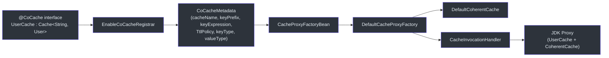
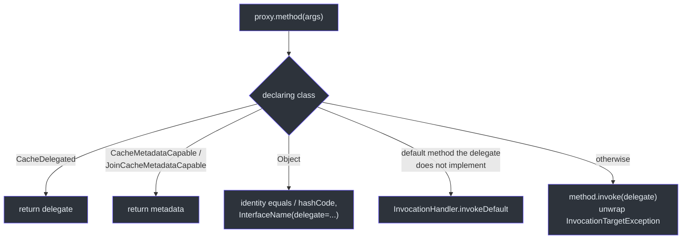
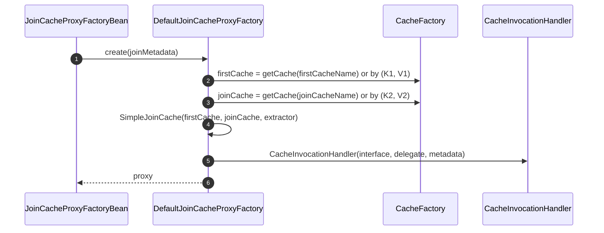

# Proxy and Annotation System

You declare a cache as an interface. CoCache parses its annotations into metadata, assembles a `DefaultCoherentCache` (or a `SimpleJoinCache`), and exposes it through a JDK dynamic proxy that implements your interface.

## Overview

```mermaid
graph LR
    I["@CoCache interface<br>UserCache : Cache&lt;String, User&gt;"] --> R["EnableCoCacheRegistrar"]
    R --> M["CoCacheMetadata<br>(cacheName, keyPrefix, keyExpression,<br>TtlPolicy, keyType, valueType)"]
    M --> FB["CacheProxyFactoryBean"]
    FB --> PF["DefaultCacheProxyFactory"]
    PF --> CC["DefaultCoherentCache"]
    PF --> H["CacheInvocationHandler"]
    H --> P["JDK Proxy<br>(UserCache + CoherentCache)"]

    style I fill:#2d333b,stroke:#6d5dfc,color:#e6edf3
    style R fill:#2d333b,stroke:#6d5dfc,color:#e6edf3
    style M fill:#2d333b,stroke:#6d5dfc,color:#e6edf3
    style FB fill:#2d333b,stroke:#6d5dfc,color:#e6edf3
    style PF fill:#2d333b,stroke:#6d5dfc,color:#e6edf3
    style CC fill:#2d333b,stroke:#6d5dfc,color:#e6edf3
    style H fill:#2d333b,stroke:#6d5dfc,color:#e6edf3
    style P fill:#2d333b,stroke:#6d5dfc,color:#e6edf3
```

## Registration

`@EnableCoCache(caches = [...])` imports `EnableCoCacheRegistrar`. For each listed interface it does the following:

- **Plain cache** (`Cache<K, V>`): parses `CoCacheMetadata`, registers it as `{cacheName}.CacheMetadata`, and registers a primary `CacheProxyFactoryBean` under `cacheName`.
- **Join cache** (`JoinCache<K1, V1, K2, V2>`): parses `JoinCacheMetadata` and registers a `JoinCacheProxyFactoryBean`.

`CoCacheMetadataParser` resolves `K`/`V` from the interface's `Cache` supertype; any inheritance depth works. `cacheName` defaults to the interface's simple name.

## Component Assembly

`DefaultCacheProxyFactory.create(metadata)` builds a `CoherentCacheConfiguration` from pluggable factories:

| Component | Spring factory | Bean name override | Type fallback | Default |
|-----------|----------------|--------------------|---------------|---------|
| `ClientSideCache` | `SpringClientSideCacheFactory` | `{cacheName}.ClientSideCache` | -- | Caffeine per `@CaffeineCache` |
| `DistributedCache` | `RedisDistributedCacheFactory` | `{cacheName}.DistributedCache` | -- | `RedisDistributedCache` + JSON codec |
| `KeyConverter` | `SpringKeyConverterFactory` | `{cacheName}.KeyConverter` | -- | prefix + `toString()` or SpEL |
| `CacheSource` | `SpringCacheSourceFactory` | `{cacheName}.CacheSource` | unique `CacheSource<K, V>` | `CacheSource.noOp()` |
| `JoinKeyExtractor` | `SpringJoinKeyExtractorFactory` | `{cacheName}.JoinKeyExtractor` | unique `JoinKeyExtractor<V1, K2>` | SpEL `joinKeyExpression` |

**Stateful components resolve by name only.** If they resolved by type, every cache with the same value type would share one L2 (one cache's `clear()` would wipe the others) or one key prefix (keys would collide). Stateless loaders may be shared by type.

## CacheInvocationHandler

One handler ([CacheInvocationHandler.kt](https://github.com/Ahoo-Wang/CoCache/blob/main/cocache-core/src/main/kotlin/me/ahoo/cache/proxy/CacheInvocationHandler.kt)) serves both proxy kinds:

```mermaid
flowchart TD
    Call["proxy.method(args)"] --> D{"declaring class"}
    D -->|CacheDelegated| Del["return delegate"]
    D -->|"CacheMetadataCapable /<br>JoinCacheMetadataCapable"| Meta["return metadata"]
    D -->|Object| Obj["identity equals / hashCode,<br>InterfaceName(delegate=...)"]
    D -->|"default method the delegate<br>does not implement"| Def["InvocationHandler.invokeDefault"]
    D -->|otherwise| Inv["method.invoke(delegate)<br>unwrap InvocationTargetException"]

    style Call fill:#2d333b,stroke:#6d5dfc,color:#e6edf3
    style D fill:#2d333b,stroke:#6d5dfc,color:#e6edf3
    style Del fill:#2d333b,stroke:#6d5dfc,color:#e6edf3
    style Meta fill:#2d333b,stroke:#6d5dfc,color:#e6edf3
    style Obj fill:#2d333b,stroke:#6d5dfc,color:#e6edf3
    style Def fill:#2d333b,stroke:#6d5dfc,color:#e6edf3
    style Inv fill:#2d333b,stroke:#6d5dfc,color:#e6edf3
```

Exceptions from the delegate, for example from your `CacheSource` or from Redis in strict mode, reach the caller **unwrapped**.

The proxy for a plain cache implements your interface, `CoherentCache`, `CacheDelegated`, and `CacheMetadataCapable`. You can therefore cast it to `CoherentCache` to read `configuration` (as the actuator endpoints do).

## JoinCache Proxy Flow

```mermaid
sequenceDiagram
autonumber
    participant FB as JoinCacheProxyFactoryBean
    participant F as DefaultJoinCacheProxyFactory
    participant CF as CacheFactory
    participant H as CacheInvocationHandler

    FB->>F: create(joinMetadata)
    F->>CF: firstCache = getCache(firstCacheName) or by (K1, V1)
    F->>CF: joinCache = getCache(joinCacheName) or by (K2, V2)
    F->>F: SimpleJoinCache(firstCache, joinCache, extractor)
    F->>H: CacheInvocationHandler(interface, delegate, metadata)
    F-->>FB: proxy
```

A missing component cache fails fast with a message naming both the cache name and the type. The join proxy does **not** own its component caches' lifecycles; each component cache is closed by its own factory bean.

## Source References

| Class | Module | Source |
|-------|--------|--------|
| `EnableCoCacheRegistrar` | cocache-spring | [EnableCoCacheRegistrar.kt](https://github.com/Ahoo-Wang/CoCache/blob/main/cocache-spring/src/main/kotlin/me/ahoo/cache/spring/EnableCoCacheRegistrar.kt) |
| `CoCacheMetadataParser` | cocache-core | [CoCacheMetadataParser.kt](https://github.com/Ahoo-Wang/CoCache/blob/main/cocache-core/src/main/kotlin/me/ahoo/cache/annotation/CoCacheMetadataParser.kt) |
| `DefaultCacheProxyFactory` | cocache-core | [DefaultCacheProxyFactory.kt](https://github.com/Ahoo-Wang/CoCache/blob/main/cocache-core/src/main/kotlin/me/ahoo/cache/proxy/DefaultCacheProxyFactory.kt) |
| `CacheInvocationHandler` | cocache-core | [CacheInvocationHandler.kt](https://github.com/Ahoo-Wang/CoCache/blob/main/cocache-core/src/main/kotlin/me/ahoo/cache/proxy/CacheInvocationHandler.kt) |
| `AbstractCacheFactory` | cocache-spring | [AbstractCacheFactory.kt](https://github.com/Ahoo-Wang/CoCache/blob/main/cocache-spring/src/main/kotlin/me/ahoo/cache/spring/AbstractCacheFactory.kt) |
| `DefaultJoinCacheProxyFactory` | cocache-core | [DefaultJoinCacheProxyFactory.kt](https://github.com/Ahoo-Wang/CoCache/blob/main/cocache-core/src/main/kotlin/me/ahoo/cache/join/proxy/DefaultJoinCacheProxyFactory.kt) |

## Related Pages

- [Architecture Overview](./index.md)
- [Cache Layers Deep Dive](./cache-layers.md)
- [Annotations](../api/annotations.md)
