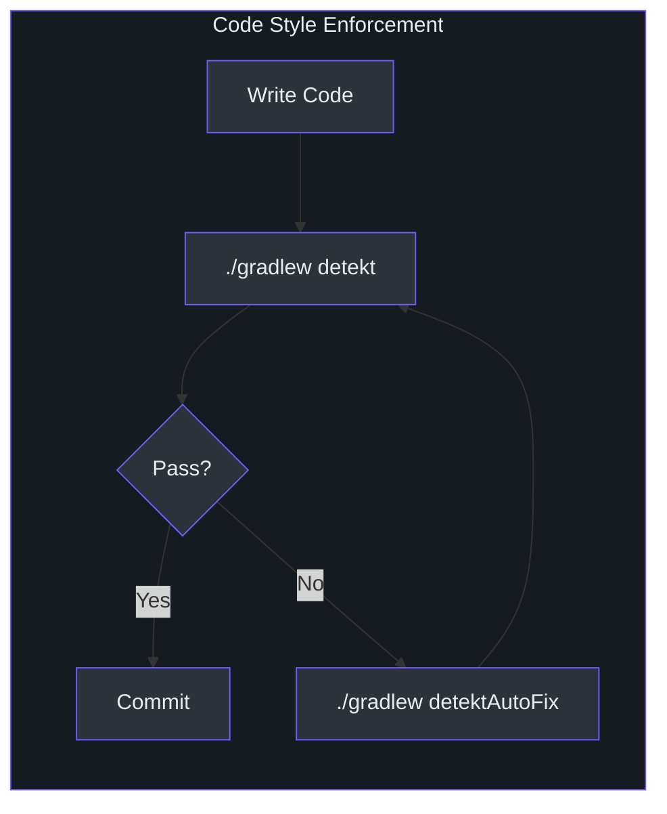
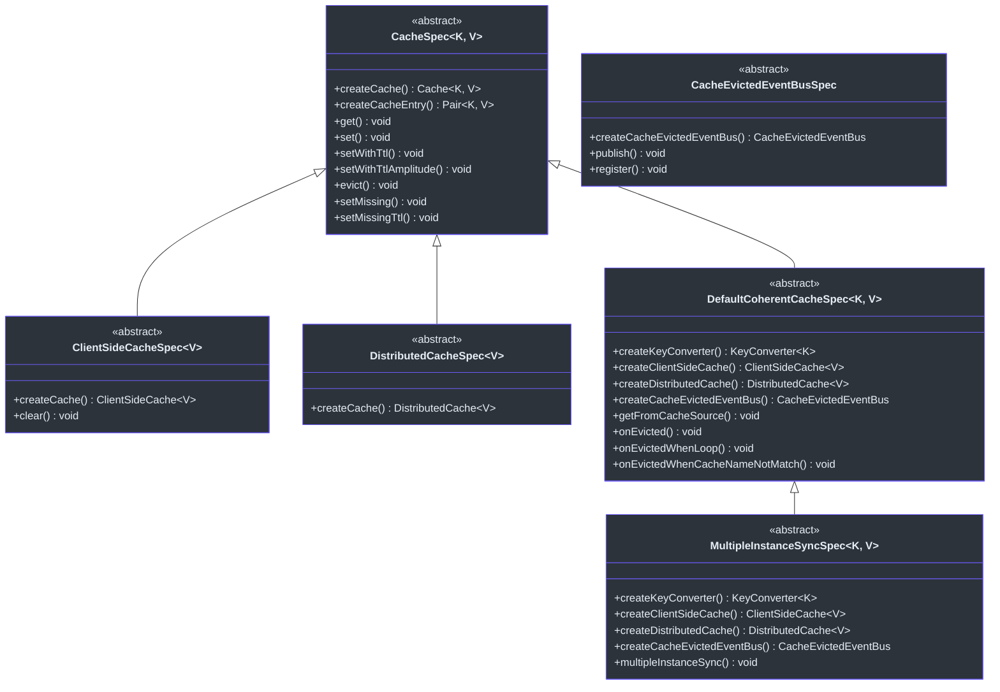
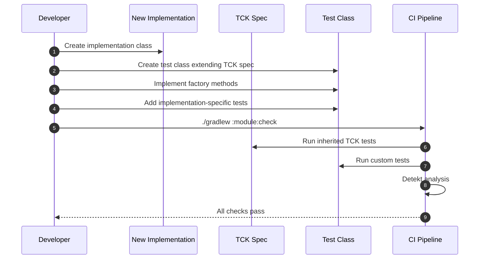
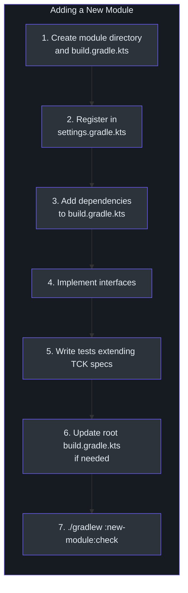
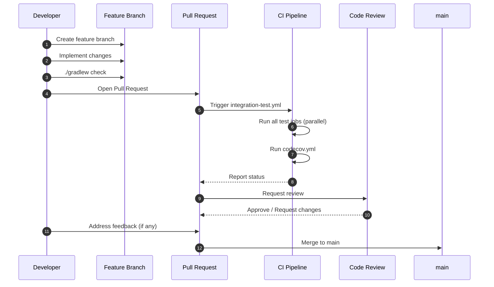

# Contributing Guide

This guide covers everything you need to know to contribute to CoCache: code style enforcement, testing requirements, pull request workflow, and how to add new cache implementations or modules.

## Code Style

CoCache enforces code style through **Detekt** with auto-correct support. The configuration lives at [`config/detekt/detekt.yml`](https://github.com/Ahoo-Wang/CoCache/blob/main/config/detekt/detekt.yml) and is applied to all projects.



### Detekt Configuration

The project overrides several default Detekt rules to allow pragmatic coding patterns. Key overrides:

| Category | Rule | Setting | Rationale | Source |
|----------|------|---------|-----------|--------|
| complexity | `LongParameterList` | disabled | Cache configuration objects naturally have many parameters | [`detekt.yml:3`](https://github.com/Ahoo-Wang/CoCache/blob/main/config/detekt/detekt.yml#L3) |
| complexity | `TooManyFunctions` | disabled | Cache interfaces combine multiple operation types | [`detekt.yml:5`](https://github.com/Ahoo-Wang/CoCache/blob/main/config/detekt/detekt.yml#L5) |
| complexity | `NestedBlockDepth` | disabled | Deep nesting acceptable in cache logic | [`detekt.yml:4`](https://github.com/Ahoo-Wang/CoCache/blob/main/config/detekt/detekt.yml#L4) |
| style | `MaxLineLength` | 300 | Accommodates fluent chains and annotations | [`detekt.yml:10`](https://github.com/Ahoo-Wang/CoCache/blob/main/config/detekt/detekt.yml#L10) |
| style | `ReturnCount` | disabled | Multiple early returns improve readability in cache get/set logic | [`detekt.yml:12`](https://github.com/Ahoo-Wang/CoCache/blob/main/config/detekt/detekt.yml#L12) |
| style | `MagicNumber` | disabled | TTL values and cache sizes are domain-specific | [`detekt.yml:18`](https://github.com/Ahoo-Wang/CoCache/blob/main/config/detekt/detekt.yml#L18) |
| style | `UnusedPrivateMember` | disabled | Some members used reflectively | [`detekt.yml:15`](https://github.com/Ahoo-Wang/CoCache/blob/main/config/detekt/detekt.yml#L15) |
| style | `WildcardImport` | allows `java.util.*` | Common Java collection imports | [`detekt.yml:21-24`](https://github.com/Ahoo-Wang/CoCache/blob/main/config/detekt/detekt.yml#L21-L24) |
| naming | `MemberNameEqualsClassName` | disabled | Cache interface methods naturally match class names | [`detekt.yml:30`](https://github.com/Ahoo-Wang/CoCache/blob/main/config/detekt/detekt.yml#L30) |
| naming | `MatchingDeclarationName` | disabled | Flexible naming for test and utility classes | [`detekt.yml:31`](https://github.com/Ahoo-Wang/CoCache/blob/main/config/detekt/detekt.yml#L31) |
| exceptions | `SwallowedException` | disabled | Exception handling in cache fallback paths | [`detekt.yml:34`](https://github.com/Ahoo-Wang/CoCache/blob/main/config/detekt/detekt.yml#L34) |
| performance | `SpreadOperator` | disabled | Spread operators used in vararg APIs | [`detekt.yml:40`](https://github.com/Ahoo-Wang/CoCache/blob/main/config/detekt/detekt.yml#L40) |
| formatting | `NoWildcardImports` | `java.util.*,org.assertj.core.api.Assertions.*` allowed | Consistent import style | [`detekt.yml:43-44`](https://github.com/Ahoo-Wang/CoCache/blob/main/config/detekt/detekt.yml#L43-L44) |

The `detekt-formatting` plugin is applied alongside the core Detekt plugin via `cocache-dependencies`, and `autoCorrect = true` is enabled at the project level ([`build.gradle.kts:58`](https://github.com/Ahoo-Wang/CoCache/blob/main/build.gradle.kts#L58)).

### Checking Style

```bash
# Run Detekt analysis
./gradlew detekt

# Run Detekt with automatic formatting fixes
./gradlew detektAutoFix
```

Detekt runs automatically as part of `./gradlew check`. Always run `detekt` before committing to catch issues early.

## Testing Requirements

All contributions must include appropriate tests. CoCache uses **JUnit 5 (Jupiter)** with **mockk** for mocking and **fluent-assert** for assertions.

### Test Stack

| Tool | Purpose | Version | Source |
|------|---------|---------|--------|
| JUnit 5 Jupiter | Test framework and parameterized tests | 6.0.3 | [`libs.versions.toml:9`](https://github.com/Ahoo-Wang/CoCache/blob/main/gradle/libs.versions.toml#L9) |
| mockk | Kotlin-native mocking | 1.14.9 | [`libs.versions.toml:11`](https://github.com/Ahoo-Wang/CoCache/blob/main/gradle/libs.versions.toml#L11) |
| fluent-assert | Fluent Kotlin assertions (wraps AssertJ) | 0.2.6 | [`libs.versions.toml:10`](https://github.com/Ahoo-Wang/CoCache/blob/main/gradle/libs.versions.toml#L10) |

### Assertion Style

CoCache mandates the **fluent-assert** library for all test assertions. Never use AssertJ's `assertThat()` directly.

```kotlin
// CORRECT -- fluent-assert extension
import me.ahoo.test.asserts.assert

cache[key].assert().isEqualTo(value)
result.assert().isNotNull()
count.assert().isOne()

// WRONG -- do not use AssertJ directly
assertThat(cache[key]).isEqualTo(value)  // NOT allowed
```

The fluent-assert pattern provides null-safe assertions and more idiomatic Kotlin syntax.

### TCK (Technology Compatibility Kit) Specs

The [`cocache-test`](https://github.com/Ahoo-Wang/CoCache/blob/main/cocache-test) module provides abstract specification classes that define the expected behavior for all cache implementations. New implementations **must** extend these specs.



| Spec Class | Tests For | Factory Methods | Source |
|------------|-----------|-----------------|--------|
| `CacheSpec<K, V>` | Basic cache operations (get, set, evict, TTL) | `createCache()`, `createCacheEntry()` | [`cocache-test/.../CacheSpec.kt`](https://github.com/Ahoo-Wang/CoCache/blob/main/cocache-test/src/main/kotlin/me/ahoo/cache/test/CacheSpec.kt) |
| `ClientSideCacheSpec<V>` | L2 client-side cache + clear operation | `createCache()` (returns `ClientSideCache<V>`) | [`cocache-test/.../ClientSideCacheSpec.kt`](https://github.com/Ahoo-Wang/CoCache/blob/main/cocache-test/src/main/kotlin/me/ahoo/cache/test/ClientSideCacheSpec.kt) |
| `DistributedCacheSpec<V>` | L1 distributed cache behavior | `createCache()` (returns `DistributedCache<V>`) | [`cocache-test/.../DistributedCacheSpec.kt`](https://github.com/Ahoo-Wang/CoCache/blob/main/cocache-test/src/main/kotlin/me/ahoo/cache/test/DistributedCacheSpec.kt) |
| `DefaultCoherentCacheSpec<K, V>` | Full coherent cache with cache source, evict events, cache stampede prevention | `createKeyConverter()`, `createClientSideCache()`, `createDistributedCache()`, `createCacheEvictedEventBus()`, `createCacheName()` | [`cocache-test/.../DefaultCoherentCacheSpec.kt`](https://github.com/Ahoo-Wang/CoCache/blob/main/cocache-test/src/main/kotlin/me/ahoo/cache/test/DefaultCoherentCacheSpec.kt) |
| `MultipleInstanceSyncSpec<K, V>` | Cross-instance cache coherence via event bus | Same as `DefaultCoherentCacheSpec` | [`cocache-test/.../MultipleInstanceSyncSpec.kt`](https://github.com/Ahoo-Wang/CoCache/blob/main/cocache-test/src/main/kotlin/me/ahoo/cache/test/MultipleInstanceSyncSpec.kt) |
| `CacheEvictedEventBusSpec` | Event bus publish and subscribe behavior | `createCacheEvictedEventBus()` | [`cocache-test/.../CacheEvictedEventBusSpec.kt`](https://github.com/Ahoo-Wang/CoCache/blob/main/cocache-test/src/main/kotlin/me/ahoo/cache/test/consistency/CacheEvictedEventBusSpec.kt) |

## How to Add a New Cache Implementation

When adding a new `ClientSideCache`, `DistributedCache`, or `CacheEvictedEventBus` implementation, follow these steps:



### Step 1: Implement the Interface

Create your implementation in the appropriate module. For example, a new `ClientSideCache`:

```kotlin
// cocache-core/src/main/kotlin/me/ahoo/cache/client/MyClientSideCache.kt
class MyClientSideCache<V> : ClientSideCache<V> {
    // implement all interface methods
}
```

### Step 2: Create a Test Class Extending the TCK Spec

```kotlin
// cocache-core/src/test/kotlin/me/ahoo/cache/client/MyClientSideCacheTest.kt
class MyClientSideCacheTest : ClientSideCacheSpec<String>() {
    override fun createCache(): ClientSideCache<String> {
        return MyClientSideCache()
    }

    override fun createCacheEntry(): Pair<String, String> {
        return "test-key" to "test-value"
    }

    // Add implementation-specific tests here
}
```

### Step 3: Run Tests

```bash
./gradlew :cocache-core:test --tests "me.ahoo.cache.client.MyClientSideCacheTest"
```

The inherited TCK tests will automatically verify all standard cache behaviors. Add custom tests for implementation-specific features.

## How to Add a New Module

To add a completely new module (e.g., a new distributed cache backend):



### Step 1: Create Module Directory

```
cocache-my-backend/
  build.gradle.kts
  src/
    main/kotlin/me/ahoo/cache/mybackend/...
    test/kotlin/me/ahoo/cache/mybackend/...
```

### Step 2: Register in `settings.gradle.kts`

Add the module to [`settings.gradle.kts`](https://github.com/Ahoo-Wang/CoCache/blob/main/settings.gradle.kts):

```kotlin
include(":cocache-my-backend")
```

### Step 3: Configure `build.gradle.kts`

```kotlin
// cocache-my-backend/build.gradle.kts
dependencies {
    api(project(":cocache-core"))
    // or api(project(":cocache-spring")) for Spring integration
    // add backend-specific dependencies
    testImplementation(project(":cocache-test"))
}
```

The module will automatically inherit:
- JDK 17 toolchain
- Kotlin compiler flags (`-Xjsr305=strict`, `-Xjvm-default=all-compatibility`)
- Detekt configuration
- JUnit 5 test configuration
- Common test dependencies (mockk, fluent-assert, logback)
- Maven publishing configuration

### Step 4: Write Tests

Extend the appropriate TCK specs from `cocache-test` and add implementation-specific tests.

### Step 5: Update Root Build (if needed)

If the new module should be part of the aggregated coverage report, no changes are needed -- the [`code-coverage-report`](https://github.com/Ahoo-Wang/CoCache/blob/main/code-coverage-report/build.gradle.kts) automatically includes all `libraryProjects`.

If the module is an application (like `cocache-example`), add it to `serverProjects` in the root [`build.gradle.kts`](https://github.com/Ahoo-Wang/CoCache/blob/main/build.gradle.kts):

```kotlin
// [build.gradle.kts:34-36](https://github.com/Ahoo-Wang/CoCache/blob/main/build.gradle.kts#L34-L36)
val serverProjects = setOf(
    project(":cocache-example"),
    project(":cocache-my-backend"), // add here if it's an application
)
```

## Branch Naming

Follow a consistent branch naming convention:

| Pattern | Purpose | Example |
|---------|---------|---------|
| `feature/<description>` | New features | `feature/redisson-distributed-cache` |
| `fix/<description>` | Bug fixes | `fix/ttl-amplitude-calculation` |
| `refactor/<description>` | Code refactoring | `refactor/extract-cache-source` |
| `docs/<description>` | Documentation changes | `docs/update-api-reference` |
| `chore/<description>` | Build, CI, dependency updates | `chore/upgrade-spring-boot` |

## Commit Message Format

Use conventional commit format:

```
<type>(<scope>): <description>

[optional body]
```

| Type | Usage | Example |
|------|-------|---------|
| `feat` | New feature | `feat(core): add CaffeineCache implementation` |
| `fix` | Bug fix | `fix(spring-redis): handle null cache values` |
| `refactor` | Code restructuring | `refactor(api): extract CacheGetter interface` |
| `test` | Adding or updating tests | `test(core): add concurrent access spec` |
| `docs` | Documentation | `docs(wiki): add publishing guide` |
| `chore` | Build, CI, deps | `chore(deps): upgrade Kotlin to 2.3.20` |
| `ci` | CI/CD changes | `ci: add CodeQL analysis workflow` |

## Pull Request Workflow



### PR Checklist

Before submitting a pull request, ensure:

1. **All tests pass**: `./gradlew check` succeeds locally
2. **Detekt clean**: `./gradlew detekt` passes (or run `detektAutoFix` first)
3. **TCK specs extended**: New implementations extend the appropriate spec classes from `cocache-test`
4. **Coverage maintained**: New code includes test coverage (Codecov target: 60%)
5. **No secrets committed**: No credentials, tokens, or environment-specific values in code
6. **API compatibility**: Public API changes are backward-compatible or documented as breaking

## Related Pages

- [Build & CI Overview](/building/) -- Build system, Gradle setup, and CI/CD pipelines
- [Publishing & Release](/building/publishing) -- Maven Central publishing and release workflow
- [Testing](/testing/) -- Test specifications, patterns, and shared test infrastructure
- [Architecture](/architecture/) -- System architecture and design decisions
