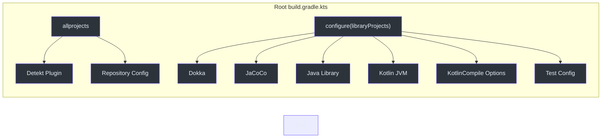
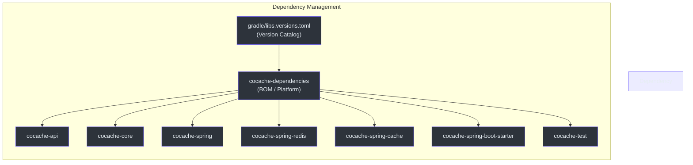
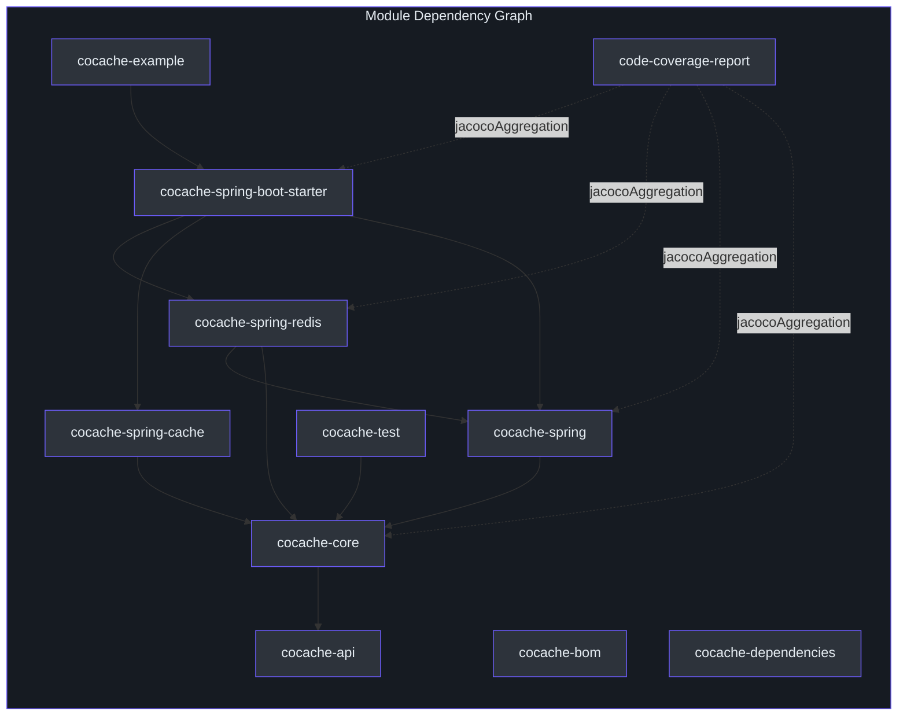
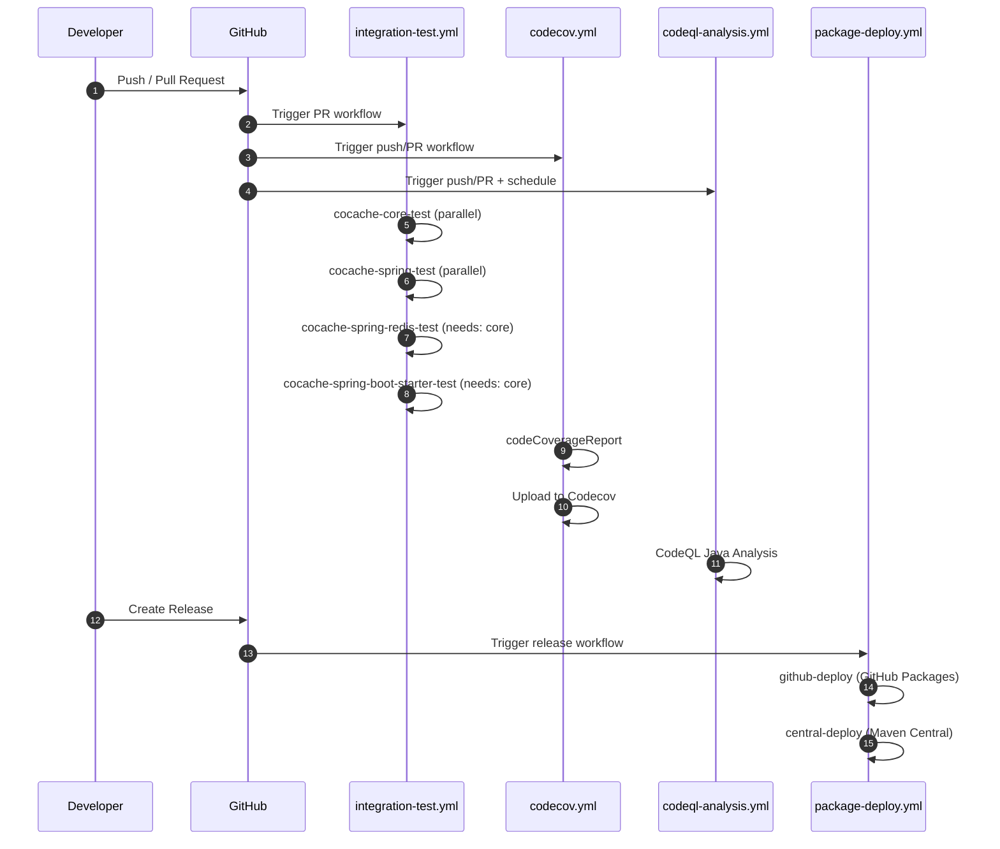
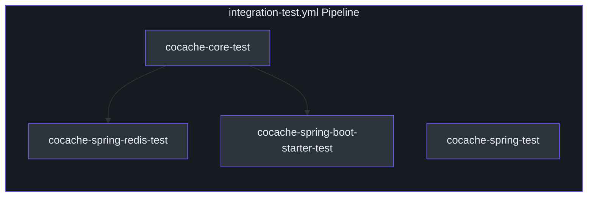

# Build & CI Overview

CoCache uses **Gradle 9.4.1** with the Kotlin DSL, targeting **JDK 17+** across all library modules. The build pipeline integrates Detekt for static analysis, Dokka for API documentation, JaCoCo for code coverage, and GitHub Actions for continuous integration and deployment.

## Gradle Setup

The root [`build.gradle.kts`](https://github.com/Ahoo-Wang/CoCache/blob/main/build.gradle.kts) applies shared configuration to all subprojects through `allprojects` and `configure` blocks. The [Gradle Version Catalog](https://github.com/Ahoo-Wang/CoCache/blob/main/gradle/libs.versions.toml) centralizes dependency versions.



### JDK 17 Toolchain

All library modules enforce JDK 17 via the Kotlin JVM toolchain configuration in the root build script:

```kotlin
// [build.gradle.kts:88-91](https://github.com/Ahoo-Wang/CoCache/blob/main/build.gradle.kts#L88-L91)
configure<KotlinJvmProjectExtension> {
    jvmToolchain {
        languageVersion.set(JavaLanguageVersion.of(17))
    }
}
```

The [`cocache-example`](https://github.com/Ahoo-Wang/CoCache/blob/main/cocache-example/build.gradle.kts) module also declares its own JDK 17 toolchain explicitly.

### Kotlin Compiler Flags

Two critical Kotlin compiler flags are applied to all library modules:

| Flag | Purpose | Source |
|------|---------|--------|
| `-Xjsr305=strict` | Enforces strict null-safety for JSR-305 annotated APIs (e.g., Spring, Guava) | [`build.gradle.kts:95`](https://github.com/Ahoo-Wang/CoCache/blob/main/build.gradle.kts#L95) |
| `-Xjvm-default=all-compatibility` | Generates default method implementations in interfaces for Java interoperability | [`build.gradle.kts:95`](https://github.com/Ahoo-Wang/CoCache/blob/main/build.gradle.kts#L95) |
| `javaParameters = true` | Stores method parameter names in bytecode for reflection-based tools | [`build.gradle.kts:96`](https://github.com/Ahoo-Wang/CoCache/blob/main/build.gradle.kts#L96) |

Java compilation also passes `-parameters` for consistent parameter name retention:

```kotlin
// [build.gradle.kts:99-101](https://github.com/Ahoo-Wang/CoCache/blob/main/build.gradle.kts#L99-L101)
tasks.withType<JavaCompile> {
    options.compilerArgs.addAll(listOf("-parameters"))
}
```

## Dependency Management

CoCache uses a two-tier dependency management strategy:



| Artifact | Role | Source |
|----------|------|--------|
| `cocache-dependencies` | Platform BOM aggregating Spring Boot, CoSid, fluent-assert, and library constraints | [`cocache-dependencies/build.gradle.kts`](https://github.com/Ahoo-Wang/CoCache/blob/main/cocache-dependencies/build.gradle.kts) |
| `cocache-bom` | Published BOM exposing all library modules as dependency constraints | [`cocache-bom/build.gradle.kts`](https://github.com/Ahoo-Wang/CoCache/blob/main/cocache-bom/build.gradle.kts) |
| `gradle/libs.versions.toml` | Version catalog defining all library and plugin versions | [`gradle/libs.versions.toml`](https://github.com/Ahoo-Wang/CoCache/blob/main/gradle/libs.versions.toml) |

All library modules import the platform via:

```kotlin
// [build.gradle.kts:111](https://github.com/Ahoo-Wang/CoCache/blob/main/build.gradle.kts#L111)
api(platform(dependenciesProject))
```

### Key Dependency Versions

| Dependency | Version | Source |
|------------|---------|--------|
| Kotlin | 2.3.20 | [`libs.versions.toml:14`](https://github.com/Ahoo-Wang/CoCache/blob/main/gradle/libs.versions.toml#L14) |
| Spring Boot | 4.0.5 | [`libs.versions.toml:3`](https://github.com/Ahoo-Wang/CoCache/blob/main/gradle/libs.versions.toml#L3) |
| CoSid | 3.2.0 | [`libs.versions.toml:4`](https://github.com/Ahoo-Wang/CoCache/blob/main/gradle/libs.versions.toml#L4) |
| Detekt | 1.23.8 | [`libs.versions.toml:13`](https://github.com/Ahoo-Wang/CoCache/blob/main/gradle/libs.versions.toml#L13) |
| Dokka | 2.2.0 | [`libs.versions.toml:14`](https://github.com/Ahoo-Wang/CoCache/blob/main/gradle/libs.versions.toml#L14) |
| JUnit | 6.0.3 | [`libs.versions.toml:9`](https://github.com/Ahoo-Wang/CoCache/blob/main/gradle/libs.versions.toml#L9) |
| fluent-assert | 0.2.6 | [`libs.versions.toml:10`](https://github.com/Ahoo-Wang/CoCache/blob/main/gradle/libs.versions.toml#L10) |
| mockk | 1.14.9 | [`libs.versions.toml:11`](https://github.com/Ahoo-Wang/CoCache/blob/main/gradle/libs.versions.toml#L11) |

## Module Build Graph

The following diagram shows the inter-module dependency relationships:



The root build script classifies projects into logical groups for configuration:

| Group | Projects | Purpose | Source |
|-------|----------|---------|--------|
| `bomProjects` | `cocache-bom`, `cocache-dependencies` | Java Platform (BOM) modules | [`build.gradle.kts:29-32`](https://github.com/Ahoo-Wang/CoCache/blob/main/build.gradle.kts#L29-L32) |
| `serverProjects` | `cocache-example` | Non-published application modules | [`build.gradle.kts:34-36`](https://github.com/Ahoo-Wang/CoCache/blob/main/build.gradle.kts#L34-L36) |
| `libraryProjects` | All others minus BOMs and server | Published library modules with Dokka, JaCoCo, and publishing | [`build.gradle.kts:44-46`](https://github.com/Ahoo-Wang/CoCache/blob/main/build.gradle.kts#L44-L46) |

## Quality Tooling

### Detekt (Static Analysis)

Detekt is applied to **all projects** (including BOM and server modules) via the `allprojects` block. Configuration is centralized at [`config/detekt/detekt.yml`](https://github.com/Ahoo-Wang/CoCache/blob/main/config/detekt/detekt.yml).

```kotlin
// [build.gradle.kts:54-59](https://github.com/Ahoo-Wang/CoCache/blob/main/build.gradle.kts#L54-L59)
allprojects {
    apply<DetektPlugin>()
    configure<DetektExtension> {
        config.setFrom(files("${rootProject.rootDir}/config/detekt/detekt.yml"))
        buildUponDefaultConfig = true
        autoCorrect = true
    }
}
```

Key Detekt configuration overrides:

| Rule | Setting | Source |
|------|---------|--------|
| `LongParameterList` | disabled | [`detekt.yml:3`](https://github.com/Ahoo-Wang/CoCache/blob/main/config/detekt/detekt.yml#L3) |
| `TooManyFunctions` | disabled | [`detekt.yml:5`](https://github.com/Ahoo-Wang/CoCache/blob/main/config/detekt/detekt.yml#L5) |
| `MaxLineLength` | 300 | [`detekt.yml:10`](https://github.com/Ahoo-Wang/CoCache/blob/main/config/detekt/detekt.yml#L10) |
| `ReturnCount` | disabled | [`detekt.yml:12`](https://github.com/Ahoo-Wang/CoCache/blob/main/config/detekt/detekt.yml#L12) |
| `MagicNumber` | disabled | [`detekt.yml:18`](https://github.com/Ahoo-Wang/CoCache/blob/main/config/detekt/detekt.yml#L18) |
| `UnusedPrivateMember` | disabled | [`detekt.yml:15`](https://github.com/Ahoo-Wang/CoCache/blob/main/config/detekt/detekt.yml#L15) |
| `WildcardImport` | allows `java.util.*` | [`detekt.yml:21-24`](https://github.com/Ahoo-Wang/CoCache/blob/main/config/detekt/detekt.yml#L21-L24) |

The `detekt-formatting` plugin (from [`cocache-dependencies`](https://github.com/Ahoo-Wang/CoCache/blob/main/cocache-dependencies/build.gradle.kts)) is also applied to all projects, enforcing consistent code formatting.

### Dokka (API Documentation)

Dokka is applied to all library projects to generate Kotlin/Java API documentation:

```kotlin
// [build.gradle.kts:80](https://github.com/Ahoo-Wang/CoCache/blob/main/build.gradle.kts#L80)
apply<DokkaPlugin>()
```

All library modules also generate `javadocJar` and `sourcesJar` for Maven publication:

```kotlin
// [build.gradle.kts:83-86](https://github.com/Ahoo-Wang/CoCache/blob/main/build.gradle.kts#L83-L86)
configure<JavaPluginExtension> {
    withJavadocJar()
    withSourcesJar()
}
```

### JaCoCo (Code Coverage)

JaCoCo is applied to all library projects for per-module coverage. The [`code-coverage-report`](https://github.com/Ahoo-Wang/CoCache/blob/main/code-coverage-report/build.gradle.kts) module uses `jacoco-report-aggregation` to produce an aggregated coverage report across all library modules.

```kotlin
// [code-coverage-report/build.gradle.kts:20-26](https://github.com/Ahoo-Wang/CoCache/blob/main/code-coverage-report/build.gradle.kts#L20-L26)
val libraryProjects = rootProject.ext.get("libraryProjects") as Iterable<Project>
dependencies {
    libraryProjects.forEach {
        jacocoAggregation(it)
    }
}
```

A custom Logback configuration ([`config/logback.xml`](https://github.com/Ahoo-Wang/CoCache/blob/main/config/logback.xml)) is injected into all test tasks to ensure JaCoCo captures all logging output correctly:

```kotlin
// [build.gradle.kts:108](https://github.com/Ahoo-Wang/CoCache/blob/main/build.gradle.kts#L108)
jvmArgs = listOf("-Dlogback.configurationFile=${rootProject.rootDir}/config/logback.xml")
```

The [`codecov.yml`](https://github.com/Ahoo-Wang/CoCache/blob/main/codecov.yml) configuration targets 60% coverage with a 1% threshold for both patch and project metrics, ignoring the `cocache-test` and `cocache-example` modules.

## Build Commands

| Command | Purpose | Notes |
|---------|---------|-------|
| `./gradlew build -x test` | Full build without tests | Fast compilation check |
| `./gradlew check` | Full check: tests + Detekt + Dokka | Used in CI for reproducible validation |
| `./gradlew clean check` | Clean full check | Recommended for CI to ensure reproducibility |
| `./gradlew test` | Run all tests | JUnit 5 via Jupiter engine |
| `./gradlew :cocache-core:test` | Test a specific module | Prefix with `:` for module targeting |
| `./gradlew :cocache-core:test --tests "me.ahoo.cache.proxy.ProxyCacheTest"` | Run a single test class | Full qualified class name |
| `./gradlew detekt` | Run Detekt analysis only | Static analysis without build |
| `./gradlew detektAutoFix` | Run Detekt with auto-fix | Applies safe formatting corrections |
| `./gradlew codeCoverageReport` | Generate aggregated JaCoCo report | Used by Codecov workflow |
| `./gradlew publishToMavenLocal` | Publish to local Maven repo | For local integration testing |

## Test Configuration

All library modules configure JUnit 5 (Jupiter) as the test platform with full exception logging:

```kotlin
// [build.gradle.kts:102-109](https://github.com/Ahoo-Wang/CoCache/blob/main/build.gradle.kts#L102-L109)
tasks.withType<Test> {
    useJUnitPlatform()
    testLogging {
        exceptionFormat = TestExceptionFormat.FULL
    }
    jvmArgs = listOf("-Dlogback.configurationFile=${rootProject.rootDir}/config/logback.xml")
}
```

Test dependencies injected to all library modules:

| Dependency | Purpose | Source |
|------------|---------|--------|
| `junit-jupiter-api` | JUnit 5 test API | [`build.gradle.kts:116`](https://github.com/Ahoo-Wang/CoCache/blob/main/build.gradle.kts#L116) |
| `junit-jupiter-params` | Parameterized test support | [`build.gradle.kts:117`](https://github.com/Ahoo-Wang/CoCache/blob/main/build.gradle.kts#L117) |
| `fluent-assert-core` | Fluent assertion DSL for Kotlin | [`build.gradle.kts:118`](https://github.com/Ahoo-Wang/CoCache/blob/main/build.gradle.kts#L118) |
| `mockk` | Kotlin mocking framework | [`build.gradle.kts:119`](https://github.com/Ahoo-Wang/CoCache/blob/main/build.gradle.kts#L119) |
| `logback-classic` | Logging implementation for tests | [`build.gradle.kts:115`](https://github.com/Ahoo-Wang/CoCache/blob/main/build.gradle.kts#L115) |
| `junit-platform-launcher` | JUnit runtime launcher | [`build.gradle.kts:122`](https://github.com/Ahoo-Wang/CoCache/blob/main/build.gradle.kts#L122) |
| `junit-jupiter-engine` | JUnit test engine | [`build.gradle.kts:123`](https://github.com/Ahoo-Wang/CoCache/blob/main/build.gradle.kts#L123) |

## CI/CD Pipelines

All workflows are defined in [`.github/workflows/`](https://github.com/Ahoo-Wang/CoCache/blob/main/.github/workflows/).



### Integration Test (`integration-test.yml`)

Triggered on every pull request. Runs four parallel jobs with dependency ordering:

| Job | Depends On | Redis Service | Source |
|-----|------------|---------------|--------|
| `cocache-core-test` | -- | No | [`integration-test.yml:17-32`](https://github.com/Ahoo-Wang/CoCache/blob/main/.github/workflows/integration-test.yml#L17-L32) |
| `cocache-spring-test` | -- | No | [`integration-test.yml:33-49`](https://github.com/Ahoo-Wang/CoCache/blob/main/.github/workflows/integration-test.yml#L33-L49) |
| `cocache-spring-redis-test` | `cocache-core-test` | Yes (port 6379) | [`integration-test.yml:51-78`](https://github.com/Ahoo-Wang/CoCache/blob/main/.github/workflows/integration-test.yml#L51-L78) |
| `cocache-spring-boot-starter-test` | `cocache-core-test` | Yes (port 6379) | [`integration-test.yml:80-107`](https://github.com/Ahoo-Wang/CoCache/blob/main/.github/workflows/integration-test.yml#L80-L107) |



Redis-dependent tests use a GitHub Actions service container with health checks:

```yaml
# [integration-test.yml:56-65](https://github.com/Ahoo-Wang/CoCache/blob/main/.github/workflows/integration-test.yml#L56-L65)
services:
  redis:
    image: redis
    options: >-
      --health-cmd "redis-cli ping"
      --health-interval 10s
      --health-timeout 5s
      --health-retries 5
    ports:
      - 6379:6379
```

### Codecov (`codecov.yml`)

Triggered on push and pull request. Runs the full `codeCoverageReport` task with a Redis service, then uploads the aggregated JaCoCo XML report to Codecov.

| Step | Detail | Source |
|------|--------|--------|
| Build | `./gradlew codeCoverageReport --stacktrace` | [`codecov.yml:30`](https://github.com/Ahoo-Wang/CoCache/blob/main/.github/workflows/codecov.yml#L30) |
| Upload | `codecov/codecov-action@v6` with `CODECOV_TOKEN` | [`codecov.yml:33`](https://github.com/Ahoo-Wang/CoCache/blob/main/.github/workflows/codecov.yml#L33) |
| Report Path | `./code-coverage-report/build/reports/jacoco/codeCoverageReport/codeCoverageReport.xml` | [`codecov.yml:41`](https://github.com/Ahoo-Wang/CoCache/blob/main/.github/workflows/codecov.yml#L41) |

### CodeQL Analysis (`codeql-analysis.yml`)

Triggered on push/PR to `main` and weekly schedule (Friday 09:17 UTC). Performs static security analysis for Java using GitHub CodeQL.

| Trigger | Schedule | Source |
|---------|----------|--------|
| Push to `main` | Immediate | [`codeql-analysis.yml:15`](https://github.com/Ahoo-Wang/CoCache/blob/main/.github/workflows/codeql-analysis.yml#L15) |
| PR to `main` | Immediate | [`codeql-analysis.yml:17`](https://github.com/Ahoo-Wang/CoCache/blob/main/.github/workflows/codeql-analysis.yml#L17) |
| Cron | `17 9 * * 5` (Fridays) | [`codeql-analysis.yml:20`](https://github.com/Ahoo-Wang/CoCache/blob/main/.github/workflows/codeql-analysis.yml#L20) |

### Package Deploy (`package-deploy.yml`)

Triggered on GitHub release creation. Runs two parallel jobs:

| Job | Target | Command | Source |
|-----|--------|---------|--------|
| `github-deploy` | GitHub Packages | `./gradlew publishAllPublicationsToGitHubPackagesRepository` | [`package-deploy.yml:37`](https://github.com/Ahoo-Wang/CoCache/blob/main/.github/workflows/package-deploy.yml#L37) |
| `central-deploy` | Maven Central (Sonatype) | `./gradlew publishToSonatype closeAndReleaseSonatypeStagingRepository` | [`package-deploy.yml:59`](https://github.com/Ahoo-Wang/CoCache/blob/main/.github/workflows/package-deploy.yml#L59) |

Both jobs require JDK 17 (Temurin) and use PGP signing with CI-injected secrets.

## Manifold Configuration

The Gradle wrapper is pinned to Gradle 9.4.1:

```properties
# [gradle-wrapper.properties:3](https://github.com/Ahoo-Wang/CoCache/blob/main/gradle/wrapper/gradle-wrapper.properties#L3)
distributionUrl=https\://services.gradle.org/distributions/gradle-9.4.1-bin.zip
```

The [`settings.gradle.kts`](https://github.com/Ahoo-Wang/CoCache/blob/main/settings.gradle.kts) uses the `foojay-resolver-convention` plugin (v1.0.0) for automatic JDK toolchain resolution.

## Related Pages

- [Contributing Guide](/building/contributing) -- Code style, testing requirements, and PR workflow
- [Publishing & Release](/building/publishing) -- Maven Central publishing and release pipeline
- [Testing](/testing/) -- Test specifications and patterns
- [Architecture](/architecture/) -- System architecture overview
