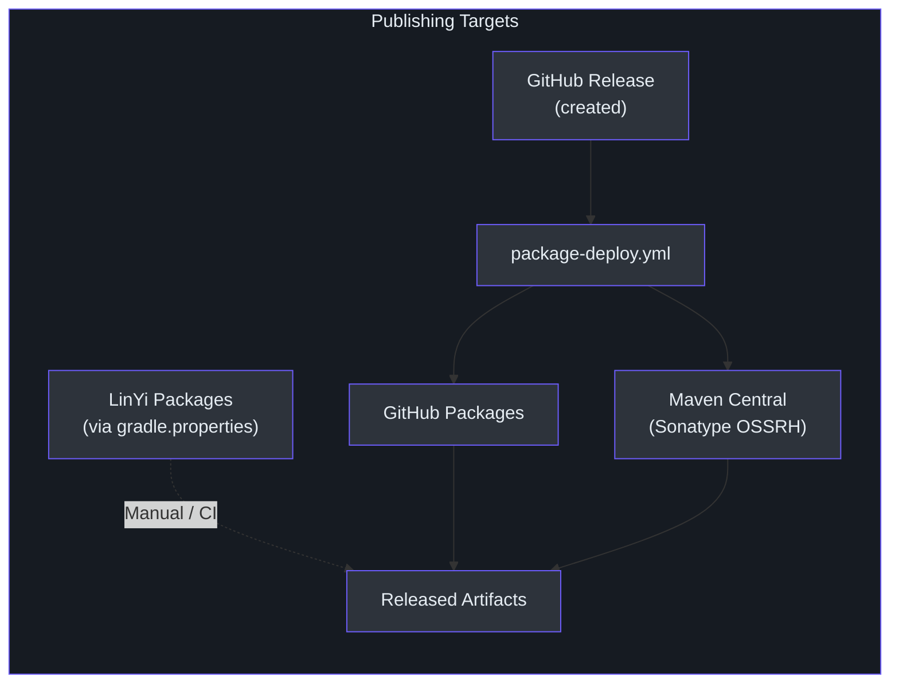
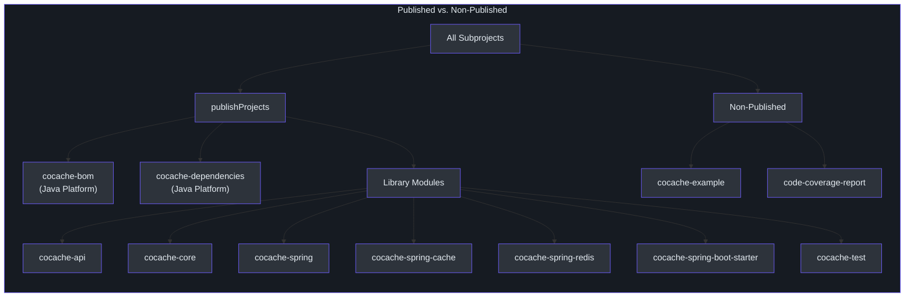
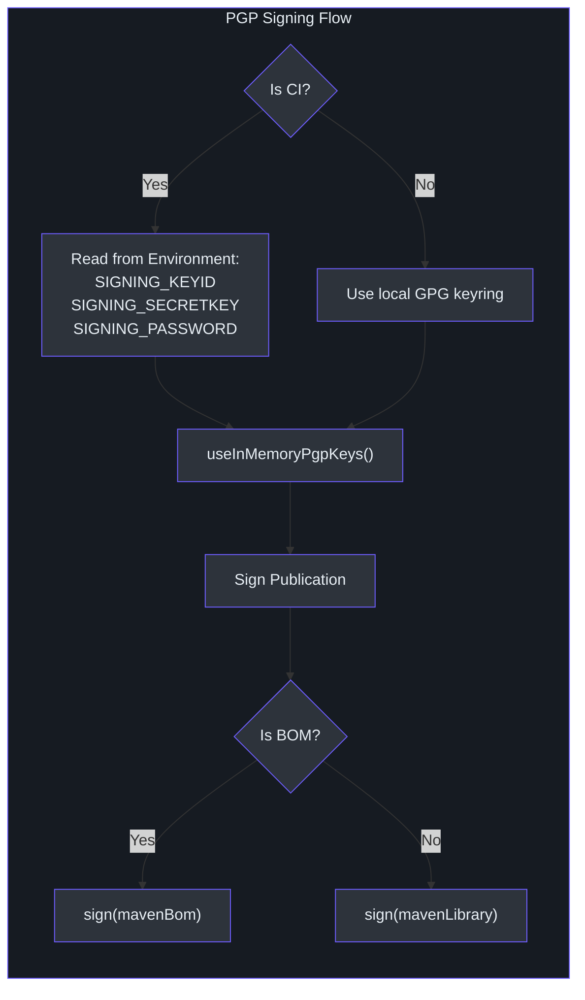
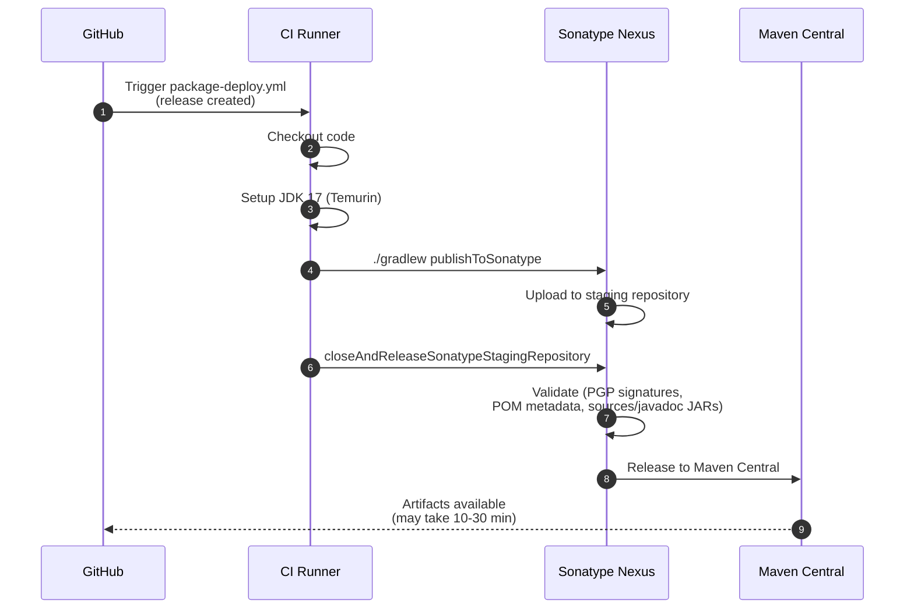
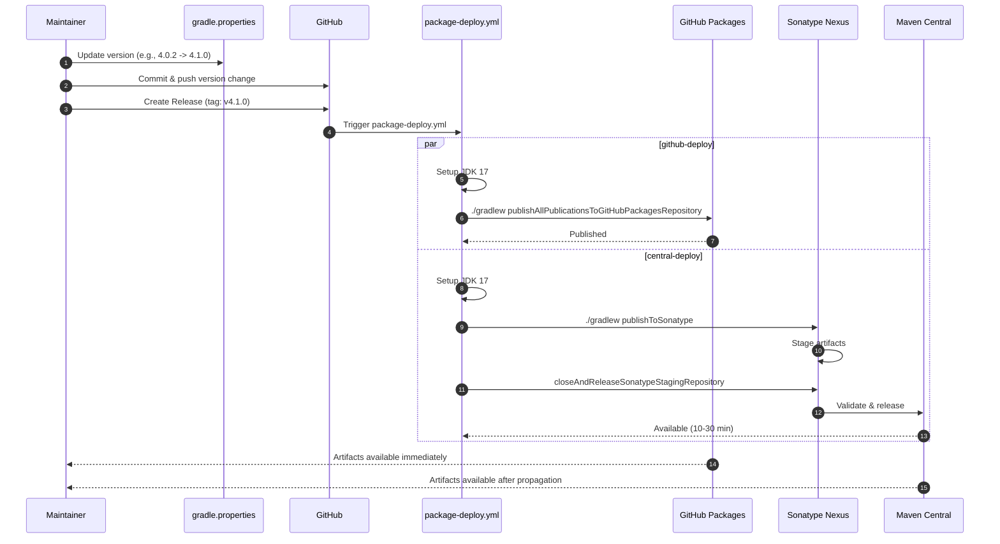

# Publishing & Release

CoCache publishes to three Maven repositories: **Maven Central** (via Sonatype), **GitHub Packages**, and **LinYi Packages**. Publishing is automated through the [`package-deploy.yml`](https://github.com/Ahoo-Wang/CoCache/blob/main/.github/workflows/package-deploy.yml) GitHub Actions workflow, triggered when a GitHub Release is created.

## Publishing Targets



| Repository | URL | Authentication | Source |
|------------|-----|----------------|--------|
| GitHub Packages | `https://maven.pkg.github.com/Ahoo-Wang/CoCache` | `GITHUB_ACTOR` + `GITHUB_TOKEN` | [`build.gradle.kts:138-144`](https://github.com/Ahoo-Wang/CoCache/blob/main/build.gradle.kts#L138-L144) |
| Maven Central | `https://ossrh-staging-api.central.sonatype.com/service/local/` | `SONATYPE_USERNAME` + `SONATYPE_PASSWORD` | [`build.gradle.kts:208-215`](https://github.com/Ahoo-Wang/CoCache/blob/main/build.gradle.kts#L208-L215) |
| LinYi Packages | From `linyiPackageReleaseUrl` property | `linyiPackageUsername` + `linyiPackagePwd` | [`build.gradle.kts:145-152`](https://github.com/Ahoo-Wang/CoCache/blob/main/build.gradle.kts#L145-L152) |

## Published Modules

All modules except `cocache-example` and `code-coverage-report` are published. The root build script defines this partition:

```kotlin
// [build.gradle.kts:44](https://github.com/Ahoo-Wang/CoCache/blob/main/build.gradle.kts#L44)
val publishProjects = subprojects - serverProjects - codeCoverageReportProject
```



Published modules include `javadocJar` and `sourcesJar` artifacts, required by Maven Central:

```kotlin
// [build.gradle.kts:83-86](https://github.com/Ahoo-Wang/CoCache/blob/main/build.gradle.kts#L83-L86)
configure<JavaPluginExtension> {
    withJavadocJar()
    withSourcesJar()
}
```

## Maven Publication Structure

Each published module creates one of two publication types depending on its nature:

| Module Type | Publication Name | Component | Source |
|-------------|-----------------|-----------|--------|
| BOM (Platform) | `mavenBom` | `javaPlatform` | [`build.gradle.kts:155-156`](https://github.com/Ahoo-Wang/CoCache/blob/main/build.gradle.kts#L155-L156) |
| Library | `mavenLibrary` | `java` | [`build.gradle.kts:155-156`](https://github.com/Ahoo-Wang/CoCache/blob/main/build.gradle.kts#L155-L156) |

All publications include standardized POM metadata:

```kotlin
// [build.gradle.kts:157-189](https://github.com/Ahoo-Wang/CoCache/blob/main/build.gradle.kts#L157-L189)
pom {
    name.set(rootProject.name)
    description.set(getPropertyOf("description"))
    url.set(getPropertyOf("website"))
    // ... license, developer, SCM metadata from gradle.properties
}
```

The POM properties are sourced from [`gradle.properties`](https://github.com/Ahoo-Wang/CoCache/blob/main/gradle.properties):

| Property | Value | Source |
|----------|-------|--------|
| `group` | `me.ahoo.cocache` | [`gradle.properties:14`](https://github.com/Ahoo-Wang/CoCache/blob/main/gradle.properties#L14) |
| `version` | `4.0.2` | [`gradle.properties:15`](https://github.com/Ahoo-Wang/CoCache/blob/main/gradle.properties#L15) |
| `description` | `Level 2 Distributed Coherence Cache Framework` | [`gradle.properties:17`](https://github.com/Ahoo-Wang/CoCache/blob/main/gradle.properties#L17) |
| `website` | `https://github.com/Ahoo-Wang/CoCache` | [`gradle.properties:18`](https://github.com/Ahoo-Wang/CoCache/blob/main/gradle.properties#L18) |
| `license_name` | `The Apache Software License, Version 2.0` | [`gradle.properties:22`](https://github.com/Ahoo-Wang/CoCache/blob/main/gradle.properties#L22) |

## Version Management

The project version is defined centrally in [`gradle.properties`](https://github.com/Ahoo-Wang/CoCache/blob/main/gradle.properties):

```properties
# [gradle.properties:15](https://github.com/Ahoo-Wang/CoCache/blob/main/gradle.properties#L15)
version=4.0.2
```

All published artifacts share this version. To prepare a release:

1. Update the `version` property in `gradle.properties`
2. Commit the version change
3. Create a GitHub Release with a matching tag (e.g., `v4.0.2`)

The version is automatically stamped into JAR manifests:

```kotlin
// [build.gradle.kts:65-68](https://github.com/Ahoo-Wang/CoCache/blob/main/build.gradle.kts#L65-L68)
tasks.withType<Jar> {
    manifest {
        attributes["Implementation-Title"] = project.name
        attributes["Implementation-Version"] = project.version
    }
}
```

## PGP Signing

All published artifacts are PGP-signed. The signing configuration adapts between local development and CI:

```kotlin
// [build.gradle.kts:192-205](https://github.com/Ahoo-Wang/CoCache/blob/main/build.gradle.kts#L192-L205)
configure<SigningExtension> {
    val isInCI = null != System.getenv("CI")
    if (isInCI) {
        val signingKeyId = System.getenv("SIGNING_KEYID")
        val signingKey = System.getenv("SIGNING_SECRETKEY")
        val signingPassword = System.getenv("SIGNING_PASSWORD")
        useInMemoryPgpKeys(signingKeyId, signingKey, signingPassword)
    }
    if (isBom) {
        sign(publishing.publications.get("mavenBom"))
    } else {
        sign(publishing.publications.get("mavenLibrary"))
    }
}
```



### Required CI Secrets

| Secret | Purpose | Used By |
|--------|---------|---------|
| `SIGNING_KEYID` | PGP key identifier | Both `github-deploy` and `central-deploy` jobs |
| `SIGNING_SECRETKEY` | PGP private key (ASCII-armored) | Both `github-deploy` and `central-deploy` jobs |
| `SIGNING_PASSWORD` | PGP key passphrase | Both `github-deploy` and `central-deploy` jobs |
| `SONATYPE_USERNAME` | Sonatype OSSRH username | `central-deploy` job only |
| `SONATYPE_PASSWORD` | Sonatype OSSRH password | `central-deploy` job only |
| `GITHUB_TOKEN` | GitHub Packages access | `github-deploy` job (auto-provided) |

## Nexus Publishing (Maven Central)

CoCache uses the [`io.github.gradle-nexus.publish-plugin`](https://github.com/Ahoo-Wang/CoCache/blob/main/gradle/libs.versions.toml#L16) (v2.0.0) to publish to Maven Central via Sonatype's OSSRH staging API.

```kotlin
// [build.gradle.kts:208-216](https://github.com/Ahoo-Wang/CoCache/blob/main/build.gradle.kts#L208-L216)
nexusPublishing {
    repositories {
        sonatype {
            nexusUrl.set(uri("https://ossrh-staging-api.central.sonatype.com/service/local/"))
            username.set(System.getenv("SONATYPE_USERNAME"))
            password.set(System.getenv("SONATYPE_PASSWORD"))
        }
    }
}
```

The Maven Central publishing process involves a staging workflow:



### Maven Central Requirements

Maven Central enforces strict requirements that CoCache satisfies:

| Requirement | How CoCache Meets It | Source |
|-------------|---------------------|--------|
| PGP signatures | All publications signed via `SigningExtension` | [`build.gradle.kts:192-205`](https://github.com/Ahoo-Wang/CoCache/blob/main/build.gradle.kts#L192-L205) |
| Sources JAR | `withSourcesJar()` on all library modules | [`build.gradle.kts:84`](https://github.com/Ahoo-Wang/CoCache/blob/main/build.gradle.kts#L84) |
| Javadoc JAR | `withJavadocJar()` on all library modules (Dokka generates Kotlin docs) | [`build.gradle.kts:85`](https://github.com/Ahoo-Wang/CoCache/blob/main/build.gradle.kts#L85) |
| POM metadata | `name`, `description`, `url`, `licenses`, `developers`, `scm` | [`build.gradle.kts:159-188`](https://github.com/Ahoo-Wang/CoCache/blob/main/build.gradle.kts#L159-L188) |
| Group ID ownership | `me.ahoo.cocache` verified via Sonatype namespace | [`gradle.properties:14`](https://github.com/Ahoo-Wang/CoCache/blob/main/gradle.properties#L14) |

## GitHub Packages

GitHub Packages provides a secondary distribution channel, tightly integrated with the GitHub repository.

```kotlin
// [build.gradle.kts:138-144](https://github.com/Ahoo-Wang/CoCache/blob/main/build.gradle.kts#L138-L144)
maven {
    name = "GitHubPackages"
    url = uri("https://maven.pkg.github.com/Ahoo-Wang/CoCache")
    credentials {
        username = System.getenv("GITHUB_ACTOR")
        password = System.getenv("GITHUB_TOKEN")
    }
}
```

The `github-deploy` job publishes all publications:

```yaml
# [package-deploy.yml:37-38](https://github.com/Ahoo-Wang/CoCache/blob/main/.github/workflows/package-deploy.yml#L37-L38)
- name: Publish package
  run: ./gradlew publishAllPublicationsToGitHubPackagesRepository
```

### Consuming from GitHub Packages

```kotlin
// build.gradle.kts (consumer project)
repositories {
    maven {
        url = uri("https://maven.pkg.github.com/Ahoo-Wang/CoCache")
        credentials {
            username = project.findProperty("gpr.user") as String? ?: System.getenv("GITHUB_ACTOR")
            password = project.findProperty("gpr.key") as String? ?: System.getenv("GITHUB_TOKEN")
        }
    }
}
```

## LinYi Packages

LinYi Packages is a private Maven repository. Configuration is read from `gradle.properties` (not committed to the repository):

```kotlin
// [build.gradle.kts:145-152](https://github.com/Ahoo-Wang/CoCache/blob/main/build.gradle.kts#L145-L152)
maven {
    name = "LinYiPackages"
    url = uri(project.properties["linyiPackageReleaseUrl"].toString())
    credentials {
        username = project.properties["linyiPackageUsername"]?.toString()
        password = project.properties["linyiPackagePwd"]?.toString()
    }
}
```

These properties are expected to be defined in the developer's local `~/.gradle/gradle.properties` or via environment variables:

| Property | Description |
|----------|-------------|
| `linyiPackageReleaseUrl` | Repository URL |
| `linyiPackageUsername` | Repository username |
| `linyiPackagePwd` | Repository password |

## Release Workflow

The complete release lifecycle from version bump to artifact availability:



### Step-by-Step Release Process

1. **Update version** in [`gradle.properties`](https://github.com/Ahoo-Wang/CoCache/blob/main/gradle.properties):
   ```properties
   version=4.1.0
   ```
2. **Commit** the version change and push to `main`
3. **Create a GitHub Release** with a tag matching `v<version>` (e.g., `v4.1.0`)
4. **Wait for CI**: The `package-deploy.yml` workflow triggers automatically
5. **Verify** artifacts appear on GitHub Packages and Maven Central

## Local Publishing

For local development and testing, publish to the local Maven repository:

```bash
# Publish all modules to ~/.m2/repository
./gradlew publishToMavenLocal
```

This publishes artifacts at version `<current-version>-SNAPSHOT` (or the exact version from `gradle.properties`) to `~/.m2/repository`, allowing other local projects to consume the latest CoCache artifacts without a formal release.

### Project Build Repository

A local build directory repository is also configured for build-time artifact exchange:

```kotlin
// [build.gradle.kts:133-136](https://github.com/Ahoo-Wang/CoCache/blob/main/build.gradle.kts#L133-L136)
maven {
    name = "projectBuildRepo"
    url = uri(layout.buildDirectory.dir("repos"))
}
```

Publish to this repository with:

```bash
./gradlew publishAllPublicationsToProjectBuildRepoRepository
```

## Related Pages

- [Build & CI Overview](/building/) -- Build system, Gradle setup, and quality tooling
- [Contributing Guide](/building/contributing) -- Code style, testing, and PR workflow
- [Modules](/modules/) -- Module architecture and responsibilities
- [Architecture](/architecture/) -- System architecture overview
