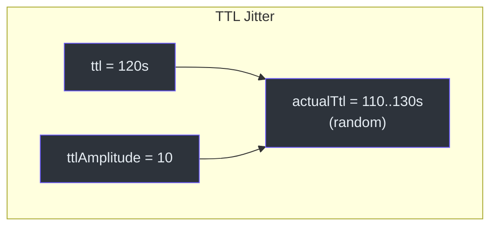
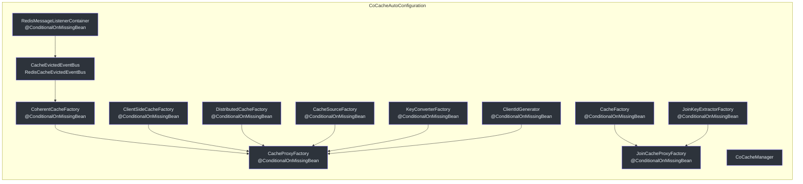
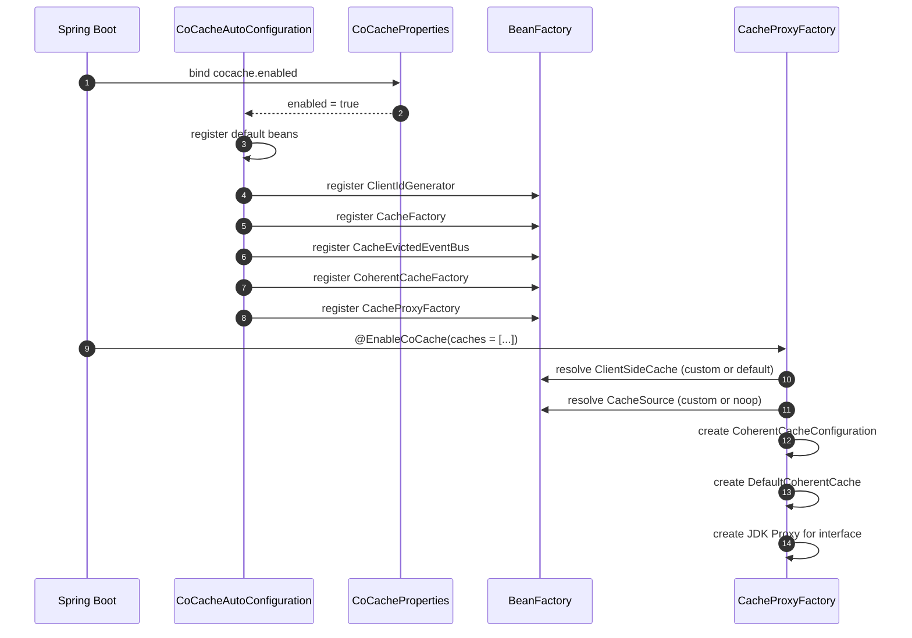

# Configuration Reference

This page covers all configuration options available in CoCache, from annotation parameters to Spring Boot properties and custom bean overrides.

## @CoCache Annotation

The `@CoCache` annotation marks a cache interface for proxy-based implementation. It configures the distributed cache layer behavior.

| Parameter | Type | Default | Description | Source |
|-----------|------|---------|-------------|--------|
| `name` | `String` | `""` (interface name) | Cache name used for event matching and bean naming | [CoCache.kt:30](https://github.com/Ahoo-Wang/CoCache/blob/main/cocache-api/src/main/kotlin/me/ahoo/cache/api/annotation/CoCache.kt#L30) |
| `keyPrefix` | `String` | `""` | Prefix prepended to all cache keys in the distributed layer | [CoCache.kt:31](https://github.com/Ahoo-Wang/CoCache/blob/main/cocache-api/src/main/kotlin/me/ahoo/cache/api/annotation/CoCache.kt#L31) |
| `keyExpression` | `String` | `""` | SpEL expression for key derivation | [CoCache.kt:33](https://github.com/Ahoo-Wang/CoCache/blob/main/cocache-api/src/main/kotlin/me/ahoo/cache/api/annotation/CoCache.kt#L33) |
| `ttl` | `Long` | `Long.MAX_VALUE` | Time-to-live in the unit specified by the cache implementation (seconds for Redis) | [CoCache.kt:35](https://github.com/Ahoo-Wang/CoCache/blob/main/cocache-api/src/main/kotlin/me/ahoo/cache/api/annotation/CoCache.kt#L35) |
| `ttlAmplitude` | `Long` | `10` | Random jitter range added/subtracted from TTL to prevent cache avalanche | [CoCache.kt:36](https://github.com/Ahoo-Wang/CoCache/blob/main/cocache-api/src/main/kotlin/me/ahoo/cache/api/annotation/CoCache.kt#L36) |

### TTL Jitter Mechanism

The `ttlAmplitude` parameter prevents cache avalanche (many keys expiring simultaneously) by randomizing the actual TTL:

```
actualTtl = ttl + random(-ttlAmplitude, +ttlAmplitude)
```



Source: [ComputedTtlAt.kt:49-56](https://github.com/Ahoo-Wang/CoCache/blob/main/cocache-core/src/main/kotlin/me/ahoo/cache/ComputedTtlAt.kt#L49-L56)

### Example

```kotlin
@CoCache(keyPrefix = "user:", ttl = 120, ttlAmplitude = 10)
interface UserCache : Cache<String, User>
```

## @GuavaCache Annotation

Configures a Guava-based `ClientSideCache` (L2 local cache).

| Parameter | Type | Default | Description | Source |
|-----------|------|---------|-------------|--------|
| `initialCapacity` | `Int` | `-1` (unset) | Initial capacity of the Guava cache | [GuavaCache.kt:30](https://github.com/Ahoo-Wang/CoCache/blob/main/cocache-api/src/main/kotlin/me/ahoo/cache/api/annotation/GuavaCache.kt#L30) |
| `concurrencyLevel` | `Int` | `-1` (unset) | Number of concurrent updates the cache can handle | [GuavaCache.kt:31](https://github.com/Ahoo-Wang/CoCache/blob/main/cocache-api/src/main/kotlin/me/ahoo/cache/api/annotation/GuavaCache.kt#L31) |
| `maximumSize` | `Long` | `-1` (unset) | Maximum number of entries the cache may hold | [GuavaCache.kt:32](https://github.com/Ahoo-Wang/CoCache/blob/main/cocache-api/src/main/kotlin/me/ahoo/cache/api/annotation/GuavaCache.kt#L32) |
| `expireUnit` | `TimeUnit` | `TimeUnit.SECONDS` | Time unit for `expireAfterWrite` and `expireAfterAccess` | [GuavaCache.kt:33](https://github.com/Ahoo-Wang/CoCache/blob/main/cocache-api/src/main/kotlin/me/ahoo/cache/api/annotation/GuavaCache.kt#L33) |
| `expireAfterWrite` | `Long` | `-1` (unset) | Duration after write before entry expires | [GuavaCache.kt:34](https://github.com/Ahoo-Wang/CoCache/blob/main/cocache-api/src/main/kotlin/me/ahoo/cache/api/annotation/GuavaCache.kt#L34) |
| `expireAfterAccess` | `Long` | `-1` (unset) | Duration after last access before entry expires | [GuavaCache.kt:35](https://github.com/Ahoo-Wang/CoCache/blob/main/cocache-api/src/main/kotlin/me/ahoo/cache/api/annotation/GuavaCache.kt#L35) |

## @CaffeineCache Annotation

Configures a Caffeine-based `ClientSideCache` (L2 local cache).

| Parameter | Type | Default | Description | Source |
|-----------|------|---------|-------------|--------|
| `initialCapacity` | `Int` | `-1` (unset) | Initial capacity of the Caffeine cache | [CaffeineCache.kt:31](https://github.com/Ahoo-Wang/CoCache/blob/main/cocache-api/src/main/kotlin/me/ahoo/cache/api/annotation/CaffeineCache.kt#L31) |
| `maximumSize` | `Long` | `-1` (unset) | Maximum number of entries the cache may hold | [CaffeineCache.kt:32](https://github.com/Ahoo-Wang/CoCache/blob/main/cocache-api/src/main/kotlin/me/ahoo/cache/api/annotation/CaffeineCache.kt#L32) |
| `expireUnit` | `TimeUnit` | `TimeUnit.SECONDS` | Time unit for expiration settings | [CaffeineCache.kt:33](https://github.com/Ahoo-Wang/CoCache/blob/main/cocache-api/src/main/kotlin/me/ahoo/cache/api/annotation/CaffeineCache.kt#L33) |
| `expireAfterWrite` | `Long` | `-1` (unset) | Duration after write before entry expires | [CaffeineCache.kt:34](https://github.com/Ahoo-Wang/CoCache/blob/main/cocache-api/src/main/kotlin/me/ahoo/cache/api/annotation/CaffeineCache.kt#L34) |
| `expireAfterAccess` | `Long` | `-1` (unset) | Duration after last access before entry expires | [CaffeineCache.kt:35](https://github.com/Ahoo-Wang/CoCache/blob/main/cocache-api/src/main/kotlin/me/ahoo/cache/api/annotation/CaffeineCache.kt#L35) |

## @JoinCacheable Annotation

Marks a cache interface as a `JoinCache` that composes two cached values.

| Parameter | Type | Default | Description | Source |
|-----------|------|---------|-------------|--------|
| `firstCacheName` | `String` | `""` | Name of the primary cache to retrieve the first value | [JoinCacheable.kt](https://github.com/Ahoo-Wang/CoCache/blob/main/cocache-api/src/main/kotlin/me/ahoo/cache/api/annotation/JoinCacheable.kt) |
| `joinCacheName` | `String` | `""` | Name of the secondary cache to retrieve the joined value | [JoinCacheable.kt](https://github.com/Ahoo-Wang/CoCache/blob/main/cocache-api/src/main/kotlin/me/ahoo/cache/api/annotation/JoinCacheable.kt) |
| `joinKeyExpression` | `String` | `""` | SpEL expression to extract the join key from the first value | [JoinCacheable.kt](https://github.com/Ahoo-Wang/CoCache/blob/main/cocache-api/src/main/kotlin/me/ahoo/cache/api/annotation/JoinCacheable.kt) |

```kotlin
@JoinCacheable(
    firstCacheName = "UserExtendInfoCache",
    joinCacheName = "UserCache",
    joinKeyExpression = "#{#root.userId}"
)
interface UserExtendInfoJoinCache : JoinCache<String, UserExtendInfo, String, User>
```

Source: [cocache-example/.../cache/UserExtendInfoJoinCache.kt](https://github.com/Ahoo-Wang/CoCache/blob/main/cocache-example/src/main/kotlin/me/ahoo/cache/example/cache/UserExtendInfoJoinCache.kt)

## Spring Boot Properties

### CoCacheProperties

| Property | Type | Default | Description | Source |
|----------|------|---------|-------------|--------|
| `cocache.enabled` | `Boolean` | `true` | Enables or disables the entire CoCache auto-configuration | [CoCacheProperties.kt](https://github.com/Ahoo-Wang/CoCache/blob/main/cocache-spring-boot-starter/src/main/kotlin/me/ahoo/cache/spring/boot/starter/CoCacheProperties.kt) |

```yaml
# application.yml
cocache:
  enabled: true
```

When `cocache.enabled` is `false`, all CoCache beans are skipped. The conditional is handled by `@ConditionalOnCoCacheEnabled`.

Source: [ConditionalOnCoCacheEnabled.kt](https://github.com/Ahoo-Wang/CoCache/blob/main/cocache-spring-boot-starter/src/main/kotlin/me/ahoo/cache/spring/boot/starter/ConditionalOnCoCacheEnabled.kt)

## Auto-Configuration Bean Registry

The `CoCacheAutoConfiguration` class registers all required beans. Every bean uses `@ConditionalOnMissingBean`, meaning you can override any bean by declaring your own.



Source: [CoCacheAutoConfiguration.kt:61-186](https://github.com/Ahoo-Wang/CoCache/blob/main/cocache-spring-boot-starter/src/main/kotlin/me/ahoo/cache/spring/boot/starter/CoCacheAutoConfiguration.kt#L61-L186)

### Auto-Configured Beans Reference

| Bean | Type | Conditional | Description |
|------|------|-------------|-------------|
| `defaultHostClientIdGenerator` | `ClientIdGenerator` | `@ConditionalOnMissingBean` | Generates client IDs based on host address |
| `cacheFactory` | `CacheFactory` | `@ConditionalOnMissingBean` | Resolves cache instances from the bean factory |
| `coCacheManager` | `CoCacheManager` | -- | Integrates with Spring Cache abstraction |
| `cocacheRedisMessageListenerContainer` | `RedisMessageListenerContainer` | `@ConditionalOnMissingBean` + `@ConditionalOnSingleCandidate` | Listens for Redis pub/sub messages |
| `cacheEvictedEventBus` | `CacheEvictedEventBus` | `@ConditionalOnMissingBean` | Publishes and subscribes to cache eviction events via Redis |
| `coherentCacheFactory` | `CoherentCacheFactory` | `@ConditionalOnMissingBean` | Creates `DefaultCoherentCache` instances |
| `cacheSourceFactory` | `CacheSourceFactory` | `@ConditionalOnMissingBean` | Resolves `CacheSource` beans by name |
| `clientSideCacheFactory` | `ClientSideCacheFactory` | `@ConditionalOnMissingBean` | Creates `ClientSideCache` instances from annotations |
| `distributedCacheFactory` | `DistributedCacheFactory` | `@ConditionalOnMissingBean` | Creates `RedisDistributedCache` instances |
| `keyConverterFactory` | `KeyConverterFactory` | `@ConditionalOnMissingBean` | Converts cache keys using SpEL expressions |
| `cacheProxyFactory` | `CacheProxyFactory` | `@ConditionalOnMissingBean` | Creates proxy implementations of cache interfaces |
| `joinKeyExtractorFactory` | `JoinKeyExtractorFactory` | `@ConditionalOnMissingBean` | Resolves join key extractors from SpEL expressions |
| `joinCacheProxyFactory` | `JoinCacheProxyFactory` | `@ConditionalOnMissingBean` | Creates proxy implementations of JoinCache interfaces |

## Custom Bean Overrides

### Custom ClientSideCache

Override the L2 cache for a specific cache interface by declaring a bean:

```kotlin
@Configuration
class UserCacheConfiguration {
    @Bean
    fun customizeUserClientSideCache(): ClientSideCache<User> {
        return MapClientSideCache(ttl = 120, ttlAmplitude = 10)
    }
}
```

The auto-configuration uses `SpringClientSideCacheFactory` which resolves beans from the Spring `BeanFactory`. If a matching `ClientSideCache` bean exists, it takes precedence over annotation-based Guava/Caffeine defaults.

### Custom CacheSource

Provide a data source loader for a specific cache:

```kotlin
@Configuration
class UserCacheConfiguration {
    @Bean
    fun customizeUserCacheSource(): CacheSource<String, User> {
        return object : CacheSource<String, User> {
            override fun loadCacheValue(key: String): CacheValue<User>? {
                // Load from database
                return database.findById(key)?.let {
                    DefaultCacheValue.forever(it)
                }
            }
        }
    }
}
```

If no `CacheSource` bean is provided, the cache uses `CacheSource.noOp()` which always returns `null`.

### Custom DistributedCache

Override the distributed cache implementation:

```kotlin
@Bean
fun customDistributedCache(redisTemplate: StringRedisTemplate): DistributedCache<User> {
    val codec = ObjectToJsonCodecExecutor<User>(
        User::class.java, redisTemplate, ObjectMapper()
    )
    return RedisDistributedCache(redisTemplate, codec)
}
```

### Custom CacheEvictedEventBus

Replace the Redis-based event bus with a custom implementation:

```kotlin
@Bean
fun customEventBus(): CacheEvictedEventBus {
    // Custom event bus (e.g., Kafka, RabbitMQ)
    return MyCustomEventBus()
}
```

## Configuration Flow



## CosID Integration

When the CosID library is on the classpath and a `HostAddressSupplier` bean is present, the auto-configuration registers a `HostClientIdGenerator` that uses CosID's host address for client ID generation.

```kotlin
@Configuration
@ConditionalOnClass(HostAddressSupplier::class)
class CosIdHostAddressSupplierAutoConfiguration {
    @Bean
    @ConditionalOnBean(HostAddressSupplier::class)
    fun inetUtilsHostClientIdGenerator(
        hostAddressSupplier: HostAddressSupplier
    ): ClientIdGenerator {
        return HostClientIdGenerator {
            hostAddressSupplier.hostAddress
        }
    }
}
```

Source: [CoCacheAutoConfiguration.kt:175-185](https://github.com/Ahoo-Wang/CoCache/blob/main/cocache-spring-boot-starter/src/main/kotlin/me/ahoo/cache/spring/boot/starter/CoCacheAutoConfiguration.kt#L175-L185)

## Related Pages

- [Introduction](./index.md) -- Architecture overview and key features
- [Quick Start Guide](./quick-start.md) -- Setup and first cache in minutes
- [Testing Overview](../testing/index.md) -- TCK test specs and test patterns
- [Performance Patterns](../testing/performance-patterns.md) -- TTL jitter and cache stampede details
