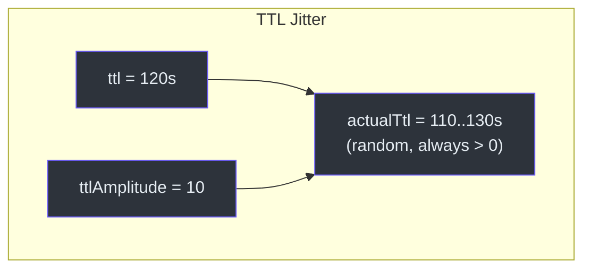
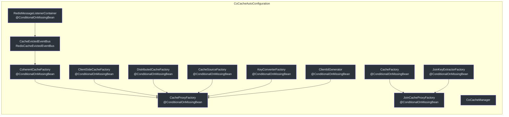
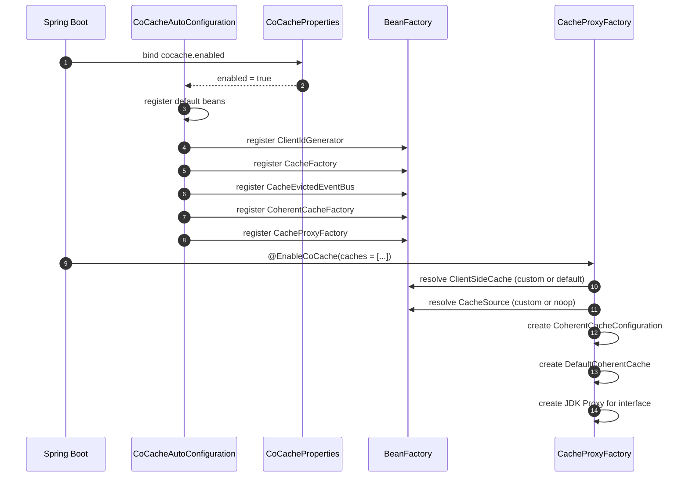

# Configuration Reference

This page covers all configuration options available in CoCache, from annotation parameters to Spring Boot properties and custom bean overrides.

## @CoCache Annotation

The `@CoCache` annotation marks a cache interface for proxy-based implementation. It configures the distributed cache layer behavior.

| Parameter | Type | Default | Description | Source |
|-----------|------|---------|-------------|--------|
| `name` | `String` | `""` (interface name) | Cache name used for event channels and bean naming | [CoCache.kt](https://github.com/Ahoo-Wang/CoCache/blob/main/cocache-api/src/main/kotlin/me/ahoo/cache/api/annotation/CoCache.kt) |
| `keyPrefix` | `String` | `""` (→ `cocache:{cacheName}:`) | Prefix prepended to all storage keys; supports Spring placeholders | [CoCache.kt](https://github.com/Ahoo-Wang/CoCache/blob/main/cocache-api/src/main/kotlin/me/ahoo/cache/api/annotation/CoCache.kt) |
| `keyExpression` | `String` | `""` | SpEL template for key derivation | [CoCache.kt](https://github.com/Ahoo-Wang/CoCache/blob/main/cocache-api/src/main/kotlin/me/ahoo/cache/api/annotation/CoCache.kt) |
| `ttl` | `Long` | `3600` | Value TTL in seconds (`TtlAt.FOREVER` = never expires) | [CoCache.kt](https://github.com/Ahoo-Wang/CoCache/blob/main/cocache-api/src/main/kotlin/me/ahoo/cache/api/annotation/CoCache.kt) |
| `ttlAmplitude` | `Long` | `60` | Random jitter (± seconds) on the value TTL to prevent cache avalanche | [CoCache.kt](https://github.com/Ahoo-Wang/CoCache/blob/main/cocache-api/src/main/kotlin/me/ahoo/cache/api/annotation/CoCache.kt) |
| `missingTtl` | `Long` | `60` | Negative-cache TTL in seconds (when `CacheSource` returns `null`) | [CoCache.kt](https://github.com/Ahoo-Wang/CoCache/blob/main/cocache-api/src/main/kotlin/me/ahoo/cache/api/annotation/CoCache.kt) |

### Choosing TTLs

- `ttl` bounds how long any residual inconsistency can survive. The cache-aside race (a slow load overwriting a concurrent update in L1) can only be repaired by expiry. Keep `ttl` finite unless every writer reliably calls `evict`.
- `missingTtl` bounds how long a newly created row can stay invisible after a lookup cached its absence. Keep it short.

### TTL Jitter Mechanism

The `ttlAmplitude` parameter prevents cache avalanche (many keys expiring simultaneously) by randomizing the actual TTL:

```
actualTtl = ttl + random(-ttlAmplitude, +ttlAmplitude)
```


```mermaid
graph LR
    subgraph ttl_jitter ["TTL Jitter"]
        direction LR
        TTL["ttl = 120s"]
        Amp["ttlAmplitude = 10"]
        Result["actualTtl = 110..130s<br>(random, always > 0)"]
    end

    TTL --> Result
    Amp --> Result

    style TTL fill:#2d333b,stroke:#6d5dfc,color:#e6edf3
    style Amp fill:#2d333b,stroke:#6d5dfc,color:#e6edf3
    style Result fill:#2d333b,stroke:#6d5dfc,color:#e6edf3
```

Source: [TtlAt.kt](https://github.com/Ahoo-Wang/CoCache/blob/main/cocache-api/src/main/kotlin/me/ahoo/cache/api/TtlAt.kt), [TtlPolicy.kt](https://github.com/Ahoo-Wang/CoCache/blob/main/cocache-core/src/main/kotlin/me/ahoo/cache/TtlPolicy.kt)

### Example

```kotlin
@CoCache(keyPrefix = "user:", ttl = 120, ttlAmplitude = 10)
interface UserCache : Cache<String, User>
```

## @CaffeineCache Annotation

Configures the default L2 (`CaffeineClientSideCache`). It is optional; without it the defaults below apply. Entries expire at their own `ttlAt`.

| Parameter | Type | Default | Description | Source |
|-----------|------|---------|-------------|--------|
| `initialCapacity` | `Int` | `-1` (unset) | Initial capacity | [CaffeineCache.kt](https://github.com/Ahoo-Wang/CoCache/blob/main/cocache-api/src/main/kotlin/me/ahoo/cache/api/annotation/CaffeineCache.kt) |
| `maximumSize` | `Long` | `10000` | Maximum entries (L2 is always bounded) | [CaffeineCache.kt](https://github.com/Ahoo-Wang/CoCache/blob/main/cocache-api/src/main/kotlin/me/ahoo/cache/api/annotation/CaffeineCache.kt) |
| `expireAfterAccess` | `Long` | `0` (disabled) | Idle eviction since last access | [CaffeineCache.kt](https://github.com/Ahoo-Wang/CoCache/blob/main/cocache-api/src/main/kotlin/me/ahoo/cache/api/annotation/CaffeineCache.kt) |
| `expireUnit` | `TimeUnit` | `SECONDS` | Unit for `expireAfterAccess` | [CaffeineCache.kt](https://github.com/Ahoo-Wang/CoCache/blob/main/cocache-api/src/main/kotlin/me/ahoo/cache/api/annotation/CaffeineCache.kt) |

## @JoinCacheable Annotation

Marks a cache interface as a `JoinCache` that composes two cached values.

| Parameter | Type | Default | Description | Source |
|-----------|------|---------|-------------|--------|
| `firstCacheName` | `String` | `""` | Name of the primary cache to retrieve the first value | [JoinCacheable.kt](https://github.com/Ahoo-Wang/CoCache/blob/main/cocache-api/src/main/kotlin/me/ahoo/cache/api/annotation/JoinCacheable.kt) |
| `joinCacheName` | `String` | `""` | Name of the secondary cache to retrieve the joined value | [JoinCacheable.kt](https://github.com/Ahoo-Wang/CoCache/blob/main/cocache-api/src/main/kotlin/me/ahoo/cache/api/annotation/JoinCacheable.kt) |
| `joinKeyExpression` | `String` | `""` | SpEL expression to extract the join key from the first value | [JoinCacheable.kt](https://github.com/Ahoo-Wang/CoCache/blob/main/cocache-api/src/main/kotlin/me/ahoo/cache/api/annotation/JoinCacheable.kt) |

```kotlin
@JoinCacheable(
    firstCacheName = "UserExtendInfoCache",
    joinCacheName = "UserCache",
    joinKeyExpression = "#{#root.userId}"
)
interface UserExtendInfoJoinCache : JoinCache<String, UserExtendInfo, String, User>
```

Source: [cocache-example/.../cache/UserExtendInfoJoinCache.kt](https://github.com/Ahoo-Wang/CoCache/blob/main/cocache-example/src/main/kotlin/me/ahoo/cache/example/cache/UserExtendInfoJoinCache.kt)

## Spring Boot Properties

### CoCacheProperties

| Property | Type | Default | Description | Source |
|----------|------|---------|-------------|--------|
| `cocache.enabled` | `Boolean` | `true` | Enables or disables the entire CoCache auto-configuration | [CoCacheProperties.kt](https://github.com/Ahoo-Wang/CoCache/blob/main/cocache-spring-boot-starter/src/main/kotlin/me/ahoo/cache/spring/boot/starter/CoCacheProperties.kt) |
| `cocache.redis.strict-failure` | `Boolean` | `false` | Redis failure policy: `false` = degrade (reads fall back to source, writes log warnings); `true` = rethrow `DataAccessException` | [CoCacheProperties.kt](https://github.com/Ahoo-Wang/CoCache/blob/main/cocache-spring-boot-starter/src/main/kotlin/me/ahoo/cache/spring/boot/starter/CoCacheProperties.kt) |
| `cocache.redis.missing-guard-sentinel` | `String` | `"_nil_"` | Custom missing-guard sentinel value for Redis codecs (see notes below) | [CoCacheProperties.kt](https://github.com/Ahoo-Wang/CoCache/blob/main/cocache-spring-boot-starter/src/main/kotlin/me/ahoo/cache/spring/boot/starter/CoCacheProperties.kt) |

```yaml
# application.yml
cocache:
  enabled: true
  redis:
    strict-failure: false
    missing-guard-sentinel: "_nil_"
```

When `cocache.enabled` is `false`, all CoCache beans are skipped. The conditional is handled by `@ConditionalOnCoCacheEnabled`.

Source: [ConditionalOnCoCacheEnabled.kt](https://github.com/Ahoo-Wang/CoCache/blob/main/cocache-spring-boot-starter/src/main/kotlin/me/ahoo/cache/spring/boot/starter/ConditionalOnCoCacheEnabled.kt)

#### Redis Failure Degradation

`RedisDistributedCache` degrades instead of propagating Redis failures to business callers:

- **Read failures** → treated as a cache miss: the coherent cache falls back to the source (database), so business calls are unaffected during Redis outages or master-slave switchovers.
- **Write / evict failures** → logged at `WARN` and swallowed — a cache write failure never blocks the business write path.
- The eviction-event publish path (`RedisCacheEvictedEventBus`) degrades the same way (pub/sub is fire-and-forget by nature).

Set `cocache.redis.strict-failure=true` to propagate exceptions instead. Note that during an outage with degradation enabled, every key not served by the local L2 cache falls back to the source once per client-side TTL window per process — plan source capacity accordingly. These properties apply only to auto-configured (fallback-created) caches; custom `DistributedCache` beans manage their own policy.

#### Missing-Guard Sentinel

Redis codecs mark negative-cache entries with the sentinel value `"_nil_"`. If your business data can legitimately equal the sentinel (an exact `"_nil_"` string, a single-element `{"_nil_"}` set, or a single-`"_nil_"`-keyed map written by an external writer), configure a custom sentinel:

```yaml
cocache:
  redis:
    missing-guard-sentinel: "\u0000myapp:nil"
```

Constraints:

- Custom and default sentinels **do not recognize each other** — switching requires a simultaneous cluster-wide change (during a rolling upgrade, old instances would misread the new sentinel as a real value).
- The value must not equal any legitimate serialized business value, and must not be blank (binding fails fast).
- In-process, negative entries are the explicit `MissingValue` type; the sentinel exists only in Redis.

## Auto-Configuration Bean Registry

The `CoCacheAutoConfiguration` class registers all required beans. Every bean uses `@ConditionalOnMissingBean`, meaning you can override any bean by declaring your own.


```mermaid
graph TB
    subgraph autoconfig ["CoCacheAutoConfiguration"]
        direction TB
        ClientId["ClientIdGenerator<br>@ConditionalOnMissingBean"]
        CacheFact["CacheFactory<br>@ConditionalOnMissingBean"]
        CoCacheMgr["CoCacheManager"]
        RedisContainer["RedisMessageListenerContainer<br>@ConditionalOnMissingBean"]
        EventBus["CacheEvictedEventBus<br>RedisCacheEvictedEventBus"]
        CoherentFact["CoherentCacheFactory<br>@ConditionalOnMissingBean"]
        CacheSrcFact["CacheSourceFactory<br>@ConditionalOnMissingBean"]
        CSCFact["ClientSideCacheFactory<br>@ConditionalOnMissingBean"]
        DistFact["DistributedCacheFactory<br>@ConditionalOnMissingBean"]
        KeyConvFact["KeyConverterFactory<br>@ConditionalOnMissingBean"]
        ProxyFact["CacheProxyFactory<br>@ConditionalOnMissingBean"]
        JoinKeyFact["JoinKeyExtractorFactory<br>@ConditionalOnMissingBean"]
        JoinProxyFact["JoinCacheProxyFactory<br>@ConditionalOnMissingBean"]
    end

    RedisContainer --> EventBus
    EventBus --> CoherentFact
    CoherentFact --> ProxyFact
    CSCFact --> ProxyFact
    DistFact --> ProxyFact
    CacheSrcFact --> ProxyFact
    KeyConvFact --> ProxyFact
    ClientId --> ProxyFact
    CacheFact --> JoinProxyFact
    JoinKeyFact --> JoinProxyFact

    style ClientId fill:#2d333b,stroke:#6d5dfc,color:#e6edf3
    style CacheFact fill:#2d333b,stroke:#6d5dfc,color:#e6edf3
    style CoCacheMgr fill:#2d333b,stroke:#6d5dfc,color:#e6edf3
    style RedisContainer fill:#2d333b,stroke:#6d5dfc,color:#e6edf3
    style EventBus fill:#2d333b,stroke:#6d5dfc,color:#e6edf3
    style CoherentFact fill:#2d333b,stroke:#6d5dfc,color:#e6edf3
    style CacheSrcFact fill:#2d333b,stroke:#6d5dfc,color:#e6edf3
    style CSCFact fill:#2d333b,stroke:#6d5dfc,color:#e6edf3
    style DistFact fill:#2d333b,stroke:#6d5dfc,color:#e6edf3
    style KeyConvFact fill:#2d333b,stroke:#6d5dfc,color:#e6edf3
    style ProxyFact fill:#2d333b,stroke:#6d5dfc,color:#e6edf3
    style JoinKeyFact fill:#2d333b,stroke:#6d5dfc,color:#e6edf3
    style JoinProxyFact fill:#2d333b,stroke:#6d5dfc,color:#e6edf3
```

Source: [CoCacheAutoConfiguration.kt:61-186](https://github.com/Ahoo-Wang/CoCache/blob/main/cocache-spring-boot-starter/src/main/kotlin/me/ahoo/cache/spring/boot/starter/CoCacheAutoConfiguration.kt#L61-L186)

### Auto-Configured Beans Reference

| Bean | Type | Conditional | Description |
|------|------|-------------|-------------|
| `defaultHostClientIdGenerator` | `ClientIdGenerator` | `@ConditionalOnMissingBean` | Generates client IDs based on host address |
| `cacheFactory` | `CacheFactory` | `@ConditionalOnMissingBean` | Resolves cache instances from the bean factory |
| `coCacheManager` | `CoCacheManager` | -- | Integrates with Spring Cache abstraction |
| `cocacheRedisMessageListenerContainer` | `RedisMessageListenerContainer` | `@ConditionalOnMissingBean` + `@ConditionalOnSingleCandidate` | Listens for Redis pub/sub messages |
| `cacheEvictedEventBus` | `CacheEvictedEventBus` | `@ConditionalOnMissingBean` | Publishes and subscribes to cache eviction events via Redis |
| `coherentCacheFactory` | `CoherentCacheFactory` | `@ConditionalOnMissingBean` | Creates `DefaultCoherentCache` instances |
| `cacheSourceFactory` | `CacheSourceFactory` | `@ConditionalOnMissingBean` | Resolves `CacheSource` beans by name, then by unique type |
| `clientSideCacheFactory` | `ClientSideCacheFactory` | `@ConditionalOnMissingBean` | Resolves `{cacheName}.ClientSideCache` or builds Caffeine from `@CaffeineCache` |
| `distributedCacheFactory` | `DistributedCacheFactory` | `@ConditionalOnMissingBean` | Creates `RedisDistributedCache` instances |
| `keyConverterFactory` | `KeyConverterFactory` | `@ConditionalOnMissingBean` | Converts cache keys using SpEL expressions |
| `cacheProxyFactory` | `CacheProxyFactory` | `@ConditionalOnMissingBean` | Creates proxy implementations of cache interfaces |
| `joinKeyExtractorFactory` | `JoinKeyExtractorFactory` | `@ConditionalOnMissingBean` | Resolves join key extractors from SpEL expressions |
| `joinCacheProxyFactory` | `JoinCacheProxyFactory` | `@ConditionalOnMissingBean` | Creates proxy implementations of JoinCache interfaces |

## Custom Bean Overrides

### Custom ClientSideCache

Override the L2 cache for a specific cache interface by declaring a bean named `{cacheName}.ClientSideCache`:

```kotlin
@Configuration
class UserCacheConfiguration {
    @Bean("UserCache.ClientSideCache")
    fun userClientSideCache(): ClientSideCache<User> {
        return CaffeineClientSideCache.build(maximumSize = 100_000, expireAfterAccess = Duration.ofMinutes(10))
    }
}
```

Stateful components (`ClientSideCache`, `DistributedCache`, `KeyConverter`) are resolved **by bean name only**. A bean matched by type would be shared by every cache with the same value type: one cache's `clear()` would wipe the others, and their key prefixes would collide.

### Custom CacheSource

Provide a data source loader for a specific cache:

```kotlin
@Configuration
class UserCacheConfiguration {
    @Bean
    fun customizeUserCacheSource(): CacheSource<String, User> {
        // null → negative cache for missingTtl seconds
        return CacheSource { key -> database.findById(key)?.let { CacheValue.forever(it) } }
    }
}
```

A `CacheSource` is resolved by the name `{cacheName}.CacheSource` first, then by a unique bean of type `CacheSource<K, V>` (sources are stateless and safe to share). If neither exists, the cache uses `CacheSource.noOp()`.

### Custom DistributedCache

Override the distributed cache implementation with a bean named `{cacheName}.DistributedCache`:

```kotlin
@Bean("UserCache.DistributedCache")
fun customDistributedCache(redisTemplate: StringRedisTemplate): DistributedCache<User> {
    val codec = ObjectToJsonCodecExecutor<User>(
        User::class.java, redisTemplate, ObjectMapper()
    )
    return RedisDistributedCache(redisTemplate, codec)
}
```

### Custom CacheEvictedEventBus

Replace the Redis-based event bus with a custom implementation. Implementations must call `CacheEvictedSubscriber.onReset()` whenever a subscription is (re)established, because events sent while unsubscribed are lost:

```kotlin
@Bean
fun customEventBus(): CacheEvictedEventBus {
    // Custom event bus (e.g., Kafka, RabbitMQ)
    return MyCustomEventBus()
}
```

## Configuration Flow


```mermaid
sequenceDiagram
autonumber
    participant App as Spring Boot
    participant Auto as CoCacheAutoConfiguration
    participant Prop as CoCacheProperties
    participant Bean as BeanFactory
    participant Proxy as CacheProxyFactory

    App->>Prop: bind cocache.enabled
    Prop-->>Auto: enabled = true
    Auto->>Auto: register default beans
    Auto->>Bean: register ClientIdGenerator
    Auto->>Bean: register CacheFactory
    Auto->>Bean: register CacheEvictedEventBus
    Auto->>Bean: register CoherentCacheFactory
    Auto->>Bean: register CacheProxyFactory
    App->>Proxy: @EnableCoCache(caches = [...])
    Proxy->>Bean: resolve ClientSideCache (custom or default)
    Proxy->>Bean: resolve CacheSource (custom or noop)
    Proxy->>Proxy: create CoherentCacheConfiguration
    Proxy->>Proxy: create DefaultCoherentCache
    Proxy->>Proxy: create JDK Proxy for interface

```

## CosID Integration

When the CosID library is on the classpath and a `HostAddressSupplier` bean is present, the auto-configuration registers a `HostClientIdGenerator` that uses CosID's host address for client ID generation.

```kotlin
@Configuration
@ConditionalOnClass(HostAddressSupplier::class)
class CosIdHostAddressSupplierAutoConfiguration {
    @Bean
    @ConditionalOnBean(HostAddressSupplier::class)
    fun inetUtilsHostClientIdGenerator(
        hostAddressSupplier: HostAddressSupplier
    ): ClientIdGenerator {
        return HostClientIdGenerator {
            hostAddressSupplier.hostAddress
        }
    }
}
```

Source: [CoCacheAutoConfiguration.kt:175-185](https://github.com/Ahoo-Wang/CoCache/blob/main/cocache-spring-boot-starter/src/main/kotlin/me/ahoo/cache/spring/boot/starter/CoCacheAutoConfiguration.kt#L175-L185)

## Related Pages

- [Introduction](./index.md) -- Architecture overview and key features
- [Quick Start Guide](./quick-start.md) -- Setup and first cache in minutes
- [Testing Overview](../testing/index.md) -- TCK test specs and test patterns
- [Performance Patterns](../testing/performance-patterns.md) -- TTL jitter and cache stampede details
