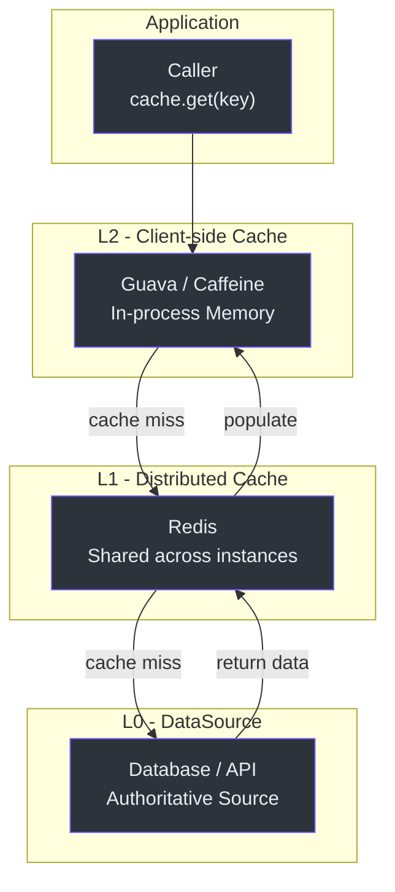
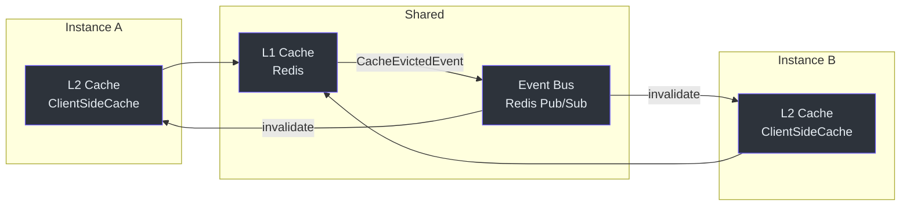
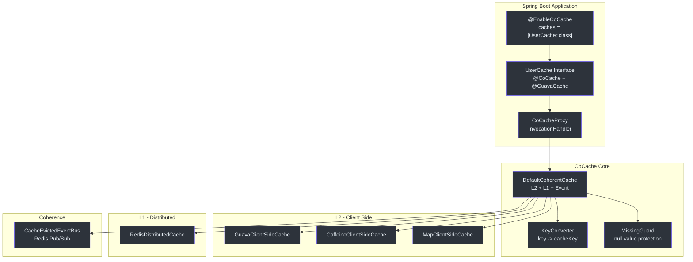
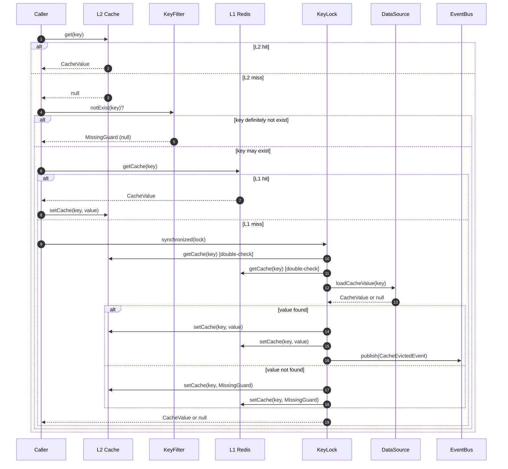

# CoCache Introduction

**CoCache** is a **Level 2 Distributed Coherence Cache Framework** for Java/Kotlin that provides a two-level caching architecture with event-driven coherence across distributed instances. It is published under the group `me.ahoo.cocache` at version **4.2.0**.

CoCache sits between your application and your data source, adding two cache layers -- a local in-memory L2 cache (Guava or Caffeine) and a shared distributed L1 cache (Redis) -- while keeping all instances coherent through an event bus.

## Three-Tier Cache Concept

CoCache implements a three-tier data access model:

| Tier | Name | Location | Purpose | Source |
|------|------|----------|---------|--------|
| L2 | Client-side Cache | In-process (Guava / Caffeine) | Fastest access, per-instance | [cocache-api/.../client/ClientSideCache.kt](https://github.com/Ahoo-Wang/CoCache/blob/main/cocache-api/src/main/kotlin/me/ahoo/cache/api/client/ClientSideCache.kt) |
| L1 | Distributed Cache | Shared (Redis) | Cross-instance consistency | [cocache-api/.../distributed/DistributedCache.kt](https://github.com/Ahoo-Wang/CoCache/blob/main/cocache-api/src/main/kotlin/me/ahoo/cache/api/distributed/DistributedCache.kt) |
| L0 | DataSource | Origin (Database, API) | Authoritative data source | [cocache-api/.../source/CacheSource.kt](https://github.com/Ahoo-Wang/CoCache/blob/main/cocache-api/src/main/kotlin/me/ahoo/cache/api/source/CacheSource.kt) |





## Key Features

| Feature | Description | Source |
|---------|-------------|--------|
| Two-Level Caching | L2 (local) + L1 (distributed) with fine-grained locking | [DefaultCoherentCache.kt:89-135](https://github.com/Ahoo-Wang/CoCache/blob/main/cocache-core/src/main/kotlin/me/ahoo/cache/consistency/DefaultCoherentCache.kt#L89-L135) |
| Event-Driven Coherence | `CacheEvictedEventBus` for distributed cache invalidation | [CacheEvictedEventBus.kt](https://github.com/Ahoo-Wang/CoCache/blob/main/cocache-core/src/main/kotlin/me/ahoo/cache/consistency/CacheEvictedEventBus.kt) |
| Annotation-Based Config | `@CoCache`, `@GuavaCache`, `@CaffeineCache`, `@JoinCacheable` | [cocache-api/.../annotation/](https://github.com/Ahoo-Wang/CoCache/blob/main/cocache-api/src/main/kotlin/me/ahoo/cache/api/annotation/) |
| JoinCache | Compose multiple cached values into a single result | [JoinCache.kt](https://github.com/Ahoo-Wang/CoCache/blob/main/cocache-api/src/main/kotlin/me/ahoo/cache/api/join/JoinCache.kt) |
| Cache Stampede Prevention | Per-key synchronized locking prevents thundering herd | [DefaultCoherentCache.kt:78-86](https://github.com/Ahoo-Wang/CoCache/blob/main/cocache-core/src/main/kotlin/me/ahoo/cache/consistency/DefaultCoherentCache.kt#L78-L86) |
| Cache Penetration Guard | MissingGuard caches null values to prevent repeated DB hits | [MissingGuard.kt](https://github.com/Ahoo-Wang/CoCache/blob/main/cocache-core/src/main/kotlin/me/ahoo/cache/MissingGuard.kt) |
| Bloom Key Filter | Optional Bloom filter to block non-existent key queries | [BloomKeyFilter.kt](https://github.com/Ahoo-Wang/CoCache/blob/main/cocache-core/src/main/kotlin/me/ahoo/cache/filter/BloomKeyFilter.kt) |
| TTL Jitter | Random TTL amplitude prevents cache avalanche | [ComputedTtlAt.kt:49-56](https://github.com/Ahoo-Wang/CoCache/blob/main/cocache-core/src/main/kotlin/me/ahoo/cache/ComputedTtlAt.kt#L49-L56) |
| Proxy-Based Caching | Dynamic proxies implement cache interfaces at runtime | [CoCacheProxy.kt](https://github.com/Ahoo-Wang/CoCache/blob/main/cocache-core/src/main/kotlin/me/ahoo/cache/proxy/CoCacheProxy.kt) |
| Spring Boot Starter | Auto-configuration with conditional bean registration | [CoCacheAutoConfiguration.kt:61-186](https://github.com/Ahoo-Wang/CoCache/blob/main/cocache-spring-boot-starter/src/main/kotlin/me/ahoo/cache/spring/boot/starter/CoCacheAutoConfiguration.kt#L61-L186) |

## Architecture Overview



## Caching Flow



## Module Architecture

| Module | Description | Source |
|--------|-------------|--------|
| `cocache-api` | Core interfaces (`Cache`, `CacheValue`, `ClientSideCache`, `CacheSource`) | [cocache-api/](https://github.com/Ahoo-Wang/CoCache/tree/main/cocache-api) |
| `cocache-core` | Default implementations (`DefaultCoherentCache`, proxy-based caching) | [cocache-core/](https://github.com/Ahoo-Wang/CoCache/tree/main/cocache-core) |
| `cocache-spring` | Spring integration (`@EnableCoCache`, factory beans) | [cocache-spring/](https://github.com/Ahoo-Wang/CoCache/tree/main/cocache-spring) |
| `cocache-spring-redis` | Redis distributed cache implementation | [cocache-spring-redis/](https://github.com/Ahoo-Wang/CoCache/tree/main/cocache-spring-redis) |
| `cocache-spring-cache` | Spring Cache abstraction bridge | [cocache-spring-cache/](https://github.com/Ahoo-Wang/CoCache/tree/main/cocache-spring-cache) |
| `cocache-spring-boot-starter` | Auto-configuration for Spring Boot | [cocache-spring-boot-starter/](https://github.com/Ahoo-Wang/CoCache/tree/main/cocache-spring-boot-starter) |
| `cocache-test` | Shared test specs (TCK) | [cocache-test/](https://github.com/Ahoo-Wang/CoCache/tree/main/cocache-test) |
| `cocache-example` | Example application | [cocache-example/](https://github.com/Ahoo-Wang/CoCache/tree/main/cocache-example) |
| `cocache-bom` | Bill of Materials | [cocache-bom/](https://github.com/Ahoo-Wang/CoCache/tree/main/cocache-bom) |
| `cocache-dependencies` | Centralized version catalog | [cocache-dependencies/](https://github.com/Ahoo-Wang/CoCache/tree/main/cocache-dependencies) |

## Project Information

| Property | Value | Source |
|----------|-------|--------|
| Group | `me.ahoo.cocache` | [gradle.properties:14](https://github.com/Ahoo-Wang/CoCache/blob/main/gradle.properties#L14) |
| Version | `4.2.0` | [gradle.properties:15](https://github.com/Ahoo-Wang/CoCache/blob/main/gradle.properties#L15) |
| License | Apache License 2.0 | [gradle.properties:23](https://github.com/Ahoo-Wang/CoCache/blob/main/gradle.properties#L23) |
| JDK | 17+ (via `jvmToolchain`) | [build.gradle.kts](https://github.com/Ahoo-Wang/CoCache/blob/main/build.gradle.kts) |
| Gradle | 9.6.1 (wrapper) | [gradle/wrapper/gradle-wrapper.properties](https://github.com/Ahoo-Wang/CoCache/blob/main/gradle/wrapper/gradle-wrapper.properties) |

## Quick Example

```kotlin
// 1. Define a cache interface
@CoCache(keyPrefix = "user:", ttl = 120)
@GuavaCache(
    maximumSize = 1_000_000,
    expireUnit = TimeUnit.SECONDS,
    expireAfterAccess = 120
)
interface UserCache : Cache<String, User>

// 2. Enable caching
@EnableCoCache(caches = [UserCache::class])
@SpringBootApplication
class AppServer

// 3. Use the cache
@RestController
class UserController(private val userCache: UserCache) {
    @GetMapping("{id}")
    fun get(@PathVariable id: String): User? = userCache[id]
}
```

## Related Pages

- [Quick Start Guide](./quick-start.md) -- Setup and first cache in minutes
- [Configuration Reference](./configuration.md) -- All annotation parameters and properties
- [Testing Overview](../testing/index.md) -- TCK test specs and test patterns
- [Performance Patterns](../testing/performance-patterns.md) -- Cache stampede, penetration, and avalanche prevention
