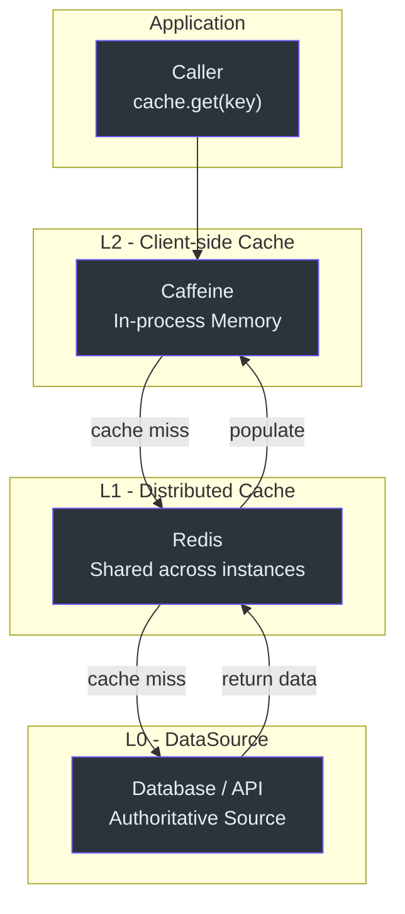
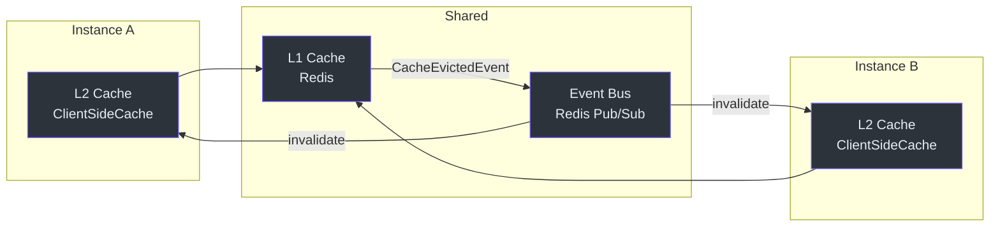
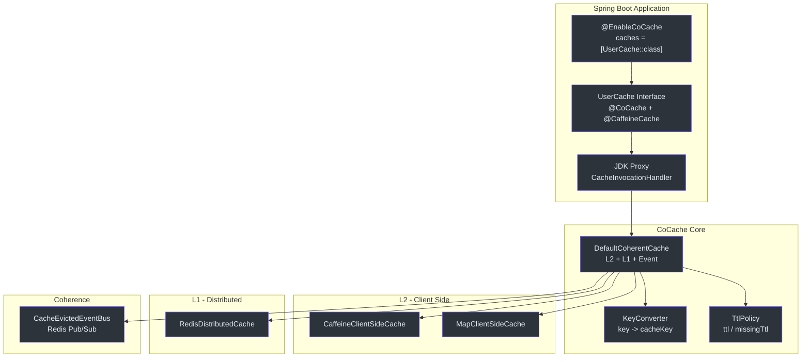
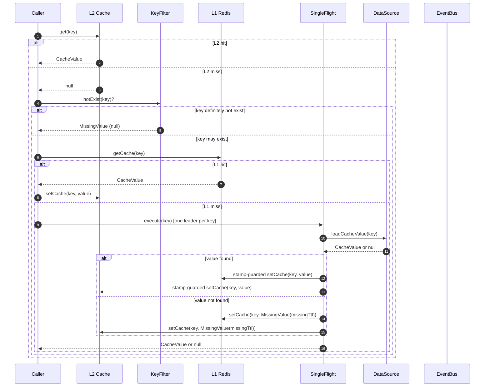

# CoCache Introduction

**CoCache** is a **Level 2 Distributed Coherence Cache Framework** for Java/Kotlin that provides a two-level caching architecture with event-driven coherence across distributed instances. It is published under the group `me.ahoo.cocache` at version **5.0.0**.

CoCache sits between your application and your data source, adding two cache layers -- a bounded local in-memory L2 cache (Caffeine) and a shared distributed L1 cache (Redis) -- while keeping all instances coherent through an event bus.

## Three-Tier Cache Concept

CoCache implements a three-tier data access model:

| Tier | Name | Location | Purpose | Source |
|------|------|----------|---------|--------|
| L2 | Client-side Cache | In-process (bounded Caffeine) | Fastest access, per-instance | [cocache-api/.../client/ClientSideCache.kt](https://github.com/Ahoo-Wang/CoCache/blob/main/cocache-api/src/main/kotlin/me/ahoo/cache/api/client/ClientSideCache.kt) |
| L1 | Distributed Cache | Shared (Redis) | Cross-instance consistency | [cocache-api/.../distributed/DistributedCache.kt](https://github.com/Ahoo-Wang/CoCache/blob/main/cocache-api/src/main/kotlin/me/ahoo/cache/api/distributed/DistributedCache.kt) |
| L0 | DataSource | Origin (Database, API) | Authoritative data source | [cocache-api/.../source/CacheSource.kt](https://github.com/Ahoo-Wang/CoCache/blob/main/cocache-api/src/main/kotlin/me/ahoo/cache/api/source/CacheSource.kt) |


```mermaid
graph TB
    subgraph Application
        direction TB
        Caller["Caller<br>cache.get(key)"]
    end

    subgraph sg_20 ["L2 - Client-side Cache"]
        direction TB
        L2["Caffeine<br>In-process Memory"]
    end

    subgraph sg_21 ["L1 - Distributed Cache"]
        direction TB
        L1["Redis<br>Shared across instances"]
    end

    subgraph sg_22 ["L0 - DataSource"]
        direction TB
        L0["Database / API<br>Authoritative Source"]
    end

    Caller --> L2
    L2 -->|"cache miss"| L1
    L1 -->|"cache miss"| L0
    L0 -->|"return data"| L1
    L1 -->|"populate"| L2

    style Caller fill:#2d333b,stroke:#6d5dfc,color:#e6edf3
    style L2 fill:#2d333b,stroke:#6d5dfc,color:#e6edf3
    style L1 fill:#2d333b,stroke:#6d5dfc,color:#e6edf3
    style L0 fill:#2d333b,stroke:#6d5dfc,color:#e6edf3
```


```mermaid
graph LR
    subgraph sg_23 ["Instance A"]
        L2A["L2 Cache<br>ClientSideCache"]
    end
    subgraph sg_24 ["Instance B"]
        L2B["L2 Cache<br>ClientSideCache"]
    end
    subgraph sg_25 ["Shared"]
        L1["L1 Cache<br>Redis"]
        EB["Event Bus<br>Redis Pub/Sub"]
    end

    L2A --> L1
    L2B --> L1
    L1 -->|"CacheEvictedEvent"| EB
    EB -->|"invalidate"| L2A
    EB -->|"invalidate"| L2B

    style L2A fill:#2d333b,stroke:#6d5dfc,color:#e6edf3
    style L2B fill:#2d333b,stroke:#6d5dfc,color:#e6edf3
    style L1 fill:#2d333b,stroke:#6d5dfc,color:#e6edf3
    style EB fill:#2d333b,stroke:#6d5dfc,color:#e6edf3
```

## Key Features

| Feature | Description | Source |
|---------|-------------|--------|
| Two-Level Caching | L2 (local) + L1 (distributed) with stamp-guarded write-backs | [DefaultCoherentCache.kt](https://github.com/Ahoo-Wang/CoCache/blob/main/cocache-core/src/main/kotlin/me/ahoo/cache/consistency/DefaultCoherentCache.kt) |
| Event-Driven Coherence | `CacheEvictedEventBus` for distributed cache invalidation | [CacheEvictedEventBus.kt](https://github.com/Ahoo-Wang/CoCache/blob/main/cocache-core/src/main/kotlin/me/ahoo/cache/consistency/CacheEvictedEventBus.kt) |
| Annotation-Based Config | `@CoCache`, `@CaffeineCache`, `@JoinCacheable` | [cocache-api/.../annotation/](https://github.com/Ahoo-Wang/CoCache/blob/main/cocache-api/src/main/kotlin/me/ahoo/cache/api/annotation/) |
| JoinCache | Compose multiple cached values into a single result | [JoinCache.kt](https://github.com/Ahoo-Wang/CoCache/blob/main/cocache-api/src/main/kotlin/me/ahoo/cache/api/join/JoinCache.kt) |
| Cache Stampede Prevention | Per-key `SingleFlight` coalesces concurrent loads | [SingleFlight.kt](https://github.com/Ahoo-Wang/CoCache/blob/main/cocache-core/src/main/kotlin/me/ahoo/cache/concurrent/SingleFlight.kt) |
| Cache Penetration Guard | Explicit negative cache (`MissingValue`) with its own short `missingTtl` | [CacheValue.kt](https://github.com/Ahoo-Wang/CoCache/blob/main/cocache-api/src/main/kotlin/me/ahoo/cache/api/CacheValue.kt) |
| Bloom Key Filter | Optional Bloom filter to block non-existent key queries | [BloomKeyFilter.kt](https://github.com/Ahoo-Wang/CoCache/blob/main/cocache-core/src/main/kotlin/me/ahoo/cache/filter/BloomKeyFilter.kt) |
| TTL Jitter | Random TTL amplitude prevents cache avalanche | [TtlAt.kt](https://github.com/Ahoo-Wang/CoCache/blob/main/cocache-api/src/main/kotlin/me/ahoo/cache/api/TtlAt.kt) |
| Bounded Staleness | Finite default TTL; L2 cleared on every event-channel (re)subscription | [docs/architecture.md](https://github.com/Ahoo-Wang/CoCache/blob/main/docs/architecture.md) |
| Proxy-Based Caching | Dynamic proxies implement cache interfaces at runtime | [CacheInvocationHandler.kt](https://github.com/Ahoo-Wang/CoCache/blob/main/cocache-core/src/main/kotlin/me/ahoo/cache/proxy/CacheInvocationHandler.kt) |
| Spring Boot Starter | Auto-configuration with conditional bean registration | [CoCacheAutoConfiguration.kt:61-186](https://github.com/Ahoo-Wang/CoCache/blob/main/cocache-spring-boot-starter/src/main/kotlin/me/ahoo/cache/spring/boot/starter/CoCacheAutoConfiguration.kt#L61-L186) |

## Architecture Overview


```mermaid
graph TB
    subgraph sg_26 ["Spring Boot Application"]
        direction TB
        EnableCoCache["@EnableCoCache<br>caches = [UserCache::class]"]
        UserCache["UserCache Interface<br>@CoCache + @CaffeineCache"]
        Proxy["JDK Proxy<br>CacheInvocationHandler"]
    end

    subgraph sg_27 ["CoCache Core"]
        direction TB
        CoherentCache["DefaultCoherentCache<br>L2 + L1 + Event"]
        KeyConverter["KeyConverter<br>key -> cacheKey"]
        TtlPolicy["TtlPolicy<br>ttl / missingTtl"]
    end

    subgraph sg_28 ["L2 - Client Side"]
        direction TB
        Caffeine["CaffeineClientSideCache"]
        Map["MapClientSideCache"]
    end

    subgraph sg_29 ["L1 - Distributed"]
        direction TB
        Redis["RedisDistributedCache"]
    end

    subgraph sg_30 ["Coherence"]
        direction TB
        EventBus["CacheEvictedEventBus<br>Redis Pub/Sub"]
    end

    EnableCoCache --> UserCache
    UserCache --> Proxy
    Proxy --> CoherentCache
    CoherentCache --> KeyConverter
    CoherentCache --> TtlPolicy
    CoherentCache --> Caffeine
    CoherentCache --> Map
    CoherentCache --> Redis
    CoherentCache --> EventBus

    style EnableCoCache fill:#2d333b,stroke:#6d5dfc,color:#e6edf3
    style UserCache fill:#2d333b,stroke:#6d5dfc,color:#e6edf3
    style Proxy fill:#2d333b,stroke:#6d5dfc,color:#e6edf3
    style CoherentCache fill:#2d333b,stroke:#6d5dfc,color:#e6edf3
    style KeyConverter fill:#2d333b,stroke:#6d5dfc,color:#e6edf3
    style TtlPolicy fill:#2d333b,stroke:#6d5dfc,color:#e6edf3
    style Caffeine fill:#2d333b,stroke:#6d5dfc,color:#e6edf3
    style Map fill:#2d333b,stroke:#6d5dfc,color:#e6edf3
    style Redis fill:#2d333b,stroke:#6d5dfc,color:#e6edf3
    style EventBus fill:#2d333b,stroke:#6d5dfc,color:#e6edf3
```

## Caching Flow


```mermaid
sequenceDiagram
autonumber
    participant Caller as Caller
    participant L2 as L2 Cache
    participant KeyFilter as KeyFilter
    participant L1 as L1 Redis
    participant Lock as SingleFlight
    participant L0 as DataSource
    participant EventBus as EventBus

    Caller->>L2: get(key)
    alt L2 hit
        L2-->>Caller: CacheValue
    else L2 miss
        L2-->>Caller: null
        Caller->>KeyFilter: notExist(key)?
        alt key definitely not exist
            KeyFilter-->>Caller: MissingValue (null)
        else key may exist
            Caller->>L1: getCache(key)
            alt L1 hit
                L1-->>Caller: CacheValue
                Caller->>L2: setCache(key, value)
            else L1 miss
                Caller->>Lock: execute(key) [one leader per key]
                Lock->>L0: loadCacheValue(key)
                L0-->>Lock: CacheValue or null
                alt value found
                    Lock->>L1: stamp-guarded setCache(key, value)
                    Lock->>L2: stamp-guarded setCache(key, value)
                else value not found
                    Lock->>L1: setCache(key, MissingValue(missingTtl))
                    Lock->>L2: setCache(key, MissingValue(missingTtl))
                end
                Lock-->>Caller: CacheValue or null
            end
        end
    end

```

## Module Architecture

| Module | Description | Source |
|--------|-------------|--------|
| `cocache-api` | User API and all SPI (`Cache`, `CacheValue`, `CacheStore`, `CacheSource`, `CacheEvictedEventBus`) | [cocache-api/](https://github.com/Ahoo-Wang/CoCache/tree/main/cocache-api) |
| `cocache-core` | Orchestration and defaults (`DefaultCoherentCache`, `TtlPolicy`, Caffeine L2, proxies) | [cocache-core/](https://github.com/Ahoo-Wang/CoCache/tree/main/cocache-core) |
| `cocache-spring` | Spring integration (`@EnableCoCache`, factory beans) | [cocache-spring/](https://github.com/Ahoo-Wang/CoCache/tree/main/cocache-spring) |
| `cocache-spring-redis` | Redis distributed cache implementation | [cocache-spring-redis/](https://github.com/Ahoo-Wang/CoCache/tree/main/cocache-spring-redis) |
| `cocache-spring-cache` | Spring Cache abstraction bridge | [cocache-spring-cache/](https://github.com/Ahoo-Wang/CoCache/tree/main/cocache-spring-cache) |
| `cocache-spring-boot-starter` | Auto-configuration for Spring Boot | [cocache-spring-boot-starter/](https://github.com/Ahoo-Wang/CoCache/tree/main/cocache-spring-boot-starter) |
| `cocache-test` | Shared test specs (TCK) | [cocache-test/](https://github.com/Ahoo-Wang/CoCache/tree/main/cocache-test) |
| `cocache-example` | Example application | [cocache-example/](https://github.com/Ahoo-Wang/CoCache/tree/main/cocache-example) |
| `cocache-bom` | Bill of Materials | [cocache-bom/](https://github.com/Ahoo-Wang/CoCache/tree/main/cocache-bom) |
| `cocache-dependencies` | Centralized version catalog | [cocache-dependencies/](https://github.com/Ahoo-Wang/CoCache/tree/main/cocache-dependencies) |

## Project Information

| Property | Value | Source |
|----------|-------|--------|
| Group | `me.ahoo.cocache` | [gradle.properties:14](https://github.com/Ahoo-Wang/CoCache/blob/main/gradle.properties#L14) |
| Version | `5.0.0` | [gradle.properties:15](https://github.com/Ahoo-Wang/CoCache/blob/main/gradle.properties#L15) |
| License | Apache License 2.0 | [gradle.properties:23](https://github.com/Ahoo-Wang/CoCache/blob/main/gradle.properties#L23) |
| JDK | 17+ (via `jvmToolchain`) | [build.gradle.kts](https://github.com/Ahoo-Wang/CoCache/blob/main/build.gradle.kts) |
| Gradle | 9.6.1 (wrapper) | [gradle/wrapper/gradle-wrapper.properties](https://github.com/Ahoo-Wang/CoCache/blob/main/gradle/wrapper/gradle-wrapper.properties) |

## Quick Example

```kotlin
// 1. Define a cache interface
@CoCache(keyPrefix = "user:", ttl = 120)
@CaffeineCache(maximumSize = 1_000_000, expireAfterAccess = 120)
interface UserCache : Cache<String, User>

// 2. Enable caching
@EnableCoCache(caches = [UserCache::class])
@SpringBootApplication
class AppServer

// 3. Use the cache
@RestController
class UserController(private val userCache: UserCache) {
    @GetMapping("{id}")
    fun get(@PathVariable id: String): User? = userCache[id]
}
```

## Related Pages

- [Quick Start Guide](./quick-start.md) -- Setup and first cache in minutes
- [Configuration Reference](./configuration.md) -- All annotation parameters and properties
- [Testing Overview](../testing/index.md) -- TCK test specs and test patterns
- [Performance Patterns](../testing/performance-patterns.md) -- Cache stampede, penetration, and avalanche prevention
