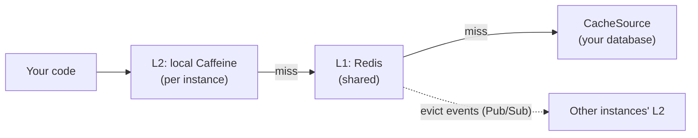

# Introduction

CoCache is a two-level coherent cache for Java and Kotlin applications on Spring Boot. You declare a cache as an interface. CoCache implements it and keeps an in-process copy (L2) in step with a shared Redis copy (L1) across all instances of your service.

## The problem

A local in-memory cache is the fastest place to read from, but every instance has its own copy. When one instance changes the data, the other instances keep serving the old value. A shared cache like Redis fixes that but costs a network round trip on every read.

CoCache keeps both and connects them:

```mermaid
flowchart LR
    App["Your code"] --> L2["L2: local Caffeine<br>(per instance)"]
    L2 -- miss --> L1["L1: Redis<br>(shared)"]
    L1 -- miss --> Src["CacheSource<br>(your database)"]
    L1 -. "evict events (Pub/Sub)" .-> Peers["Other instances' L2"]
```

- A read tries L2, then L1, then your `CacheSource`. Each miss fills the levels above it.
- A write or evict on one instance publishes an event. Every other instance drops its L2 copy.
- Concurrent misses for the same key share one load, so a hot key that expires does not stampede your database.

## What you get

| Concern | How CoCache handles it |
|---------|------------------------|
| Read latency | An L2 hit is an in-process lookup. An L1 hit is one Redis round trip. |
| Stale copies across instances | Writes and evicts broadcast an eviction event. Peers drop their L2 copy. |
| Lost events (Redis reconnects) | L2 is cleared every time the event channel (re)subscribes. |
| Cache stampede | Concurrent misses for a key are coalesced into one load per instance. |
| Cache penetration (lookups for keys that don't exist) | `CacheSource` returning `null` stores a negative entry for `missingTtl` seconds. |
| Cache avalanche (many keys expiring at once) | Each TTL gets random jitter of `±ttlAmplitude` seconds. |
| Redis outages | By default, reads fall back to the source and writes log a warning. |

## Guarantees

CoCache trades a bounded amount of staleness for latency. It is explicit about how much.

- **Staleness is bounded.** Every value expires after `ttl` (1 hour by default). Negative entries expire after `missingTtl` (60 seconds by default). These are the upper bounds on any inconsistency.
- **Invalidations are not lost to races.** A slow load that started before an evict cannot write its old value back afterwards. Every write-back checks for invalidations that happened while it was in flight.
- **Read-your-writes on one instance.** After `evict(key)` or `set(key, …)` returns, the same instance does not serve the previous value.

CoCache does **not** give strongly consistent (linearizable) reads across instances. Peers see a change once the eviction event arrives, normally within milliseconds. One race is inherent to any cache-aside design: a load that read the database before an update can land in Redis after the update's evict. The finite `ttl` repairs it. See [Consistency](../architecture/consistency.md) for the exact model.

## When to use it

Use CoCache when:

- you run several instances of a Spring Boot service against shared data,
- reads far outnumber writes, and
- your writes can tolerate other instances seeing the change a few milliseconds later.

Don't use it when:

- every read must see the latest committed write (read from the database, or use a lock),
- the data changes on nearly every read, so caching would buy little, or
- the values are too large to hold copies in every instance's memory.

## Next steps

- [Quick Start](./quick-start.md): add CoCache to an application in five steps.
- [Configuration](./configuration.md): TTLs, L2 sizing, per-cache components, and properties.
- [Architecture](../architecture/index.md): how CoCache is built.
