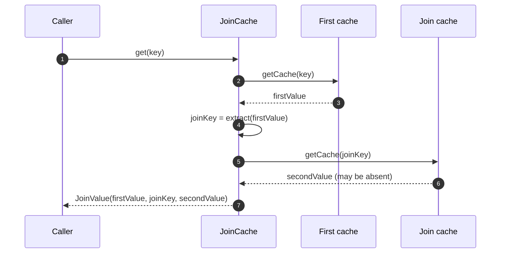

# JoinCache

A `JoinCache` reads a value from one cache, derives a key from it, and reads a second cache with that key. One call returns both values. A typical use is "order + its customer" or "profile extension + its user". Each cache keeps its own lifecycle, TTL, and invalidation.



## Declare it

Both component caches must be ordinary CoCache caches. List all three interfaces in `@EnableCoCache`:

```kotlin
data class UserExtendInfo(val id: String, val userId: String)

@CoCache(keyPrefix = "userExtendInfo:")
interface UserExtendInfoCache : Cache<String, UserExtendInfo>

@CoCache(keyPrefix = "user:")
interface UserCache : Cache<String, User>

@JoinCacheable(
    firstCacheName = "UserExtendInfoCache",
    joinCacheName = "UserCache",
    joinKeyExpression = "#{#root.userId}",   // evaluated against the first value
)
interface UserExtendInfoJoinCache : JoinCache<String, UserExtendInfo, String, User>

@EnableCoCache(caches = [UserExtendInfoCache::class, UserCache::class, UserExtendInfoJoinCache::class])
```

`joinKeyExpression` is a SpEL template, and it works only when the join key type is `String`. For any other key type, leave it blank and provide a `JoinKeyExtractor<V1, K2>` bean. Name the bean `{name}.JoinKeyExtractor`, where `{name}` is the JoinCache's own name, or make it the only bean of that generic type.

```kotlin
@Bean("UserExtendInfoJoinCache.JoinKeyExtractor")
fun userIdExtractor() = JoinKeyExtractor<UserExtendInfo, String> { it.userId }
```

## Semantics

| Operation | Behavior |
|-----------|----------|
| `get(key)` / `getCache(key)` | Reads the first cache, which loads from its source on a miss. If the first value is negative, the result is negative. Otherwise it reads the join cache. A missing second value gives `secondValue = null`. |
| Result `ttlAt` | The earlier of the two values' expiries |
| `set(key, joinValue)` | Writes the first value, and the second value if present, each with its own cache's TTL policy |
| `evict(key)` | Evicts **only the first cache**. The second cache's value is shared by other entries and belongs to its own writers. |
| `evict(firstKey, joinKey)` | Evicts both |

A JoinCache adds no coherence logic of its own. Invalidation flows through the two component caches. When a `User` changes, evict it from `UserCache`, and every join that reads it sees the new value on its next call.
