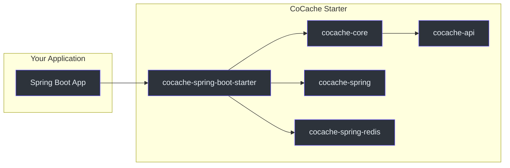
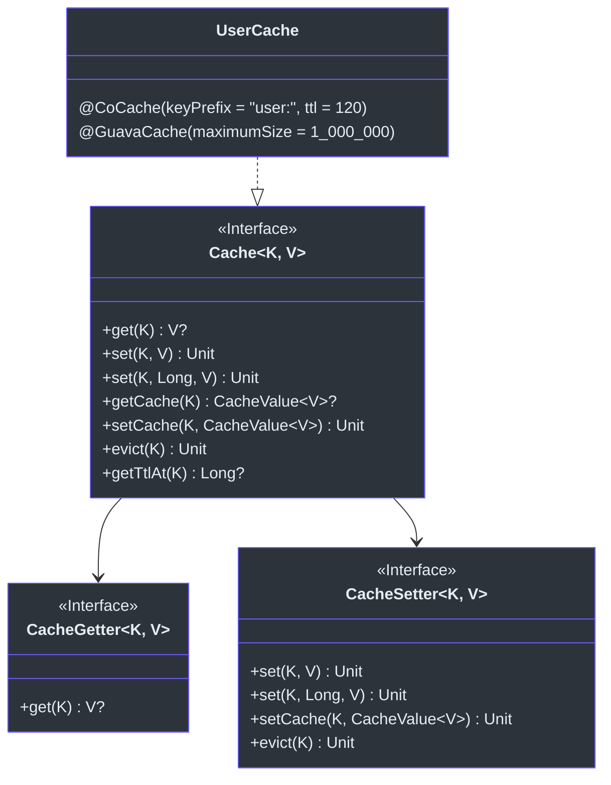
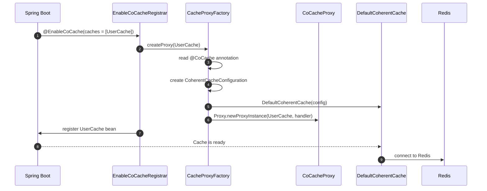
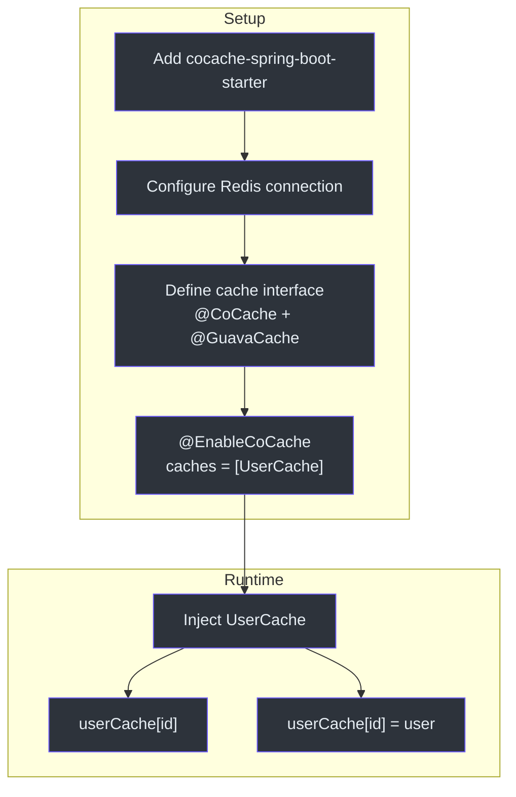

# Quick Start Guide

This guide walks you through adding CoCache to a Spring Boot application, defining a cache interface, and connecting it to Redis.

## Prerequisites

- JDK 17 or later
- A Spring Boot 3.x project
- A running Redis instance (for the distributed cache layer)

## Step 1: Add Dependencies

### Gradle (Kotlin DSL)

```kotlin
// build.gradle.kts
dependencies {
    implementation("me.ahoo.cocache:cocache-spring-boot-starter:4.0.2")
    implementation("org.springframework.boot:spring-boot-starter-data-redis")
}
```

### Gradle (Groovy DSL)

```groovy
dependencies {
    implementation 'me.ahoo.cocache:cocache-spring-boot-starter:4.0.2'
    implementation 'org.springframework.boot:spring-boot-starter-data-redis'
}
```

### Maven

```xml
<dependency>
    <groupId>me.ahoo.cocache</groupId>
    <artifactId>cocache-spring-boot-starter</artifactId>
    <version>4.0.2</version>
</dependency>
<dependency>
    <groupId>org.springframework.boot</groupId>
    <artifactId>spring-boot-starter-data-redis</artifactId>
</dependency>
```

The `cocache-spring-boot-starter` transitively pulls in `cocache-core`, `cocache-spring`, and `cocache-spring-redis`.



## Step 2: Configure Redis

Set Redis connection properties in `application.yml`:

```yaml
spring:
  data:
    redis:
      host: localhost
      port: 6379
      # password: your-password
      # database: 0
```

## Step 3: Define a Cache Interface

Create a Kotlin interface that extends `Cache<K, V>` and annotate it with `@CoCache`. The annotation parameters configure the distributed cache behavior.



### Basic Cache Interface

```kotlin
import me.ahoo.cache.api.Cache
import me.ahoo.cache.api.annotation.CoCache
import me.ahoo.cache.api.annotation.GuavaCache
import java.util.concurrent.TimeUnit

@CoCache(keyPrefix = "user:", ttl = 120)
@GuavaCache(
    maximumSize = 1_000_000,
    expireUnit = TimeUnit.SECONDS,
    expireAfterAccess = 120
)
interface UserCache : Cache<String, User>
```

Source: [cocache-example/.../cache/UserCache.kt](https://github.com/Ahoo-Wang/CoCache/blob/main/cocache-example/src/main/kotlin/me/ahoo/cache/example/cache/UserCache.kt)

The cache interface is automatically implemented by `CoCacheProxy` at runtime via dynamic proxy. You do not need to write any implementation code.

### The Model Class

```kotlin
data class User(val id: String, val name: String)
```

Source: [cocache-example/.../model/User.kt](https://github.com/Ahoo-Wang/CoCache/blob/main/cocache-example/src/main/kotlin/me/ahoo/cache/example/model/User.kt)

## Step 4: Enable CoCache

Annotate your Spring Boot application class with `@EnableCoCache` and list the cache interfaces to register:

```kotlin
import me.ahoo.cache.spring.EnableCoCache
import org.springframework.boot.autoconfigure.SpringBootApplication
import org.springframework.boot.runApplication

@EnableCoCache(caches = [UserCache::class])
@SpringBootApplication
class AppServer

fun main(args: Array<String>) {
    runApplication<AppServer>(*args)
}
```

Source: [cocache-example/.../AppServer.kt](https://github.com/Ahoo-Wang/CoCache/blob/main/cocache-example/src/main/kotlin/me/ahoo/cache/example/AppServer.kt)



## Step 5: Use the Cache

Inject the cache interface into any Spring-managed bean and use it directly:

```kotlin
@RestController
@RequestMapping("test")
class TestController(private val userCache: UserCache) {

    @GetMapping("{id}")
    fun get(@PathVariable id: String): User? {
        return userCache[id]
    }

    @PostMapping("{id}")
    fun set(@PathVariable id: String): String {
        val user = User(id, UUID.randomUUID().toString())
        userCache[user.id] = user
        return user.id
    }
}
```

Source: [cocache-example/.../controller/TestController.kt](https://github.com/Ahoo-Wang/CoCache/blob/main/cocache-example/src/main/kotlin/me/ahoo/cache/example/controller/TestController.kt)

## Step 6 (Optional): Custom ClientSideCache and CacheSource

You can customize the L2 cache and data source per cache interface by declaring beans with matching names:

```kotlin
@Configuration
class UserCacheConfiguration {
    @Bean
    fun customizeUserClientSideCache(): ClientSideCache<User> {
        return MapClientSideCache(ttl = 120, ttlAmplitude = 10)
    }

    @Bean
    fun customizeUserCacheSource(): CacheSource<String, User> {
        return CacheSource.noOp()  // No data source fallback
    }
}
```

Source: [cocache-example/.../config/UserCacheConfiguration.kt](https://github.com/Ahoo-Wang/CoCache/blob/main/cocache-example/src/main/kotlin/me/ahoo/cache/example/config/UserCacheConfiguration.kt)

If you do not provide custom beans, the auto-configuration uses defaults:
- **ClientSideCache**: Guava-based (if `@GuavaCache` is present) or Caffeine-based (if `@CaffeineCache` is present)
- **CacheSource**: Requires a `CacheSource` bean or falls back to `CacheSource.noOp()`

## Step 7 (Optional): Programmatic CoherentCache

For advanced use cases, you can create `CoherentCache` instances programmatically:

```kotlin
@Configuration
class ClassDefinedCacheConfiguration {
    @Bean("userCache")
    fun userCache(
        redisTemplate: StringRedisTemplate,
        coherentCacheFactory: CoherentCacheFactory,
        objectMapper: ObjectMapper,
        clientIdGenerator: ClientIdGenerator
    ): CoherentCache<String, User> {
        val codecExecutor = ObjectToJsonCodecExecutor<User>(
            User::class.java, redisTemplate, objectMapper
        )
        val distributedCache: DistributedCache<User> =
            RedisDistributedCache(redisTemplate, codecExecutor)

        return coherentCacheFactory.create(
            CoherentCacheConfiguration(
                cacheName = "userCache",
                clientId = clientIdGenerator.generate(),
                keyConverter = ToStringKeyConverter("user:"),
                distributedCache = distributedCache,
                clientSideCache = GuavaClientSideCache(
                    CacheBuilder.newBuilder()
                        .expireAfterAccess(Duration.ofHours(1))
                        .build<String, CacheValue<User>>()
                )
            )
        )
    }
}
```

Source: [cocache-example/.../config/ClassDefinedCacheConfiguration.kt](https://github.com/Ahoo-Wang/CoCache/blob/main/cocache-example/src/main/kotlin/me/ahoo/cache/example/config/ClassDefinedCacheConfiguration.kt)

## Complete Flow Diagram



## Available Cache Operations

| Operation | Method | Description | Source |
|-----------|--------|-------------|--------|
| Get | `cache[key]` | Retrieves value through L2 -> L1 -> DataSource | [CacheGetter.kt](https://github.com/Ahoo-Wang/CoCache/blob/main/cocache-api/src/main/kotlin/me/ahoo/cache/api/CacheGetter.kt) |
| Set | `cache[key] = value` | Writes to both L2 and L1, publishes evict event | [CacheSetter.kt](https://github.com/Ahoo-Wang/CoCache/blob/main/cocache-api/src/main/kotlin/me/ahoo/cache/api/CacheSetter.kt) |
| Set with TTL | `cache[key, ttl] = value` | Set with custom TTL and optional amplitude | [CacheSetter.kt](https://github.com/Ahoo-Wang/CoCache/blob/main/cocache-api/src/main/kotlin/me/ahoo/cache/api/CacheSetter.kt) |
| Evict | `cache.evict(key)` | Removes from both L2 and L1, publishes evict event | [DefaultCoherentCache.kt:151-156](https://github.com/Ahoo-Wang/CoCache/blob/main/cocache-core/src/main/kotlin/me/ahoo/cache/consistency/DefaultCoherentCache.kt#L151-L156) |
| Get TTL | `cache.getTtlAt(key)` | Returns expiration timestamp for the key | [CacheGetter.kt](https://github.com/Ahoo-Wang/CoCache/blob/main/cocache-api/src/main/kotlin/me/ahoo/cache/api/CacheGetter.kt) |

## Related Pages

- [Introduction](./index.md) -- Architecture overview and key features
- [Configuration Reference](./configuration.md) -- All annotation parameters and properties
- [Testing Overview](../testing/index.md) -- TCK test specs
- [Unit Testing](../testing/unit-testing.md) -- Writing tests with cache spec base classes
