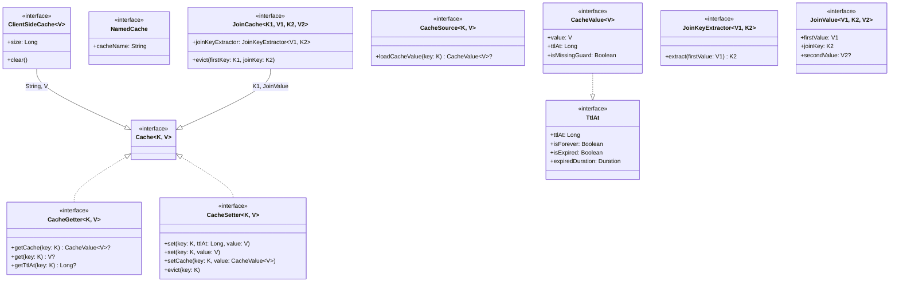
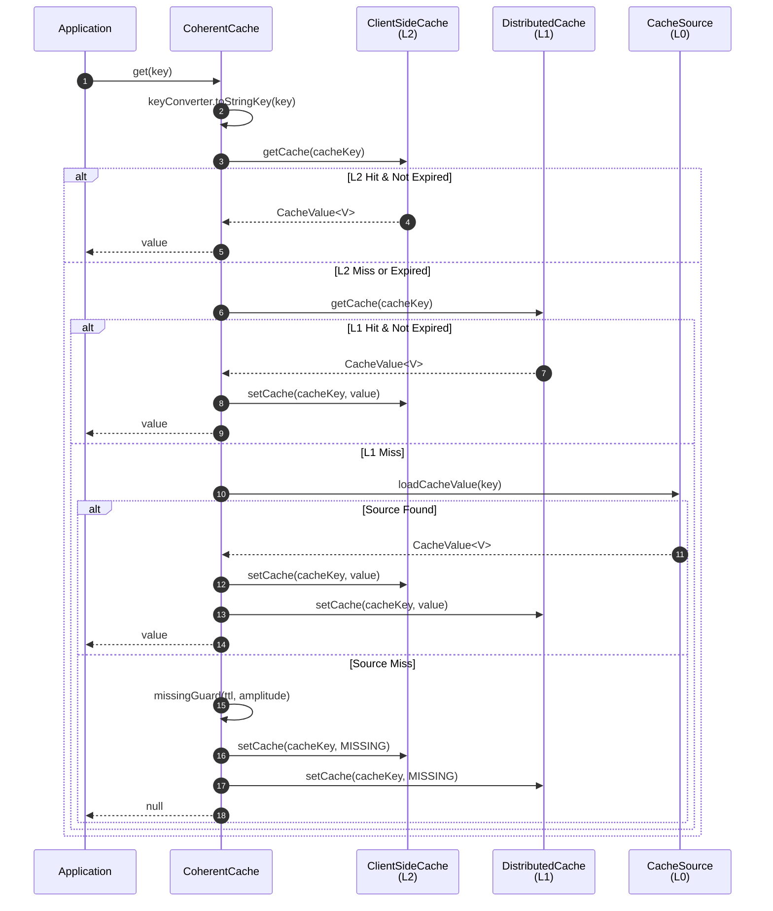
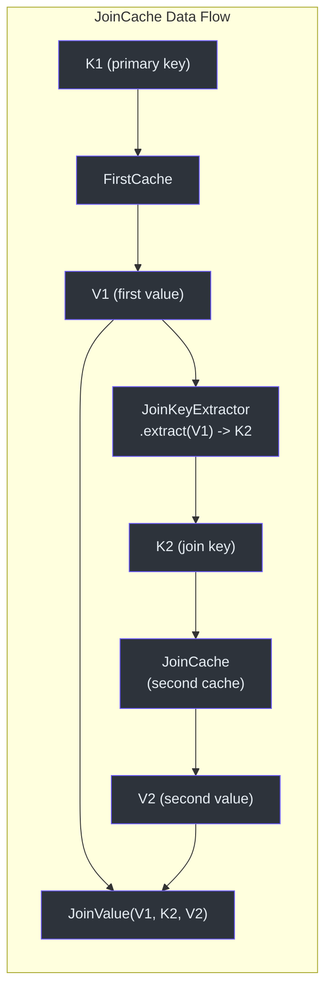
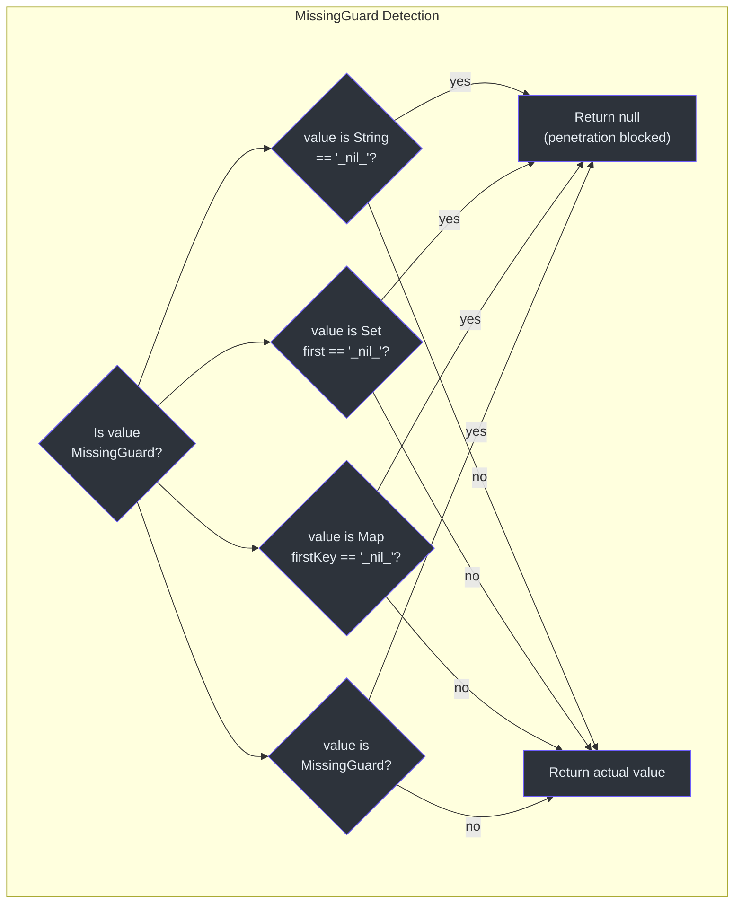

# cocache-api Module

The `cocache-api` module is the foundation of CoCache. It defines all interfaces, data contracts, and annotations that downstream modules implement. Because it has no implementation dependencies, any project can depend on `cocache-api` to program against the CoCache contract without pulling in Guava, Caffeine, Redis, or Spring.

## Interface Hierarchy



## Source Files

The module contains exactly **16 source files** organized into 4 packages.

### Core Interfaces (6 files)

| Interface | File | Description |
|-----------|------|-------------|
| `Cache<K, V>` | [Cache.kt](https://github.com/Ahoo-Wang/CoCache/blob/main/cocache-api/src/main/kotlin/me/ahoo/cache/api/Cache.kt#L21) | Top-level cache interface combining `CacheGetter` and `CacheSetter`. All cache operations start here. |
| `CacheGetter<K, V>` | [CacheGetter.kt](https://github.com/Ahoo-Wang/CoCache/blob/main/cocache-api/src/main/kotlin/me/ahoo/cache/api/CacheGetter.kt#L20) | Read-only cache operations: `getCache()` returns `CacheValue` with TTL metadata, `get()` returns the raw value, `getTtlAt()` returns the expiration timestamp. |
| `CacheSetter<K, V>` | [CacheSetter.kt](https://github.com/Ahoo-Wang/CoCache/blob/main/cocache-api/src/main/kotlin/me/ahoo/cache/api/CacheSetter.kt#L16) | Write cache operations: `set()` with/without explicit TTL, `setCache()` with a pre-built `CacheValue`, and `evict()`. |
| `CacheValue<V>` | [CacheValue.kt](https://github.com/Ahoo-Wang/CoCache/blob/main/cocache-api/src/main/kotlin/me/ahoo/cache/api/CacheValue.kt#L20) | Wraps a cached value with its TTL timestamp (`ttlAt`) and a `isMissingGuard` flag for cache penetration protection. Extends `TtlAt`. |
| `TtlAt` | [TtlAt.kt](https://github.com/Ahoo-Wang/CoCache/blob/main/cocache-api/src/main/kotlin/me/ahoo/cache/api/TtlAt.kt#L22) | Time-to-live contract: `ttlAt` (absolute epoch-second timestamp), `isForever`, `isExpired`, `expiredDuration`. |
| `NamedCache` | [NamedCache.kt](https://github.com/Ahoo-Wang/CoCache/blob/main/cocache-api/src/main/kotlin/me/ahoo/cache/api/NamedCache.kt#L20) | Provides `cacheName: String` for cache identification across the event bus and monitoring. |

### Client-Side Cache (1 file)

| Interface | File | Description |
|-----------|------|-------------|
| `ClientSideCache<V>` | [ClientSideCache.kt](https://github.com/Ahoo-Wang/CoCache/blob/main/cocache-api/src/main/kotlin/me/ahoo/cache/api/client/ClientSideCache.kt#L22) | L2 local in-memory cache contract. Extends `Cache<String, V>` with `size` and `clear()`. Implementations include Map, Guava, and Caffeine. |

### Cache Source (2 files)

| Interface | File | Description |
|-----------|------|-------------|
| `CacheSource<K, V>` | [CacheSource.kt](https://github.com/Ahoo-Wang/CoCache/blob/main/cocache-api/src/main/kotlin/me/ahoo/cache/api/source/CacheSource.kt#L24) | L0 data source loader. Called when both L2 (client-side) and L1 (distributed) miss. Returns `CacheValue` to populate the cache. `loadCacheValue()` throws `TimeoutException` on failure. |
| `NoOpCacheSource` | [NoOpCacheSource.kt](https://github.com/Ahoo-Wang/CoCache/blob/main/cocache-api/src/main/kotlin/me/ahoo/cache/api/source/NoOpCacheSource.kt#L22) | Singleton `object` that always returns `null` from `loadCacheValue()`. Used as default when no cache source is configured. Accessible via `CacheSource.noOp()`. |

### Join Cache (3 files)

| Interface | File | Description |
|-----------|------|-------------|
| `JoinCache<K1, V1, K2, V2>` | [JoinCache.kt](https://github.com/Ahoo-Wang/CoCache/blob/main/cocache-api/src/main/kotlin/me/ahoo/cache/api/join/JoinCache.kt#L23) | Composes two cached values. Extends `Cache<K1, JoinValue<V1, K2, V2>>`. Has a `joinKeyExtractor` to derive the secondary key from the primary value, and a dual-key `evict(firstKey, joinKey)`. |
| `JoinKeyExtractor<V1, K2>` | [JoinKeyExtractor.kt](https://github.com/Ahoo-Wang/CoCache/blob/main/cocache-api/src/main/kotlin/me/ahoo/cache/api/join/JoinKeyExtractor.kt#L8) | Functional interface (`fun interface`) that extracts the join/secondary key from the first value. |
| `JoinValue<V1, K2, V2>` | [JoinValue.kt](https://github.com/Ahoo-Wang/CoCache/blob/main/cocache-api/src/main/kotlin/me/ahoo/cache/api/join/JoinValue.kt#L16) | Result type combining `firstValue: V1`, `joinKey: K2`, and optional `secondValue: V2?`. |

### Annotations (4 files)

| Annotation | File | Description |
|-----------|------|-------------|
| `@CoCache` | [CoCache.kt](https://github.com/Ahoo-Wang/CoCache/blob/main/cocache-api/src/main/kotlin/me/ahoo/cache/api/annotation/CoCache.kt#L29) | Marks a cache interface. Parameters: `name` (cache name, defaults to interface simpleName), `keyPrefix`, `keyExpression` (SpEL), `ttl` (default `Long.MAX_VALUE` = forever), `ttlAmplitude` (default 10 seconds, for jitter). |
| `@GuavaCache` | [GuavaCache.kt](https://github.com/Ahoo-Wang/CoCache/blob/main/cocache-api/src/main/kotlin/me/ahoo/cache/api/annotation/GuavaCache.kt#L28) | Configures Guava as L2 client-side cache. Parameters: `initialCapacity`, `concurrencyLevel`, `maximumSize`, `expireUnit`, `expireAfterWrite`, `expireAfterAccess`. |
| `@CaffeineCache` | [CaffeineCache.kt](https://github.com/Ahoo-Wang/CoCache/blob/main/cocache-api/src/main/kotlin/me/ahoo/cache/api/annotation/CaffeineCache.kt#L30) | Configures Caffeine as L2 client-side cache. Parameters: `initialCapacity`, `maximumSize`, `expireUnit`, `expireAfterWrite`, `expireAfterAccess`. |
| `@JoinCacheable` | [JoinCacheable.kt](https://github.com/Ahoo-Wang/CoCache/blob/main/cocache-api/src/main/kotlin/me/ahoo/cache/api/annotation/JoinCacheable.kt#L24) | Marks a cache interface as a JoinCache. Parameters: `name`, `firstCacheName`, `joinCacheName`, `joinKeyExpression`. |

## Cache Value Flow

The following diagram illustrates how `CacheValue` flows through the system, from data source to client:



## JoinCache Composition



## MissingGuard Mechanism

The `MissingGuard` pattern prevents cache penetration (also known as cache null/nil attack). When a `CacheSource` returns `null` for a key that does not exist in the database, CoCache stores a sentinel value (`"_nil_"`) instead. Subsequent lookups for the same key find the sentinel and return `null` without querying the database.



The sentinel detection logic lives in the [MissingGuard](https://github.com/Ahoo-Wang/CoCache/blob/main/cocache-core/src/main/kotlin/me/ahoo/cache/MissingGuard.kt#L17) companion object and works polymorphically across `String`, `Set`, `Map`, and objects implementing the `MissingGuard` marker interface.

## Usage Example

```kotlin
// 1. Define a cache interface
@CoCache(name = "userCache", keyPrefix = "user:", ttl = 3600, ttlAmplitude = 30)
@GuavaCache(maximumSize = 10000, expireAfterWrite = 600)
interface UserCache : Cache<String, User>

// 2. Use in application code
class UserService(private val userCache: UserCache) {
    fun getUser(userId: String): User? = userCache[userId]
    fun updateUser(userId: String, user: User) {
        userCache[userId] = user   // sets L2 + L1 + publishes event
    }
    fun deleteUser(userId: String) {
        userCache.evict(userId)    // evicts L2 + L1 + publishes event
    }
}
```

## Related Pages

- [Module Overview](./index.md) -- Dependency graph and module descriptions
- [cocache-core](./cocache-core.md) -- Default implementations of all API interfaces
- [cocache-spring](./cocache-spring.md) -- Spring integration and `@EnableCoCache`
- [cocache-spring-boot-starter](./cocache-spring-boot-starter.md) -- Auto-configuration
