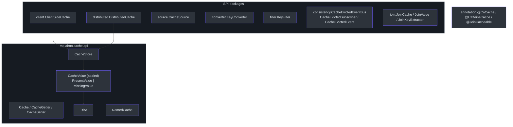
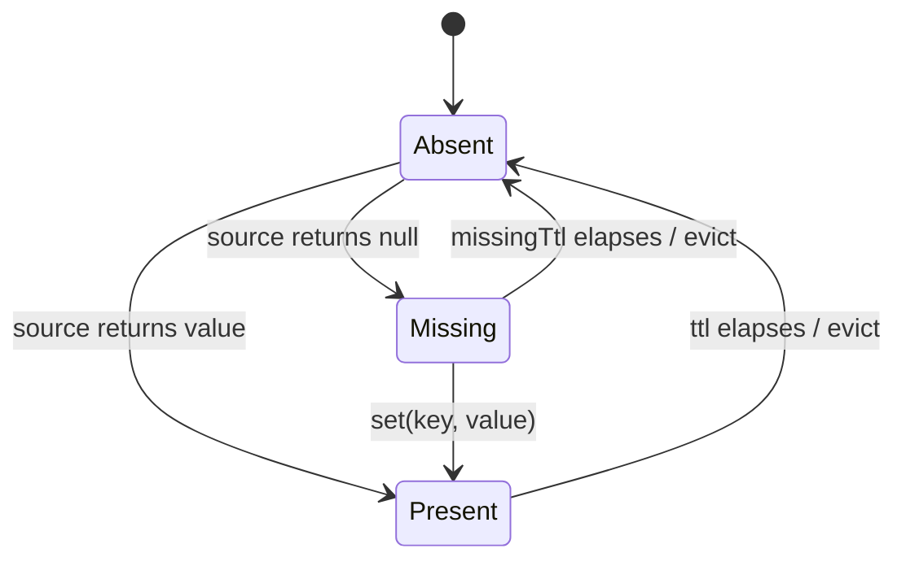
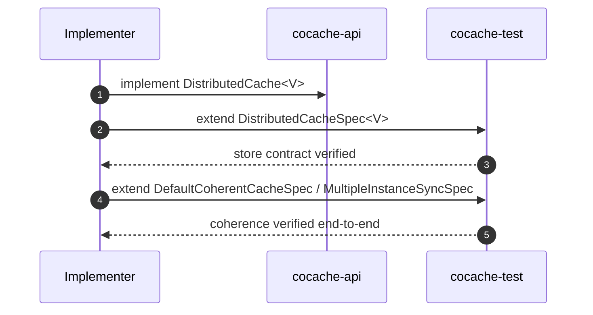

# cocache-api

`cocache-api` defines every contract in CoCache: the API your application calls and the SPI that storage and channel implementations provide. It has no runtime dependencies beyond the Kotlin standard library. A new L1 store or event channel therefore needs only this module, plus `cocache-test` to verify it against the TCK.

## Package Map

```mermaid
graph TB
    subgraph api ["me.ahoo.cache.api"]
        Cache["Cache / CacheGetter / CacheSetter"]
        CV["CacheValue (sealed)<br>PresentValue | MissingValue"]
        TtlAt["TtlAt"]
        Store["CacheStore"]
        Named["NamedCache"]
    end
    subgraph spi ["SPI packages"]
        Client["client.ClientSideCache"]
        Dist["distributed.DistributedCache"]
        Src["source.CacheSource"]
        Conv["converter.KeyConverter"]
        Filt["filter.KeyFilter"]
        Cons["consistency.CacheEvictedEventBus<br>CacheEvictedSubscriber / CacheEvictedEvent"]
        Join["join.JoinCache / JoinValue / JoinKeyExtractor"]
    end
    Ann["annotation.@CoCache / @CaffeineCache / @JoinCacheable"]

    Client --> Store
    Dist --> Store
    Store --> CV
    CV --> TtlAt

    style Cache fill:#2d333b,stroke:#6d5dfc,color:#e6edf3
    style CV fill:#2d333b,stroke:#6d5dfc,color:#e6edf3
    style TtlAt fill:#2d333b,stroke:#6d5dfc,color:#e6edf3
    style Store fill:#2d333b,stroke:#6d5dfc,color:#e6edf3
    style Named fill:#2d333b,stroke:#6d5dfc,color:#e6edf3
    style Client fill:#2d333b,stroke:#6d5dfc,color:#e6edf3
    style Dist fill:#2d333b,stroke:#6d5dfc,color:#e6edf3
    style Src fill:#2d333b,stroke:#6d5dfc,color:#e6edf3
    style Conv fill:#2d333b,stroke:#6d5dfc,color:#e6edf3
    style Filt fill:#2d333b,stroke:#6d5dfc,color:#e6edf3
    style Cons fill:#2d333b,stroke:#6d5dfc,color:#e6edf3
    style Join fill:#2d333b,stroke:#6d5dfc,color:#e6edf3
    style Ann fill:#2d333b,stroke:#6d5dfc,color:#e6edf3
    style api fill:#161b22,stroke:#8b949e,color:#e6edf3
    style spi fill:#161b22,stroke:#8b949e,color:#e6edf3
```

## Contracts

| Type | Kind | Contract | Source |
|------|------|----------|--------|
| `Cache<K, V>` | API | `getCache`, `get`, `getTtlAt`, `setCache`, `set`, `evict` | [Cache.kt](https://github.com/Ahoo-Wang/CoCache/blob/main/cocache-api/src/main/kotlin/me/ahoo/cache/api/Cache.kt) |
| `CacheValue<V>` | Value | Sealed: `PresentValue(value, ttlAt)` / `MissingValue(ttlAt)`; `of(null, …)` is missing | [CacheValue.kt](https://github.com/Ahoo-Wang/CoCache/blob/main/cocache-api/src/main/kotlin/me/ahoo/cache/api/CacheValue.kt) |
| `TtlAt` | Value | Absolute epoch-second expiry, `FOREVER`, `at(ttl, amplitude)` | [TtlAt.kt](https://github.com/Ahoo-Wang/CoCache/blob/main/cocache-api/src/main/kotlin/me/ahoo/cache/api/TtlAt.kt) |
| `CacheStore<V>` | SPI | Pure string-key storage of `CacheValue`; no policy | [CacheStore.kt](https://github.com/Ahoo-Wang/CoCache/blob/main/cocache-api/src/main/kotlin/me/ahoo/cache/api/CacheStore.kt) |
| `ClientSideCache<V>` | SPI | L2 store + `size`, `clear()` | [ClientSideCache.kt](https://github.com/Ahoo-Wang/CoCache/blob/main/cocache-api/src/main/kotlin/me/ahoo/cache/api/client/ClientSideCache.kt) |
| `DistributedCache<V>` | SPI | L1 store + `close()`; `null` from `getCache` means miss | [DistributedCache.kt](https://github.com/Ahoo-Wang/CoCache/blob/main/cocache-api/src/main/kotlin/me/ahoo/cache/api/distributed/DistributedCache.kt) |
| `CacheSource<K, V>` | SPI | `loadCacheValue(key)`; `null` → negative cache | [CacheSource.kt](https://github.com/Ahoo-Wang/CoCache/blob/main/cocache-api/src/main/kotlin/me/ahoo/cache/api/source/CacheSource.kt) |
| `KeyConverter<K>` | SPI | Business key → storage key | [KeyConverter.kt](https://github.com/Ahoo-Wang/CoCache/blob/main/cocache-api/src/main/kotlin/me/ahoo/cache/api/converter/KeyConverter.kt) |
| `KeyFilter` | SPI | `notExist(key)` short-circuits to a negative result | [KeyFilter.kt](https://github.com/Ahoo-Wang/CoCache/blob/main/cocache-api/src/main/kotlin/me/ahoo/cache/api/filter/KeyFilter.kt) |
| `CacheEvictedEventBus` | SPI | `publish` / `register` / `unregister`; must call `onReset` on (re)subscription | [CacheEvictedEventBus.kt](https://github.com/Ahoo-Wang/CoCache/blob/main/cocache-api/src/main/kotlin/me/ahoo/cache/api/consistency/CacheEvictedEventBus.kt) |
| `CacheEvictedSubscriber` | SPI | `onEvicted(event)`, `onReset()` | [CacheEvictedSubscriber.kt](https://github.com/Ahoo-Wang/CoCache/blob/main/cocache-api/src/main/kotlin/me/ahoo/cache/api/consistency/CacheEvictedSubscriber.kt) |
| `JoinCache` / `JoinValue` / `JoinKeyExtractor` | API | Composition of two caches | [join/](https://github.com/Ahoo-Wang/CoCache/tree/main/cocache-api/src/main/kotlin/me/ahoo/cache/api/join) |

## Negative Cache

```mermaid
stateDiagram-v2
    [*] --> Absent
    Absent --> Present: source returns value
    Absent --> Missing: source returns null
    Missing --> Absent: missingTtl elapses / evict
    Present --> Absent: ttl elapses / evict
    Missing --> Present: set(key, value)
```

The negative cache is an explicit type, so it cannot collide with business data: `CacheValue.forever("_nil_").isMissing` is `false`. The Redis sentinel (`_nil_` by default) is purely a wire encoding inside the Redis codecs.

## Annotations

| Annotation | Purpose | Source |
|------------|---------|--------|
| `@CoCache` | `name`, `keyPrefix`, `keyExpression`, `ttl` (3600), `ttlAmplitude` (60), `missingTtl` (60) | [CoCache.kt](https://github.com/Ahoo-Wang/CoCache/blob/main/cocache-api/src/main/kotlin/me/ahoo/cache/api/annotation/CoCache.kt) |
| `@CaffeineCache` | L2 `maximumSize` (10000), `initialCapacity`, `expireAfterAccess` | [CaffeineCache.kt](https://github.com/Ahoo-Wang/CoCache/blob/main/cocache-api/src/main/kotlin/me/ahoo/cache/api/annotation/CaffeineCache.kt) |
| `@JoinCacheable` | `firstCacheName`, `joinCacheName`, `joinKeyExpression` | [JoinCacheable.kt](https://github.com/Ahoo-Wang/CoCache/blob/main/cocache-api/src/main/kotlin/me/ahoo/cache/api/annotation/JoinCacheable.kt) |

## Implementing an SPI

```mermaid
sequenceDiagram
autonumber
    participant Dev as Implementer
    participant API as cocache-api
    participant TCK as cocache-test
    Dev->>API: implement DistributedCache<V>
    Dev->>TCK: extend DistributedCacheSpec<V>
    TCK-->>Dev: store contract verified
    Dev->>TCK: extend DefaultCoherentCacheSpec / MultipleInstanceSyncSpec
    TCK-->>Dev: coherence verified end-to-end
```

## Related Pages

- [Core Interfaces Reference](../api/core-interfaces.md)
- [cocache-core](./cocache-core.md)
- [Testing Overview](../testing/index.md)
