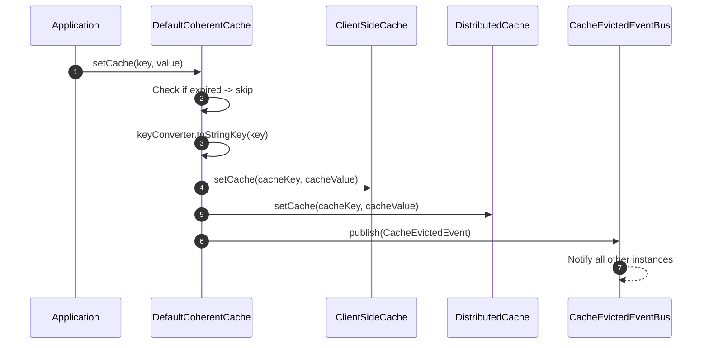
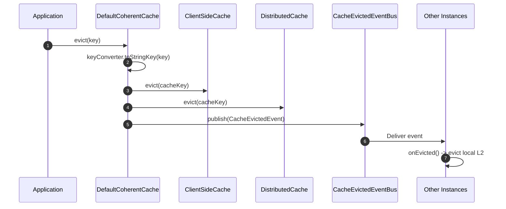
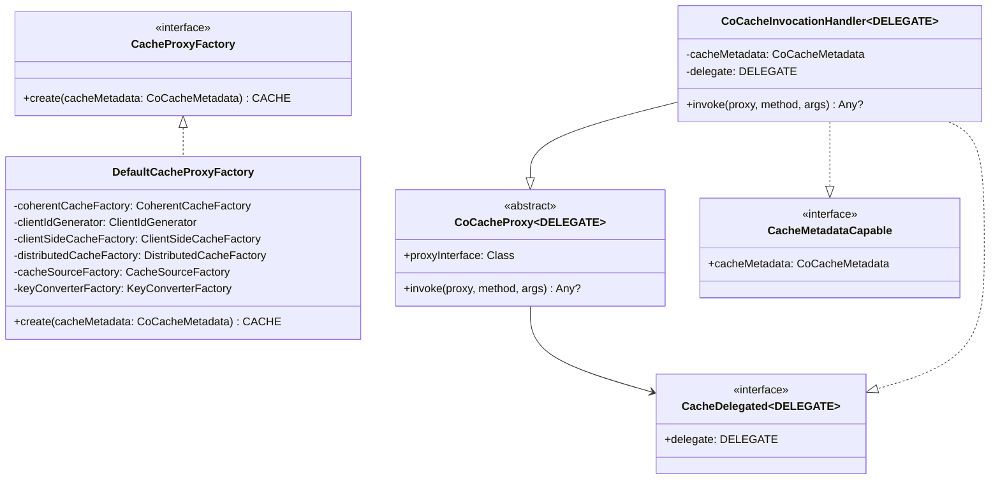
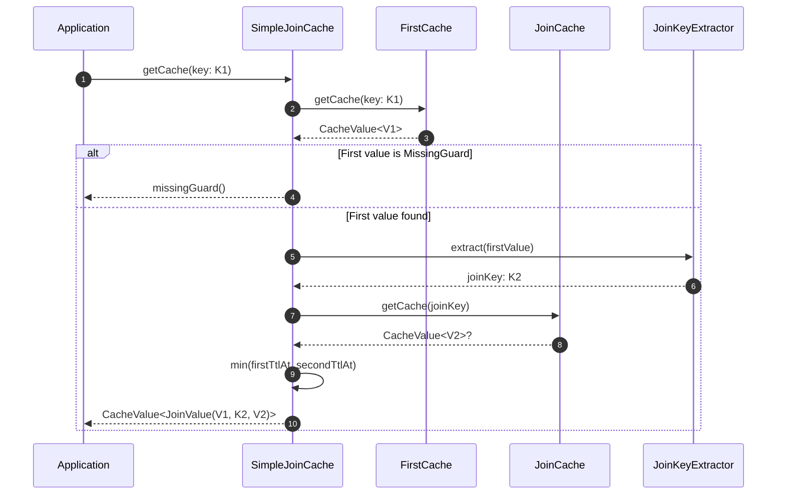

# cocache-core Module

The `cocache-core` module is the engine of CoCache. It contains the default implementations of every interface defined in `cocache-api`, plus the proxy-based caching mechanism, TTL computation with jitter, key filtering, the JoinCache system, and the in-memory event bus.

## Module Dependencies

```mermaid
graph LR
    subgraph "cocache-core Dependencies"
        style "cocache-core Dependencies" fill:#161b22,stroke:#6d5dfc,color:#e6edf3

        api["cocache-api"]
        style api fill:#2d333b,stroke:#6d5dfc,color:#e6edf3

        core["cocache-core"]
        style core fill:#2d333b,stroke:#6d5dfc,color:#e6edf3

        cosid["cosid-core<br>(CoSid ID generation)"]
        style cosid fill:#2d333b,stroke:#6d5dfc,color:#e6edf3

        kotlin["kotlin-reflect"]
        style kotlin fill:#2d333b,stroke:#6d5dfc,color:#e6edf3

        spel["spring-expression<br>(SpEL parsing)"]
        style spel fill:#2d333b,stroke:#6d5dfc,color:#e6edf3

        guava["guava<br>(compileOnly)"]
        style guava fill:#2d333b,stroke:#6d5dfc,color:#e6edf3

        caffeine["caffeine<br>(compileOnly)"]
        style caffeine fill:#2d333b,stroke:#6d5dfc,color:#e6edf3

        api --> core
        cosid --> core
        kotlin --> core
        spel --> core
        guava -.-> core
        caffeine -.-> core
    end

    linkStyle default stroke:#8b949e
```

## DefaultCoherentCache -- The Heart of CoCache

[DefaultCoherentCache](https://github.com/Ahoo-Wang/CoCache/blob/main/cocache-core/src/main/kotlin/me/ahoo/cache/consistency/DefaultCoherentCache.kt#L30) orchestrates the two-level caching strategy. It holds references to the client-side cache (L2), distributed cache (L1), cache source (L0), key filter, key converter, and the event bus.

### Read Path (getCache)

```mermaid
flowchart TB
    subgraph "DefaultCoherentCache.getCache(key)"
        style "DefaultCoherentCache.getCache(key)" fill:#161b22,stroke:#6d5dfc,color:#e6edf3

        start["getCache(key)"]
        style start fill:#2d333b,stroke:#6d5dfc,color:#e6edf3

        convert["keyConverter.toStringKey(key)"]
        style convert fill:#2d333b,stroke:#6d5dfc,color:#e6edf3

        l2["Check L2 (clientSideCache)"]
        style l2 fill:#2d333b,stroke:#6d5dfc,color:#e6edf3

        l2_hit{"L2 hit<br>& not expired?"}
        style l2_hit fill:#2d333b,stroke:#6d5dfc,color:#e6edf3

        l2_evict["Evict expired L2 entry"]
        style l2_evict fill:#2d333b,stroke:#6d5dfc,color:#e6edf3

        filter{"keyFilter.notExist(key)?"}
        style filter fill:#2d333b,stroke:#6d5dfc,color:#e6edf3

        missing["Return missingGuard"]
        style missing fill:#2d333b,stroke:#6d5dfc,color:#e6edf3

        l1["Check L1 (distributedCache)"]
        style l1 fill:#2d333b,stroke:#6d5dfc,color:#e6edf3

        l1_hit{"L1 hit<br>& not expired?"}
        style l1_hit fill:#2d333b,stroke:#6d5dfc,color:#e6edf3

        l1_populate["Populate L2 from L1"]
        style l1_populate fill:#2d333b,stroke:#6d5dfc,color:#e6edf3

        lock["Acquire fine-grained<br>lock (cacheKey)"]
        style lock fill:#2d333b,stroke:#6d5dfc,color:#e6edf3

        recheck["Re-check L2 + L1<br>(double-check)"]
        style recheck fill:#2d333b,stroke:#6d5dfc,color:#e6edf3

        source["cacheSource.loadCacheValue(key)"]
        style source fill:#2d333b,stroke:#6d5dfc,color:#e6edf3

        source_hit{"Source found?"}
        style source_hit fill:#2d333b,stroke:#6d5dfc,color:#e6edf3

        set_both["Set L2 + L1<br>Publish CacheEvictedEvent"]
        style set_both fill:#2d333b,stroke:#6d5dfc,color:#e6edf3

        set_missing["Set missing guard<br>in L2 + L1"]
        style set_missing fill:#2d333b,stroke:#6d5dfc,color:#e6edf3

        release["Release lock"]
        style release fill:#2d333b,stroke:#6d5dfc,color:#e6edf3

        start --> convert --> l2 --> l2_hit
        l2_hit -->|yes| start
        l2_hit -->|no| l2_evict --> filter
        filter -->|yes| missing
        filter -->|no| l1 --> l1_hit
        l1_hit -->|yes| l1_populate --> start
        l1_hit -->|no| lock --> recheck --> source --> source_hit
        source_hit -->|yes| set_both --> release
        source_hit -->|no| set_missing --> release
    end

    linkStyle default stroke:#8b949e
```

The fine-grained locking uses a `ConcurrentHashMap<String, Any>` of per-key lock objects to prevent cache stampede (cache breakdown) -- multiple threads requesting the same missing key will synchronize on the same lock, so only one thread performs the expensive `loadCacheValue()` call.

### Write Path (setCache)



### Evict Path



### Event-Driven Coherence

When a `CacheEvictedEvent` arrives, the `onEvicted()` handler at [DefaultCoherentCache.kt:159](https://github.com/Ahoo-Wang/CoCache/blob/main/cocache-core/src/main/kotlin/me/ahoo/cache/consistency/DefaultCoherentCache.kt#L159) performs two checks:

1. **Cache name match**: Ignores events for different caches.
2. **Self-published check**: Ignores events published by the same `clientId` to avoid redundant evictions.

Only cross-instance events for the matching cache name trigger the local L2 eviction.

## CoherentCacheConfiguration

[CoherentCacheConfiguration](https://github.com/Ahoo-Wang/CoCache/blob/main/cocache-core/src/main/kotlin/me/ahoo/cache/consistency/CoherentCacheConfiguration.kt#L26) is the data class that bundles all components needed to create a `CoherentCache`:

| Field | Type | Default | Purpose |
|-------|------|---------|---------|
| `cacheName` | `String` | (required) | Cache identifier used for event bus routing |
| `clientId` | `String` | (required) | Unique client identifier for coherence filtering |
| `keyConverter` | `KeyConverter<K>` | (required) | Converts typed keys to string cache keys |
| `distributedCache` | `DistributedCache<V>` | (required) | L1 shared cache |
| `clientSideCache` | `ClientSideCache<V>` | `MapClientSideCache()` | L2 local cache |
| `cacheSource` | `CacheSource<K, V>` | `CacheSource.noOp()` | L0 data source |
| `keyFilter` | `KeyFilter` | `NoOpKeyFilter` | Bloom filter for key existence |

## Proxy System

CoCache uses JDK dynamic proxies to create cache implementations from interfaces annotated with `@CoCache`.



### Proxy Creation Flow

In [DefaultCacheProxyFactory.create()](https://github.com/Ahoo-Wang/CoCache/blob/main/cocache-core/src/main/kotlin/me/ahoo/cache/proxy/DefaultCacheProxyFactory.kt#L40):

1. Generate a unique `clientId` via `ClientIdGenerator`.
2. Create `ClientSideCache` (L2) from the factory.
3. Create `DistributedCache` (L1) from the factory.
4. Create `CacheSource` (L0) from the factory.
5. Create `KeyConverter` from the factory.
6. Build a `CoherentCache` via `CoherentCacheFactory`, which also registers it on the event bus.
7. Wrap in a `CoCacheInvocationHandler` and create a JDK `Proxy` implementing the user's interface, `CoherentCache`, `CacheDelegated`, and `CacheMetadataCapable`.

### Method Dispatch

[CoCacheProxy.invoke()](https://github.com/Ahoo-Wang/CoCache/blob/main/cocache-core/src/main/kotlin/me/ahoo/cache/proxy/CoCacheProxy.kt#L34) handles two cases:

- **Default methods** on the proxy interface: Delegates to `InvocationHandler.invokeDefault()` for proper default method resolution.
- **All other methods**: Delegates directly to the `CoherentCache` implementation via `method.invoke(delegate, *args)`.

## Client-Side Cache Implementations

Three implementations of `ClientSideCache<V>` are provided:

| Implementation | File | Backing Store | Key Features |
|---------------|------|---------------|--------------|
| `MapClientSideCache` | [MapClientSideCache.kt](https://github.com/Ahoo-Wang/CoCache/blob/main/cocache-core/src/main/kotlin/me/ahoo/cache/client/MapClientSideCache.kt#L24) | `ConcurrentHashMap` | Simplest implementation, no eviction policy, default for `CoherentCacheConfiguration` |
| `GuavaClientSideCache` | [GuavaClientSideCache.kt](https://github.com/Ahoo-Wang/CoCache/blob/main/cocache-core/src/main/kotlin/me/ahoo/cache/client/GuavaClientSideCache.kt#L26) | Guava `Cache` | Supports `maximumSize`, `expireAfterWrite`, `expireAfterAccess`, `initialCapacity`, `concurrencyLevel`. Built via `@GuavaCache.toClientSideCache()` |
| `CaffeineClientSideCache` | [CaffeineClientSideCache.kt](https://github.com/Ahoo-Wang/CoCache/blob/main/cocache-core/src/main/kotlin/me/ahoo/cache/client/CaffeineClientSideCache.kt#L27) | Caffeine `Cache` | Same features as Guava minus `concurrencyLevel`. Built via `@CaffeineCache.toClientSideCache()` |

All three implement `ComputedClientSideCache<V>` which extends both `ClientSideCache<V>` and `ComputedCache<String, V>`, providing automatic expired-entry eviction on read.

## TTL System

The TTL system provides time-to-live computation with jitter to prevent cache avalanche (all entries expiring at once).

```mermaid
graph TB
    subgraph "TTL Computation Pipeline"
        style "TTL Computation Pipeline" fill:#161b22,stroke:#6d5dfc,color:#e6edf3

        ttl_input["ttl (base seconds)"]
        style ttl_input fill:#2d333b,stroke:#6d5dfc,color:#e6edf3

        amp_input["ttlAmplitude (jitter range)"]
        style amp_input fill:#2d333b,stroke:#6d5dfc,color:#e6edf3

        jitter["ComputedTtlAt.jitter(ttl, amplitude)<br>random(ttl - amp .. ttl + amp)"]
        style jitter fill:#2d333b,stroke:#6d5dfc,color:#e6edf3

        clock["CacheSecondClock.INSTANCE<br>.currentTime()"]
        style clock fill:#2d333b,stroke:#6d5dfc,color:#e6edf3

        at["ttlAt = currentTime + jitteredTtl"]
        style at fill:#2d333b,stroke:#6d5dfc,color:#e6edf3

        store["Store CacheValue(value, ttlAt)"]
        style store fill:#2d333b,stroke:#6d5dfc,color:#e6edf3

        expire_check{"CacheSecondClock.now > ttlAt?"}
        style expire_check fill:#2d333b,stroke:#6d5dfc,color:#e6edf3

        expired["isExpired = true"]
        style expired fill:#2d333b,stroke:#6d5dfc,color:#e6edf3

        valid["isExpired = false"]
        style valid fill:#2d333b,stroke:#6d5dfc,color:#e6edf3

        ttl_input --> jitter
        amp_input --> jitter
        jitter --> at
        clock --> at
        at --> store
        store --> expire_check
        expire_check -->|yes| expired
        expire_check -->|no| valid
    end

    linkStyle default stroke:#8b949e
```

### Key TTL Classes

| Class | File | Purpose |
|-------|------|---------|
| `ComputedTtlAt` | [ComputedTtlAt.kt](https://github.com/Ahoo-Wang/CoCache/blob/main/cocache-core/src/main/kotlin/me/ahoo/cache/ComputedTtlAt.kt#L20) | Computes `isExpired`, `isForever`, `expiredDuration`. Uses `CacheSecondClock` for current time. The `jitter()` function randomizes TTL within amplitude bounds. |
| `TtlConfiguration` | [TtlConfiguration.kt](https://github.com/Ahoo-Wang/CoCache/blob/main/cocache-core/src/main/kotlin/me/ahoo/cache/TtlConfiguration.kt#L19) | Interface carrying `ttl` and `ttlAmplitude`. Implemented by `CoCacheMetadata` and `CoherentCacheConfiguration`. |
| `CacheSecondClock` | [CacheSecondClock.kt](https://github.com/Ahoo-Wang/CoCache/blob/main/cocache-core/src/main/kotlin/me/ahoo/cache/util/CacheSecondClock.kt#L23) | Singleton daemon thread that updates `lastTime` every second from `SystemSecondClock`. Avoids repeated `System.currentTimeMillis()` calls. |
| `DefaultCacheValue` | [DefaultCacheValue.kt](https://github.com/Ahoo-Wang/CoCache/blob/main/cocache-core/src/main/kotlin/me/ahoo/cache/DefaultCacheValue.kt#L31) | Default `CacheValue` implementation. Factory methods: `forever()`, `ttlAt()`, `missingGuard()`. |

## Key Converter System

Key converters transform typed cache keys into the string keys used by L1/L2 caches.

| Class | File | Strategy |
|-------|------|----------|
| `KeyConverter<K>` | [KeyConverter.kt](https://github.com/Ahoo-Wang/CoCache/blob/main/cocache-core/src/main/kotlin/me/ahoo/cache/converter/KeyConverter.kt#L8) | `fun interface` with `toStringKey(sourceKey: K): String` |
| `ToStringKeyConverter<K>` | [ToStringKeyConverter.kt](https://github.com/Ahoo-Wang/CoCache/blob/main/cocache-core/src/main/kotlin/me/ahoo/cache/converter/ToStringKeyConverter.kt#L20) | `keyPrefix + sourceKey.toString()`. Default when no `keyExpression` is configured. |
| `ExpKeyConverter<K>` | [ExpKeyConverter.kt](https://github.com/Ahoo-Wang/CoCache/blob/main/cocache-core/src/main/kotlin/me/ahoo/cache/converter/ExpKeyConverter.kt#L24) | Uses SpEL expression: `keyPrefix + expression.getValue(sourceKey)`. For complex key derivation from composite objects. |

Example: A `UserCache` with `keyPrefix = "user:"` and key type `String` produces cache keys like `"user:123"`. With a `keyExpression = "#{id}"` and key type `User`, it evaluates the SpEL expression against the `User` object to extract the ID.

## Key Filter (Bloom Filter)

The `KeyFilter` interface prevents cache penetration by checking if a key has ever been seen.

| Implementation | File | Behavior |
|---------------|------|----------|
| `NoOpKeyFilter` | [NoOpKeyFilter.kt](https://github.com/Ahoo-Wang/CoCache/blob/main/cocache-core/src/main/kotlin/me/ahoo/cache/filter/NoOpKeyFilter.kt#L22) | Always returns `false` (all keys are considered potentially valid). Default. |
| `BloomKeyFilter` | [BloomKeyFilter.kt](https://github.com/Ahoo-Wang/CoCache/blob/main/cocache-core/src/main/kotlin/me/ahoo/cache/filter/BloomKeyFilter.kt#L23) | Wraps a Guava `BloomFilter<String>`. Returns `true` when the key is definitely not in the filter, short-circuiting the L0 lookup. |

## JoinCache System

### SimpleJoinCache

[SimpleJoinCache](https://github.com/Ahoo-Wang/CoCache/blob/main/cocache-core/src/main/kotlin/me/ahoo/cache/join/SimpleJoinCache.kt#L31) composes two caches:



### Join Key Extraction

| Class | File | Strategy |
|-------|------|----------|
| `JoinKeyExtractor<V1, K2>` | [JoinKeyExtractor.kt](https://github.com/Ahoo-Wang/CoCache/blob/main/cocache-api/src/main/kotlin/me/ahoo/cache/api/join/JoinKeyExtractor.kt#L8) | Functional interface from `cocache-api` |
| `ExpJoinKeyExtractor<V1>` | [ExpJoinKeyExtractor.kt](https://github.com/Ahoo-Wang/CoCache/blob/main/cocache-core/src/main/kotlin/me/ahoo/cache/join/ExpJoinKeyExtractor.kt#L21) | Uses SpEL `#{...}` template expressions to extract a string join key from the first value |

### JoinCache Proxy

| Class | File | Purpose |
|-------|------|---------|
| `JoinCacheProxyFactory` | [JoinCacheProxyFactory.kt](https://github.com/Ahoo-Wang/CoCache/blob/main/cocache-core/src/main/kotlin/me/ahoo/cache/join/proxy/JoinCacheProxyFactory.kt) | Interface for creating JoinCache proxies |
| `DefaultJoinCacheProxyFactory` | [DefaultJoinCacheProxyFactory.kt](https://github.com/Ahoo-Wang/CoCache/blob/main/cocache-core/src/main/kotlin/me/ahoo/cache/join/proxy/DefaultJoinCacheProxyFactory.kt) | Creates JoinCache proxies by wiring two CoherentCache instances with a JoinKeyExtractor |
| `JoinCacheInvocationHandler` | [JoinCacheInvocationHandler.kt](https://github.com/Ahoo-Wang/CoCache/blob/main/cocache-core/src/main/kotlin/me/ahoo/cache/join/proxy/JoinCacheInvocationHandler.kt) | InvocationHandler for JoinCache proxy instances |

## CacheEvictedEventBus

The event bus distributes cache invalidation signals across instances.

| Implementation | File | Scope |
|---------------|------|-------|
| `GuavaCacheEvictedEventBus` | [GuavaCacheEvictedEventBus.kt](https://github.com/Ahoo-Wang/CoCache/blob/main/cocache-core/src/main/kotlin/me/ahoo/cache/consistency/GuavaCacheEvictedEventBus.kt#L25) | In-process only. Uses Guava `EventBus` with `@Subscribe`. Suitable for single-instance deployments. |
| `NoOpCacheEvictedEventBus` | [NoOpCacheEvictedEventBus.kt](https://github.com/Ahoo-Wang/CoCache/blob/main/cocache-core/src/main/kotlin/me/ahoo/cache/consistency/NoOpCacheEvictedEventBus.kt#L20) | No-op singleton. All methods are no-ops. |
| `RedisCacheEvictedEventBus` | (in cocache-spring-redis) | Cross-instance via Redis Pub/Sub. See [cocache-spring-redis](./cocache-spring-redis.md). |

## Factory Interfaces

All factories follow a consistent pattern: accept `CoCacheMetadata`, return a component instance.

| Factory | File | Creates |
|---------|------|---------|
| `CacheProxyFactory` | [CacheProxyFactory.kt](https://github.com/Ahoo-Wang/CoCache/blob/main/cocache-core/src/main/kotlin/me/ahoo/cache/proxy/CacheProxyFactory.kt#L19) | Cache proxy instances from `CoCacheMetadata` |
| `CoherentCacheFactory` | [CoherentCacheFactory.kt](https://github.com/Ahoo-Wang/CoCache/blob/main/cocache-core/src/main/kotlin/me/ahoo/cache/consistency/CoherentCacheFactory.kt#L16) | `CoherentCache` from `CoherentCacheConfiguration` |
| `ClientSideCacheFactory` | [ClientSideCacheFactory.kt](https://github.com/Ahoo-Wang/CoCache/blob/main/cocache-core/src/main/kotlin/me/ahoo/cache/client/ClientSideCacheFactory.kt#L19) | `ClientSideCache` from `CoCacheMetadata` |
| `DistributedCacheFactory` | [DistributedCacheFactory.kt](https://github.com/Ahoo-Wang/CoCache/blob/main/cocache-core/src/main/kotlin/me/ahoo/cache/distributed/DistributedCacheFactory.kt#L18) | `DistributedCache` from `CoCacheMetadata` |
| `CacheSourceFactory` | [CacheSourceFactory.kt](https://github.com/Ahoo-Wang/CoCache/blob/main/cocache-core/src/main/kotlin/me/ahoo/cache/source/CacheSourceFactory.kt#L19) | `CacheSource` from `CoCacheMetadata` |
| `KeyConverterFactory` | [KeyConverterFactory.kt](https://github.com/Ahoo-Wang/CoCache/blob/main/cocache-core/src/main/kotlin/me/ahoo/cache/converter/KeyConverterFactory.kt) | `KeyConverter` from `CoCacheMetadata` |
| `JoinKeyExtractorFactory` | [JoinKeyExtractorFactory.kt](https://github.com/Ahoo-Wang/CoCache/blob/main/cocache-core/src/main/kotlin/me/ahoo/cache/join/JoinKeyExtractorFactory.kt#L19) | `JoinKeyExtractor` from `JoinCacheMetadata` |

## ClientIdGenerator

Unique client identifiers are critical for event-driven coherence -- each instance must be able to filter out its own events.

| Implementation | File | Strategy |
|---------------|------|----------|
| `UUIDClientIdGenerator` | [ClientIdGenerator.kt](https://github.com/Ahoo-Wang/CoCache/blob/main/cocache-core/src/main/kotlin/me/ahoo/cache/util/ClientIdGenerator.kt#L32) | Random UUID (no dashes) |
| `HostClientIdGenerator` | [ClientIdGenerator.kt](https://github.com/Ahoo-Wang/CoCache/blob/main/cocache-core/src/main/kotlin/me/ahoo/cache/util/ClientIdGenerator.kt#L38) | `counter:processId@hostAddress` (default in production) |

## CacheFactory

[CacheFactory](https://github.com/Ahoo-Wang/CoCache/blob/main/cocache-core/src/main/kotlin/me/ahoo/cache/CacheFactory.kt#L19) is a registry for looking up cache instances by name or type. The `cocache-spring` module provides `SpringCacheFactory` which delegates to Spring's `BeanFactory`.

## Metadata Parsing

| Class | File | Purpose |
|-------|------|---------|
| `CoCacheMetadata` | [CoCacheMetadata.kt](https://github.com/Ahoo-Wang/CoCache/blob/main/cocache-core/src/main/kotlin/me/ahoo/cache/annotation/CoCacheMetadata.kt#L20) | Parsed data class from `@CoCache` annotation |
| `CoCacheMetadataParser` | [CoCacheMetadataParser.kt](https://github.com/Ahoo-Wang/CoCache/blob/main/cocache-core/src/main/kotlin/me/ahoo/cache/annotation/CoCacheMetadataParser.kt) | Parses `@CoCache` from KClass |
| `JoinCacheMetadata` | [JoinCacheMetadata.kt](https://github.com/Ahoo-Wang/CoCache/blob/main/cocache-core/src/main/kotlin/me/ahoo/cache/annotation/JoinCacheMetadata.kt#L19) | Parsed data class from `@JoinCacheable` |
| `JoinCacheMetadataParser` | [JoinCacheMetadataParser.kt](https://github.com/Ahoo-Wang/CoCache/blob/main/cocache-core/src/main/kotlin/me/ahoo/cache/annotation/JoinCacheMetadataParser.kt) | Parses `@JoinCacheable` from KClass |

## Related Pages

- [Module Overview](./index.md) -- Dependency graph and module descriptions
- [cocache-api](./cocache-api.md) -- Interfaces and annotations
- [cocache-spring](./cocache-spring.md) -- Spring integration and factory beans
- [cocache-spring-redis](./cocache-spring-redis.md) -- Redis distributed cache and event bus
