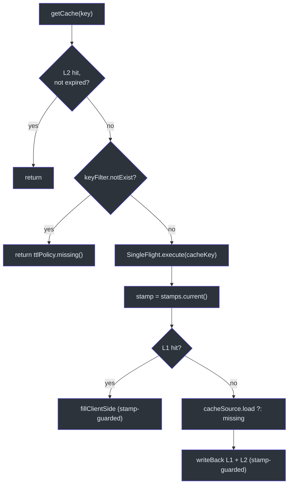
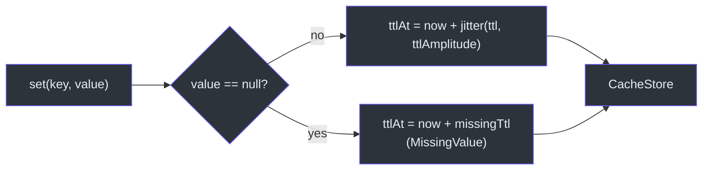
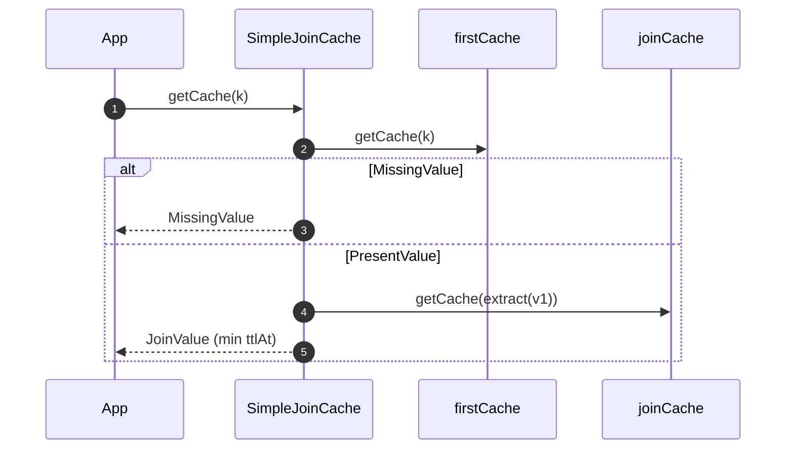

# cocache-core

`cocache-core` implements the CoCache contracts without any Spring or Redis dependency. Its runtime dependencies are `cocache-api`, Caffeine (default L2), Spring Expression (SpEL keys), kotlin-logging, and CosId (client IDs). Guava is compile-only, used by `BloomKeyFilter`.

## Package Overview

| Package | Key Types | Source |
|---------|-----------|--------|
| `me.ahoo.cache` | `TtlPolicy`, `CacheFactory` | [cache/](https://github.com/Ahoo-Wang/CoCache/tree/main/cocache-core/src/main/kotlin/me/ahoo/cache) |
| `me.ahoo.cache.consistency` | `CoherentCache`, `DefaultCoherentCache`, `CoherentCacheConfiguration`, `DefaultCoherentCacheFactory`, `InvalidationStamps` (internal), `LocalCacheEvictedEventBus`, `NoOpCacheEvictedEventBus` | [consistency/](https://github.com/Ahoo-Wang/CoCache/tree/main/cocache-core/src/main/kotlin/me/ahoo/cache/consistency) |
| `me.ahoo.cache.concurrent` | `SingleFlight` | [concurrent/](https://github.com/Ahoo-Wang/CoCache/tree/main/cocache-core/src/main/kotlin/me/ahoo/cache/concurrent) |
| `me.ahoo.cache.client` | `CaffeineClientSideCache`, `MapClientSideCache`, `DefaultClientSideCacheFactory` | [client/](https://github.com/Ahoo-Wang/CoCache/tree/main/cocache-core/src/main/kotlin/me/ahoo/cache/client) |
| `me.ahoo.cache.distributed` | `InMemoryDistributedCache`, `DistributedCacheFactory` | [distributed/](https://github.com/Ahoo-Wang/CoCache/tree/main/cocache-core/src/main/kotlin/me/ahoo/cache/distributed) |
| `me.ahoo.cache.converter` | `ToStringKeyConverter`, `ExpKeyConverter`, `DefaultKeyConverterFactory` | [converter/](https://github.com/Ahoo-Wang/CoCache/tree/main/cocache-core/src/main/kotlin/me/ahoo/cache/converter) |
| `me.ahoo.cache.filter` | `BloomKeyFilter` | [filter/](https://github.com/Ahoo-Wang/CoCache/tree/main/cocache-core/src/main/kotlin/me/ahoo/cache/filter) |
| `me.ahoo.cache.annotation` | `CoCacheMetadata(Parser)`, `JoinCacheMetadata(Parser)` | [annotation/](https://github.com/Ahoo-Wang/CoCache/tree/main/cocache-core/src/main/kotlin/me/ahoo/cache/annotation) |
| `me.ahoo.cache.proxy` | `CacheInvocationHandler`, `DefaultCacheProxyFactory`, `CacheDelegated`, `CacheMetadataCapable` | [proxy/](https://github.com/Ahoo-Wang/CoCache/tree/main/cocache-core/src/main/kotlin/me/ahoo/cache/proxy) |
| `me.ahoo.cache.join` | `SimpleJoinCache`, `ExpJoinKeyExtractor`, `DefaultJoinCacheProxyFactory` | [join/](https://github.com/Ahoo-Wang/CoCache/tree/main/cocache-core/src/main/kotlin/me/ahoo/cache/join) |
| `me.ahoo.cache.util` | `ClientIdGenerator` (UUID / host-based) | [util/](https://github.com/Ahoo-Wang/CoCache/tree/main/cocache-core/src/main/kotlin/me/ahoo/cache/util) |

## DefaultCoherentCache

```mermaid
flowchart TD
    get["getCache(key)"] --> l2{"L2 hit,<br>not expired?"}
    l2 -->|yes| ret["return"]
    l2 -->|no| filter{"keyFilter.notExist?"}
    filter -->|yes| missing["return ttlPolicy.missing()"]
    filter -->|no| flight["SingleFlight.execute(cacheKey)"]
    flight --> stamp["stamp = stamps.current()"]
    stamp --> l1{"L1 hit?"}
    l1 -->|yes| fill["fillClientSide (stamp-guarded)"]
    l1 -->|no| load["cacheSource.load ?: missing"]
    load --> wb["writeBack L1 + L2 (stamp-guarded)"]

    style get fill:#2d333b,stroke:#6d5dfc,color:#e6edf3
    style l2 fill:#2d333b,stroke:#6d5dfc,color:#e6edf3
    style ret fill:#2d333b,stroke:#6d5dfc,color:#e6edf3
    style filter fill:#2d333b,stroke:#6d5dfc,color:#e6edf3
    style missing fill:#2d333b,stroke:#6d5dfc,color:#e6edf3
    style flight fill:#2d333b,stroke:#6d5dfc,color:#e6edf3
    style stamp fill:#2d333b,stroke:#6d5dfc,color:#e6edf3
    style l1 fill:#2d333b,stroke:#6d5dfc,color:#e6edf3
    style fill fill:#2d333b,stroke:#6d5dfc,color:#e6edf3
    style load fill:#2d333b,stroke:#6d5dfc,color:#e6edf3
    style wb fill:#2d333b,stroke:#6d5dfc,color:#e6edf3
```

| Mechanism | What it guarantees | Source |
|-----------|-------------------|--------|
| `SingleFlight` | One L1 read + source load per key at a time within an instance. Followers get the leader's value or **original exception**. Same-key reentrancy fails fast. | [SingleFlight.kt](https://github.com/Ahoo-Wang/CoCache/blob/main/cocache-core/src/main/kotlin/me/ahoo/cache/concurrent/SingleFlight.kt) |
| `InvalidationStamps` | A write-back that overlaps any invalidation of its key (local `evict`/`setCache`, remote `onEvicted`, `onReset`) is skipped or undone | [InvalidationStamps.kt](https://github.com/Ahoo-Wang/CoCache/blob/main/cocache-core/src/main/kotlin/me/ahoo/cache/consistency/InvalidationStamps.kt) |
| `onReset` | Clears L2 and invalidates all stamps when the channel (re)subscribes | [DefaultCoherentCache.kt](https://github.com/Ahoo-Wang/CoCache/blob/main/cocache-core/src/main/kotlin/me/ahoo/cache/consistency/DefaultCoherentCache.kt) |
| `close()` | Idempotent: unregister from the bus, close L1 | [DefaultCoherentCache.kt](https://github.com/Ahoo-Wang/CoCache/blob/main/cocache-core/src/main/kotlin/me/ahoo/cache/consistency/DefaultCoherentCache.kt) |

### CoherentCacheConfiguration

| Field | Default | Description |
|-------|---------|-------------|
| `cacheName` | -- | Event channel and logical name |
| `clientId` | -- | Identifies self-published events |
| `keyConverter` | -- | Business key → storage key |
| `distributedCache` | -- | L1 |
| `clientSideCache` | `CaffeineClientSideCache.build()` | L2 |
| `cacheSource` | `CacheSource.noOp()` | L0 |
| `keyFilter` | `KeyFilter.NO_OP` | Existence filter |
| `ttlPolicy` | `TtlPolicy()` (3600 / 60 / 60) | Value and negative-cache TTLs |

## TTL Policy

```mermaid
graph LR
    V["set(key, value)"] --> P{"value == null?"}
    P -->|no| T["ttlAt = now + jitter(ttl, ttlAmplitude)"]
    P -->|yes| M["ttlAt = now + missingTtl<br>(MissingValue)"]
    T --> S["CacheStore"]
    M --> S

    style V fill:#2d333b,stroke:#6d5dfc,color:#e6edf3
    style P fill:#2d333b,stroke:#6d5dfc,color:#e6edf3
    style T fill:#2d333b,stroke:#6d5dfc,color:#e6edf3
    style M fill:#2d333b,stroke:#6d5dfc,color:#e6edf3
    style S fill:#2d333b,stroke:#6d5dfc,color:#e6edf3
```

The jittered TTL is clamped to stay positive. `TtlAt.FOREVER` as `ttl` disables expiry. Time comes from `CacheClock`, a volatile epoch second refreshed every 100 ms by a daemon thread: `System.currentTimeMillis()` does not scale across threads on some platforms (e.g. macOS), and the hit path checks expiry on every read.

## L2 Implementations

| Class | Notes | Source |
|-------|-------|--------|
| `CaffeineClientSideCache` | Default. `build(maximumSize = 10_000, initialCapacity, expireAfterAccess)`; expired entries are evicted when read. No per-entry `Expiry`, which would write metadata on every read and stop hot keys from scaling | [CaffeineClientSideCache.kt](https://github.com/Ahoo-Wang/CoCache/blob/main/cocache-core/src/main/kotlin/me/ahoo/cache/client/CaffeineClientSideCache.kt) |
| `MapClientSideCache` | Unbounded `ConcurrentHashMap`; tests or small fixed key sets | [MapClientSideCache.kt](https://github.com/Ahoo-Wang/CoCache/blob/main/cocache-core/src/main/kotlin/me/ahoo/cache/client/MapClientSideCache.kt) |

## Proxies and Join

- `CacheInvocationHandler` serves `@CoCache` and `@JoinCacheable` proxies. It unwraps `InvocationTargetException` and implements identity `equals`/`hashCode`. See [Proxy and Annotations](../architecture/proxy.md).
- `SimpleJoinCache` composes two `Cache`s without owning their lifecycles. `evict(key)` evicts only the first cache, and a missing first value yields `MissingValue`.

```mermaid
sequenceDiagram
autonumber
    participant App
    participant SJC as SimpleJoinCache
    participant F as firstCache
    participant J as joinCache
    App->>SJC: getCache(k)
    SJC->>F: getCache(k)
    alt MissingValue
        SJC-->>App: MissingValue
    else PresentValue
        SJC->>J: getCache(extract(v1))
        SJC-->>App: JoinValue (min ttlAt)
    end
```

## Related Pages

- [cocache-api](./cocache-api.md)
- [Cache Layers](../architecture/cache-layers.md)
- [Cache Coherence](../architecture/coherence.md)
