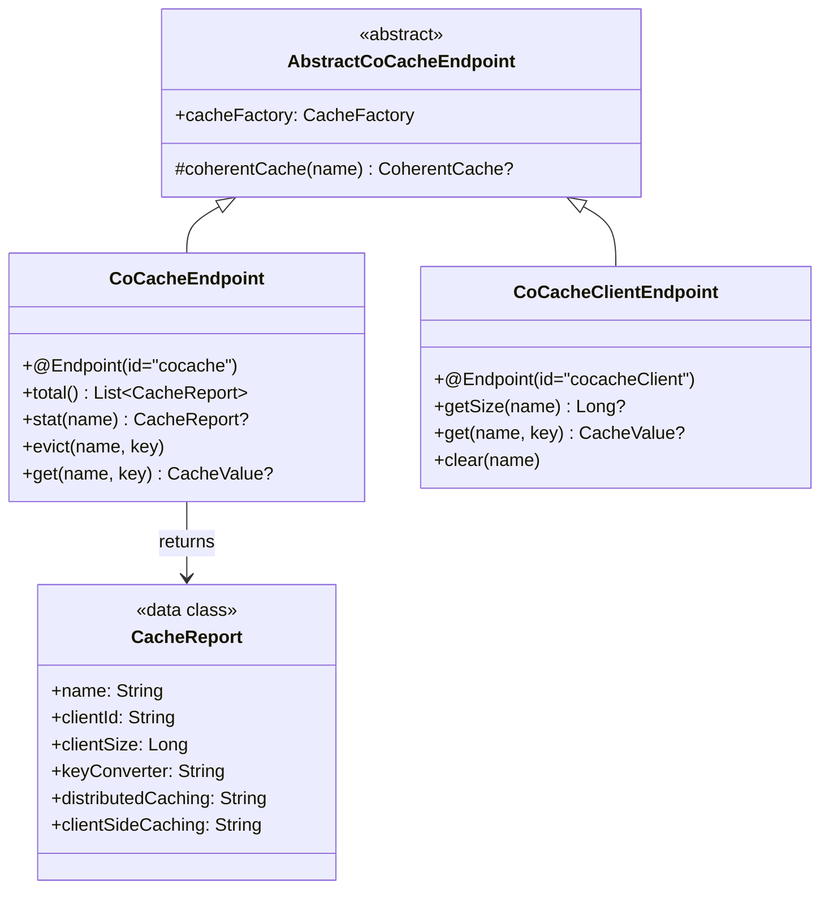
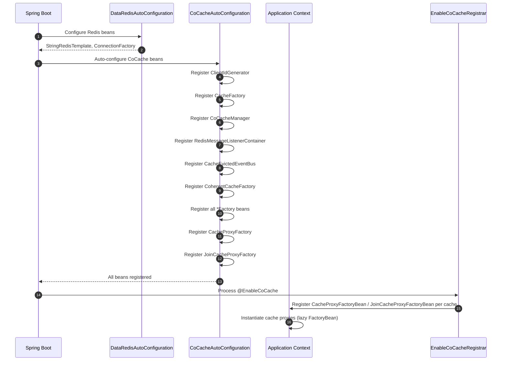

# cocache-spring-boot-starter Module

The `cocache-spring-boot-starter` module provides zero-configuration setup for CoCache in Spring Boot applications. It auto-registers all required beans (factories, event bus, coherent cache factory, proxy factory, cache manager) and exposes Spring Boot Actuator endpoints for runtime cache inspection and management.

## Module Dependencies

```mermaid
graph LR
    subgraph "cocache-spring-boot-starter Dependencies"
        style "cocache-spring-boot-starter Dependencies" fill:#161b22,stroke:#6d5dfc,color:#e6edf3

        spring["cocache-spring"]
        style spring fill:#2d333b,stroke:#6d5dfc,color:#e6edf3

        redis["cocache-spring-redis"]
        style redis fill:#2d333b,stroke:#6d5dfc,color:#e6edf3

        cache["cocache-spring-cache"]
        style cache fill:#2d333b,stroke:#6d5dfc,color:#e6edf3

        starter["cocache-spring-boot-starter"]
        style starter fill:#2d333b,stroke:#6d5dfc,color:#e6edf3

        boot["spring-boot-starter"]
        style boot fill:#2d333b,stroke:#6d5dfc,color:#e6edf3

        data_redis["spring-boot-data-redis"]
        style data_redis fill:#2d333b,stroke:#6d5dfc,color:#e6edf3

        jackson_boot["spring-boot-starter-jackson"]
        style jackson_boot fill:#2d333b,stroke:#6d5dfc,color:#e6edf3

        spring --> starter
        redis --> starter
        cache --> starter
        boot --> starter
        data_redis --> starter
        jackson_boot --> starter
    end

```

## Source Files (8 files)

| File | Package | Description |
|------|---------|-------------|
| [CoCacheAutoConfiguration.kt](https://github.com/Ahoo-Wang/CoCache/blob/main/cocache-spring-boot-starter/src/main/kotlin/me/ahoo/cache/spring/boot/starter/CoCacheAutoConfiguration.kt#L61) | `...boot.starter` | Main auto-configuration class registering all beans |
| [CoCacheProperties.kt](https://github.com/Ahoo-Wang/CoCache/blob/main/cocache-spring-boot-starter/src/main/kotlin/me/ahoo/cache/spring/boot/starter/CoCacheProperties.kt#L23) | `...boot.starter` | Configuration properties under `cocache.*` |
| [ConditionalOnCoCacheEnabled.kt](https://github.com/Ahoo-Wang/CoCache/blob/main/cocache-spring-boot-starter/src/main/kotlin/me/ahoo/cache/spring/boot/starter/ConditionalOnCoCacheEnabled.kt#L23) | `...boot.starter` | Conditional annotation for enabling/disabling CoCache |
| [EnabledSuffix.kt](https://github.com/Ahoo-Wang/CoCache/blob/main/cocache-spring-boot-starter/src/main/kotlin/me/ahoo/cache/spring/boot/starter/EnabledSuffix.kt#L20) | `...boot.starter` | Constant for the `.enabled` suffix |
| [CoCacheEndpoint.kt](https://github.com/Ahoo-Wang/CoCache/blob/main/cocache-spring-boot-starter/src/main/kotlin/me/ahoo/cache/spring/boot/starter/CoCacheEndpoint.kt#L27) | `...boot.starter` | Actuator endpoint for cache stats and management |
| [CoCacheClientEndpoint.kt](https://github.com/Ahoo-Wang/CoCache/blob/main/cocache-spring-boot-starter/src/main/kotlin/me/ahoo/cache/spring/boot/starter/CoCacheClientEndpoint.kt#L25) | `...boot.starter` | Actuator endpoint for client-side (L2) cache inspection |
| [AbstractCoCacheEndpoint.kt](https://github.com/Ahoo-Wang/CoCache/blob/main/cocache-spring-boot-starter/src/main/kotlin/me/ahoo/cache/spring/boot/starter/AbstractCoCacheEndpoint.kt#L19) | `...boot.starter` | Base class for cache endpoints |
| [CoCacheEndpointAutoConfiguration.kt](https://github.com/Ahoo-Wang/CoCache/blob/main/cocache-spring-boot-starter/src/main/kotlin/me/ahoo/cache/spring/boot/starter/CoCacheEndpointAutoConfiguration.kt#L27) | `...boot.starter` | Auto-configuration for actuator endpoints |

## Auto-Configuration Registration

CoCache uses Spring Boot's standard `AutoConfiguration.imports` mechanism:

**File**: `META-INF/spring/org.springframework.boot.autoconfigure.AutoConfiguration.imports`

```
me.ahoo.cache.spring.boot.starter.CoCacheAutoConfiguration
me.ahoo.cache.spring.boot.starter.CoCacheEndpointAutoConfiguration
```

## CoCacheAutoConfiguration -- Bean Wiring

[CoCacheAutoConfiguration](https://github.com/Ahoo-Wang/CoCache/blob/main/cocache-spring-boot-starter/src/main/kotlin/me/ahoo/cache/spring/boot/starter/CoCacheAutoConfiguration.kt#L61) is the main auto-configuration class, annotated with `@AutoConfiguration(after = [DataRedisAutoConfiguration::class])` to ensure Redis is configured first.

```mermaid
graph TB
    subgraph "CoCacheAutoConfiguration Bean Graph"
        style "CoCacheAutoConfiguration Bean Graph" fill:#161b22,stroke:#6d5dfc,color:#e6edf3

        props["@EnableConfigurationProperties<br>(CoCacheProperties)"]
        style props fill:#2d333b,stroke:#6d5dfc,color:#e6edf3

        cond["@ConditionalOnCoCacheEnabled<br>(cocache.enabled=true)"]
        style cond fill:#2d333b,stroke:#6d5dfc,color:#e6edf3

        cid["ClientIdGenerator<br>(default: HostClientIdGenerator)"]
        style cid fill:#2d333b,stroke:#6d5dfc,color:#e6edf3

        cf["CacheFactory<br>(SpringCacheFactory)"]
        style cf fill:#2d333b,stroke:#6d5dfc,color:#e6edf3

        ccm["CoCacheManager<br>(Spring Cache bridge)"]
        style ccm fill:#2d333b,stroke:#6d5dfc,color:#e6edf3

        rmlc["RedisMessageListenerContainer<br>(for Pub/Sub)"]
        style rmlc fill:#2d333b,stroke:#6d5dfc,color:#e6edf3

        eeb["CacheEvictedEventBus<br>(RedisCacheEvictedEventBus)"]
        style eeb fill:#2d333b,stroke:#6d5dfc,color:#e6edf3

        ccf["CoherentCacheFactory<br>(DefaultCoherentCacheFactory)"]
        style ccf fill:#2d333b,stroke:#6d5dfc,color:#e6edf3

        csf["CacheSourceFactory<br>(SpringCacheSourceFactory)"]
        style csf fill:#2d333b,stroke:#6d5dfc,color:#e6edf3

        cscf["ClientSideCacheFactory<br>(SpringClientSideCacheFactory)"]
        style cscf fill:#2d333b,stroke:#6d5dfc,color:#e6edf3

        dcf["DistributedCacheFactory<br>(RedisDistributedCacheFactory)"]
        style dcf fill:#2d333b,stroke:#6d5dfc,color:#e6edf3

        kcf["KeyConverterFactory<br>(SpringKeyConverterFactory)"]
        style kcf fill:#2d333b,stroke:#6d5dfc,color:#e6edf3

        cpf["CacheProxyFactory<br>(DefaultCacheProxyFactory)"]
        style cpf fill:#2d333b,stroke:#6d5dfc,color:#e6edf3

        jkef["JoinKeyExtractorFactory<br>(SpringJoinKeyExtractorFactory)"]
        style jkef fill:#2d333b,stroke:#6d5dfc,color:#e6edf3

        jcpf["JoinCacheProxyFactory<br>(DefaultJoinCacheProxyFactory)"]
        style jcpf fill:#2d333b,stroke:#6d5dfc,color:#e6edf3

        props --> cond
        cond --> cid
        cond --> cf
        cf --> ccm
        cond --> rmlc
        rmlc --> eeb
        eeb --> ccf
        cond --> csf
        cond --> cscf
        cond --> dcf
        cond --> kcf
        cid --> cpf
        ccf --> cpf
        cscf --> cpf
        dcf --> cpf
        csf --> cpf
        kcf --> cpf
        cf --> jcpf
        jkef --> jcpf
    end

```

### Complete Bean List

| Bean | Type | Conditional | Default Implementation |
|------|------|------------|----------------------|
| `defaultHostClientIdGenerator` | `ClientIdGenerator` | `@ConditionalOnMissingBean(ClientIdGenerator, HostAddressSupplier)` | `ClientIdGenerator.HOST` |
| `cacheFactory` | `CacheFactory` | `@ConditionalOnMissingBean` | `SpringCacheFactory` |
| `coCacheManager` | `CoCacheManager` | (always) | `CoCacheManager(cacheFactory)` |
| `cocacheRedisMessageListenerContainer` | `RedisMessageListenerContainer` | `@ConditionalOnMissingBean`, `@ConditionalOnSingleCandidate(RedisConnectionFactory)` | Container with `redisConnectionFactory` |
| `cacheEvictedEventBus` | `CacheEvictedEventBus` | `@ConditionalOnMissingBean` | `RedisCacheEvictedEventBus` |
| `coherentCacheFactory` | `CoherentCacheFactory` | `@ConditionalOnMissingBean` | `DefaultCoherentCacheFactory` |
| `cacheSourceFactory` | `CacheSourceFactory` | `@ConditionalOnMissingBean` | `SpringCacheSourceFactory` |
| `clientSideCacheFactory` | `ClientSideCacheFactory` | `@ConditionalOnMissingBean` | `SpringClientSideCacheFactory` |
| `distributedCacheFactory` | `DistributedCacheFactory` | `@ConditionalOnMissingBean` | `RedisDistributedCacheFactory` |
| `keyConverterFactory` | `KeyConverterFactory` | `@ConditionalOnMissingBean` | `SpringKeyConverterFactory` |
| `cacheProxyFactory` | `CacheProxyFactory` | `@ConditionalOnMissingBean` | `DefaultCacheProxyFactory` |
| `joinKeyExtractorFactory` | `JoinKeyExtractorFactory` | `@ConditionalOnMissingBean` | `SpringJoinKeyExtractorFactory` |
| `joinCacheProxyFactory` | `JoinCacheProxyFactory` | `@ConditionalOnMissingBean` | `DefaultJoinCacheProxyFactory` |

Every bean is annotated with `@ConditionalOnMissingBean`, allowing users to override any component by simply declaring their own bean.

## CoCacheProperties

[CoCacheProperties](https://github.com/Ahoo-Wang/CoCache/blob/main/cocache-spring-boot-starter/src/main/kotlin/me/ahoo/cache/spring/boot/starter/CoCacheProperties.kt#L23) maps to the `cocache.*` prefix:

| Property | Type | Default | Description |
|----------|------|---------|-------------|
| `cocache.enabled` | `Boolean` | `true` | Master switch to enable/disable CoCache |

```yaml
# application.yml
cocache:
  enabled: true  # set to false to disable all CoCache beans
```

## @ConditionalOnCoCacheEnabled

[@ConditionalOnCoCacheEnabled](https://github.com/Ahoo-Wang/CoCache/blob/main/cocache-spring-boot-starter/src/main/kotlin/me/ahoo/cache/spring/boot/starter/ConditionalOnCoCacheEnabled.kt#L23) is a composed annotation that checks `cocache.enabled=true`. It uses `matchIfMissing = true` so CoCache is enabled by default when the property is not set.

## Actuator Endpoints

### CoCacheEndpoint (`/actuator/cocache`)

[CoCacheEndpoint](https://github.com/Ahoo-Wang/CoCache/blob/main/cocache-spring-boot-starter/src/main/kotlin/me/ahoo/cache/spring/boot/starter/CoCacheEndpoint.kt#L27) provides comprehensive cache management:

```mermaid
graph LR
    subgraph "CoCacheEndpoint Operations"
        style "CoCacheEndpoint Operations" fill:#161b22,stroke:#6d5dfc,color:#e6edf3

        total["GET /actuator/cocache<br>-> List of all cache reports"]
        style total fill:#2d333b,stroke:#6d5dfc,color:#e6edf3

        stat["GET /actuator/cocache/{name}<br>-> CacheReport for named cache"]
        style stat fill:#2d333b,stroke:#6d5dfc,color:#e6edf3

        get["GET /actuator/cocache/{name}/{key}<br>-> CacheValue for specific entry"]
        style get fill:#2d333b,stroke:#6d5dfc,color:#e6edf3

        evict["DELETE /actuator/cocache/{name}/{key}<br>-> Evict cache entry"]
        style evict fill:#2d333b,stroke:#6d5dfc,color:#e6edf3

        total --- stat
        stat --- get
        stat --- evict
    end

```

The `CacheReport` data class returned by the endpoint includes:

| Field | Description |
|-------|-------------|
| `name` | Cache name |
| `clientId` | This instance's client ID |
| `clientSize` | Number of entries in L2 client-side cache |
| `keyConverter` | `toString()` of the key converter |
| `distributedCaching` | Fully-qualified class name of the distributed cache |
| `clientSideCaching` | Fully-qualified class name of the client-side cache |
| `cacheEvictedEventBus` | Fully-qualified class name of the event bus |
| `cacheSource` | Fully-qualified class name of the cache source |
| `keyFilter` | Fully-qualified class name of the key filter |

### CoCacheClientEndpoint (`/actuator/cocacheClient`)

[CoCacheClientEndpoint](https://github.com/Ahoo-Wang/CoCache/blob/main/cocache-spring-boot-starter/src/main/kotlin/me/ahoo/cache/spring/boot/starter/CoCacheClientEndpoint.kt#L25) provides L2 (client-side) cache inspection:

| Operation | HTTP | Description |
|-----------|------|-------------|
| `getSize` | `GET /actuator/cocacheClient/{name}` | Returns the size of the L2 client-side cache |
| `get` | `GET /actuator/cocacheClient/{name}/{key}` | Returns the L2 cache value for a specific key (after key conversion) |
| `clear` | `DELETE /actuator/cocacheClient/{name}` | Clears the entire L2 client-side cache for the named cache |

### Endpoint Auto-Configuration

[CoCacheEndpointAutoConfiguration](https://github.com/Ahoo-Wang/CoCache/blob/main/cocache-spring-boot-starter/src/main/kotlin/me/ahoo/cache/spring/boot/starter/CoCacheEndpointAutoConfiguration.kt#L27) is conditional on `Endpoint` being on the classpath (i.e., Spring Boot Actuator is included). It registers both endpoint beans.

## Endpoint Class Hierarchy



## Enable/Disable Decision Flow

```mermaid
flowchart TB
    subgraph "CoCache Activation Logic"
        style "CoCache Activation Logic" fill:#161b22,stroke:#6d5dfc,color:#e6edf3

        boot["Spring Boot starts"]
        style boot fill:#2d333b,stroke:#6d5dfc,color:#e6edf3

        check_prop{"cocache.enabled<br>property?"}
        style check_prop fill:#2d333b,stroke:#6d5dfc,color:#e6edf3

        not_set["Property not set<br>(matchIfMissing=true)"]
        style not_set fill:#2d333b,stroke:#6d5dfc,color:#e6edf3

        is_true{"value == true?"}
        style is_true fill:#2d333b,stroke:#6d5dfc,color:#e6edf3

        activate["Load CoCacheAutoConfiguration<br>Register all beans"]
        style activate fill:#2d333b,stroke:#6d5dfc,color:#e6edf3

        endpoints{"Actuator on<br>classpath?"}
        style endpoints fill:#2d333b,stroke:#6d5dfc,color:#e6edf3

        register_ep["Register CoCacheEndpoint<br>Register CoCacheClientEndpoint"]
        style register_ep fill:#2d333b,stroke:#6d5dfc,color:#e6edf3

        skip_ep["Skip endpoint registration"]
        style skip_ep fill:#2d333b,stroke:#6d5dfc,color:#e6edf3

        disabled["CoCache disabled<br>(all beans skipped)"]
        style disabled fill:#2d333b,stroke:#6d5dfc,color:#e6edf3

        boot --> check_prop
        check_prop -->|not set| not_set --> activate
        check_prop -->|set| is_true
        is_true -->|yes| activate
        is_true -->|no| disabled
        activate --> endpoints
        endpoints -->|yes| register_ep
        endpoints -->|no| skip_ep
    end

```

## CosID Integration

The auto-configuration includes a nested `CosIdHostAddressSupplierAutoConfiguration` class at [CoCacheAutoConfiguration.kt:176](https://github.com/Ahoo-Wang/CoCache/blob/main/cocache-spring-boot-starter/src/main/kotlin/me/ahoo/cache/spring/boot/starter/CoCacheAutoConfiguration.kt#L176) that integrates with [CosID](https://github.com/Ahoo-Wang/CosID) when available. If a `HostAddressSupplier` bean from CosID is present, it creates a `HostClientIdGenerator` that uses CosID's host address resolution.

## Bootstrap Sequence



## Enabling CoCache in a Spring Boot Application

Minimal setup:

```kotlin
// 1. Add dependency (build.gradle.kts)
dependencies {
    implementation("me.ahoo.cocache:cocache-spring-boot-starter")
}

// 2. Define cache interfaces
@CoCache(name = "userCache", keyPrefix = "user:", ttl = 3600)
interface UserCache : Cache<String, User>

// 3. Enable CoCache
@EnableCoCache(caches = [UserCache::class])
@SpringBootApplication
class MyApplication
```

The auto-configuration handles everything else: Redis connection, event bus, proxy creation, and cache manager registration.

## Related Pages

- [Module Overview](./index.md) -- Dependency graph and module descriptions
- [cocache-spring](./cocache-spring.md) -- @EnableCoCache and AbstractCacheFactory
- [cocache-spring-redis](./cocache-spring-redis.md) -- Redis distributed cache and event bus
- [cocache-spring-cache](./cocache-spring-cache.md) -- Spring Cache bridge (CoCacheManager)
