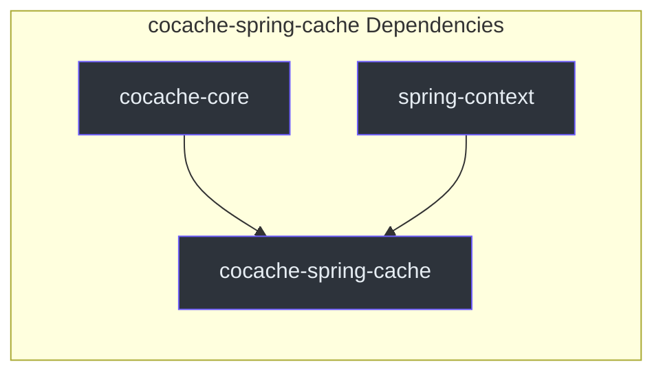
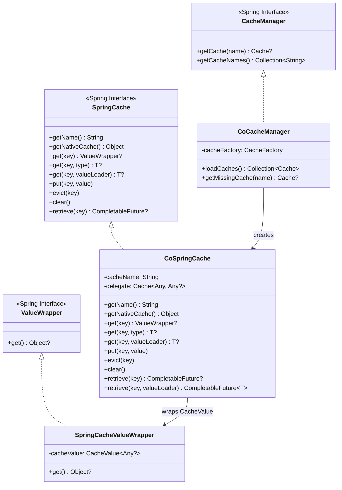
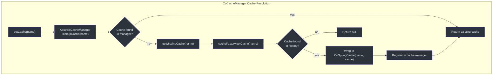
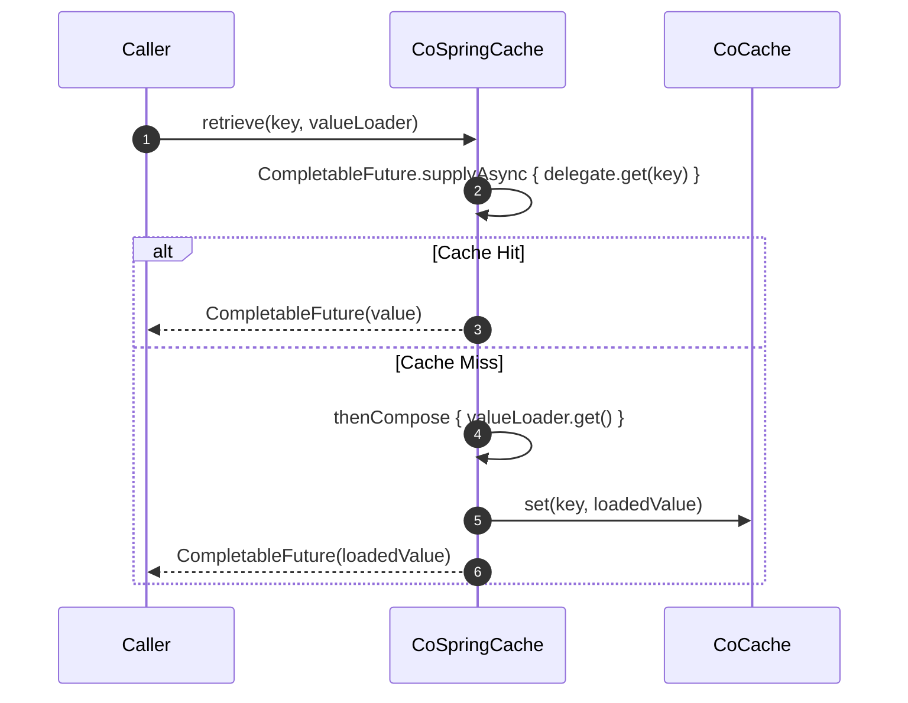
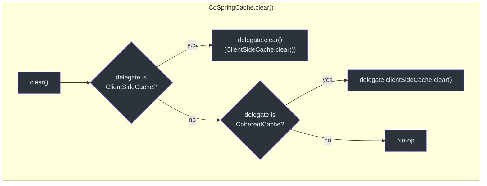
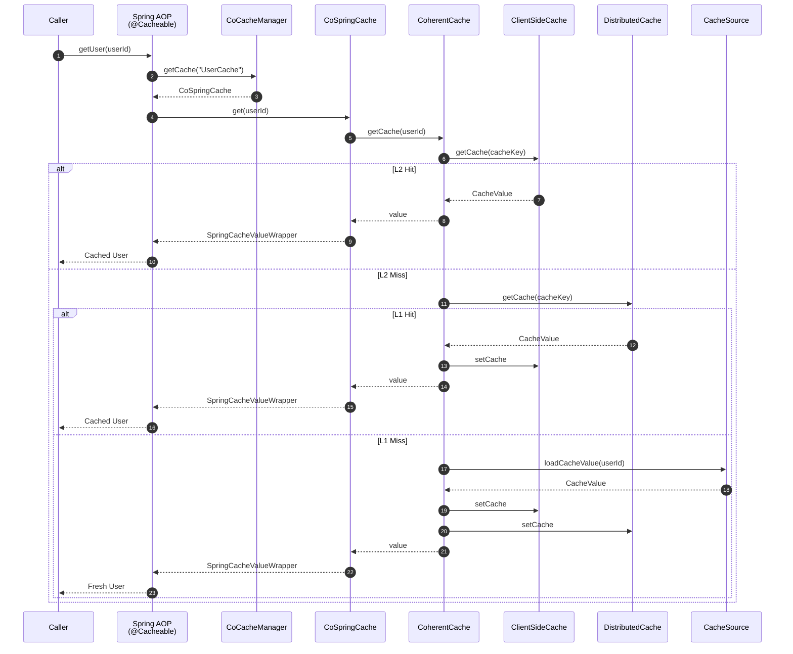

# cocache-spring-cache Module

The `cocache-spring-cache` module implements the bridge between CoCache and Spring's `org.springframework.cache.CacheManager` abstraction. Once configured, all CoCache-managed caches become accessible through Spring's standard `@Cacheable`, `@CachePut`, and `@CacheEvict` annotations, enabling seamless integration with existing Spring Cache infrastructure.

## Module Dependencies



## Source Files (3 files)

| File | Package | Purpose |
|------|---------|---------|
| [CoCacheManager.kt](https://github.com/Ahoo-Wang/CoCache/blob/main/cocache-spring-cache/src/main/kotlin/me/ahoo/cache/spring/cache/CoCacheManager.kt#L21) | `me.ahoo.cache.spring.cache` | Spring `CacheManager` backed by CoCache's `CacheFactory` |
| [CoSpringCache.kt](https://github.com/Ahoo-Wang/CoCache/blob/main/cocache-spring-cache/src/main/kotlin/me/ahoo/cache/spring/cache/CoSpringCache.kt#L27) | `me.ahoo.cache.spring.cache` | Spring `Cache` adapter wrapping a CoCache `Cache` instance |
| [SpringCacheValueWrapper.kt](https://github.com/Ahoo-Wang/CoCache/blob/main/cocache-spring-cache/src/main/kotlin/me/ahoo/cache/spring/cache/SpringCacheValueWrapper.kt#L19) | `me.ahoo.cache.spring.cache` | `Cache.ValueWrapper` adapter for `CacheValue` |

## Architecture Overview



## CoCacheManager

[CoCacheManager](https://github.com/Ahoo-Wang/CoCache/blob/main/cocache-spring-cache/src/main/kotlin/me/ahoo/cache/spring/cache/CoCacheManager.kt#L21) extends Spring's `AbstractCacheManager` and delegates to CoCache's `CacheFactory` for cache resolution.

### Cache Resolution Strategy



### loadCaches()

The `loadCaches()` method at [CoCacheManager.kt:23](https://github.com/Ahoo-Wang/CoCache/blob/main/cocache-spring-cache/src/main/kotlin/me/ahoo/cache/spring/cache/CoCacheManager.kt#L23) eagerly loads all registered caches from the `CacheFactory` and wraps each in a `CoSpringCache`. This populates the cache manager with all known caches at startup.

## CoSpringCache

[CoSpringCache](https://github.com/Ahoo-Wang/CoCache/blob/main/cocache-spring-cache/src/main/kotlin/me/ahoo/cache/spring/cache/CoSpringCache.kt#L27) adapts a CoCache `Cache<Any, Any?>` to Spring's `Cache` interface. It implements `CacheDelegated` and `NamedCache` for access to the underlying CoCache infrastructure.

### Method Mapping

| Spring Cache Method | CoSpringCache Implementation | CoCache Operation |
|--------------------|------------------------------|-------------------|
| `getName()` | Returns `cacheName` | -- |
| `getNativeCache()` | Returns the delegate `Cache` | -- |
| `get(key)` | `delegate.getCache(key)` -> `SpringCacheValueWrapper` | `CacheGetter.getCache()` |
| `get(key, type)` | `delegate.get(key)` cast to `T` | `CacheGetter.get()` |
| `get(key, valueLoader)` | Get or load pattern | Get -> if null, call `valueLoader.call()`, set, return |
| `put(key, value)` | `delegate.set(key, value)` | `CacheSetter.set()` |
| `evict(key)` | `delegate.evict(key)` | `CacheSetter.evict()` |
| `clear()` | `ClientSideCache.clear()` or `CoherentCache.clientSideCache.clear()` | L2 only |
| `retrieve(key)` | `CompletableFuture.supplyAsync { delegate.get(key) }` | Async get |
| `retrieve(key, valueLoader)` | Async get-or-load with `thenCompose` | Async get -> load if null |

### Async Retrieve Support

CoSpringCache supports Spring 6.1's `Cache.retrieve()` methods for asynchronous cache access:



The `retrieve(key, valueLoader)` implementation at [CoSpringCache.kt:82](https://github.com/Ahoo-Wang/CoCache/blob/main/cocache-spring-cache/src/main/kotlin/me/ahoo/cache/spring/cache/CoSpringCache.kt#L82) uses `CompletableFuture.thenCompose()` to chain the cache check with the value loader, avoiding blocking the caller thread during cache misses.

### Clear Behavior

The `clear()` method at [CoSpringCache.kt:66](https://github.com/Ahoo-Wang/CoCache/blob/main/cocache-spring-cache/src/main/kotlin/me/ahoo/cache/spring/cache/CoSpringCache.kt#L66) only clears the L2 (client-side) cache, not the L1 (distributed) cache. This is intentional -- clearing the distributed cache would affect all instances, which is rarely the desired behavior.



## SpringCacheValueWrapper

[SpringCacheValueWrapper](https://github.com/Ahoo-Wang/CoCache/blob/main/cocache-spring-cache/src/main/kotlin/me/ahoo/cache/spring/cache/SpringCacheValueWrapper.kt#L19) is a minimal adapter from CoCache's `CacheValue<Any?>` to Spring's `Cache.ValueWrapper`. The `get()` method returns `cacheValue.value`, which may be `null` for missing guard values.

## Usage with Spring Cache Annotations

Once `CoCacheManager` is registered as a bean (done automatically by `cocache-spring-boot-starter`), standard Spring Cache annotations work out of the box:

```kotlin
@Service
class UserService(
    private val userRepository: UserRepository
) {
    @Cacheable(cacheNames = ["UserCache"], key = "#userId")
    fun getUser(userId: String): User {
        return userRepository.findById(userId).orElseThrow()
    }

    @CachePut(cacheNames = ["UserCache"], key = "#user.id")
    fun updateUser(user: User): User {
        return userRepository.save(user)
    }

    @CacheEvict(cacheNames = ["UserCache"], key = "#userId")
    fun deleteUser(userId: String) {
        userRepository.deleteById(userId)
    }

    @CacheEvict(cacheNames = ["UserCache"], allEntries = true)
    fun clearAllUsers() {
        // Clears L2 only via CoSpringCache.clear()
    }
}
```

This approach works alongside CoCache's native proxy-based caching -- both mechanisms share the same underlying `CoherentCache` instance, so cache operations through either path are consistent.

## Data Flow: @Cacheable Through CoSpringCache



## Registration in Auto-Configuration

The `CoCacheManager` bean is registered in [CoCacheAutoConfiguration.kt:81](https://github.com/Ahoo-Wang/CoCache/blob/main/cocache-spring-boot-starter/src/main/kotlin/me/ahoo/cache/spring/boot/starter/CoCacheAutoConfiguration.kt#L81):

```kotlin
@Bean
fun coCacheManager(cacheFactory: CacheFactory): CoCacheManager {
    return CoCacheManager(cacheFactory)
}
```

In Spring Boot auto-configuration, this bean is created automatically. For non-Boot Spring applications, users must manually register the `CoCacheManager`:

```kotlin
@Configuration
@EnableCaching
class CacheConfig {
    @Bean
    fun cacheManager(cacheFactory: CacheFactory): CoCacheManager {
        return CoCacheManager(cacheFactory)
    }
}
```

## Related Pages

- [Module Overview](./index.md) -- Dependency graph and module descriptions
- [cocache-core](./cocache-core.md) -- CoherentCache, Cache interface, CacheFactory
- [cocache-spring](./cocache-spring.md) -- SpringCacheFactory (the CacheFactory implementation)
- [cocache-spring-boot-starter](./cocache-spring-boot-starter.md) -- Auto-configuration that registers CoCacheManager
