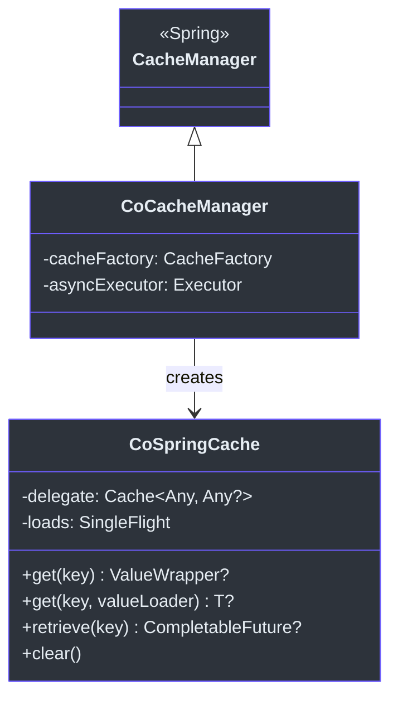
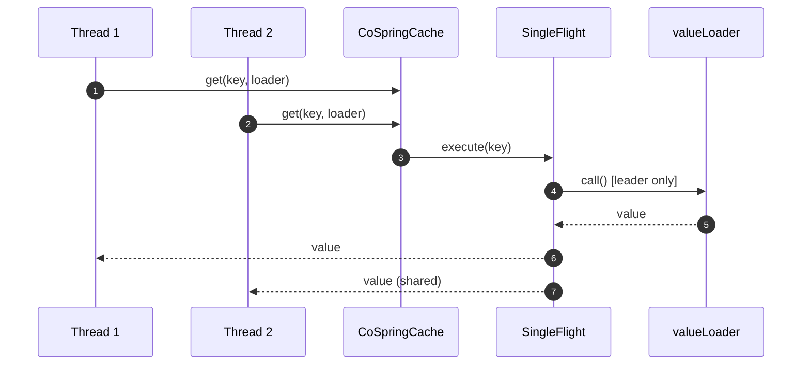

# cocache-spring-cache

This module adapts CoCache caches to Spring's `CacheManager` / `Cache` abstraction, so `@Cacheable`, `@CachePut` and `@CacheEvict` run on the same `CoherentCache` instances as the proxy API.

## Components

| Class | Role | Source |
|-------|------|--------|
| `CoCacheManager` | `AbstractCacheManager` over `CacheFactory`; wraps every CoCache bean as a `CoSpringCache` | [CoCacheManager.kt](https://github.com/Ahoo-Wang/CoCache/blob/main/cocache-spring-cache/src/main/kotlin/me/ahoo/cache/spring/cache/CoCacheManager.kt) |
| `CoSpringCache` | Spring `Cache` adapter over `Cache<Any, Any?>` | [CoSpringCache.kt](https://github.com/Ahoo-Wang/CoCache/blob/main/cocache-spring-cache/src/main/kotlin/me/ahoo/cache/spring/cache/CoSpringCache.kt) |


```mermaid
classDiagram
    class CacheManager {
        <<Spring>>
    }
    class CoCacheManager {
        -cacheFactory: CacheFactory
        -asyncExecutor: Executor
    }
    class CoSpringCache {
        -delegate: Cache~Any, Any?~
        -loads: SingleFlight
        +get(key) ValueWrapper?
        +get(key, valueLoader) T?
        +retrieve(key) CompletableFuture?
        +clear()
    }
    CacheManager <|-- CoCacheManager
    CoCacheManager --> CoSpringCache : creates

    style CacheManager fill:#2d333b,stroke:#6d5dfc,color:#e6edf3
    style CoCacheManager fill:#2d333b,stroke:#6d5dfc,color:#e6edf3
    style CoSpringCache fill:#2d333b,stroke:#6d5dfc,color:#e6edf3
```

## Semantics

| Spring method | Behavior |
|---------------|----------|
| `get(key)` | `SimpleValueWrapper(value)` on a hit. Absent, expired, and **negative-cache** entries return `null` (a miss). |
| `get(key, type)` | As `get(key)`, with a type check (`IllegalStateException` on mismatch) |
| `get(key, valueLoader)` | Concurrent callers for the same key share **one** load (`SingleFlight`), which satisfies `@Cacheable(sync = true)`. Loader failures are wrapped in `ValueRetrievalException`. |
| `put(key, value)` | `delegate[key] = value` with the cache's `TtlPolicy`. `null` is stored as a negative cache. |
| `evict(key)` | `delegate.evict(key)` (L2 + L1 + broadcast) |
| `clear()` | Clears this instance's L2 only, unwrapping proxies and join caches. L1 is shared and cannot be cleared wholesale. |
| `retrieve(key)` / `retrieve(key, loader)` | The blocking lookup runs on `asyncExecutor` (default: a daemon cached thread pool, not the ForkJoin common pool) |

Why negative entries read as a miss: a `CoherentCache` loads from its `CacheSource` on a miss and stores a `MissingValue` when nothing is found. If that were surfaced as a "cached null", `@Cacheable` would never invoke the annotated method for caches whose source is `noOp`.


```mermaid
sequenceDiagram
autonumber
    participant T1 as Thread 1
    participant T2 as Thread 2
    participant CSC as CoSpringCache
    participant SF as SingleFlight
    participant L as valueLoader

    T1->>CSC: get(key, loader)
    T2->>CSC: get(key, loader)
    CSC->>SF: execute(key)
    SF->>L: call() [leader only]
    L-->>SF: value
    SF-->>T1: value
    SF-->>T2: value (shared)
```

## Usage

```kotlin
@Service
class UserService(private val userRepository: UserRepository) {
    @Cacheable(cacheNames = ["UserCache"], key = "#userId", sync = true)
    fun getUser(userId: String): User = userRepository.findById(userId).orElseThrow()

    @CacheEvict(cacheNames = ["UserCache"], key = "#user.id")
    fun updateUser(user: User): User = userRepository.save(user)
}
```

Prefer `@CacheEvict` after a write over `@CachePut`: evicting forces the next read to load the committed state.

## Registration

`cocache-spring-boot-starter` registers `CoCacheManager` unless another `CacheManager` exists. Without Boot:

```kotlin
@Configuration
@EnableCaching
class CacheConfig {
    @Bean
    fun cacheManager(cacheFactory: CacheFactory, executor: Executor): CoCacheManager = CoCacheManager(cacheFactory, executor)
}
```

## Related Pages

- [Module Overview](./index.md)
- [cocache-core](./cocache-core.md)
- [Spring Integration API](../api/spring-integration.md)
