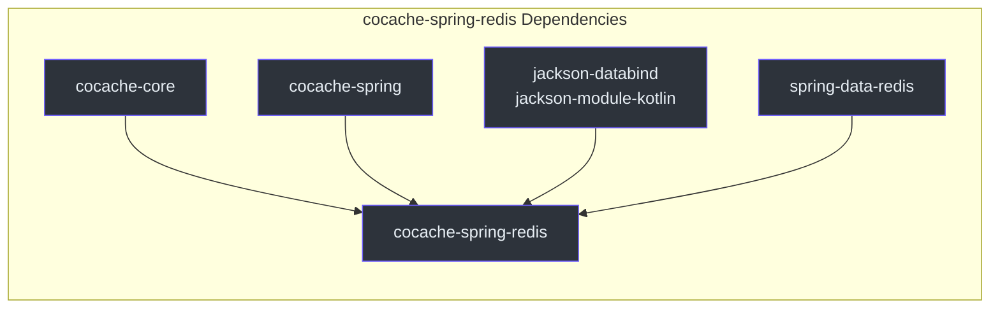
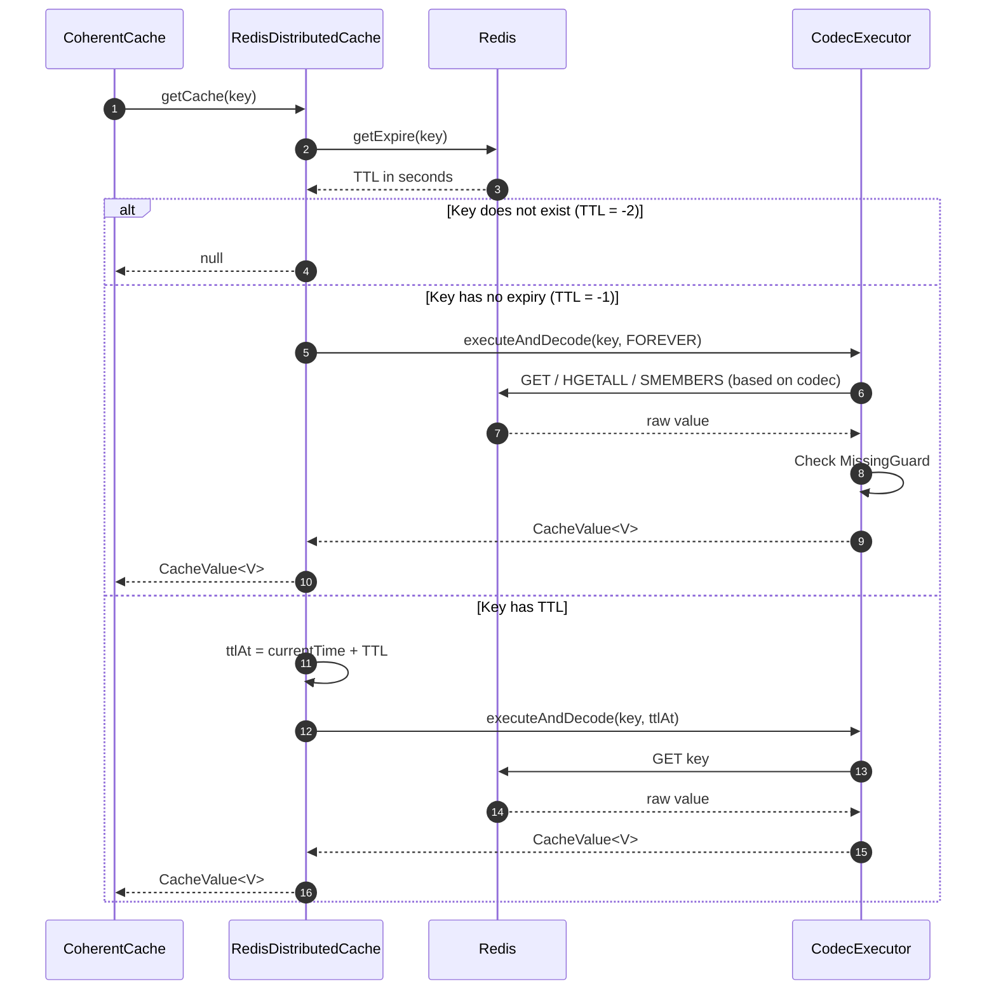
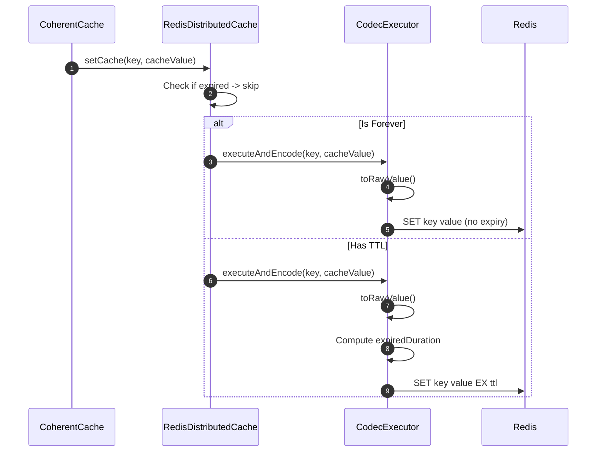
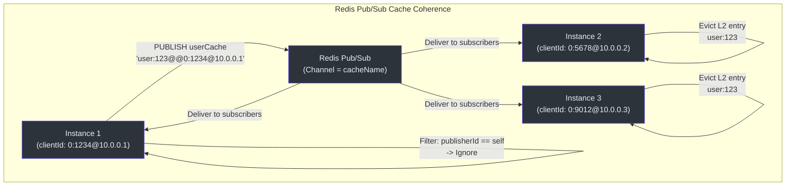
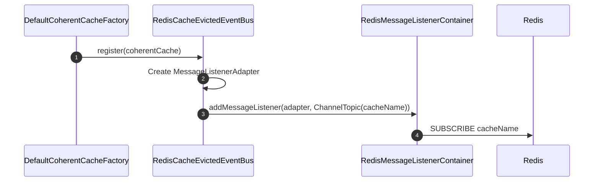
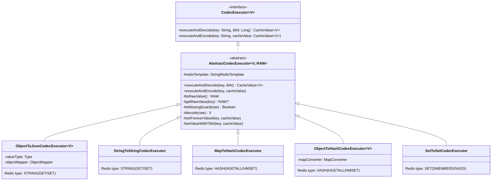
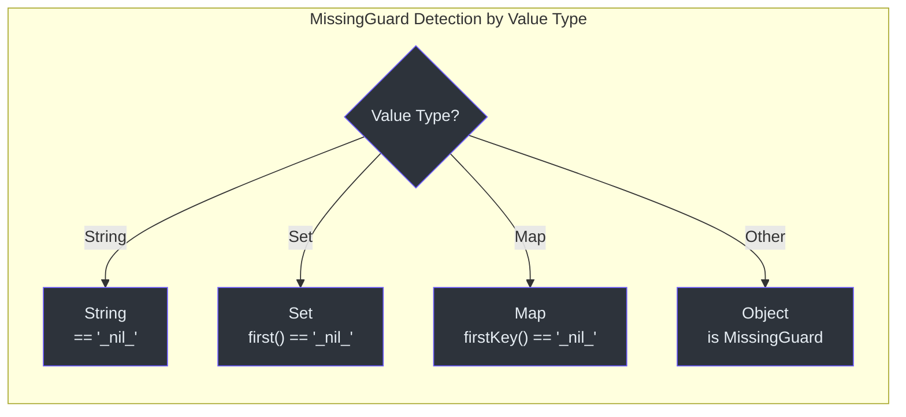
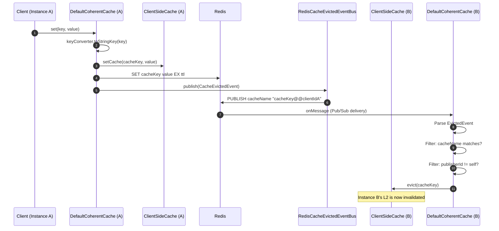

# cocache-spring-redis Module

The `cocache-spring-redis` module implements the distributed cache layer (L1) using Redis and the cross-instance cache coherence mechanism using Redis Pub/Sub. It provides the production-ready implementations that make CoCache a true distributed cache framework.

## Module Dependencies



## Source Files

| File | Package | Description |
|------|---------|-------------|
| [RedisDistributedCache.kt](https://github.com/Ahoo-Wang/CoCache/blob/main/cocache-spring-redis/src/main/kotlin/me/ahoo/cache/spring/redis/RedisDistributedCache.kt#L28) | `me.ahoo.cache.spring.redis` | L1 distributed cache implementation using `StringRedisTemplate` |
| [RedisCacheEvictedEventBus.kt](https://github.com/Ahoo-Wang/CoCache/blob/main/cocache-spring-redis/src/main/kotlin/me/ahoo/cache/spring/redis/RedisCacheEvictedEventBus.kt#L32) | `me.ahoo.cache.spring.redis` | Cross-instance event bus using Redis Pub/Sub |
| [RedisDistributedCacheFactory.kt](https://github.com/Ahoo-Wang/CoCache/blob/main/cocache-spring-redis/src/main/kotlin/me/ahoo/cache/spring/redis/RedisDistributedCacheFactory.kt#L27) | `me.ahoo.cache.spring.redis` | Factory for creating `RedisDistributedCache` instances via `AbstractCacheFactory` |
| [CodecExecutor.kt](https://github.com/Ahoo-Wang/CoCache/blob/main/cocache-spring-redis/src/main/kotlin/me/ahoo/cache/spring/redis/codec/CodecExecutor.kt#L22) | `me.ahoo.cache.spring.redis.codec` | Codec interface for encoding/decoding cache values |
| [AbstractCodecExecutor.kt](https://github.com/Ahoo-Wang/CoCache/blob/main/cocache-spring-redis/src/main/kotlin/me/ahoo/cache/spring/redis/codec/AbstractCodecExecutor.kt#L21) | `me.ahoo.cache.spring.redis.codec` | Abstract base with pipelined write and MissingGuard handling |
| [ObjectToJsonCodecExecutor.kt](https://github.com/Ahoo-Wang/CoCache/blob/main/cocache-spring-redis/src/main/kotlin/me/ahoo/cache/spring/redis/codec/ObjectToJsonCodecExecutor.kt#L27) | `me.ahoo.cache.spring.redis.codec` | JSON serialization via Jackson (default codec) |
| [StringToStringCodecExecutor.kt](https://github.com/Ahoo-Wang/CoCache/blob/main/cocache-spring-redis/src/main/kotlin/me/ahoo/cache/spring/redis/codec/StringToStringCodecExecutor.kt#L25) | `me.ahoo.cache.spring.redis.codec` | Direct string storage for `String` values |
| [MapToHashCodecExecutor.kt](https://github.com/Ahoo-Wang/CoCache/blob/main/cocache-spring-redis/src/main/kotlin/me/ahoo/cache/spring/redis/codec/MapToHashCodecExecutor.kt#L26) | `me.ahoo.cache.spring.redis.codec` | Redis Hash storage for `Map<String, String>` values |
| [ObjectToHashCodecExecutor.kt](https://github.com/Ahoo-Wang/CoCache/blob/main/cocoa-spring-redis/src/main/kotlin/me/ahoo/cache/spring/redis/codec/ObjectToHashCodecExecutor.kt#L26) | `me.ahoo.cache.spring.redis.codec` | Hash storage for arbitrary objects via `MapConverter` |
| [SetToSetCodecExecutor.kt](https://github.com/Ahoo-Wang/CoCache/blob/main/cocache-spring-redis/src/main/kotlin/me/ahoo/cache/spring/redis/codec/SetToSetCodecExecutor.kt#L25) | `me.ahoo.cache.spring.redis.codec` | Redis Set storage for `Set<String>` values |
| [EvictedEvents.kt](https://github.com/Ahoo-Wang/CoCache/blob/main/cocache-spring-redis/src/main/kotlin/me/ahoo/cache/spring/redis/codec/EvictedEvents.kt#L19) | `me.ahoo.cache.spring.redis.codec` | Message format for evicted events (key@@clientId encoding) |

## RedisDistributedCache

[RedisDistributedCache](https://github.com/Ahoo-Wang/CoCache/blob/main/cocache-spring-redis/src/main/kotlin/me/ahoo/cache/spring/redis/RedisDistributedCache.kt#L28) implements `DistributedCache<V>` using Spring's `StringRedisTemplate` and a pluggable `CodecExecutor`.

### Cache Read Flow



### Cache Write Flow



## RedisCacheEvictedEventBus

[RedisCacheEvictedEventBus](https://github.com/Ahoo-Wang/CoCache/blob/main/cocache-spring-redis/src/main/kotlin/me/ahoo/cache/spring/redis/RedisCacheEvictedEventBus.kt#L32) uses Redis Pub/Sub to distribute cache eviction events across all application instances.



### Event Registration

When a `CoherentCache` is created by `DefaultCoherentCacheFactory`, it registers with the event bus:



### MessageListenerAdapter

The [MessageListenerAdapter](https://github.com/Ahoo-Wang/CoCache/blob/main/cocache-spring-redis/src/main/kotlin/me/ahoo/cache/spring/redis/RedisCacheEvictedEventBus.kt#L67) wraps `CacheEvictedSubscriber` to implement Spring's `MessageListener` interface. On receiving a Redis message, it delegates to `EvictedEvents.fromMessage()` to parse the message and then calls `subscriber.onEvicted()`.

## EvictedEvents Message Format

[EvictedEvents](https://github.com/Ahoo-Wang/CoCache/blob/main/cocache-spring-redis/src/main/kotlin/me/ahoo/cache/spring/redis/codec/EvictedEvents.kt#L19) defines the wire format for cache eviction messages:

| Field | Encoding | Example |
|-------|----------|---------|
| Channel | Cache name (from `NamedCache.cacheName`) | `userCache` |
| Body | `key + "@@" + clientId` | `user:123@@0:1234@10.0.0.1` |

Parsing at [EvictedEvents.fromMessage()](https://github.com/Ahoo-Wang/CoCache/blob/main/cocache-spring-redis/src/main/kotlin/me/ahoo/cache/spring/redis/codec/EvictedEvents.kt#L22):
- `cacheName` = `message.channel.decodeToString()`
- Split `message.body.decodeToString()` by `"@@"` into `[key, clientId]`
- Construct `CacheEvictedEvent(cacheName, key, clientId)`

## Codec Hierarchy

The codec system handles serialization of cache values to/from Redis data structures. Each codec maps a specific value type to a Redis data type.



### Codec Details

| Codec | Value Type | Redis Type | Serialization | MissingGuard Encoding |
|-------|-----------|------------|---------------|----------------------|
| `ObjectToJsonCodecExecutor` | Any (POJO) | STRING | Jackson ObjectMapper JSON | `"_nil_"` string |
| `StringToStringCodecExecutor` | `String` | STRING | Direct (no conversion) | `"_nil_"` string |
| `MapToHashCodecExecutor` | `Map<String, String>` | HASH | Direct key-value mapping | `{"_nil_": "<timestamp>"}` |
| `ObjectToHashCodecExecutor` | Any via `MapConverter` | HASH | Object <-> Map conversion | `{"_nil_": "<timestamp>"}` |
| `SetToSetCodecExecutor` | `Set<String>` | SET | Direct set members | `{"_nil_"}` single-element set |

### AbstractCodecExecutor Write Pipeline

[AbstractCodecExecutor](https://github.com/Ahoo-Wang/CoCache/blob/main/cocache-spring-redis/src/main/kotlin/me/ahoo/cache/spring/redis/codec/AbstractCodecExecutor.kt#L21) provides a `setPipelined()` helper at [line 45](https://github.com/Ahoo-Wang/CoCache/blob/main/cocache-spring-redis/src/main/kotlin/me/ahoo/cache/spring/redis/codec/AbstractCodecExecutor.kt#L45) that atomically deletes the old key and writes the new value in a single Redis pipeline, preventing stale reads during the write window.

### MissingGuard Detection Per Codec

Each codec has a codec-specific way to detect the missing guard sentinel, matching the polymorphic `MissingGuard.Companion.isMissingGuard` extensions:



## RedisDistributedCacheFactory

[RedisDistributedCacheFactory](https://github.com/Ahoo-Wang/CoCache/blob/main/cocache-spring-redis/src/main/kotlin/me/ahoo/cache/spring/redis/RedisDistributedCacheFactory.kt#L27) extends `AbstractCacheFactory` and creates `RedisDistributedCache` instances. Its `fallback()` method at [line 47](https://github.com/Ahoo-Wang/CoCache/blob/main/cocache-spring-redis/src/main/kotlin/me/ahoo/cache/spring/redis/RedisDistributedCacheFactory.kt#L47) creates a `RedisDistributedCache` with `ObjectToJsonCodecExecutor` (JSON serialization) as the default codec.

Users can customize the distributed cache by declaring a Spring bean named `"{cacheName}.DistributedCache"`:

```kotlin
@Bean("UserCache.DistributedCache")
fun userDistributedCache(
    redisTemplate: StringRedisTemplate
): DistributedCache<User> {
    val codec = ObjectToHashCodecExecutor(
        mapConverter = object : ObjectToHashCodecExecutor.MapConverter<User> {
            override fun asValue(map: Map<String, String>): User = /* convert map to User */
            override fun asMap(value: User): Map<String, String> = /* convert User to map */
        },
        redisTemplate = redisTemplate
    )
    return RedisDistributedCache(redisTemplate, codec, ttl = 7200, ttlAmplitude = 60)
}
```

## Cross-Instance Coherence Flow

The complete flow of a cache write with cross-instance invalidation:



## Related Pages

- [Module Overview](./index.md) -- Dependency graph and module descriptions
- [cocache-core](./cocache-core.md) -- DefaultCoherentCache, DistributedCache interface, CacheEvictedEventBus
- [cocache-spring](./cocache-spring.md) -- AbstractCacheFactory base class, Spring integration
- [cocache-spring-boot-starter](./cocache-spring-boot-starter.md) -- Auto-configuration that wires RedisDistributedCacheFactory
