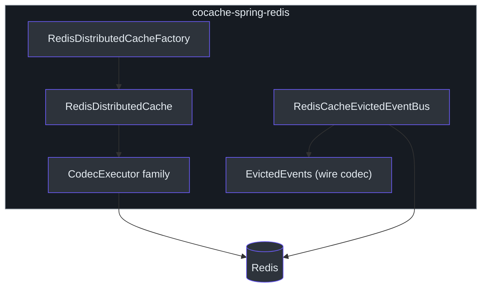
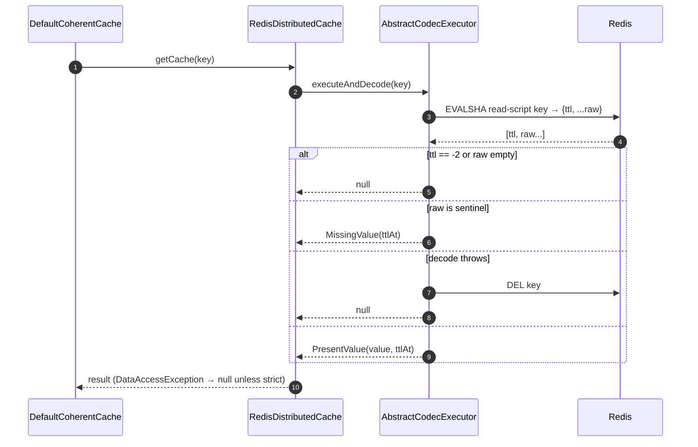
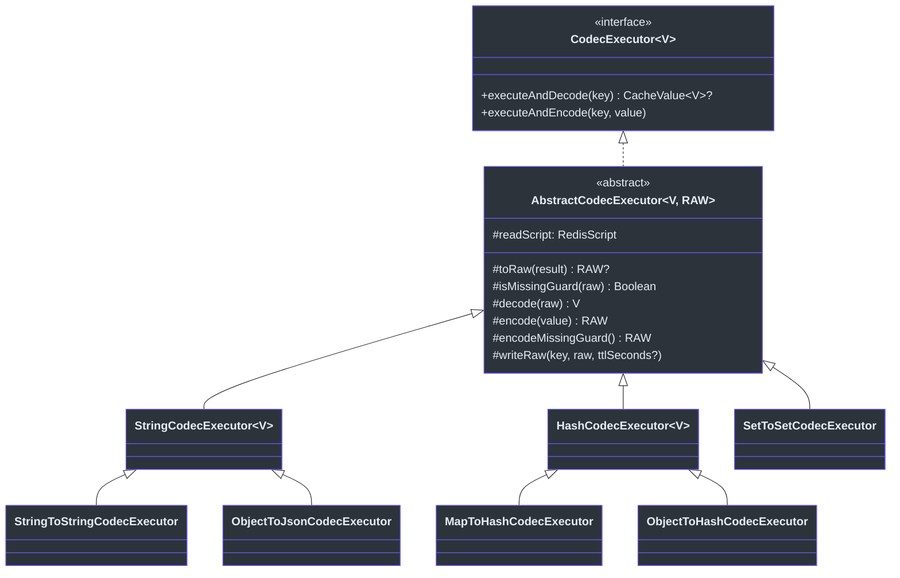

# cocache-spring-redis

This module provides the Redis implementations of two SPIs: the L1 store (`DistributedCache`) and the invalidation channel (`CacheEvictedEventBus`). It depends on `cocache-spring`, Spring Data Redis, and Jackson.

```mermaid
graph TB
    subgraph redis_mod ["cocache-spring-redis"]
        RDC["RedisDistributedCache"]
        RDCF["RedisDistributedCacheFactory"]
        CE["CodecExecutor family"]
        Bus["RedisCacheEvictedEventBus"]
        EE["EvictedEvents (wire codec)"]
    end
    RDCF --> RDC
    RDC --> CE
    Bus --> EE
    CE --> R[("Redis")]
    Bus --> R

    style RDC fill:#2d333b,stroke:#6d5dfc,color:#e6edf3
    style RDCF fill:#2d333b,stroke:#6d5dfc,color:#e6edf3
    style CE fill:#2d333b,stroke:#6d5dfc,color:#e6edf3
    style Bus fill:#2d333b,stroke:#6d5dfc,color:#e6edf3
    style EE fill:#2d333b,stroke:#6d5dfc,color:#e6edf3
    style R fill:#2d333b,stroke:#6d5dfc,color:#e6edf3
    style redis_mod fill:#161b22,stroke:#8b949e,color:#e6edf3
```

## Source Files

| File | Description |
|------|-------------|
| [RedisDistributedCache.kt](https://github.com/Ahoo-Wang/CoCache/blob/main/cocache-spring-redis/src/main/kotlin/me/ahoo/cache/spring/redis/RedisDistributedCache.kt) | L1 store; failure degradation (`strictFailure`) |
| [RedisDistributedCacheFactory.kt](https://github.com/Ahoo-Wang/CoCache/blob/main/cocache-spring-redis/src/main/kotlin/me/ahoo/cache/spring/redis/RedisDistributedCacheFactory.kt) | `{cacheName}.DistributedCache` bean or JSON-codec default |
| [CodecExecutor.kt](https://github.com/Ahoo-Wang/CoCache/blob/main/cocache-spring-redis/src/main/kotlin/me/ahoo/cache/spring/redis/codec/CodecExecutor.kt) | `executeAndDecode(key)` / `executeAndEncode(key, value)` |
| [AbstractCodecExecutor.kt](https://github.com/Ahoo-Wang/CoCache/blob/main/cocache-spring-redis/src/main/kotlin/me/ahoo/cache/spring/redis/codec/AbstractCodecExecutor.kt) | Shared read/write protocol |
| [StringCodecExecutor.kt](https://github.com/Ahoo-Wang/CoCache/blob/main/cocache-spring-redis/src/main/kotlin/me/ahoo/cache/spring/redis/codec/StringCodecExecutor.kt) | String-structured base + `StringToStringCodecExecutor` |
| [ObjectToJsonCodecExecutor.kt](https://github.com/Ahoo-Wang/CoCache/blob/main/cocache-spring-redis/src/main/kotlin/me/ahoo/cache/spring/redis/codec/ObjectToJsonCodecExecutor.kt) | Jackson JSON (default) |
| [HashCodecExecutor.kt](https://github.com/Ahoo-Wang/CoCache/blob/main/cocache-spring-redis/src/main/kotlin/me/ahoo/cache/spring/redis/codec/HashCodecExecutor.kt) | Hash base + `MapToHashCodecExecutor`, `ObjectToHashCodecExecutor` |
| [SetToSetCodecExecutor.kt](https://github.com/Ahoo-Wang/CoCache/blob/main/cocache-spring-redis/src/main/kotlin/me/ahoo/cache/spring/redis/codec/SetToSetCodecExecutor.kt) | Redis Set |
| [RedisCacheEvictedEventBus.kt](https://github.com/Ahoo-Wang/CoCache/blob/main/cocache-spring-redis/src/main/kotlin/me/ahoo/cache/spring/redis/RedisCacheEvictedEventBus.kt) | Pub/Sub channel per cache |
| [EvictedEvents.kt](https://github.com/Ahoo-Wang/CoCache/blob/main/cocache-spring-redis/src/main/kotlin/me/ahoo/cache/spring/redis/codec/EvictedEvents.kt) | `key@@publisherId` message format |

## Read Protocol

```mermaid
sequenceDiagram
autonumber
    participant CC as DefaultCoherentCache
    participant RDC as RedisDistributedCache
    participant CE as AbstractCodecExecutor
    participant R as Redis

    CC->>RDC: getCache(key)
    RDC->>CE: executeAndDecode(key)
    CE->>R: EVALSHA read-script key → {ttl, ...raw}
    R-->>CE: [ttl, raw...]
    alt ttl == -2 or raw empty
        CE-->>RDC: null
    else raw is sentinel
        CE-->>RDC: MissingValue(ttlAt)
    else decode throws
        CE->>R: DEL key
        CE-->>RDC: null
    else
        CE-->>RDC: PresentValue(value, ttlAt)
    end
    RDC-->>CC: result (DataAccessException → null unless strict)
```

- One round trip per L1 read: an atomic Lua script on the shared connection. Do not use `executePipelined` here: Lettuce pipelines need a dedicated connection, which without a pool costs more than two plain round trips.
- **A missing key is a miss, never a negative cache.** In 4.x a key deleted between the separate `TTL` and `GET` calls decoded as a negative cache, which could pin "not found" into L2 until the old TTL.
- `ttlAt = now + ttl`, or `FOREVER` for TTL `-1`. The value is reconstructed from Redis expiry, so it can drift by ±1 s.

## Write Protocol

| Value | Action |
|-------|--------|
| expired | `DEL key` |
| `MissingValue` | write the codec's sentinel form |
| `PresentValue` | write the encoded value |
| TTL | `null` (no expiry) for `FOREVER`; otherwise remaining seconds clamped to at least 1 |

Hash and Set writes are a single atomic Lua script (`DEL` + `HSET`/`SADD` + optional `EXPIRE`). An empty Map/Set deletes the key.

## Codecs

```mermaid
classDiagram
    class CodecExecutor~V~ {
        <<interface>>
        +executeAndDecode(key) CacheValue~V~?
        +executeAndEncode(key, value)
    }
    class AbstractCodecExecutor~V, RAW~ {
        <<abstract>>
        #readScript: RedisScript
        #toRaw(result) RAW?
        #isMissingGuard(raw) Boolean
        #decode(raw) V
        #encode(value) RAW
        #encodeMissingGuard() RAW
        #writeRaw(key, raw, ttlSeconds?)
    }
    class StringCodecExecutor~V~
    class HashCodecExecutor~V~
    CodecExecutor <|.. AbstractCodecExecutor
    AbstractCodecExecutor <|-- StringCodecExecutor
    AbstractCodecExecutor <|-- HashCodecExecutor
    AbstractCodecExecutor <|-- SetToSetCodecExecutor
    StringCodecExecutor <|-- StringToStringCodecExecutor
    StringCodecExecutor <|-- ObjectToJsonCodecExecutor
    HashCodecExecutor <|-- MapToHashCodecExecutor
    HashCodecExecutor <|-- ObjectToHashCodecExecutor

    style CodecExecutor fill:#2d333b,stroke:#6d5dfc,color:#e6edf3
    style AbstractCodecExecutor fill:#2d333b,stroke:#6d5dfc,color:#e6edf3
    style StringCodecExecutor fill:#2d333b,stroke:#6d5dfc,color:#e6edf3
    style HashCodecExecutor fill:#2d333b,stroke:#6d5dfc,color:#e6edf3
    style SetToSetCodecExecutor fill:#2d333b,stroke:#6d5dfc,color:#e6edf3
    style StringToStringCodecExecutor fill:#2d333b,stroke:#6d5dfc,color:#e6edf3
    style ObjectToJsonCodecExecutor fill:#2d333b,stroke:#6d5dfc,color:#e6edf3
    style MapToHashCodecExecutor fill:#2d333b,stroke:#6d5dfc,color:#e6edf3
    style ObjectToHashCodecExecutor fill:#2d333b,stroke:#6d5dfc,color:#e6edf3
```

| Codec | Value Type | Redis Type | Negative-cache wire form |
|-------|------------|------------|--------------------------|
| `ObjectToJsonCodecExecutor` (default) | any POJO | String | `_nil_` |
| `StringToStringCodecExecutor` | `String` | String | `_nil_` (a business string equal to the sentinel reads back as negative) |
| `MapToHashCodecExecutor` | `Map<String, String>` | Hash | `{_nil_: <written-at>}` |
| `ObjectToHashCodecExecutor` | any via `MapConverter` | Hash | `{_nil_: <written-at>}` |
| `SetToSetCodecExecutor` | `Set<String>` | Set | `{_nil_}` |

The sentinel is constructor-injectable (`missingGuardSentinel`, property `cocache.redis.missing-guard-sentinel`). Custom and default sentinels do not recognize each other, so switch the whole cluster at once.

To write a codec for another structure, extend `AbstractCodecExecutor` and implement `readScript` (via `readScript("GET" | "HGETALL" | "SMEMBERS")`), `toRaw` (elements after the TTL), `isMissingGuard`, `decode`, `encode`, `encodeMissingGuard`, and `writeRaw`.

## RedisCacheEvictedEventBus

- Channel = `cacheName`, message = `key@@publisherId`, split on the last `@@`.
- `publish` swallows `DataAccessException` with a warning.
- Each registered subscriber is wrapped in a listener that implements `MessageListener` **and** `SubscriptionListener`. The container calls `onChannelSubscribed` after the initial subscription, after every reconnect, and when another listener joins the channel. Each call is mapped to `CacheEvictedSubscriber.onReset()`, which clears L2.
- Subscription notifications go through the container's `TaskExecutor`. Tests use a `SyncTaskExecutor` so `register()` returns only after the reset ran.

## Failure Degradation

| Operation | Default (`strictFailure = false`) | Strict |
|-----------|-----------------------------------|--------|
| read | `null` (miss → source load) + `WARN` | rethrow |
| write / evict | `WARN`, swallowed | rethrow |

These settings apply to the default (fallback-created) caches. A custom `{cacheName}.DistributedCache` bean chooses its own policy.

## Related Pages

- [Cache Layers](../architecture/cache-layers.md)
- [Cache Coherence](../architecture/coherence.md)
- [Configuration](../guide/configuration.md)
