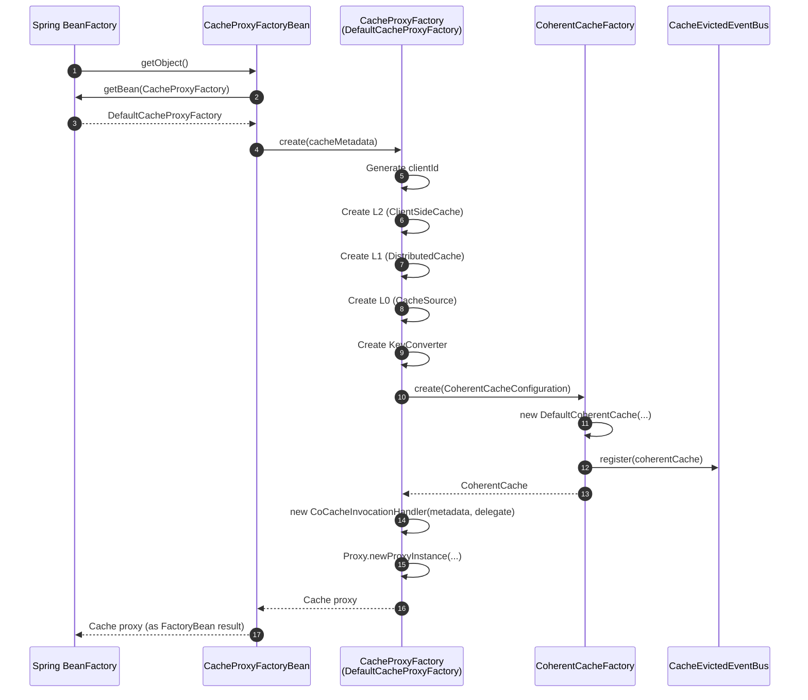
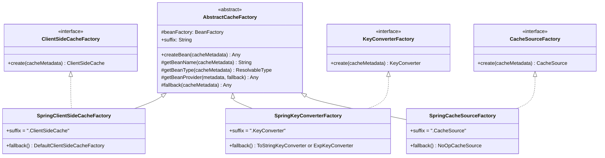
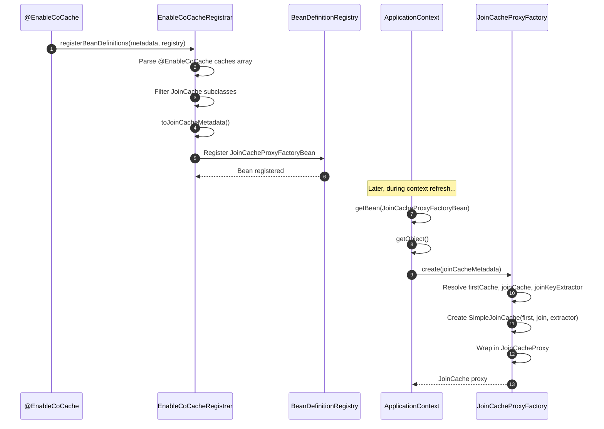

# cocache-spring Module

The `cocache-spring` module bridges CoCache's core abstractions with the Spring Framework's dependency injection container. It enables declarative cache registration via `@EnableCoCache`, automatic Spring bean resolution for all cache components, and FactoryBean-based proxy creation.

## Module Dependencies

```mermaid
graph LR
    subgraph "cocache-spring Dependencies"
        style "cocache-spring Dependencies" fill:#161b22,stroke:#6d5dfc,color:#e6edf3

        core["cocache-core"]
        style core fill:#2d333b,stroke:#6d5dfc,color:#e6edf3

        spring_mod["cocache-spring"]
        style spring_mod fill:#2d333b,stroke:#6d5dfc,color:#e6edf3

        spring_ctx["spring-context"]
        style spring_ctx fill:#2d333b,stroke:#6d5dfc,color:#e6edf3

        core --> spring_mod
        spring_ctx --> spring_mod
    end

```

## Source Files (10 files)

| File | Package | Purpose |
|------|---------|---------|
| [EnableCoCache.kt](https://github.com/Ahoo-Wang/CoCache/blob/main/cocache-spring/src/main/kotlin/me/ahoo/cache/spring/EnableCoCache.kt#L22) | `me.ahoo.cache.spring` | `@EnableCoCache` annotation that triggers cache registration |
| [EnableCoCacheRegistrar.kt](https://github.com/Ahoo-Wang/CoCache/blob/main/cocache-spring/src/main/kotlin/me/ahoo/cache/spring/EnableCoCacheRegistrar.kt#L31) | `me.ahoo.cache.spring` | `ImportBeanDefinitionRegistrar` that parses cache classes and registers beans |
| [AbstractCacheFactory.kt](https://github.com/Ahoo-Wang/CoCache/blob/main/cocache-spring/src/main/kotlin/me/ahoo/cache/spring/AbstractCacheFactory.kt#L21) | `me.ahoo.cache.spring` | Base class for Spring-aware factory pattern with bean name lookup |
| [SpringCacheFactory.kt](https://github.com/Ahoo-Wang/CoCache/blob/main/cocache-spring/src/main/kotlin/me/ahoo/cache/spring/SpringCacheFactory.kt#L24) | `me.ahoo.cache.spring` | `CacheFactory` implementation using Spring `ListableBeanFactory` |
| [CacheProxyFactoryBean.kt](https://github.com/Ahoo-Wang/CoCache/blob/main/cocache-spring/src/main/kotlin/me/ahoo/cache/spring/proxy/CacheProxyFactoryBean.kt#L23) | `me.ahoo.cache.spring.proxy` | `FactoryBean` for standard `Cache` proxies |
| [JoinCacheProxyFactoryBean.kt](https://github.com/Ahoo-Wang/CoCache/blob/main/cocache-spring/src/main/kotlin/me/ahoo/cache/spring/join/JoinCacheProxyFactoryBean.kt#L23) | `me.ahoo.cache.spring.join` | `FactoryBean` for `JoinCache` proxies |
| [SpringClientSideCacheFactory.kt](https://github.com/Ahoo-Wang/CoCache/blob/main/cocache-spring/src/main/kotlin/me/ahoo/cache/spring/client/SpringClientSideCacheFactory.kt#L25) | `me.ahoo.cache.spring.client` | Resolves `ClientSideCache` beans or falls back to default |
| [SpringKeyConverterFactory.kt](https://github.com/Ahoo-Wang/CoCache/blob/main/cocache-spring/src/main/kotlin/me/ahoo/cache/spring/converter/SpringKeyConverterFactory.kt#L27) | `me.ahoo.cache.spring.converter` | Resolves `KeyConverter` beans or creates `ToStringKeyConverter`/`ExpKeyConverter` |
| [SpringCacheSourceFactory.kt](https://github.com/Ahoo-Wang/CoCache/blob/main/cocache-spring/src/main/kotlin/me/ahoo/cache/spring/source/SpringCacheSourceFactory.kt#L24) | `me.ahoo.cache.spring.source` | Resolves `CacheSource` beans or defaults to `NoOpCacheSource` |
| [SpringJoinKeyExtractorFactory.kt](https://github.com/Ahoo-Wang/CoCache/blob/main/cocache-spring/src/main/kotlin/me/ahoo/cache/spring/join/SpringJoinKeyExtractorFactory.kt#L24) | `me.ahoo.cache.spring.join` | Resolves `JoinKeyExtractor` beans or creates `ExpJoinKeyExtractor` from expression |

## @EnableCoCache -- Registration Entry Point

[@EnableCoCache](https://github.com/Ahoo-Wang/CoCache/blob/main/cocache-spring/src/main/kotlin/me/ahoo/cache/spring/EnableCoCache.kt#L22) is the primary entry point:

```kotlin
@Import(EnableCoCacheRegistrar::class)
@Target(AnnotationTarget.CLASS)
annotation class EnableCoCache(
    val caches: Array<KClass<out Cache<*, *>>> = []
)
```

Usage:

```kotlin
@EnableCoCache(caches = [UserCache::class, ProductCache::class, UserProductJoinCache::class])
@Configuration
class CacheConfiguration
```

## Registration Flow

```mermaid
flowchart TB
    subgraph "EnableCoCacheRegistrar Registration Flow"
        style "EnableCoCacheRegistrar Registration Flow" fill:#161b22,stroke:#6d5dfc,color:#e6edf3

        scan["@EnableCoCache(caches=[...])<br>ImportBeanDefinitionRegistrar"]
        style scan fill:#2d333b,stroke:#6d5dfc,color:#e6edf3

        parse["Parse AnnotationMetadata<br>Extract cache classes"]
        style parse fill:#2d333b,stroke:#6d5dfc,color:#e6edf3

        filter1{"Is JoinCache?"}
        style filter1 fill:#2d333b,stroke:#6d5dfc,color:#e6edf3

        co_cache["Parse as CoCacheMetadata<br>(via toCoCacheMetadata())"]
        style co_cache fill:#2d333b,stroke:#6d5dfc,color:#e6edf3

        join_cache["Parse as JoinCacheMetadata<br>(via toJoinCacheMetadata())"]
        style join_cache fill:#2d333b,stroke:#6d5dfc,color:#e6edf3

        register_metadata["Register CoCacheMetadata bean<br>(name + '.CacheMetadata')"]
        style register_metadata fill:#2d333b,stroke:#6d5dfc,color:#e6edf3

        register_cache["Register CacheProxyFactoryBean<br>(name = cacheName, primary=true)"]
        style register_cache fill:#2d333b,stroke:#6d5dfc,color:#e6edf3

        register_join["Register JoinCacheProxyFactoryBean<br>(name = cacheName, primary=true)"]
        style register_join fill:#2d333b,stroke:#6d5dfc,color:#e6edf3

        scan --> parse --> filter1
        filter1 -->|No| co_cache --> register_metadata --> register_cache
        filter1 -->|Yes| join_cache --> register_join
    end

```

The registrar at [EnableCoCacheRegistrar.kt:45](https://github.com/Ahoo-Wang/CoCache/blob/main/cocache-spring/src/main/kotlin/me/ahoo/cache/spring/EnableCoCacheRegistrar.kt#L45) performs these steps:

1. Extracts the `caches` array from the `@EnableCoCache` annotation attributes.
2. Splits cache classes into two groups: those that implement `JoinCache` and those that do not.
3. For non-JoinCache classes: parses `CoCacheMetadata` via `KClass.toCoCacheMetadata()`, registers both the metadata bean and a `CacheProxyFactoryBean`.
4. For JoinCache classes: parses `JoinCacheMetadata` via `KClass.toJoinCacheMetadata()`, registers a `JoinCacheProxyFactoryBean`.

## AbstractCacheFactory Pattern

[AbstractCacheFactory](https://github.com/Ahoo-Wang/CoCache/blob/main/cocache-spring/src/main/kotlin/me/ahoo/cache/spring/AbstractCacheFactory.kt#L21) is the shared base class for all Spring-aware component factories. It implements a three-tier resolution strategy:

```mermaid
flowchart TB
    subgraph "AbstractCacheFactory.createBean(cacheMetadata)"
        style "AbstractCacheFactory.createBean(cacheMetadata)" fill:#161b22,stroke:#6d5dfc,color:#e6edf3

        bean_name["Compute beanName<br>= cacheName + suffix"]
        style bean_name fill:#2d333b,stroke:#6d5dfc,color:#e6edf3

        exists{"beanFactory<br>.containsBean<br>(beanName)?"}
        style exists fill:#2d333b,stroke:#6d5dfc,color:#e6edf3

        by_name["Return beanFactory<br>.getBean(beanName)"]
        style by_name fill:#2d333b,stroke:#6d5dfc,color:#e6edf3

        by_type["getBeanProvider(type)<br>.getIfAvailable()"]
        style by_type fill:#2d333b,stroke:#6d5dfc,color:#e6edf3

        type_found{"Bean found<br>by type?"}
        style type_found fill:#2d333b,stroke:#6d5dfc,color:#e6edf3

        fallback["Invoke fallback()<br>(default implementation)"]
        style fallback fill:#2d333b,stroke:#6d5dfc,color:#e6edf3

        ttl_aware{"Is TtlConfigurationAware?"}
        style ttl_aware fill:#2d333b,stroke:#6d5dfc,color:#e6edf3

        set_ttl["setTtlConfiguration(metadata)"]
        style set_ttl fill:#2d333b,stroke:#6d5dfc,color:#e6edf3

        done["Return bean"]
        style done fill:#2d333b,stroke:#6d5dfc,color:#e6edf3

        bean_name --> exists
        exists -->|yes| by_name --> done
        exists -->|no| by_type --> type_found
        type_found -->|yes| ttl_aware
        type_found -->|no| fallback --> ttl_aware
        ttl_aware -->|yes| set_ttl --> done
        ttl_aware -->|no| done
    end

```

Each subclass defines:
- **`suffix`**: The convention-based bean name suffix (e.g., `".ClientSideCache"`, `".DistributedCache"`, `".KeyConverter"`, `".CacheSource"`, `".JoinKeyExtractor"`)
- **`getBeanType()`**: The `ResolvableType` for type-based bean lookup
- **`fallback()`**: The default factory method when no Spring bean is found

### Factory Suffixes and Bean Naming

| Factory | Suffix | Example Bean Name |
|---------|--------|-------------------|
| `SpringClientSideCacheFactory` | `.ClientSideCache` | `UserCache.ClientSideCache` |
| `SpringKeyConverterFactory` | `.KeyConverter` | `UserCache.KeyConverter` |
| `SpringCacheSourceFactory` | `.CacheSource` | `UserCache.CacheSource` |
| `RedisDistributedCacheFactory` (in cocache-spring-redis) | `.DistributedCache` | `UserCache.DistributedCache` |
| `SpringJoinKeyExtractorFactory` | `.JoinKeyExtractor` | `UserProductJoinCache.JoinKeyExtractor` |

This naming convention allows users to override any component simply by declaring a Spring bean with the expected name.

## CacheProxyFactoryBean

[CacheProxyFactoryBean](https://github.com/Ahoo-Wang/CoCache/blob/main/cocache-spring/src/main/kotlin/me/ahoo/cache/spring/proxy/CacheProxyFactoryBean.kt#L23) is a Spring `FactoryBean` that creates cache proxy instances. It lazily retrieves the `CacheProxyFactory` from the `ApplicationContext` and delegates creation:



## JoinCacheProxyFactoryBean

[JoinCacheProxyFactoryBean](https://github.com/Ahoo-Wang/CoCache/blob/main/cocache-spring/src/main/kotlin/me/ahoo/cache/spring/join/JoinCacheProxyFactoryBean.kt#L23) follows the same pattern but retrieves the `JoinCacheProxyFactory` and creates a JoinCache proxy wired with the first cache, join cache, and join key extractor.

## SpringCacheFactory

[SpringCacheFactory](https://github.com/Ahoo-Wang/CoCache/blob/main/cocache-spring/src/main/kotlin/me/ahoo/cache/spring/SpringCacheFactory.kt#L24) implements the `CacheFactory` interface using Spring's `ListableBeanFactory`:

| Method | Strategy |
|--------|----------|
| `caches` | `beanFactory.getBeansOfType(Cache::class.java)` |
| `getCache(name, type)` | `beanFactory.getBean(name, type)` with `NoSuchBeanDefinitionException` handling |
| `getCache(keyType, valueType)` | `beanFactory.getBeanProvider(ResolvableType)` for generic type matching |

## SpringKeyConverterFactory

[SpringKeyConverterFactory](https://github.com/Ahoo-Wang/CoCache/blob/main/cocache-spring/src/main/kotlin/me/ahoo/cache/spring/converter/SpringKeyConverterFactory.kt#L27) has special handling for `String` key types -- when the key type is `String`, it skips the bean provider lookup and goes directly to `fallback()`, since `String` keys do not need a typed converter.

The fallback logic at [SpringKeyConverterFactory.kt:50](https://github.com/Ahoo-Wang/CoCache/blob/main/cocache-spring/src/main/kotlin/me/ahoo/cache/spring/converter/SpringKeyConverterFactory.kt#L50):

1. Resolve `keyPrefix` from `@CoCache` (supports Spring property placeholders).
2. If no prefix, default to `"cocache:{cacheName}:"`.
3. If `keyExpression` is set, create `ExpKeyConverter`.
4. Otherwise, create `ToStringKeyConverter`.

## SpringJoinKeyExtractorFactory

[SpringJoinKeyExtractorFactory](https://github.com/Ahoo-Wang/CoCache/blob/main/cocache-spring/src/main/kotlin/me/ahoo/cache/spring/join/SpringJoinKeyExtractorFactory.kt#L24) resolves join key extractors in this order:

1. If `joinKeyExpression` is set in `@JoinCacheable`, create `ExpJoinKeyExtractor`.
2. Look up a bean by name (`cacheName + ".JoinKeyExtractor"`).
3. Look up a unique bean by type (`JoinKeyExtractor<V1, K2>`).
4. Fail with an error if none found.

## Factory Hierarchy



## JoinCache Registration Flow



## Customization Example

Users can override any component by declaring a Spring bean:

```kotlin
@Configuration
class CustomCacheConfig {

    // Override the client-side cache for UserCache
    @Bean("UserCache.ClientSideCache")
    fun userCacheClientSide(): ClientSideCache<User> {
        return CaffeineClientSideCache(
            Caffeine.newBuilder()
                .maximumSize(50_000)
                .expireAfterWrite(Duration.ofMinutes(30))
                .build()
        )
    }

    // Override the cache source for UserCache
    @Bean("UserCache.CacheSource")
    fun userCacheSource(userRepository: UserRepository): CacheSource<String, User> {
        return CacheSource { key ->
            val user = userRepository.findById(key)
            user.map { DefaultCacheValue.ttlAt(it, 3600) }.orElse(null)
        }
    }
}
```

## Related Pages

- [Module Overview](./index.md) -- Dependency graph and module descriptions
- [cocache-api](./cocache-api.md) -- Interfaces and annotations
- [cocache-core](./cocache-core.md) -- Default implementations
- [cocache-spring-redis](./cocache-spring-redis.md) -- Redis distributed cache implementation
- [cocache-spring-boot-starter](./cocache-spring-boot-starter.md) -- Auto-configuration
- [cocache-spring-cache](./cocache-spring-cache.md) -- Spring Cache abstraction bridge
