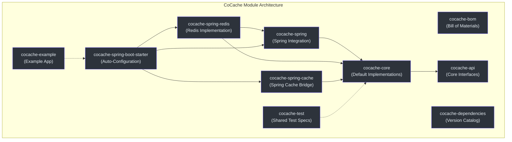
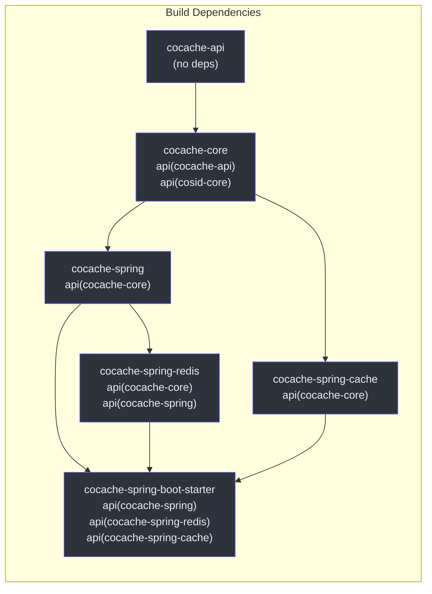
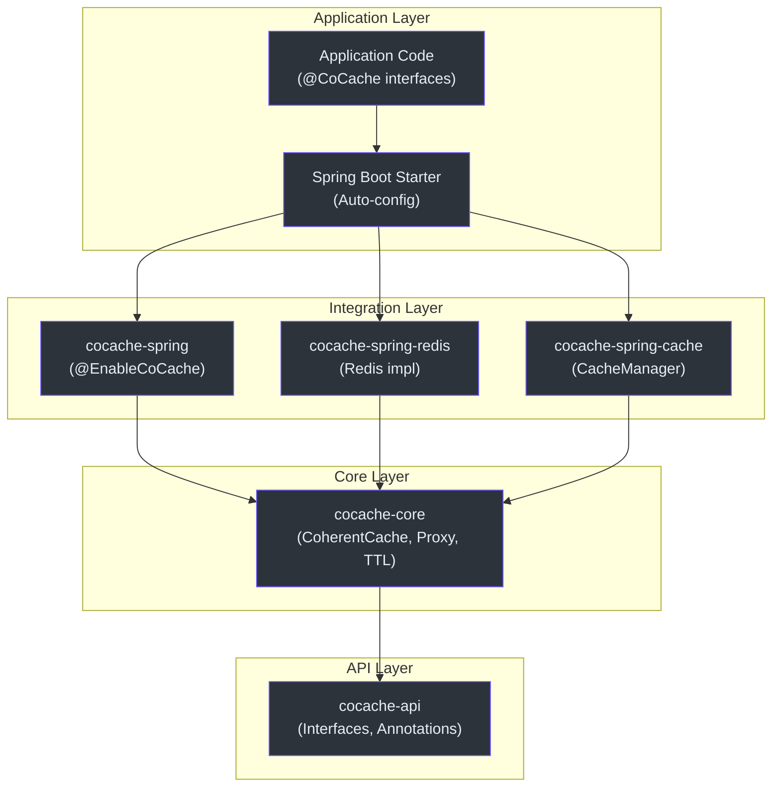
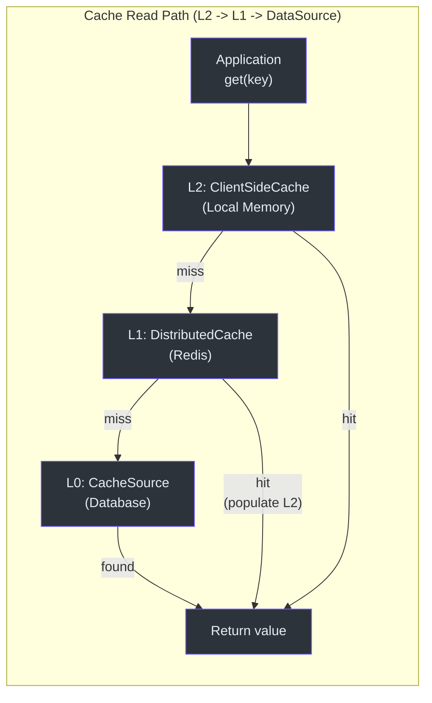
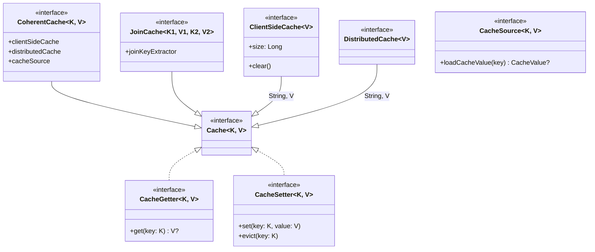

# Module Overview

CoCache is organized into a set of focused Gradle modules that layer from pure API definitions through core logic, Spring integration, Redis persistence, and Spring Boot auto-configuration. Each module has a single responsibility and depends only on the modules below it in the dependency graph.

## Module Dependency Graph



## Module Descriptions

| Module | Purpose | Key Contents | Source |
|--------|---------|-------------|--------|
| **cocache-api** | Pure interfaces and annotations with zero implementation dependencies | `Cache`, `CacheValue`, `ClientSideCache`, `CacheSource`, `JoinCache`, `@CoCache`, `@JoinCacheable` | [cocache-api/](https://github.com/Ahoo-Wang/CoCache/tree/main/cocache-api) |
| **cocache-core** | Default implementations of all core abstractions | `DefaultCoherentCache`, `CoCacheProxy`, `SimpleJoinCache`, `MapClientSideCache`, `GuavaClientSideCache`, `CaffeineClientSideCache`, `BloomKeyFilter`, `CacheEvictedEventBus` | [cocache-core/](https://github.com/Ahoo-Wang/CoCache/tree/main/cocache-core) |
| **cocache-spring** | Spring Framework integration for DI-based cache creation | `@EnableCoCache`, `EnableCoCacheRegistrar`, `AbstractCacheFactory`, `CacheProxyFactoryBean`, `JoinCacheProxyFactoryBean` | [cocache-spring/](https://github.com/Ahoo-Wang/CoCache/tree/main/cocache-spring) |
| **cocache-spring-redis** | Redis-backed distributed cache and event bus | `RedisDistributedCache`, `RedisCacheEvictedEventBus`, `CodecExecutor` hierarchy | [cocache-spring-redis/](https://github.com/Ahoo-Wang/CoCache/tree/main/cocache-spring-redis) |
| **cocache-spring-cache** | Bridge to Spring's `CacheManager` abstraction | `CoCacheManager`, `CoSpringCache` | [cocache-spring-cache/](https://github.com/Ahoo-Wang/CoCache/tree/main/cocache-spring-cache) |
| **cocache-spring-boot-starter** | Spring Boot auto-configuration and actuator endpoints | `CoCacheAutoConfiguration`, `CoCacheProperties`, `CoCacheEndpoint`, `CoCacheClientEndpoint` | [cocache-spring-boot-starter/](https://github.com/Ahoo-Wang/CoCache/tree/main/cocache-spring-boot-starter) |
| **cocache-test** | Shared abstract test specifications for verifying cache implementations | `CacheSpec`, `DistributedCacheSpec`, `ClientSideCacheSpec`, `MultipleInstanceSyncSpec` | [cocache-test/](https://github.com/Ahoo-Wang/CoCache/tree/main/cocache-test) |
| **cocache-example** | Demonstration application | `UserCache`, `UserExtendInfoJoinCache`, example configuration | [cocache-example/](https://github.com/Ahoo-Wang/CoCache/tree/main/cocache-example) |
| **cocache-bom** | Bill of Materials for dependency management | BOM POM publishing | [cocache-bom/](https://github.com/Ahoo-Wang/CoCache/tree/main/cocache-bom) |
| **cocache-dependencies** | Centralized version catalog | All third-party dependency versions | [cocache-dependencies/](https://github.com/Ahoo-Wang/CoCache/tree/main/cocache-dependencies) |
| **code-coverage-report** | Aggregated JaCoCo coverage | Multi-module coverage aggregation | [code-coverage-report/](https://github.com/Ahoo-Wang/CoCache/tree/main/code-coverage-report) |

## Gradle Build Configuration

All modules are declared in [settings.gradle.kts](https://github.com/Ahoo-Wang/CoCache/blob/main/settings.gradle.kts):

```kotlin
rootProject.name = "CoCache"

include(":cocache-bom")
include(":cocache-dependencies")
include(":cocache-api")
include(":cocache-core")
include(":cocache-spring")
include(":cocache-spring-cache")
include(":cocache-spring-redis")
include(":cocache-spring-boot-starter")
include(":cocache-test")
include(":cocache-example")
include(":code-coverage-report")
```

### Build Dependency Chain

The `build.gradle.kts` dependency declarations establish this compile-time chain:



## Layered Architecture



## Two-Level Caching Data Flow



## Core Interface Hierarchy



## Key Design Principles

1. **Interface Segregation**: `cocache-api` contains only interfaces and annotations, allowing downstream modules to depend only on the contract without implementation coupling.

2. **Factory Pattern**: Every major component (`ClientSideCache`, `DistributedCache`, `CacheSource`, `KeyConverter`, `JoinKeyExtractor`) has a corresponding Factory interface in `cocache-core` with Spring-aware implementations in `cocache-spring`.

3. **AbstractCacheFactory**: The [AbstractCacheFactory](https://github.com/Ahoo-Wang/CoCache/blob/main/cocache-spring/src/main/kotlin/me/ahoo/cache/spring/AbstractCacheFactory.kt) base class provides a unified Spring bean resolution pattern -- look up a bean by convention name first, fall back to type-based lookup, then use a default factory method.

4. **Plugin Architecture**: Users can replace any component (client-side cache, distributed cache, codec, event bus) by simply declaring a Spring bean with the expected name or type.

## Related Pages

- [cocache-api](./cocache-api.md) -- All interfaces and annotations
- [cocache-core](./cocache-core.md) -- Default implementations and core logic
- [cocache-spring](./cocache-spring.md) -- Spring Framework integration
- [cocache-spring-redis](./cocache-spring-redis.md) -- Redis distributed cache implementation
- [cocache-spring-boot-starter](./cocache-spring-boot-starter.md) -- Auto-configuration and endpoints
- [cocache-spring-cache](./cocache-spring-cache.md) -- Spring Cache abstraction bridge
