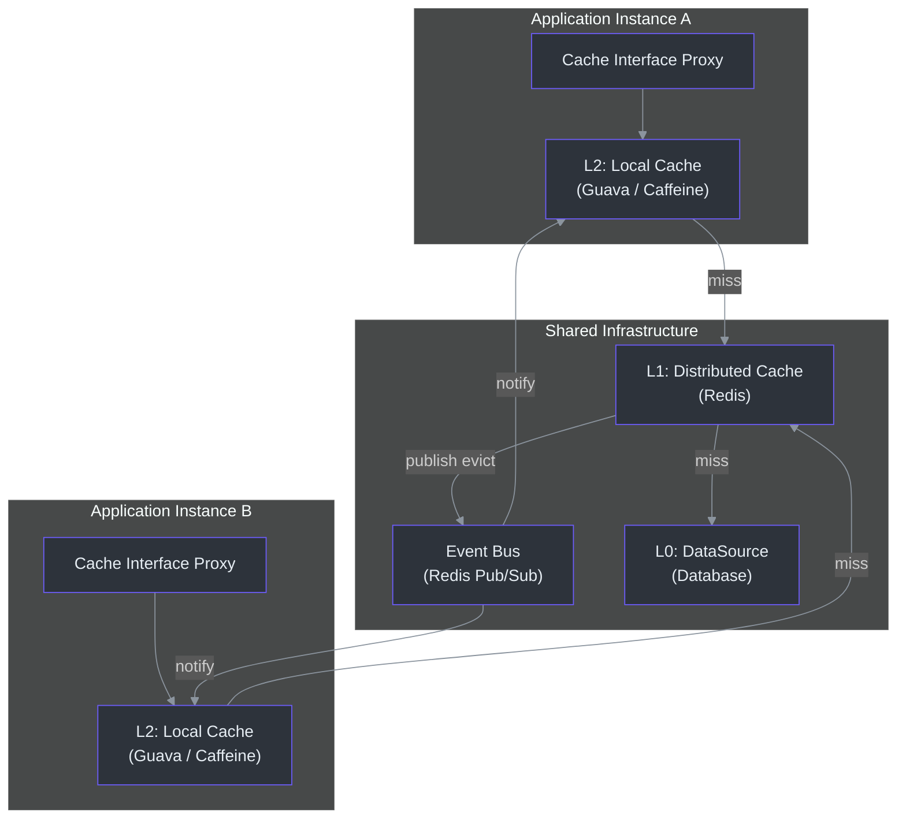
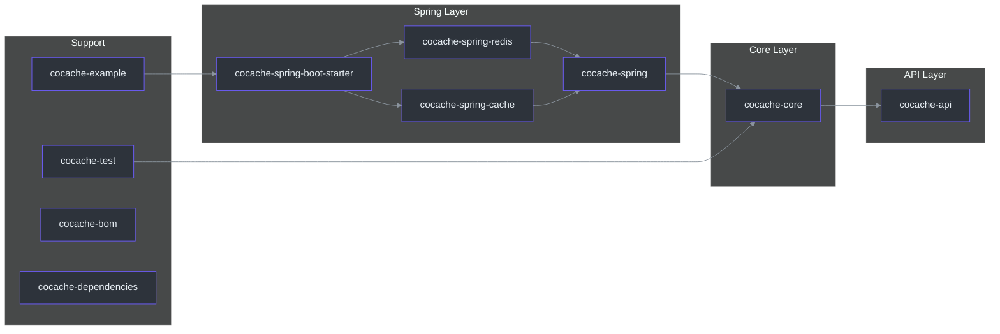
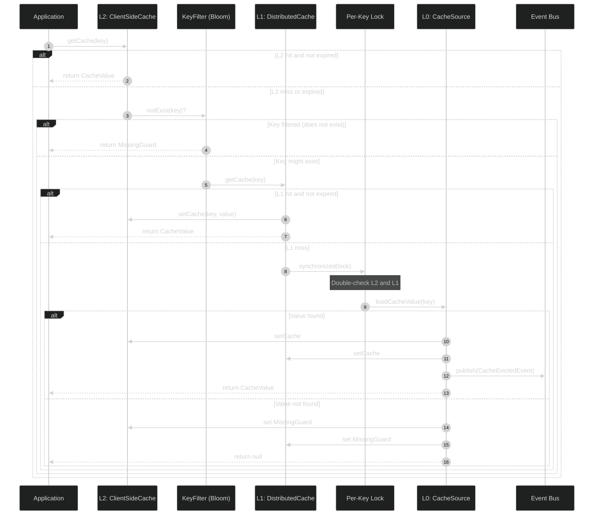
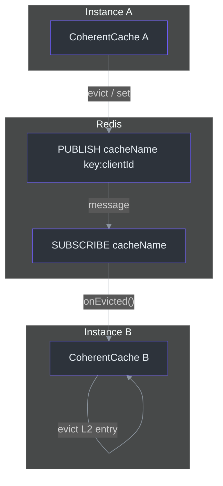
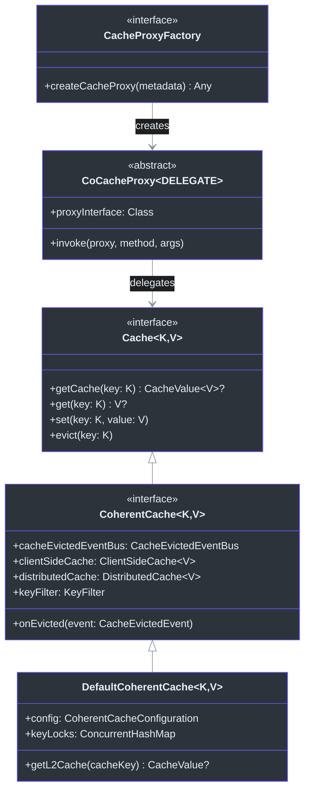
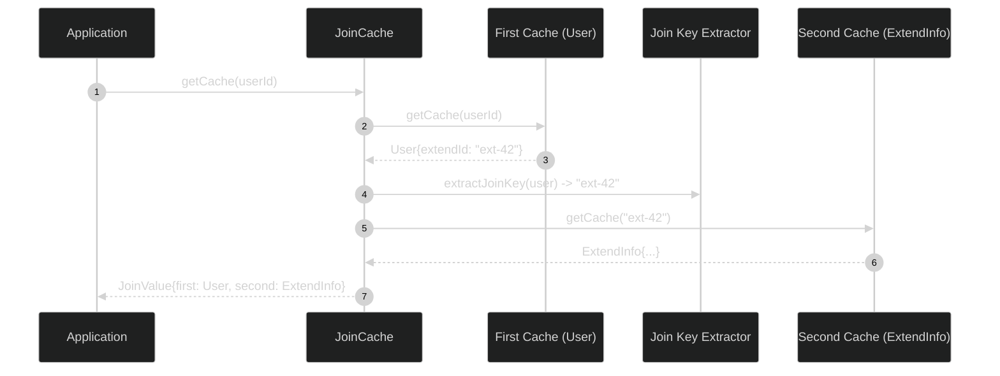

# Contributor Onboarding Guide

Welcome to the CoCache contributor guide. This document walks you through everything
you need to become an effective contributor to the CoCache framework -- from the
language and framework foundations, through the core architecture and domain model,
to hands-on productivity with the build, test, and contribution workflow.

---

## Table of Contents

- [Part I: Language and Framework Foundations](#part-i-language-and-framework-foundations)
  - [1.1 Kotlin Fundamentals](#11-kotlin-fundamentals)
  - [1.2 Java Interop Essentials](#12-java-interop-essentials)
  - [1.3 Gradle Build System](#13-gradle-build-system)
  - [1.4 Spring Boot Integration](#14-spring-boot-integration)
  - [1.5 Guava and Caffeine Libraries](#15-guava-and-caffeine-libraries)
  - [1.6 Redis](#16-redis)
- [Part II: CoCache Architecture and Domain Model](#part-ii-cocache-architecture-and-domain-model)
  - [2.1 High-Level Architecture](#21-high-level-architecture)
  - [2.2 Module Map](#22-module-map)
  - [2.3 L0 / L1 / L2 Cache Layers](#23-l0--l1--l2-cache-layers)
  - [2.4 Cache Coherence via Event Bus](#24-cache-coherence-via-event-bus)
  - [2.5 Proxy-Based Caching](#25-proxy-based-caching)
  - [2.6 JoinCache Pattern](#26-join-cache-pattern)
  - [2.7 Cache Stampede and Penetration Protection](#27-cache-stampede-and-penetration-protection)
- [Part III: Getting Productive](#part-iii-getting-productive)
  - [3.1 Environment Setup](#31-environment-setup)
  - [3.2 Building the Project](#32-building-the-project)
  - [3.3 Running Tests](#33-running-tests)
  - [3.4 Test Compatibility Kit (TCK)](#34-test-compatibility-kit-tck)
  - [3.5 Contributing Workflow](#35-contributing-workflow)
- [Glossary](#glossary)
- [Key File Reference](#key-file-reference)

---

## Part I: Language and Framework Foundations

### 1.1 Kotlin Fundamentals

CoCache is written entirely in **Kotlin** targeting **JDK 17+**. You do not need to
be a Kotlin expert to contribute, but you should be comfortable with the following
concepts.

#### Null Safety

Kotlin's type system distinguishes between nullable (`T?`) and non-null (`T`) types.
The project compiles with `-Xjsr305=strict`, which means JSR-305 annotations
(`@Nullable`, `@Nonnull`) are treated as enforcing Kotlin null-safety. If you write
a Java method that returns `@Nullable`, Kotlin callers will see it as `T?`.

```kotlin
// Non-null return -- compiler enforces this
fun getCache(key: K): CacheValue<V>?

// You must handle the null case at the call site
val value = cache.getCache("user:123")
if (value != null) {
    // use value
}
```

#### Extension Functions

CoCache uses extension functions to add utility behavior. For example, the
[cocache-core/src/main/kotlin/me/ahoo/cache/MissingGuard.kt](https://github.com/Ahoo-Wang/CoCache/blob/main/cocache-core/src/main/kotlin/me/ahoo/cache/MissingGuard.kt)
companion object defines extension properties like `Any?.isMissingGuard`:

```kotlin
val Any?.isMissingGuard: Boolean
    get() {
        return when (this) {
            is String -> this.isMissingGuard()
            is Set<*> -> this.isMissingGuard()
            else -> this is MissingGuard
        }
    }
```

#### Delegation Pattern

Kotlin's `by` keyword is used extensively in CoCache. For example,
[cocache-core/src/main/kotlin/me/ahoo/cache/consistency/DefaultCoherentCache.kt](https://github.com/Ahoo-Wang/CoCache/blob/main/cocache-core/src/main/kotlin/me/ahoo/cache/consistency/DefaultCoherentCache.kt)
delegates `DistributedClientId` and `NamedCache` to its configuration object:

```kotlin
class DefaultCoherentCache<K, V>(
    val config: CoherentCacheConfiguration<K, V>,
    override val cacheEvictedEventBus: CacheEvictedEventBus
) : CoherentCache<K, V>, DistributedClientId by config, NamedCache by config
```

#### Coroutines

CoCache does **not** use coroutines. All cache operations are synchronous. This is
a deliberate design choice: cache hits are expected to be sub-millisecond, and the
framework uses `synchronized` blocks for per-key locking rather than coroutine-based
concurrency.

### 1.2 Java Interop Essentials

The build flag `-Xjvm-default=all-compatibility` ensures that Kotlin interfaces
generate default method implementations that are callable from Java without a
`DefaultImpls` class. This is critical because CoCache's proxy-based architecture
uses `java.lang.reflect.InvocationHandler` and `java.lang.reflect.Method`.

Key interop patterns you will see in the codebase:

| Pattern | Where Used | Why |
|---------|-----------|-----|
| `@JvmStatic` on companion constants | `CacheEvictedEvent.TYPE`, `MissingGuard.STRING_VALUE` | Java callers access as `CacheEvictedEvent.TYPE` |
| `operator fun get/set` | `CacheGetter`, `CacheSetter` | Enables `cache[key]` syntax in Kotlin, `cache.get(key)` in Java |
| `@Subscribe` annotation | `DefaultCoherentCache.onEvicted()` | Guava EventBus annotation, read via reflection |

### 1.3 Gradle Build System

CoCache uses **Gradle 9.4.1** (wrapper). The build is configured via
[build.gradle.kts](https://github.com/Ahoo-Wang/CoCache/blob/main/build.gradle.kts) at the root, with each module having its
own build file.

#### Root Build Configuration

```text
build.gradle.kts          -- Root build: plugins, project categorization, common deps
settings.gradle.kts       -- Module inclusion, toolchain resolver
gradle.properties          -- Project metadata, version, sonatype URLs
config/detekt/detekt.yml   -- Detekt code quality rules
config/logback.xml         -- Test logging configuration (JaCoCo fix)
```

#### Key Gradle Commands

```bash
# Build without tests
./gradlew build -x test

# Run all tests
./gradlew test

# Run module-specific tests
./gradlew :cocache-core:test

# Run a single test class
./gradlew :cocache-core:test --tests "me.ahoo.cache.proxy.ProxyCacheTest"

# Full check (tests + detekt + dokka)
./gradlew check

# Detekt auto-fix
./gradlew detektAutoFix

# Publish to local Maven repository
./gradlew publishToMavenLocal
```

#### Dependency Management

Dependencies are centralized in the `cocache-dependencies` module, which acts as
a version catalog. All library projects declare:

```kotlin
dependencies {
    api(platform(dependenciesProject))
}
```

This ensures every module uses the same dependency versions.

### 1.4 Spring Boot Integration

CoCache integrates with **Spring Boot 4.0.5**. The Spring integration lives in
three modules:

- **`cocache-spring`** -- Core Spring integration (`@EnableCoCache`, factory beans,
  `CoCacheRegistrar`)
- **`cocache-spring-boot-starter`** -- Auto-configuration for Spring Boot
- **`cocache-spring-cache`** -- Bridge to Spring's `Cache` / `CacheManager` abstraction

#### How Spring Integration Works

The `@EnableCoCache` annotation triggers a custom `ImportBeanDefinitionRegistrar`
that scans for interfaces annotated with `@CoCache` and creates proxy beans for
each. The proxy intercepts method calls and routes them through the coherent cache
layer.

```kotlin
// From cocache-example -- defines a cache interface
@CoCache(keyPrefix = "user:", ttl = 120)
@GuavaCache(
    maximumSize = 1000_000,
    expireUnit = TimeUnit.SECONDS,
    expireAfterAccess = 120
)
interface UserCache : Cache<String, User>
```

The `@EnableCoCache` annotation lists the cache interfaces:

```kotlin
@EnableCoCache(caches = [UserCache::class])
@Configuration
class AppConfig
```

Spring auto-wires the `ClientSideCache` and `CacheSource` beans by matching the
cache name derived from the interface.

### 1.5 Guava and Caffeine Libraries

CoCache supports two local cache engines for the L2 layer:

| Engine | Annotation | Configuration Class | Module |
|--------|-----------|-------------------|--------|
| **Guava** | `@GuavaCache` | `GuavaClientSideCache` | `cocache-core` |
| **Caffeine** | `@CaffeineCache` | `CaffeineClientSideCache` | `cocache-core` |
| **Map** | (none, programmatic only) | `MapClientSideCache` | `cocache-core` |

Guava and Caffeine are configured via annotations on the cache interface. The
`ClientSideCacheFactory` reads these annotations and creates the appropriate
implementation.

The `@GuavaCache` annotation allows setting:
- `maximumSize` -- Maximum number of entries
- `expireAfterAccess` -- Eviction timeout after last access
- `expireUnit` -- Time unit for the expiration

Caffeine settings follow a similar pattern.

### 1.6 Redis

Redis is the default L1 distributed cache. CoCache uses Spring Data Redis's
`StringRedisTemplate` to interact with Redis.

The `RedisDistributedCache` implementation ([cocache-spring-redis/src/main/kotlin/me/ahoo/cache/spring/redis/RedisDistributedCache.kt](https://github.com/Ahoo-Wang/CoCache/blob/main/cocache-spring-redis/src/main/kotlin/me/ahoo/cache/spring/redis/RedisDistributedCache.kt))
uses a `CodecExecutor` for serialization/deserialization. It stores cache entries
with TTL support via Redis's native `EXPIRE` mechanism.

The `RedisCacheEvictedEventBus` ([cocache-spring-redis/src/main/kotlin/me/ahoo/cache/spring/redis/RedisCacheEvictedEventBus.kt](https://github.com/Ahoo-Wang/CoCache/blob/main/cocache-spring-redis/src/main/kotlin/me/ahoo/cache/spring/redis/RedisCacheEvictedEventBus.kt))
uses Redis Pub/Sub to broadcast eviction events across all application instances.
Each cache name maps to a separate Redis Pub/Sub channel.

---

## Part II: CoCache Architecture and Domain Model

### 2.1 High-Level Architecture

CoCache implements a **two-level distributed coherence cache**. The fundamental idea
is: every application instance maintains a local in-memory cache (L2) that is kept
coherent across instances through a shared distributed cache (L1) and an event bus.



### 2.2 Module Map



| Module | Purpose |
|--------|---------|
| `cocache-api` | Core interfaces: `Cache`, `CacheGetter`, `CacheSetter`, `ClientSideCache`, `CacheSource`, annotations |
| `cocache-core` | Default implementations: `DefaultCoherentCache`, `ComputedCache`, proxy handlers, Guava/Caffeine clients, bloom filter |
| `cocache-spring` | Spring integration: `@EnableCoCache`, `CoCacheRegistrar`, `SpringCacheFactory` |
| `cocache-spring-redis` | Redis L1 cache: `RedisDistributedCache`, `RedisCacheEvictedEventBus` |
| `cocache-spring-cache` | Spring Cache bridge: `CoCacheManager`, `CoSpringCache` |
| `cocache-spring-boot-starter` | Auto-configuration for Spring Boot |
| `cocache-test` | TCK abstract specs: `CacheSpec`, `DistributedCacheSpec`, `ClientSideCacheSpec`, `DefaultCoherentCacheSpec` |
| `cocache-example` | Reference application showing usage patterns |

### 2.3 L0 / L1 / L2 Cache Layers

CoCache uses a three-tier terminology for data access:

| Layer | Name | Component | Latency | Shared? |
|-------|------|-----------|---------|---------|
| **L2** | Local Cache | `ClientSideCache<V>` | ~microseconds | Per-instance |
| **L1** | Distributed Cache | `DistributedCache<V>` | ~milliseconds (network) | All instances |
| **L0** | Data Source | `CacheSource<K, V>` | ~milliseconds to seconds | N/A |

#### Cache Read Flow



The key source for this flow is
[cocache-core/src/main/kotlin/me/ahoo/cache/consistency/DefaultCoherentCache.kt#L89](https://github.com/Ahoo-Wang/CoCache/blob/main/cocache-core/src/main/kotlin/me/ahoo/cache/consistency/DefaultCoherentCache.kt#L89).

The method `getL2Cache()` ([cocache-core/src/main/kotlin/me/ahoo/cache/consistency/DefaultCoherentCache.kt:50](https://github.com/Ahoo-Wang/CoCache/blob/main/cocache-core/src/main/kotlin/me/ahoo/cache/consistency/DefaultCoherentCache.kt#L50))
first checks L2, then the bloom filter, then L1. If all miss, the per-key lock is
acquired and the check is repeated (double-check locking pattern) before falling
through to L0.

#### Cache Write Flow

When a value is written, it is set on **both** L2 and L1 simultaneously:

```kotlin
// DefaultCoherentCache.setCache() -- line 137
private fun setCache(cacheKey: String, cacheValue: CacheValue<V>) {
    clientSideCache.setCache(cacheKey, cacheValue)  // L2
    distributedCache.setCache(cacheKey, cacheValue)  // L1
}
```

An eviction event is then published to notify other instances.

#### Cache Evict Flow

Eviction removes the entry from both L2 and L1, then publishes an event:

```kotlin
// DefaultCoherentCache.evict() -- line 151
override fun evict(key: K) {
    val cacheKey = keyConverter.toStringKey(key)
    clientSideCache.evict(cacheKey)         // L2
    distributedCache.evict(cacheKey)        // L1
    cacheEvictedEventBus.publish(...)       // notify others
}
```

### 2.4 Cache Coherence via Event Bus

The event bus is the backbone of CoCache's coherence model. Without it, each
application instance would have a stale L2 cache after another instance updates L1.

#### Architecture



#### Event Bus Implementations

| Implementation | Module | Transport | Use Case |
|---------------|--------|-----------|----------|
| `GuavaCacheEvictedEventBus` | `cocache-core` | In-process Guava EventBus | Single-instance or testing |
| `NoOpCacheEvictedEventBus` | `cocache-core` | None (events dropped) | No coherence needed |
| `RedisCacheEvictedEventBus` | `cocache-spring-redis` | Redis Pub/Sub | Multi-instance production |

#### How It Works

1. When any instance performs a `setCache()` or `evict()`, a
   [cocache-core/src/main/kotlin/me/ahoo/cache/consistency/CacheEvictedEvent.kt](https://github.com/Ahoo-Wang/CoCache/blob/main/cocache-core/src/main/kotlin/me/ahoo/cache/consistency/CacheEvictedEvent.kt)
   is published to the event bus.

2. The event contains the `cacheName`, `key`, and `publisherId`.

3. In the Redis implementation
   ([cocache-spring-redis/src/main/kotlin/me/ahoo/cache/spring/redis/RedisCacheEvictedEventBus.kt](https://github.com/Ahoo-Wang/CoCache/blob/main/cocache-spring-redis/src/main/kotlin/me/ahoo/cache/spring/redis/RedisCacheEvictedEventBus.kt)),
   the event is sent via `redisTemplate.convertAndSend(cacheName, ...)`.

4. All instances subscribed to that cache name receive the event via
   `onEvicted()` ([cocache-core/src/main/kotlin/me/ahoo/cache/consistency/DefaultCoherentCache.kt#L159](https://github.com/Ahoo-Wang/CoCache/blob/main/cocache-core/src/main/kotlin/me/ahoo/cache/consistency/DefaultCoherentCache.kt#L159)).

5. Each instance checks: (a) does the event's cacheName match mine? (b) was this
   event published by me? If (a) yes and (b) no, the local L2 entry is evicted.

### 2.5 Proxy-Based Caching

CoCache uses JDK dynamic proxies to implement cache interfaces. This means you
never write implementation code for your cache interfaces -- just declare the
interface, annotate it, and CoCache creates the implementation at runtime.

#### Class Hierarchy



#### How Proxy Creation Works

1. `@EnableCoCache` triggers `EnableCoCacheRegistrar` (in `cocache-spring`).
2. The registrar scans for interfaces annotated with `@CoCache`.
3. For each interface, a `CoCacheMetadata` is parsed from the annotations.
4. `CacheProxyFactory.createCacheProxy()` creates a JDK dynamic proxy.
5. The proxy's `InvocationHandler` (a `CoCacheProxy` subclass) delegates all
   method calls to the `DefaultCoherentCache` instance.

The [cocache-core/src/main/kotlin/me/ahoo/cache/proxy/CoCacheProxy.kt](https://github.com/Ahoo-Wang/CoCache/blob/main/cocache-core/src/main/kotlin/me/ahoo/cache/proxy/CoCacheProxy.kt)
handles both interface default methods (invoked via `InvocationHandler.invokeDefault()`)
and regular cache methods (delegated to the `CoherentCache`).

### 2.6 JoinCache Pattern

JoinCache allows composing values from two different caches. For example, you might
have a `UserCache` (keyed by userId) and a `UserExtendInfoCache` (keyed by
extendId). A `JoinCache` can combine them: given a user, extract the extendId from
the user object, then fetch the extend info.



The `JoinCache` interface ([cocache-api/src/main/kotlin/me/ahoo/cache/api/join/JoinCache.kt](https://github.com/Ahoo-Wang/CoCache/blob/main/cocache-api/src/main/kotlin/me/ahoo/cache/api/join/JoinCache.kt))
extends `Cache<K1, JoinValue<V1, K2, V2>>` and adds a `joinKeyExtractor` that
derives the secondary key from the primary value.

The example module demonstrates this with
[cocache-example/src/main/kotlin/me/ahoo/cache/example/cache/UserExtendInfoJoinCache.kt](https://github.com/Ahoo-Wang/CoCache/blob/main/cocache-example/src/main/kotlin/me/ahoo/cache/example/cache/UserExtendInfoJoinCache.kt).

### 2.7 Cache Stampede and Penetration Protection

CoCache addresses three classic cache problems:

#### Cache Stampede (Breakdown)

**Problem**: When a popular cache entry expires, many concurrent requests
simultaneously miss the cache and all hit the database.

**Solution**: Per-key fine-grained locking. The `DefaultCoherentCache` maintains
a `ConcurrentHashMap<String, Any>` of lock objects. When a cache miss occurs, the
specific key's lock is acquired via `synchronized(lock)`. Inside the lock, the
cache is re-checked (double-check locking). Only one thread per key falls through
to the database.

```kotlin
// DefaultCoherentCache.getCache() -- lines 101-134
val lock = getLock(cacheKey)
synchronized(lock) {
    try {
        getL2Cache(cacheKey)?.let { return it }
        // ... fall through to CacheSource
    } finally {
        releaseLock(cacheKey)
    }
}
```

This is implemented at
[cocache-core/src/main/kotlin/me/ahoo/cache/consistency/DefaultCoherentCache.kt#L101](https://github.com/Ahoo-Wang/CoCache/blob/main/cocache-core/src/main/kotlin/me/ahoo/cache/consistency/DefaultCoherentCache.kt#L101).

#### Cache Penetration

**Problem**: Queries for keys that do not exist in the database always miss the
cache and hit the database.

**Solution**: MissingGuard sentinel values. When a cache lookup returns no value
from the database, CoCache stores a special "missing guard" value
(`_nil_` string for strings, or a marker object). Subsequent lookups for the same
key return this sentinel, and the caller treats it as "no value found" without
hitting the database.

```kotlin
// DefaultCoherentCache.getCache() -- line 129
setCache(cacheKey, DefaultCacheValue.missingGuard(ttl, ttlAmplitude))
return null
```

See [cocache-core/src/main/kotlin/me/ahoo/cache/MissingGuard.kt](https://github.com/Ahoo-Wang/CoCache/blob/main/cocache-core/src/main/kotlin/me/ahoo/cache/MissingGuard.kt)
for the sentinel value detection logic.

#### Cache Breakdown (via Bloom Filter)

**Problem**: Large numbers of random non-existent keys overwhelm the cache.

**Solution**: `KeyFilter` interface with a `BloomKeyFilter` implementation backed
by Guava's `BloomFilter`. Before hitting L1, the bloom filter is checked. If the
key definitely does not exist, a MissingGuard is returned immediately without
touching Redis.

See [cocache-core/src/main/kotlin/me/ahoo/cache/filter/BloomKeyFilter.kt](https://github.com/Ahoo-Wang/CoCache/blob/main/cocache-core/src/main/kotlin/me/ahoo/cache/filter/BloomKeyFilter.kt).

### 2.8 CacheValue and TTL System

Understanding the `CacheValue` and TTL (Time-To-Live) system is essential for
working with CoCache internals.

#### CacheValue Lifecycle

Every entry stored in the cache is wrapped in a `CacheValue<V>` that carries
metadata:

| Property | Type | Meaning |
|----------|------|---------|
| `value` | `V` | The actual cached data (or a MissingGuard sentinel) |
| `ttlAt` | `Long` | Absolute timestamp (seconds since epoch) when this entry expires |
| `isExpired` | `Boolean` | Whether `currentTime > ttlAt` |
| `isMissingGuard` | `Boolean` | Whether this is a sentinel "not found" marker |

The implementation is [cocache-core/src/main/kotlin/me/ahoo/cache/DefaultCacheValue.kt](https://github.com/Ahoo-Wang/CoCache/blob/main/cocache-core/src/main/kotlin/me/ahoo/cache/DefaultCacheValue.kt),
which uses `ComputedTtlAt` ([cocache-core/src/main/kotlin/me/ahoo/cache/ComputedTtlAt.kt](https://github.com/Ahoo-Wang/CoCache/blob/main/cocache-core/src/main/kotlin/me/ahoo/cache/ComputedTtlAt.kt))
to compute expiration.

#### TTL Amplitude (Jitter) in Detail

The `ComputedTtlAt.jitter()` function ([cocache-core/src/main/kotlin/me/ahoo/cache/ComputedTtlAt.kt:49](https://github.com/Ahoo-Wang/CoCache/blob/main/cocache-core/src/main/kotlin/me/ahoo/cache/ComputedTtlAt.kt#L49))
randomizes the TTL within a range:

```kotlin
fun jitter(ttl: Long, amplitude: Long): Long {
    val low = ttl - amplitude
    val high = ttl + amplitude
    return (low..high).random()
}
```

For a cache with `ttl = 120` and `ttlAmplitude = 10`, each entry will expire
between 110 and 130 seconds after creation. This prevents the "cache avalanche"
scenario where all entries fetched during a traffic spike expire simultaneously.

The `TtlConfiguration` interface ([cocache-core/src/main/kotlin/me/ahoo/cache/TtlConfiguration.kt](https://github.com/Ahoo-Wang/CoCache/blob/main/cocache-core/src/main/kotlin/me/ahoo/cache/TtlConfiguration.kt))
carries `ttl` and `ttlAmplitude` and is implemented by cache implementations.
The `getFirstTtlConfiguration()` utility function finds the TTL config from the
first cache (L2 or L1) that implements it.

#### The `isForever` Special Case

When `ttl` is `Long.MAX_VALUE` (the default in `@CoCache`), the entry never
expires. This is detected by `ComputedTtlAt.isForever()` and the entry's
`isExpired` always returns `false`. In practice, you should almost always set a
finite TTL.

### 2.9 Key Conversion

CoCache stores all cache keys as strings internally, regardless of the key type
defined on the cache interface. The `KeyConverter<K>` interface
([cocache-core/src/main/kotlin/me/ahoo/cache/converter/KeyConverter.kt](https://github.com/Ahoo-Wang/CoCache/blob/main/cocache-core/src/main/kotlin/me/ahoo/cache/converter/KeyConverter.kt))
handles this conversion.

| Converter | Behavior | Use Case |
|-----------|----------|----------|
| `ToStringKeyConverter` | Calls `key.toString()` | Simple keys (String, Long, UUID) |
| `ExpKeyConverter` | Evaluates a SpEL expression against the key | Complex keys or derived key formats |

The `@CoCache` annotation's `keyExpression` field controls which converter is
used. If empty, `ToStringKeyConverter` is used. If set to a SpEL expression
(e.g., `"#root.id"`), `ExpKeyConverter` evaluates it.

The `keyPrefix` field on `@CoCache` is prepended to all keys, providing
namespacing. For `@CoCache(keyPrefix = "user:", ttl = 120)` with key `"123"`,
the Redis key becomes `"user:123"`.

### 2.10 DistributedClientId

Each `CoherentCache` instance has a unique `clientId` (via the
`DistributedClientId` interface). This ID is used to:

1. **Identify the publisher** of eviction events, so the publishing instance
   can ignore its own events in `onEvicted()`.
2. **Log debugging information** about which instance performed which operation.

Client IDs are generated by implementations of `ClientIdGenerator`:
- `UUIDClientIdGenerator` -- Random UUID (default)
- `HostClientIdGenerator` -- Based on hostname + port

---

## Part III: Getting Productive

### 3.1 Environment Setup

#### Prerequisites

| Tool | Version | Purpose |
|------|---------|---------|
| JDK | 17+ | Runtime and compilation (Gradle auto-provisions via toolchain) |
| Docker | latest | Running Redis for integration tests |
| Git | 2.x | Version control |

#### Cloning and Initial Build

```bash
# Clone the repository
git clone https://github.com/Ahoo-Wang/CoCache.git
cd CoCache

# Verify the build compiles (skip tests for speed)
./gradlew build -x test

# Run detekt to check code style
./gradlew detekt
```

#### IDE Setup

CoCache works with IntelliJ IDEA (recommended) or any Kotlin-capable IDE.

1. Open the project root as a Gradle project.
2. IntelliJ will auto-import dependencies from `settings.gradle.kts`.
3. Set the Gradle JVM to JDK 17+.
4. Enable Kotlin plugin (bundled with IntelliJ).

### 3.2 Building the Project

```bash
# Full build (no tests) -- fast feedback during development
./gradlew build -x test

# Full check with all validations (CI mode)
./gradlew clean check

# Build with code coverage
./gradlew test jacocoTestReport
```

#### Build Output

Each module produces:
- JAR artifact in `<module>/build/libs/`
- Test results in `<module>/build/reports/tests/`
- Code coverage in `<module>/build/reports/jacoco/`

### 3.3 Running Tests

#### Unit Tests

```bash
# All tests
./gradlew test

# Module-specific
./gradlew :cocache-core:test

# Single test class
./gradlew :cocache-core:test --tests "me.ahoo.cache.proxy.ProxyCacheTest"

# Single test method
./gradlew :cocache-core:test --tests "me.ahoo.cache.proxy.ProxyCacheTest.shouldGet"
```

#### Integration Tests (require Redis)

```bash
# Start Redis via Docker
docker run -d --name cocache-redis -p 6379:6379 redis:latest

# Run Redis-dependent module tests
./gradlew :cocache-spring-redis:check
./gradlew :cocache-spring-boot-starter:check

# Clean up
docker stop cocache-redis && docker rm cocache-redis
```

#### Test Patterns

CoCache uses **JUnit 5** (Jupiter) with **MockK** for mocking and **fluent-assert**
for assertions. The fluent-assert pattern is:

```kotlin
import me.ahoo.test.asserts.assert

// Never use AssertJ's assertThat() in this project
myValue.assert().isEqualTo(expected)
list.assert().hasSize(3)
exception.assert().isInstanceOf(IllegalArgumentException::class.java)
```

### 3.4 Test Compatibility Kit (TCK)

The `cocache-test` module provides abstract test specification classes. Any new
cache implementation must pass these specs:

| Spec Class | What It Tests |
|-----------|---------------|
| `CacheSpec` | Basic get/set/evict operations |
| `ClientSideCacheSpec` | L2 cache behavior (size, clear, expiry) |
| `DistributedCacheSpec` | L1 cache behavior (shared state) |
| `DefaultCoherentCacheSpec` | Full coherent cache with event bus |
| `MultipleInstanceSyncSpec` | Multi-instance coherence via event bus |
| `CacheEvictedEventBusSpec` | Event bus publish/subscribe semantics |

To add a new cache implementation, extend the appropriate spec:

```kotlin
class MyNewClientSideCacheTest : ClientSideCacheSpec() {
    override fun createClientSideCache(): ClientSideCache<String> {
        return MyNewClientSideCache(ttl = 120, ttlAmplitude = 10)
    }
}
```

All abstract methods in the spec will be automatically executed as JUnit 5 tests.

### 3.5 Contributing Workflow

#### Branch Strategy

- `main` branch is the primary development branch.
- Create feature branches from `main`: `feature/your-feature-name`.
- Keep branches short-lived and focused.

#### Step-by-Step

```bash
# 1. Fork and clone (or create branch if you have push access)
git checkout -b feature/my-feature

# 2. Make changes, ensuring detekt passes
./gradlew detekt

# 3. Write or update tests
./gradlew :cocache-core:test

# 4. Run the full check
./gradlew check

# 5. Commit with descriptive message
git add .
git commit -m "feat(module): describe your change"

# 6. Push and create PR
git push origin feature/my-feature
```

#### Code Style

- Detekt rules are configured at [config/detekt/detekt.yml](https://github.com/Ahoo-Wang/CoCache/blob/main/config/detekt/detekt.yml).
- `MaxLineLength` is set to 300 (relaxed).
- `WildcardImport` is allowed for `java.util.*`.
- `LongParameterList`, `TooManyFunctions`, and `ReturnCount` rules are disabled.
- Auto-fix available: `./gradlew detektAutoFix`.

#### PR Requirements

- All existing tests pass.
- New features include tests.
- Detekt reports no issues.
- Code coverage does not decrease.

---

## Glossary

| Term | Definition |
|------|-----------|
| **L2 Cache** | Local in-memory cache on each application instance (Guava, Caffeine, or simple Map) |
| **L1 Cache** | Distributed cache shared across all instances (Redis) |
| **L0** | The underlying data source (typically a database), loaded via `CacheSource` |
| **CoherentCache** | The main cache abstraction that orchestrates L2, L1, L0, and event-driven coherence |
| **CacheEvictedEvent** | An event published when a cache entry is modified or removed, used for cross-instance invalidation |
| **CacheEvictedEventBus** | The pub/sub mechanism for distributing eviction events (Guava EventBus or Redis Pub/Sub) |
| **ClientSideCache** | Interface for the L2 local cache layer |
| **DistributedCache** | Interface for the L1 distributed cache layer |
| **CacheSource** | Interface for loading data from the underlying data store (L0) |
| **MissingGuard** | A sentinel value stored in cache to indicate a key was looked up but not found in the database |
| **KeyFilter** | A bloom filter that checks whether a key might exist before hitting L1 |
| **CoCache Proxy** | JDK dynamic proxy that implements a user-defined cache interface and delegates to `CoherentCache` |
| **JoinCache** | A cache that composes values from two caches using a join key extractor |
| **JoinValue** | The composite result type of a JoinCache, containing the primary value and the joined secondary value |
| **TTL Amplitude** | A random jitter added to TTL values to prevent synchronized expiration (thundering herd) |
| **KeyConverter** | Converts typed keys to string keys for storage in the cache |
| **CacheStampede** | When many concurrent requests all miss the cache simultaneously and overwhelm the data source |
| **TCK** | Test Compatibility Kit -- abstract test specs that any new cache implementation must pass |

---

## Key File Reference

| File Path | Description | Key Lines |
|-----------|-------------|-----------|
| [cocache-api/src/main/kotlin/me/ahoo/cache/api/Cache.kt](https://github.com/Ahoo-Wang/CoCache/blob/main/cocache-api/src/main/kotlin/me/ahoo/cache/api/Cache.kt) | Root cache interface | L21: `Cache<K, V> : CacheGetter<K, V>, CacheSetter<K, V>` |
| [cocache-api/src/main/kotlin/me/ahoo/cache/api/CacheGetter.kt](https://github.com/Ahoo-Wang/CoCache/blob/main/cocache-api/src/main/kotlin/me/ahoo/cache/api/CacheGetter.kt) | Read operations interface | L21-38: `getCache`, `get`, `getTtlAt` |
| [cocache-api/src/main/kotlin/me/ahoo/cache/api/CacheSetter.kt](https://github.com/Ahoo-Wang/CoCache/blob/main/cocache-api/src/main/kotlin/me/ahoo/cache/api/CacheSetter.kt) | Write operations interface | L17-30: `set`, `setCache`, `evict` |
| [cocache-api/src/main/kotlin/me/ahoo/cache/api/CacheValue.kt](https://github.com/Ahoo-Wang/CoCache/blob/main/cocache-api/src/main/kotlin/me/ahoo/cache/api/CacheValue.kt) | Cached value with TTL metadata | Interface for value + ttlAt + isExpired |
| [cocache-api/src/main/kotlin/me/ahoo/cache/api/client/ClientSideCache.kt](https://github.com/Ahoo-Wang/CoCache/blob/main/cocache-api/src/main/kotlin/me/ahoo/cache/api/client/ClientSideCache.kt) | L2 cache interface | L22: `ClientSideCache<V> : Cache<String, V>` |
| [cocache-api/src/main/kotlin/me/ahoo/cache/api/annotation/CoCache.kt](https://github.com/Ahoo-Wang/CoCache/blob/main/cocache-api/src/main/kotlin/me/ahoo/cache/api/annotation/CoCache.kt) | Cache interface annotation | L29-45: `@CoCache` annotation |
| [cocache-api/src/main/kotlin/me/ahoo/cache/api/annotation/GuavaCache.kt](https://github.com/Ahoo-Wang/CoCache/blob/main/cocache-api/src/main/kotlin/me/ahoo/cache/api/annotation/GuavaCache.kt) | Guava cache configuration | Annotation with maximumSize, expireAfterAccess |
| [cocache-api/src/main/kotlin/me/ahoo/cache/api/annotation/CaffeineCache.kt](https://github.com/Ahoo-Wang/CoCache/blob/main/cocache-api/src/main/kotlin/me/ahoo/cache/api/annotation/CaffeineCache.kt) | Caffeine cache configuration | Annotation with Caffeine settings |
| [cocache-api/src/main/kotlin/me/ahoo/cache/api/source/CacheSource.kt](https://github.com/Ahoo-Wang/CoCache/blob/main/cocache-api/src/main/kotlin/me/ahoo/cache/api/source/CacheSource.kt) | Data source interface | L0 loader |
| [cocache-api/src/main/kotlin/me/ahoo/cache/api/join/JoinCache.kt](https://github.com/Ahoo-Wang/CoCache/blob/main/cocache-api/src/main/kotlin/me/ahoo/cache/api/join/JoinCache.kt) | Join cache interface | L23: `JoinCache<K1, V1, K2, V2>` |
| [cocache-api/src/main/kotlin/me/ahoo/cache/api/join/JoinValue.kt](https://github.com/Ahoo-Wang/CoCache/blob/main/cocache-api/src/main/kotlin/me/ahoo/cache/api/join/JoinValue.kt) | Join result value | Composite value type |
| [cocache-core/src/main/kotlin/me/ahoo/cache/consistency/DefaultCoherentCache.kt](https://github.com/Ahoo-Wang/CoCache/blob/main/cocache-core/src/main/kotlin/me/ahoo/cache/consistency/DefaultCoherentCache.kt) | Core coherent cache implementation | L50: `getL2Cache`, L89: `getCache`, L137: `setCache`, L151: `evict`, L159: `onEvicted` |
| [cocache-core/src/main/kotlin/me/ahoo/cache/consistency/CoherentCache.kt](https://github.com/Ahoo-Wang/CoCache/blob/main/cocache-core/src/main/kotlin/me/ahoo/cache/consistency/CoherentCache.kt) | Coherent cache interface | L25: extends `ComputedCache`, `DistributedClientId`, `NamedCache`, `CacheEvictedSubscriber` |
| [cocache-core/src/main/kotlin/me/ahoo/cache/consistency/CacheEvictedEventBus.kt](https://github.com/Ahoo-Wang/CoCache/blob/main/cocache-core/src/main/kotlin/me/ahoo/cache/consistency/CacheEvictedEventBus.kt) | Event bus interface | L20-24: `publish`, `register`, `unregister` |
| [cocache-core/src/main/kotlin/me/ahoo/cache/consistency/CacheEvictedEvent.kt](https://github.com/Ahoo-Wang/CoCache/blob/main/cocache-core/src/main/kotlin/me/ahoo/cache/consistency/CacheEvictedEvent.kt) | Eviction event data class | L21-39: `cacheName`, `key`, `publisherId` |
| [cocache-core/src/main/kotlin/me/ahoo/cache/consistency/GuavaCacheEvictedEventBus.kt](https://github.com/Ahoo-Wang/CoCache/blob/main/cocache-core/src/main/kotlin/me/ahoo/cache/consistency/GuavaCacheEvictedEventBus.kt) | In-process event bus | Uses Guava EventBus |
| [cocache-core/src/main/kotlin/me/ahoo/cache/consistency/NoOpCacheEvictedEventBus.kt](https://github.com/Ahoo-Wang/CoCache/blob/main/cocache-core/src/main/kotlin/me/ahoo/cache/consistency/NoOpCacheEvictedEventBus.kt) | No-op event bus | Drops all events |
| [cocache-core/src/main/kotlin/me/ahoo/cache/proxy/CoCacheProxy.kt](https://github.com/Ahoo-Wang/CoCache/blob/main/cocache-core/src/main/kotlin/me/ahoo/cache/proxy/CoCacheProxy.kt) | JDK dynamic proxy handler | L20-41: `InvocationHandler` implementation |
| [cocache-core/src/main/kotlin/me/ahoo/cache/proxy/DefaultCacheProxyFactory.kt](https://github.com/Ahoo-Wang/CoCache/blob/main/cocache-core/src/main/kotlin/me/ahoo/cache/proxy/DefaultCacheProxyFactory.kt) | Proxy factory | Creates JDK proxy instances |
| [cocache-core/src/main/kotlin/me/ahoo/cache/ComputedCache.kt](https://github.com/Ahoo-Wang/CoCache/blob/main/cocache-core/src/main/kotlin/me/ahoo/cache/ComputedCache.kt) | Computed cache with default `get`/`set` | L20-64: adds `get()`, `getTtlAt()`, `set()` implementations |
| [cocache-core/src/main/kotlin/me/ahoo/cache/MissingGuard.kt](https://github.com/Ahoo-Wang/CoCache/blob/main/cocache-core/src/main/kotlin/me/ahoo/cache/MissingGuard.kt) | Missing guard sentinel | L18: `STRING_VALUE = "_nil_"` |
| [cocache-core/src/main/kotlin/me/ahoo/cache/KeyFilter.kt](https://github.com/Ahoo-Wang/CoCache/blob/main/cocache-core/src/main/kotlin/me/ahoo/cache/KeyFilter.kt) | Bloom filter interface | L22: `notExist(key: String): Boolean` |
| [cocache-core/src/main/kotlin/me/ahoo/cache/filter/BloomKeyFilter.kt](https://github.com/Ahoo-Wang/CoCache/blob/main/cocache-core/src/main/kotlin/me/ahoo/cache/filter/BloomKeyFilter.kt) | Bloom filter implementation | Uses Guava `BloomFilter` |
| [cocache-core/src/main/kotlin/me/ahoo/cache/client/GuavaClientSideCache.kt](https://github.com/Ahoo-Wang/CoCache/blob/main/cocache-core/src/main/kotlin/me/ahoo/cache/client/GuavaClientSideCache.kt) | Guava L2 cache | Wraps Guava `Cache` |
| [cocache-core/src/main/kotlin/me/ahoo/cache/client/CaffeineClientSideCache.kt](https://github.com/Ahoo-Wang/CoCache/blob/main/cocache-core/src/main/kotlin/me/ahoo/cache/client/CaffeineClientSideCache.kt) | Caffeine L2 cache | Wraps Caffeine `Cache` |
| [cocache-core/src/main/kotlin/me/ahoo/cache/client/MapClientSideCache.kt](https://github.com/Ahoo-Wang/CoCache/blob/main/cocache-core/src/main/kotlin/me/ahoo/cache/client/MapClientSideCache.kt) | Simple map L2 cache | `ConcurrentHashMap`-based |
| [cocache-spring-redis/src/main/kotlin/me/ahoo/cache/spring/redis/RedisDistributedCache.kt](https://github.com/Ahoo-Wang/CoCache/blob/main/cocache-spring-redis/src/main/kotlin/me/ahoo/cache/spring/redis/RedisDistributedCache.kt) | Redis L1 cache | Uses `StringRedisTemplate` |
| [cocache-spring-redis/src/main/kotlin/me/ahoo/cache/spring/redis/RedisCacheEvictedEventBus.kt](https://github.com/Ahoo-Wang/CoCache/blob/main/cocache-spring-redis/src/main/kotlin/me/ahoo/cache/spring/redis/RedisCacheEvictedEventBus.kt) | Redis event bus | Redis Pub/Sub implementation |
| [cocache-spring/src/main/kotlin/me/ahoo/cache/spring/EnableCoCache.kt](https://github.com/Ahoo-Wang/CoCache/blob/main/cocache-spring/src/main/kotlin/me/ahoo/cache/spring/EnableCoCache.kt) | Enable annotation | Triggers registrar |
| [cocache-spring/src/main/kotlin/me/ahoo/cache/spring/EnableCoCacheRegistrar.kt](https://github.com/Ahoo-Wang/CoCache/blob/main/cocache-spring/src/main/kotlin/me/ahoo/cache/spring/EnableCoCacheRegistrar.kt) | Bean registrar | Scans for `@CoCache` interfaces |
| [cocache-spring-cache/src/main/kotlin/me/ahoo/cache/spring/cache/CoCacheManager.kt](https://github.com/Ahoo-Wang/CoCache/blob/main/cocache-spring-cache/src/main/kotlin/me/ahoo/cache/spring/cache/CoCacheManager.kt) | Spring CacheManager bridge | Adapts CoCache to Spring Cache |
| [cocache-test/src/main/kotlin/me/ahoo/cache/test/CacheSpec.kt](https://github.com/Ahoo-Wang/CoCache/blob/main/cocache-test/src/main/kotlin/me/ahoo/cache/test/CacheSpec.kt) | TCK: basic cache operations | Abstract test spec |
| [cocache-test/src/main/kotlin/me/ahoo/cache/test/DefaultCoherentCacheSpec.kt](https://github.com/Ahoo-Wang/CoCache/blob/main/cocache-test/src/main/kotlin/me/ahoo/cache/test/DefaultCoherentCacheSpec.kt) | TCK: coherent cache | Full coherence tests |
| [cocache-test/src/main/kotlin/me/ahoo/cache/test/ClientSideCacheSpec.kt](https://github.com/Ahoo-Wang/CoCache/blob/main/cocache-test/src/main/kotlin/me/ahoo/cache/test/ClientSideCacheSpec.kt) | TCK: client-side cache | L2 tests |
| [cocache-test/src/main/kotlin/me/ahoo/cache/test/DistributedCacheSpec.kt](https://github.com/Ahoo-Wang/CoCache/blob/main/cocache-test/src/main/kotlin/me/ahoo/cache/test/DistributedCacheSpec.kt) | TCK: distributed cache | L1 tests |
| [cocache-test/src/main/kotlin/me/ahoo/cache/test/MultipleInstanceSyncSpec.kt](https://github.com/Ahoo-Wang/CoCache/blob/main/cocache-test/src/main/kotlin/me/ahoo/cache/test/MultipleInstanceSyncSpec.kt) | TCK: multi-instance sync | Cross-instance coherence |
| [cocache-test/src/main/kotlin/me/ahoo/cache/test/consistency/CacheEvictedEventBusSpec.kt](https://github.com/Ahoo-Wang/CoCache/blob/main/cocache-test/src/main/kotlin/me/ahoo/cache/test/consistency/CacheEvictedEventBusSpec.kt) | TCK: event bus | Pub/sub semantics |
| [cocache-example/src/main/kotlin/me/ahoo/cache/example/cache/UserCache.kt](https://github.com/Ahoo-Wang/CoCache/blob/main/cocache-example/src/main/kotlin/me/ahoo/cache/example/cache/UserCache.kt) | Example cache interface | `@CoCache(keyPrefix = "user:", ttl = 120)` |
| [cocache-example/src/main/kotlin/me/ahoo/cache/example/config/UserCacheConfiguration.kt](https://github.com/Ahoo-Wang/CoCache/blob/main/cocache-example/src/main/kotlin/me/ahoo/cache/example/config/UserCacheConfiguration.kt) | Example configuration | Custom `ClientSideCache` and `CacheSource` beans |
| [cocache-example/src/main/kotlin/me/ahoo/cache/example/cache/UserExtendInfoJoinCache.kt](https://github.com/Ahoo-Wang/CoCache/blob/main/cocache-example/src/main/kotlin/me/ahoo/cache/example/cache/UserExtendInfoJoinCache.kt) | Example JoinCache | Demonstrates join pattern |
| [build.gradle.kts](https://github.com/Ahoo-Wang/CoCache/blob/main/build.gradle.kts) | Root build configuration | Plugins, project categorization, common dependencies |
| [settings.gradle.kts](https://github.com/Ahoo-Wang/CoCache/blob/main/settings.gradle.kts) | Module inclusion | All 11 modules listed |
| [config/detekt/detekt.yml](https://github.com/Ahoo-Wang/CoCache/blob/main/config/detekt/detekt.yml) | Detekt code quality rules | Override configuration |

---

## Next Steps

Now that you have completed this guide, you should be able to:

1. Understand the Kotlin patterns used throughout the codebase.
2. Navigate the module structure and know where each piece lives.
3. Trace a cache read through L2 -> L1 -> L0 with locking and event publication.
4. Understand how the event bus maintains cross-instance coherence.
5. Build, test, and contribute changes following the project conventions.

For deeper architectural analysis, see the
[Staff Engineer Onboarding Guide](./staff-engineer.md).
For a non-technical overview, see the
[Executive Onboarding Guide](./executive.md).
