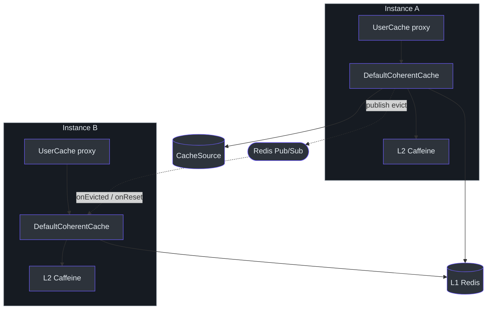
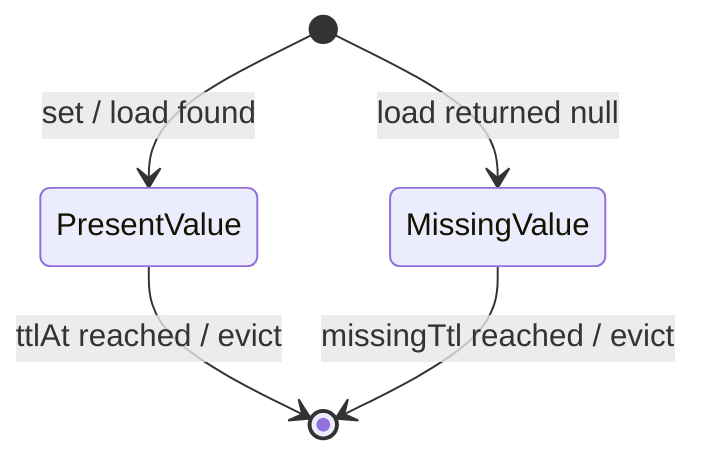

# Contributor Onboarding Guide

This guide gets you from a fresh clone to a mergeable pull request. Read [`docs/architecture.md`](https://github.com/Ahoo-Wang/CoCache/blob/main/docs/architecture.md) alongside it. That file is the single source of truth for design goals and invariants.

## Table of Contents

- [Part I: Foundations](#part-i-foundations)
- [Part II: Architecture and Domain Model](#part-ii-architecture-and-domain-model)
- [Part III: Getting Productive](#part-iii-getting-productive)
- [Glossary](#glossary)

## Part I: Foundations

### Kotlin Idioms Used Here

| Idiom | Where | Why |
|-------|-------|-----|
| `sealed interface` + `when` | `CacheValue` = `PresentValue` \| `MissingValue` | The negative cache is a type, checked exhaustively |
| `fun interface` | `CacheSource`, `KeyConverter`, `KeyFilter`, `JoinKeyExtractor` | Lambdas as SPI implementations |
| Interface default methods | `CacheGetter.get`, `CacheSetter.set(key, ttlAt, value)` | Implementers write only the primitives |
| `data class` | `CoherentCacheConfiguration`, `TtlPolicy`, `JoinValue`, metadata | Value semantics |
| Extension functions | `KClass.toCoCacheMetadata()` | Readable parsing entry points |

Compiler flags: `-Xjsr305=strict` (nullness of Java APIs is enforced) and `-Xjvm-default=all-compatibility` (interface bodies compile to Java default methods).

### Libraries

| Library | Used for | Module |
|---------|----------|--------|
| Caffeine | Default L2 (bounded; expiry checked on read) | cocache-core |
| Spring Expression | SpEL key / join-key templates (compiled mode) | cocache-core |
| Spring Data Redis + Jackson 3 | L1 store, Pub/Sub channel | cocache-spring-redis |
| Guava (compile-only) | `BloomKeyFilter` | cocache-core |
| CosId | Host-based `ClientIdGenerator` | cocache-core |

## Part II: Architecture and Domain Model

### High-Level Architecture


```mermaid
graph TB
    subgraph inst1 ["Instance A"]
        P1["UserCache proxy"] --> C1["DefaultCoherentCache"]
        C1 --> L2a["L2 Caffeine"]
    end
    subgraph inst2 ["Instance B"]
        P2["UserCache proxy"] --> C2["DefaultCoherentCache"]
        C2 --> L2b["L2 Caffeine"]
    end
    C1 --> L1[("L1 Redis")]
    C2 --> L1
    C1 -.->|"publish evict"| PS(["Redis Pub/Sub"])
    PS -.->|"onEvicted / onReset"| C2
    C1 --> DB[("CacheSource")]

    style P1 fill:#2d333b,stroke:#6d5dfc,color:#e6edf3
    style C1 fill:#2d333b,stroke:#6d5dfc,color:#e6edf3
    style L2a fill:#2d333b,stroke:#6d5dfc,color:#e6edf3
    style P2 fill:#2d333b,stroke:#6d5dfc,color:#e6edf3
    style C2 fill:#2d333b,stroke:#6d5dfc,color:#e6edf3
    style L2b fill:#2d333b,stroke:#6d5dfc,color:#e6edf3
    style L1 fill:#2d333b,stroke:#6d5dfc,color:#e6edf3
    style PS fill:#2d333b,stroke:#6d5dfc,color:#e6edf3
    style DB fill:#2d333b,stroke:#6d5dfc,color:#e6edf3
    style inst1 fill:#161b22,stroke:#8b949e,color:#e6edf3
    style inst2 fill:#161b22,stroke:#8b949e,color:#e6edf3
```

### Module Map

| Module | Responsibility |
|--------|----------------|
| `cocache-api` | User API and **all SPI**; no runtime dependencies |
| `cocache-core` | Orchestration (`DefaultCoherentCache`, `TtlPolicy`, `SingleFlight`), default stores and buses, proxies, JoinCache |
| `cocache-spring` | `@EnableCoCache`, factory beans, component resolution by bean name |
| `cocache-spring-redis` | `RedisDistributedCache`, codecs, `RedisCacheEvictedEventBus` |
| `cocache-spring-cache` | Spring `CacheManager` bridge |
| `cocache-spring-boot-starter` | Auto-configuration, properties, actuator endpoints |
| `cocache-test` | TCK specs |

Dependencies point one way only: `api ← core ← spring ← {spring-redis, spring-cache} ← starter`.

### Responsibilities by Layer

- **Stores** (`CacheStore` → `ClientSideCache`, `DistributedCache`) store `CacheValue` by string key. They hold no TTL policy.
- **Policy** (`TtlPolicy`): `ttl ± ttlAmplitude` for values, `missingTtl` for negative entries.
- **Orchestration** (`DefaultCoherentCache`): read-through, per-key load coalescing, stamp-guarded write-backs, broadcasting.
- **Channel** (`CacheEvictedEventBus`): best-effort broadcast, plus `onReset` on every (re)subscription.

### The Read Path

```mermaid
sequenceDiagram
autonumber
    participant App
    participant C as DefaultCoherentCache
    participant L2
    participant SF as SingleFlight
    participant L1
    participant Src as CacheSource

    App->>C: getCache(key)
    C->>L2: getCache
    alt hit
        L2-->>App: value
    else miss
        C->>SF: execute(cacheKey)
        SF->>L1: getCache (stamp taken first)
        alt L1 hit
            SF->>L2: fill if stamp unchanged
        else L1 miss
            SF->>Src: load (null → MissingValue(missingTtl))
            SF->>L1: write if stamp unchanged
            SF->>L2: write; undo if stamp changed meanwhile
        end
        SF-->>App: value
    end
```

### Invariants You Must Not Break

1. **An L1 miss is never a negative cache.** Only a stored sentinel decodes to `MissingValue`.
2. **Invalidators bump the stamp before evicting; write-backs check the stamp before and after writing.** This covers local `evict`/`setCache`, remote `onEvicted`, and `onReset`.
3. **`onReset` clears L2.** It is the only defense against Pub/Sub messages lost during a disconnect.
4. **Successful loads do not broadcast.**
5. **Proxies rethrow the delegate's original exception.**
6. **Stateful Spring components resolve by bean name only.**
7. **Redis wire formats stay byte-compatible** (`_nil_` sentinel shapes, `key@@publisherId` messages).

### JoinCache

`SimpleJoinCache(firstCache, joinCache, extractor)` reads the first value, extracts the join key, and reads the second value. It returns a `JoinValue` carrying the earlier `ttlAt`. `evict(key)` evicts only the first cache, and the join cache does not own the lifecycles of its components.

### CacheValue and TTL


```mermaid
stateDiagram-v2
    [*] --> PresentValue: set / load found
    [*] --> MissingValue: load returned null
    PresentValue --> [*]: ttlAt reached / evict
    MissingValue --> [*]: missingTtl reached / evict
```

`ttlAt` is an absolute epoch second; `TtlAt.FOREVER = Long.MAX_VALUE`. Time comes from `TtlAt.currentTime()`, backed by `CacheClock` (a volatile epoch second refreshed every 100 ms).

### Key Conversion and Client IDs

- `ToStringKeyConverter(prefix)` or `ExpKeyConverter(prefix, "#{...}")`. The default prefix is `cocache:{cacheName}:`.
- Every cache instance gets a `clientId` from `ClientIdGenerator`, by default `counter:pid@host`. Subscribers use it to ignore their own events, so it must never contain `@@`.

## Part III: Getting Productive

### Environment

- JDK 17+, Docker (for Redis), and the Gradle wrapper.
- Start Redis with `docker run -d --name cocache-redis -p 6379:6379 redis:7-alpine`.
- If your shell exports `SPRING_DATA_REDIS_CLUSTER_NODES` or similar variables, unset them before running the starter tests. Otherwise the tests bind to that cluster.

### Build and Test

```bash
./gradlew check                                   # tests + detekt + dokka (the gate)
./gradlew :cocache-core:test
./gradlew :cocache-core:test --tests "me.ahoo.cache.consistency.DefaultCoherentCacheTest"
./gradlew :cocache-spring-redis:check             # needs Redis
./gradlew detektAutoFix
```

### TCK

Extend the spec that matches what you built: `ClientSideCacheSpec`, `DistributedCacheSpec`, `CacheSpec`, `DefaultCoherentCacheSpec`, `MultipleInstanceSyncSpec`, or `CacheEvictedEventBusSpec`. See [Unit Testing](../testing/unit-testing.md).

### Contribution Workflow


```mermaid
flowchart LR
    Issue["Issue / design note"] --> Branch["Branch from main"]
    Branch --> Test["Reproducing test first<br>(for defects)"]
    Test --> Code["Change + update docs/architecture.md<br>if behavior changes"]
    Code --> Check["./gradlew check"]
    Check --> PR["PR (Conventional Commits),<br>squash-merge"]

    style Issue fill:#2d333b,stroke:#6d5dfc,color:#e6edf3
    style Branch fill:#2d333b,stroke:#6d5dfc,color:#e6edf3
    style Test fill:#2d333b,stroke:#6d5dfc,color:#e6edf3
    style Code fill:#2d333b,stroke:#6d5dfc,color:#e6edf3
    style Check fill:#2d333b,stroke:#6d5dfc,color:#e6edf3
    style PR fill:#2d333b,stroke:#6d5dfc,color:#e6edf3
```

- Use fluent-assert (`.assert()`) and never AssertJ `assertThat()`.
- Apache-2.0 license header on every source file. KDoc is written in Chinese.
- Keep the English and Chinese wiki pages in sync.

## Glossary

| Term | Meaning |
|------|---------|
| L0 / L1 / L2 | Data source / shared Redis store / per-instance Caffeine store |
| `MissingValue` | Negative cache entry ("source confirmed absent") |
| Stamp | Per-key-stripe invalidation counter guarding write-backs |
| SingleFlight | Per-key coalescing of concurrent loads |
| Reset | Clearing L2 when the event channel (re)subscribes |
| Sentinel | Redis-only encoding of `MissingValue` (default `_nil_`) |

## Next Steps

- [Staff Engineer Guide](./staff-engineer.md)
- [Cache Coherence](../architecture/coherence.md)
- [Testing Overview](../testing/index.md)
