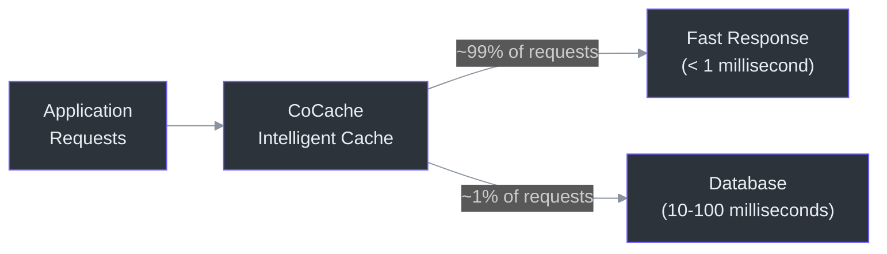
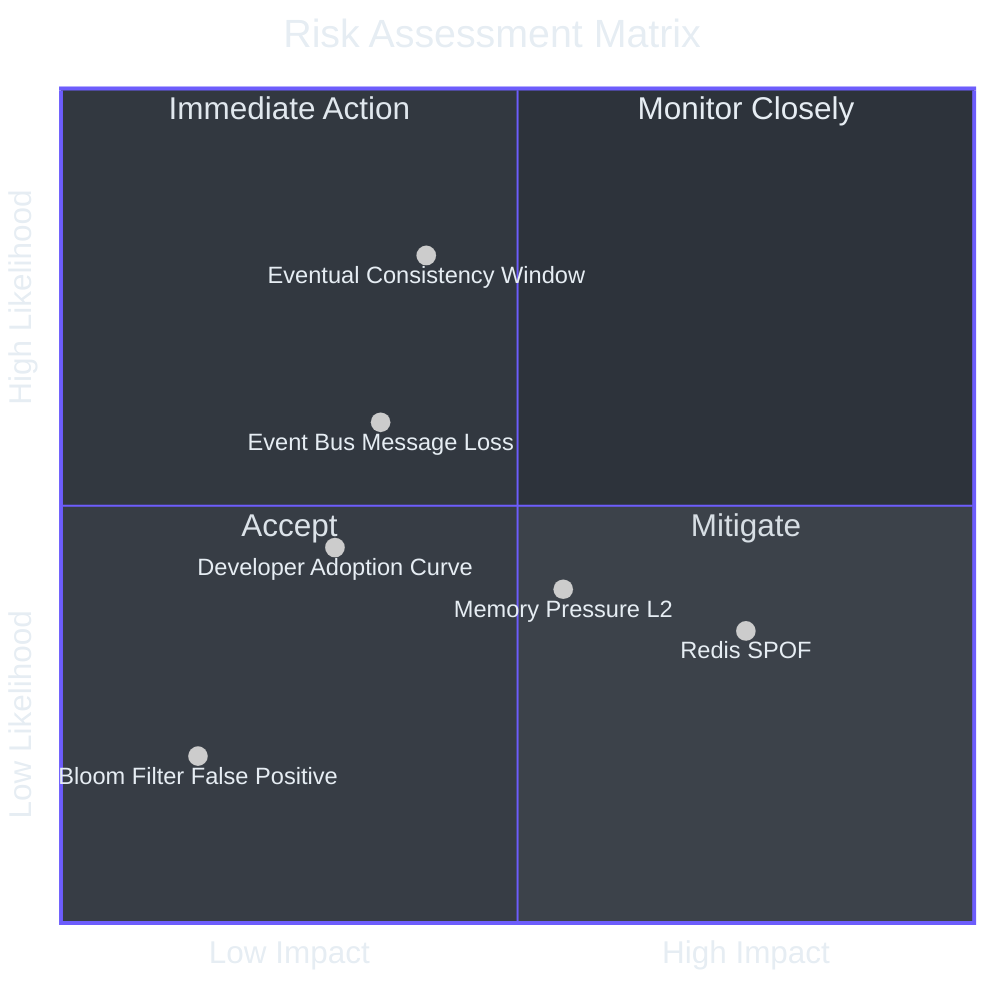
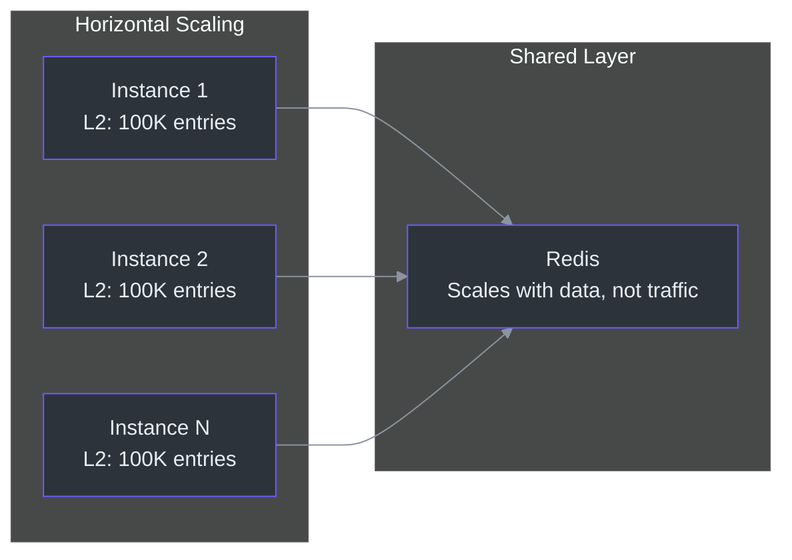

# Executive Onboarding Guide

This guide provides a strategic overview of CoCache for engineering leaders
evaluating or overseeing its adoption. It focuses on capabilities, risk,
investment rationale, cost modeling, and actionable recommendations -- without
diving into implementation details.

---

## Table of Contents

- [What CoCache Does](#what-cocache-does)
- [Capability Map](#capability-map)
- [Risk Assessment](#risk-assessment)
- [Technology Investment Thesis](#technology-investment-thesis)
- [Cost and Scaling Model](#cost-and-scaling-model)
- [Competitive Positioning](#competitive-positioning)
- [Actionable Recommendations](#actionable-recommendations)

---

## What CoCache Does

CoCache is a caching framework that sits between your application and your
database. When your application needs data (for example, a user profile), CoCache
first checks fast, local memory. If the data is not there, it checks a shared
cache (Redis). Only if neither has the data does it query the database.

The core value proposition: **99% of data requests are served in under 1
millisecond instead of 10-100 milliseconds**, dramatically reducing database
load and improving application response time.

### Why This Matters

For a typical high-traffic service handling 10,000 requests per second:

- **Without caching**: 10,000 database queries per second. Database becomes the
  bottleneck. Each query takes 10-100ms. Users experience latency.
- **With CoCache**: ~100 database queries per second (1% miss rate). Database
  operates at 1% capacity. Response times drop to sub-millisecond for cached
  reads. Infrastructure costs decrease.

---

## Capability Map

```mermaid
%%{init: {'theme': 'dark', 'themeVariables': {'primaryColor': '#2d333b', 'primaryBorderColor': '#6d5dfc', 'primaryTextColor': '#e6edf3', 'lineColor': '#8b949e', 'subgraphBgColor': '#161b22'}}}%%
graph TB
    subgraph sg_70 ["Core Capabilities"]
        direction TB
        C1["Two-Level Caching<br>Fast local + shared distributed"]
        C2["Automatic Coherence<br>All instances stay in sync"]
        C3["Stampede Protection<br>Prevents database overload"]
        C4["Penetration Protection<br>Blocks invalid key floods"]
        C5["Bloom Filter Pre-screen<br>Filters impossible lookups"]
        C6["Composite Caching<br>Joins data from multiple caches"]
    end

    subgraph sg_71 ["Integration Capabilities"]
        direction TB
        I1["Annotation-Driven<br>Declarative cache setup"]
        I2["Spring Boot Native<br>Auto-configuration"]
        I3["Pluggable Storage<br>Swap cache backends"]
        I4["Spring Cache Bridge<br>Drop-in replacement"]
    end

    subgraph sg_72 ["Operational Capabilities"]
        direction TB
        O1["Self-Healing<br>TTL bounds staleness"]
        O2["Graceful Degradation<br>Works without Redis"]
        O3["TTL Jitter<br>Prevents synchronized expiry"]
        O4["Per-Key Locking<br>Fine-grained concurrency"]
    end

    style C1 fill:#2d333b,stroke:#6d5dfc,color:#e6edf3
    style C2 fill:#2d333b,stroke:#6d5dfc,color:#e6edf3
    style C3 fill:#2d333b,stroke:#6d5dfc,color:#e6edf3
    style C4 fill:#2d333b,stroke:#6d5dfc,color:#e6edf3
    style C5 fill:#2d333b,stroke:#6d5dfc,color:#e6edf3
    style C6 fill:#2d333b,stroke:#6d5dfc,color:#e6edf3
    style I1 fill:#2d333b,stroke:#6d5dfc,color:#e6edf3
    style I2 fill:#2d333b,stroke:#6d5dfc,color:#e6edf3
    style I3 fill:#2d333b,stroke:#6d5dfc,color:#e6edf3
    style I4 fill:#2d333b,stroke:#6d5dfc,color:#e6edf3
    style O1 fill:#2d333b,stroke:#6d5dfc,color:#e6edf3
    style O2 fill:#2d333b,stroke:#6d5dfc,color:#e6edf3
    style O3 fill:#2d333b,stroke:#6d5dfc,color:#e6edf3
    style O4 fill:#2d333b,stroke:#6d5dfc,color:#e6edf3
```

### Capability Detail

| Capability | Business Impact | Technical Category |
|-----------|----------------|-------------------|
| **Two-Level Caching** | 10-100x latency reduction on data reads | Core |
| **Automatic Coherence** | All application instances see consistent data without manual intervention | Core |
| **Stampede Protection** | Prevents cascading database overload during cache expiration | Resilience |
| **Penetration Protection** | Blocks attacks that query non-existent data to overwhelm the database | Security |
| **Bloom Filter** | Reduces unnecessary cache and database lookups by pre-filtering impossible keys | Efficiency |
| **Composite Caching (JoinCache)** | Combines related data from multiple sources in a single cache operation | Developer Productivity |
| **Annotation-Driven Setup** | Reduces integration effort from days to hours | Developer Productivity |
| **Spring Boot Auto-Configuration** | Zero-configuration for standard setups | Operational Efficiency |
| **Pluggable Storage** | Future-proof: swap Guava for Caffeine, Redis for another distributed cache | Flexibility |
| **Self-Healing** | Stale data automatically corrects within the TTL window; no manual intervention | Reliability |
| **Graceful Degradation** | If Redis goes down, reads still work via local cache and direct database access | Availability |
| **TTL Jitter** | Prevents synchronized cache expiration storms that could cascade to the database | Stability |

---

## Risk Assessment

### Risk Matrix

### Detailed Risk Analysis

#### 1. Redis as Single Point of Failure

- **Risk**: Redis outage degrades caching to direct database queries for all
  instances simultaneously.
- **Likelihood**: Low-to-Medium (depends on Redis deployment maturity).
- **Impact**: High -- database load increases 10-100x; response times increase
  by 10-100x for cache-miss requests.
- **Mitigation**:
  - Deploy Redis in Sentinel or Cluster mode for automatic failover.
  - Monitor Redis availability and set up alerting at 95% health threshold.
  - CoCache degrades gracefully: local cache hits still work, and the database
    serves as the fallback.
- **Residual Risk**: Even with Redis Sentinel failover, there is a brief window
  (seconds) during failover where L1 is unavailable. Local L2 caches continue
  serving.

#### 2. Event Bus Reliability (Message Loss)

- **Risk**: Redis Pub/Sub does not guarantee delivery. A lost eviction message
  means a remote instance's local cache remains stale.
- **Likelihood**: Medium -- Redis Pub/Sub can lose messages during network
  partitions or Redis restarts.
- **Impact**: Low-to-Medium -- stale data is bounded by TTL. The worst case is
  serving data that is at most one TTL window old (e.g., 2 minutes for a 120s TTL).
- **Mitigation**:
  - TTL acts as a self-healing mechanism. Stale entries expire naturally.
  - For critical data where staleness is unacceptable, use shorter TTLs.
  - Consider implementing a stronger event bus (Kafka) for high-consistency
    requirements.

#### 3. Eventual Consistency Window

- **Risk**: Between when Instance A writes new data and when Instance B invalidates
  its local cache, Instance B may serve stale data.
- **Likelihood**: High -- this is inherent to the architecture.
- **Impact**: Low -- the window is typically sub-millisecond within a datacenter
  (Redis Pub/Sub latency).
- **Mitigation**: This is an architectural tradeoff, not a defect. For most
  business data (user profiles, product catalogs), sub-millisecond inconsistency
  is imperceptible. For financial transactions or real-time inventory, implement
  read-through from L1 (bypass L2) or use shorter TTLs.

#### 4. Memory Pressure from L2 Caches

- **Risk**: Large local caches consume significant JVM heap memory.
- **Likelihood**: Medium -- depends on `maximumSize` configuration.
- **Impact**: Medium -- excessive memory usage can trigger GC pauses or OOM.
- **Mitigation**:
  - Set appropriate `maximumSize` per cache (documented in annotation config).
  - Use Caffeine (more memory-efficient than Guava for large caches).
  - Monitor JVM heap usage and set alerting at 75% threshold.

#### 5. Bloom Filter False Positives

- **Risk**: The bloom filter may incorrectly indicate a key exists when it does
  not, causing an unnecessary L1 Redis lookup.
- **Likelihood**: Low -- bloom filters are tuned for <1% false positive rate.
- **Impact**: Negligible -- one extra Redis GET call per false positive.
- **Mitigation**: This is an acceptable tradeoff of the probabilistic data
  structure. No action needed.

#### 6. Developer Adoption Curve

- **Risk**: Teams unfamiliar with Kotlin or the annotation-based model may
  integrate incorrectly.
- **Likelihood**: Medium -- depends on team experience.
- **Impact**: Medium -- incorrect configuration can lead to cache stampede,
  memory leaks, or stale data.
- **Mitigation**:
  - Provide team training using the Contributor Onboarding Guide.
  - Use the example module as a reference implementation.
  - Code review all cache interface definitions and configurations.

---

## Technology Investment Thesis

### Problem Statement

Modern microservices architectures amplify the caching challenge:

1. **Database cost scales linearly** with request volume without caching.
2. **Response time** directly impacts user experience and conversion rates.
3. **Cache coherence** across dozens of service instances is operationally complex
   to build correctly.
4. **Cache stampede** during high-traffic events (sales, launches) can cascade
   into database overload and full outages.

### Solution Value

| Value Dimension | Without CoCache | With CoCache |
|----------------|----------------|-------------|
| Database query load | 100% of read requests | ~1% of read requests |
| Average read latency | 10-100ms (database) | <1ms (L2 cache hit) |
| Cache coherence | Manual implementation (weeks of engineering) | Automatic via event bus |
| Stampede protection | Custom per-project (error-prone) | Built-in per-key locking |
| Time to implement caching | 2-4 weeks per service | 1-2 days per service |
| Operational burden | High (custom cache logic to maintain) | Low (standard framework) |

### Return on Investment

Assumptions for a mid-size service (5 instances, 5,000 RPS, average 3 database
queries per request):

**Before CoCache:**
- 15,000 database queries/second
- Database requires 8 vCPU, 32GB RAM cluster (~$800/month cloud)
- Average response time: 50ms (database-bound)
- Engineering time for custom caching: 3 weeks per service x 4 services = 12 weeks

**After CoCache:**
- ~150 database queries/second (99% cache hit rate)
- Database can downsize to 2 vCPU, 8GB RAM (~$200/month)
- Average response time: <1ms for reads
- Engineering time: 2 days per service x 4 services = 2 weeks

**Net savings:**
- $600/month database cost reduction
- 10 weeks of engineering time freed up
- 50x reduction in p99 read latency
- Eliminated risk of cache-related production incidents from custom implementations

---

## Cost and Scaling Model

### Per-Instance Memory Cost

| Component | Memory per Instance | Notes |
|-----------|-------------------|-------|
| L2 Local Cache (Guava, 100K entries) | ~100MB heap | Depends on entry size; 1KB average |
| L2 Local Cache (Caffeine, 100K entries) | ~90MB heap | Slightly more efficient than Guava |
| Per-Key Lock Map | ~1-10MB | Transient; only during L0 fetches |
| Bloom Filter (1M keys, 1% FP) | ~1.2MB | Fixed; does not grow with entries |
| Event Bus Subscriptions | ~negligible | One Redis subscription per cache name |
| **Total overhead** | **~100-115MB per instance** | For 100K entry cache |

### Redis Cost Model

| Metric | Formula | Example (10K RPS, 99% hit rate) |
|--------|---------|-------------------------------|
| L1 operations/sec | RPS x (1 - L2_hit_rate) | 10,000 x 0.01 = 100 ops/sec |
| Pub/Sub messages/sec | Writes/sec x instance_count | 100 x 5 = 500 msgs/sec |
| Redis memory | Entries x avg_size | 100K x 1KB = 100MB |
| Redis CPU | ~0.01% per 100 ops/sec | Negligible |

Redis is extremely cost-effective for CoCache workloads. A single Redis instance
can typically serve dozens of CoCache-enabled services.

### Network Overhead

| Operation | Network Cost | Frequency |
|-----------|-------------|-----------|
| L1 cache read | 1 Redis GET (~1-2KB round-trip) | ~1% of total requests |
| L1 cache write | 1 Redis SET (~1-2KB round-trip) | Per cache miss + per explicit set |
| Event bus publish | 1 Redis PUBLISH (~200 bytes) | Per cache write/evict |
| Event bus subscribe | 1 Redis SUBSCRIBE message | Per eviction event, per instance |

For a service with 10,000 RPS and 99% L2 hit rate:
- L1 reads: 100/sec x 2KB = 200KB/sec
- L1 writes: 100/sec x 2KB = 200KB/sec
- Pub/Sub: 500/sec x 200B = 100KB/sec
- **Total: ~500KB/sec** -- negligible for modern network infrastructure.

### Scaling Characteristics

Key scaling properties:

- **Adding instances** increases total L2 capacity (more local caches) and
  increases Pub/Sub traffic linearly.
- **Redis load** scales with cache misses, not total traffic. With 99% L2 hit
  rate, adding instances barely increases Redis load.
- **Pub/Sub scaling** is the primary concern at very high instance counts (100+).
  Each instance subscribes to every cache channel. At 100 instances with 10 cache
  types, each eviction publishes 100 messages. Redis Pub/Sub handles this easily.

---

## Competitive Positioning

| Feature | CoCache | Spring Cache + Redis | Redisson Local Cache | Custom Implementation |
|---------|---------|---------------------|---------------------|----------------------|
| Two-level caching | Built-in | Manual wiring | Built-in | Manual |
| Cross-instance coherence | Automatic (event bus) | None (each instance independent) | Sync via Redis | Manual |
| Stampede protection | Per-key locking | None | RLock (distributed) | Varies |
| Penetration protection | MissingGuard + Bloom | None | None | Manual |
| Annotation-driven | `@CoCache` on interface | `@Cacheable` on method | N/A | N/A |
| Proxy-based (interface-level) | Yes | No (method-level) | No | N/A |
| JoinCache (composite) | Built-in | Not supported | Not supported | Manual |
| TTL jitter | Built-in (configurable) | Not available | Not available | Manual |
| Operational overhead | Low (framework-managed) | Medium (manual coherence) | Medium (distributed locks) | High |

---

## Actionable Recommendations

### For Teams Adopting CoCache

1. **Start with the example module.** Clone the `cocache-example` module and run it
   locally. It demonstrates a complete setup with `UserCache` and
   `UserExtendInfoJoinCache`. Use it as a template for your service.

2. **Define cache interfaces first.** Before writing any code, identify the data
   entities that benefit from caching (typically: frequently-read, infrequently-
   written data). Create interfaces annotated with `@CoCache`.

3. **Set appropriate TTLs.** Default TTL is effectively infinite (`Long.MAX_VALUE`).
   Always configure a TTL based on your data's acceptable staleness window. Use the
   `ttlAmplitude` parameter (default: 10 seconds) to prevent synchronized expiration.

4. **Size L2 caches conservatively.** Start with `maximumSize = 100_000` for Guava
   or Caffeine caches. Monitor heap usage and adjust. Over-provisioning L2 wastes
   memory; under-provisioning reduces hit rate.

5. **Deploy Redis in Sentinel or Cluster mode.** Do not use a single Redis instance
   in production. Redis Sentinel provides automatic failover with <5 second
   recovery time.

### For Architecture Governance

1. **Standardize on CoCache for all new JVM services.** The framework eliminates
   weeks of custom caching implementation per service and provides a consistent
   caching model across the organization.

2. **Establish cache naming conventions.** CoCache uses cache names for event bus
   channel routing. Define a naming standard: `<domain>.<entity>` (e.g.,
   `user.profile`, `product.catalog`).

3. **Define data staleness SLAs.** For each cached entity, document the maximum
   acceptable staleness window. This determines the TTL configuration and whether
   CoCache's eventual consistency model is appropriate.

4. **Monitor L2 hit rates.** Set an alert threshold at 85% L2 hit rate. Below
   this, investigate: cache sizing, TTL configuration, key distribution, or
   access pattern changes.

### For Risk Management

1. **Mitigate Redis SPOF**: Deploy Redis Sentinel with at least 3 sentinels and
   1 replica. Consider Redis Cluster for high-write workloads.

2. **Plan for Redis failure**: Document the expected behavior: reads continue via
   L2 (cache hits) and L0 (database). Database load increases. Response times
   increase for cache-miss requests. No data loss.

3. **Security review**: CoCache stores data in Redis in serialized form. Ensure
   Redis is deployed with authentication, TLS, and network isolation. Review what
   data is cached -- sensitive data (PII, credentials) should not be cached or
   should be encrypted.

4. **Establish cache warm-up procedures**: After a cold start (new deployment,
   Redis failover), all L2 caches are empty. Consider pre-warming critical caches
   by calling the cache source for high-traffic keys before accepting traffic.

---

## Summary

CoCache is a mature, well-architected caching framework that solves the
distributed caching problem with minimal operational overhead. Its three-tier
model (local memory, Redis, database) with automatic coherence provides
significant performance improvements while its self-healing design (TTL-based
staleness bounds, graceful degradation) limits operational risk.

The primary investment considerations are:
- **Redis infrastructure cost**: Minimal for typical workloads (~100MB memory,
  negligible CPU).
- **Per-instance memory overhead**: ~100MB per instance for a typical cache
  configuration.
- **Engineering time savings**: 2-4 weeks per service vs. 2 days with CoCache.
- **Operational risk**: Low, given self-healing design and graceful degradation.

Recommendation: **Adopt CoCache for all new and existing JVM-based services**
that require read-heavy caching, starting with non-critical services for
familiarity before expanding to high-traffic core services.
