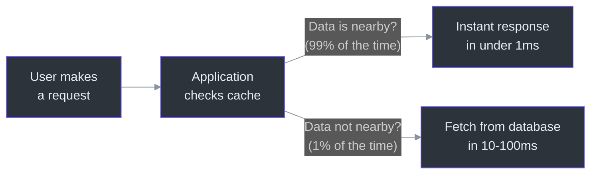
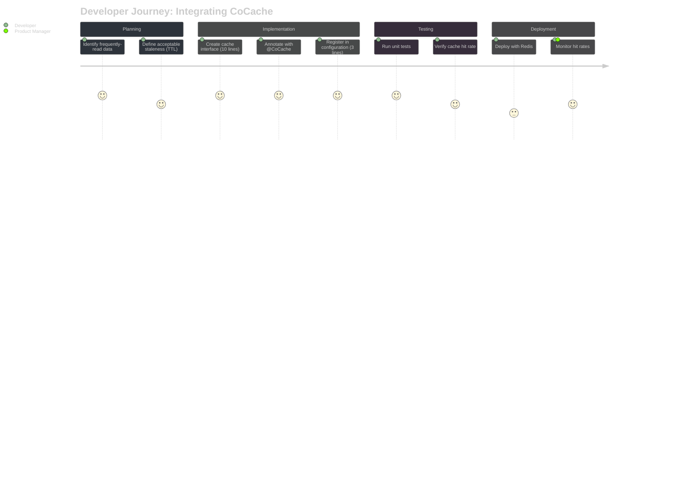
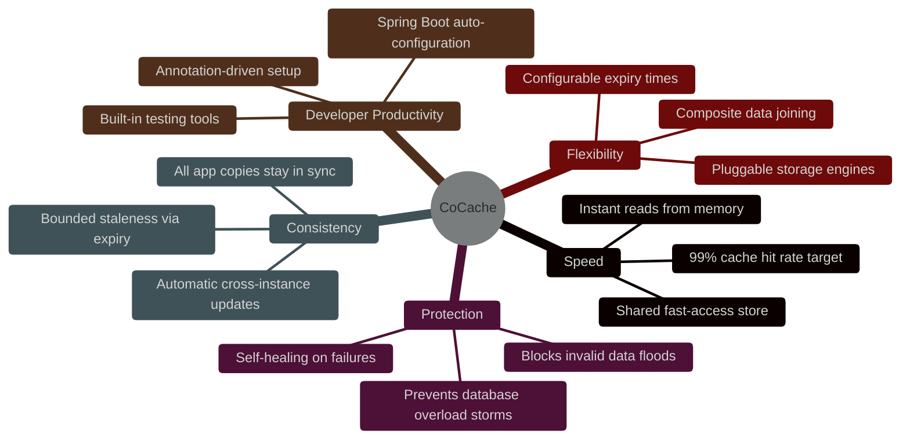
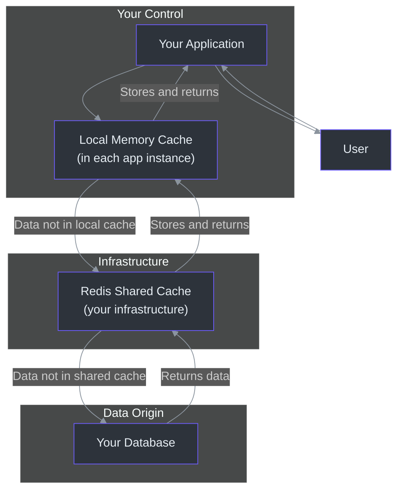

# Product Manager Onboarding Guide

This guide explains CoCache in plain language. No engineering jargon. If you
are a Product Manager working with a team that uses or plans to use CoCache,
this document will help you understand what it does, why it matters, what it
can and cannot do, and how it affects your product decisions.

---

## Table of Contents

- [What Is CoCache? (In Plain Language)](#what-is-cocache-in-plain-language)
- [Why Does It Exist?](#why-does-it-exist)
- [The Developer Experience](#the-developer-experience)
- [Feature Capability Map](#feature-capability-map)
- [What CoCache Changes for Your Product](#what-cocache-changes-for-your-product)
- [Known Limitations](#known-limitations)
- [Data and Privacy Overview](#data-and-privacy-overview)
- [Frequently Asked Questions](#frequently-asked-questions)

---

## What Is CoCache? (In Plain Language)

Imagine a library. When you want a book, you walk to the library, find it on the
shelf, and read it. That takes time. Now imagine you keep your most-used books
on your desk. You only go to the library when you need a book that is not on
your desk. That is what CoCache does -- but for your application's data.

Your application needs data (user profiles, product information, settings) to
respond to every user request. Without CoCache, every request goes to the
database (the "library"). With CoCache, frequently-used data is kept close at
hand -- first in the application's own memory (the "desk"), then in a shared
fast-access store (the "book cart in the hallway"), and only as a last resort
does it go to the database (the "library").

The result: your application responds faster, your database handles less work,
and your infrastructure costs less.

---

## Why Does It Exist?

### The Problem It Solves

Modern applications run as multiple copies (instances) to handle user traffic.
When you have 5 copies of an application running, each copy needs the same data.
Without a shared caching strategy:

1. **Every copy makes its own database queries.** This multiplies database load by
   the number of instances.
2. **When one copy updates data, the other copies do not know.** They continue
   serving old (stale) data until they happen to query the database again.
3. **Popular data that expires can cause a "rush" to the database.** If 1,000
   users all need the same product page and the cached version just expired,
   all 1,000 requests hit the database at once.

These problems are expensive to solve manually. Engineering teams spend weeks
building custom caching solutions for each project. CoCache provides a standard
solution that works across all projects.

### The Scale of the Problem

| Scenario | Without Caching | With CoCache |
|----------|----------------|-------------|
| 10,000 users/second viewing product pages | 10,000 database queries/second | ~100 database queries/second |
| Black Friday traffic spike (10x normal) | Database likely overloaded | Cache absorbs spike; database sees ~1% increase |
| Application restart (new deployment) | All data needs re-fetching | Shared cache still has data; local cache rebuilds quickly |
| Multiple application instances (5 copies) | 5x database queries for same data | Database queried once; result shared via cache |

---

## The Developer Experience

### How Developers Use CoCache

Developers interact with CoCache by defining a simple interface (a contract that
says "this is a cache for this type of data"). Here is the entire process:

**Step 1: Identify what to cache.** The developer looks at which data is read
frequently but changes rarely (user profiles, product catalogs, configuration
settings).

**Step 2: Define the cache interface.** This is a short declaration -- typically
5-10 lines of code -- that says "I want a cache for User objects, keyed by
user ID, with a 2-minute expiration."

**Step 3: Register the cache.** A few lines of configuration tell the system to
set up the cache.

**Step 4: Done.** CoCache handles everything else automatically: checking the
local memory, checking the shared store, querying the database when needed,
keeping all instances in sync, preventing overload.

### Time to Integrate

| Approach | Time per Service | Ongoing Maintenance |
|----------|-----------------|-------------------|
| Without CoCache (custom caching) | 2-4 weeks | High (custom code to maintain and debug) |
| With CoCache | 1-2 days | Low (framework-managed; standard patterns) |

### Developer Satisfaction Impact

- **Less boilerplate**: Developers spend time on business logic, not caching
  plumbing.
- **Fewer caching bugs**: Stampede, penetration, and coherence problems are
  handled by the framework.
- **Consistent patterns**: Every service uses the same caching model, making
  onboarding faster and code reviews easier.

---

## Feature Capability Map

### What CoCache Provides

### Feature Detail (Non-Technical)

| Feature | What It Does | Why It Matters to Your Product |
|---------|-------------|-------------------------------|
| **Two-level caching** | Keeps data in two places: fast local memory and a shared store | Users get instant responses; your database is not overloaded |
| **Automatic sync across copies** | When one copy updates data, all other copies are notified | Users always see up-to-date information regardless of which copy serves them |
| **Overload prevention** | If popular data expires, only one request goes to the database; others wait for the result | Your product survives traffic spikes (sales events, viral moments) without crashing |
| **Invalid request blocking** | Blocks requests for data that does not exist before they reach the database | Protects against attacks or bugs that send millions of invalid requests |
| **Expiry time jitter** | Slightly randomizes when cached data expires to prevent all data expiring at once | Prevents "cache storms" that could cascade into outages |
| **Self-healing** | If the sync system has a brief interruption, data automatically refreshes when expiry times pass | No manual intervention needed during minor infrastructure issues |
| **Composite data joining** | Combines related data from different sources in a single cached result | Reduces the number of lookups needed for complex data; faster responses |
| **Spring Boot integration** | Works automatically with the most popular Java web framework | Developers can add caching with minimal effort; faster time-to-market |
| **Pluggable storage** | Can use different memory engines (Guava, Caffeine) and shared stores (Redis) | Future-proof: can adapt to different infrastructure without code changes |

---

## What CoCache Changes for Your Product

### Performance Impact

| Metric | Typical Before | Typical After | User Impact |
|--------|---------------|---------------|-------------|
| Page load time (data-dependent) | 200-500ms | 50-150ms | Faster, more responsive pages |
| API response time (read) | 50-100ms | <1ms for cached data | Smoother app experience |
| Time to handle 10x traffic spike | Database overload risk | Minimal impact | No user-facing degradation during events |
| Cold start recovery time (new deployment) | Minutes (all data re-fetched) | Seconds (shared cache intact) | Faster deployments, less downtime |

### Cost Impact

| Area | Impact | Magnitude |
|------|--------|-----------|
| Database infrastructure | Reduced load allows smaller database instances | 50-75% cost reduction typical |
| Application instances | Slight increase (each instance uses ~100MB more memory) | 5-10% per instance |
| Redis infrastructure | Required (shared cache store) | New cost: ~$50-200/month per environment |
| Engineering time | Dramatically reduced caching implementation effort | 2-4 weeks saved per service |

### Reliability Impact

| Concern | CoCache Response |
|---------|-----------------|
| What if the shared cache (Redis) goes down? | Application continues working using local memory and direct database queries. Slower, but functional. |
| What if a network issue prevents sync between copies? | Each copy serves its own cached data. Data may be slightly out of date until sync resumes or cached data expires. |
| What if too many users request uncached data at once? | Only one request goes to the database per unique data item. Others wait and receive the result. |
| What if someone sends millions of requests for non-existent data? | The request-blocking feature (bloom filter) prevents these from ever reaching the database. |

---

## Known Limitations

Every technology has tradeoffs. Here is what CoCache does not do, so you can make
informed product decisions:

### 1. Eventual Consistency (Not Instant Consistency)

**What it means**: When data changes on one copy of the application, there is a
very brief moment (typically under 1 millisecond) where other copies might serve
the old version.

**When this matters**: For most product data (user profiles, product catalogs,
content), this is imperceptible. For real-time financial transactions, live
inventory counts during flash sales, or collaborative editing, you may need
additional consistency mechanisms.

**What to do**: Define acceptable staleness for each data type. Use shorter
expiry times for data that must be fresher.

### 2. Redis Dependency

**What it means**: CoCache requires Redis for its shared cache store and
cross-instance sync. Redis is a widely-used, proven technology, but it is an
additional piece of infrastructure to operate.

**When this matters**: If your organization does not currently operate Redis, you
will need to add it to your infrastructure. Most cloud providers offer managed
Redis services that reduce operational burden.

**What to do**: Plan for Redis in your infrastructure budget and operational
runbook. Use managed Redis services (AWS ElastiCache, Azure Cache for Redis,
Google Cloud Memorystore) where possible.

### 3. Read-Heavy Workloads Only

**What it means**: CoCache is optimized for data that is read much more often
than it is written (e.g., user profiles read 1000x/day but updated 1x/week).
It does not help with write-heavy workloads.

**When this matters**: For data that changes frequently (chat messages, real-time
scores, activity feeds), CoCache provides less benefit because cached data
expires quickly.

**What to do**: Use CoCache for stable, frequently-read data. Use other
strategies for write-heavy data.

### 4. No Built-in Cache Warming

**What it means**: When a new copy of your application starts (after deployment
or restart), its local cache is empty. It takes some time (and some database
queries) to "warm up" the cache.

**When this matters**: For applications with strict cold-start latency
requirements, you may need to implement a cache warming step in your deployment
process.

**What to do**: For critical caches, implement a pre-warming step that loads
the most frequently accessed data before accepting user traffic.

### 5. Per-Instance Memory Overhead

**What it means**: Each copy of your application uses additional memory (~100MB)
for its local cache. With 10 instances, that is ~1GB total across the fleet.

**When this matters**: For memory-constrained environments (small containers,
edge deployments), this may be significant.

**What to do**: Right-size the local cache (configurable maximum number of
entries). Start small and increase based on hit rate monitoring.

---

## Data and Privacy Overview

### Where Data Lives

When CoCache is in use, your data exists in up to three places:

| Location | What Data | Retention | Who Can Access |
|----------|-----------|-----------|---------------|
| **Local application memory** (L2) | Recently accessed data | Until expiry time (configurable: seconds to hours) | Only the specific application instance |
| **Redis shared store** (L1) | All cached data | Until expiry time (configurable) | All application instances that connect to this Redis |
| **Database** (L0) | All data | Permanent (per your database policies) | Per your database access controls |

### Privacy Considerations

1. **Cached data includes whatever the application caches.** If your application
   caches user profiles, then user profile data (name, email, preferences, etc.)
   will be present in both local memory and Redis.

2. **Redis should be treated as a sensitive data store.** It should have
   authentication enabled, network isolation (not exposed to the public internet),
   and encryption in transit (TLS).

3. **Local memory is inherently ephemeral.** When an application instance shuts
   down, its local cache is destroyed. No data persists beyond the instance's
   lifetime.

4. **No data classification built in.** CoCache does not distinguish between
   sensitive and non-sensitive data. It is the application developer's
   responsibility to cache only appropriate data and to configure Redis security.

5. **Regulatory compliance**: If your product is subject to GDPR, CCPA, or
   similar regulations, ensure that:
   - Cached personal data is included in data deletion requests (cache eviction).
   - Redis data at rest is encrypted if it contains personal data.
   - Data retention policies account for cache expiry times.

### Data Flow Diagram

---

## Frequently Asked Questions

### General Questions

**Q: Do users interact with CoCache directly?**
A: No. CoCache works entirely behind the scenes. Users interact with your
application (website, mobile app, API). CoCache makes those interactions faster
by optimizing how your application retrieves data. Users will never see or know
about CoCache.

**Q: Will CoCache change how our product looks or feels?**
A: The product will look the same but feel faster. Pages load quicker, API
responses come back sooner, and the application handles traffic spikes better.
There are no visual or feature changes.

**Q: Does CoCache work on mobile devices?**
A: CoCache runs on the server side (where your application runs), not on user
devices. Mobile users benefit from the faster server responses. There is no
mobile SDK or client-side component.

### Performance Questions

**Q: How much faster will our application be?**
A: For data that is cached, response times typically drop from 10-100ms to under
1ms. For overall application response time, expect 30-70% improvement depending
on how much of your response time comes from database queries. Applications that
are mostly database-bound see the biggest improvement.

**Q: What is a "cache hit rate" and what should ours be?**
A: Cache hit rate is the percentage of requests served from cache (fast) vs.
the database (slow). A good target is 90-99%. Below 85% suggests the cache
is too small, the expiry times are too short, or the data access patterns are
not well-suited for caching.

**Q: What happens during a traffic spike?**
A: CoCache absorbs the spike because most requests are served from cache. The
database only sees a small fraction of the traffic. Additionally, the built-in
"overload prevention" ensures that even when popular cached data expires during
a spike, only one request goes to the database while others wait for the result.

### Reliability Questions

**Q: Can CoCache cause an outage?**
A: CoCache is designed to fail safely. If the shared cache (Redis) goes down,
the application continues working using local memory and direct database queries.
It will be slower but functional. CoCache cannot cause data loss because it does
not own the authoritative data -- that is always in your database.

**Q: How do we handle data that must be perfectly up-to-date?**
A: For data where even a brief moment of staleness is unacceptable (e.g.,
financial balances), developers can configure short expiry times (seconds) or
bypass the cache entirely for that specific data. This is a per-data-type
decision.

**Q: What monitoring do we need?**
A: The engineering team should monitor: cache hit rates (target: >90%), Redis
health, and application memory usage. These metrics tell you whether the cache
is effective and healthy.

### Adoption Questions

**Q: How long does it take to adopt CoCache for a service?**
A: For a typical service: 1-2 days of engineering work. This includes defining
the cache interfaces, configuring the cache settings, testing, and deploying.
Compare this to 2-4 weeks for building a custom caching solution.

**Q: Can we adopt CoCache incrementally?**
A: Yes. CoCache is per-data-entity. You can cache one data type (e.g., user
profiles) first, measure the impact, and then expand to other data types.
There is no requirement to cache everything at once.

**Q: Does CoCache require us to change our database?**
A: No. CoCache sits between your application and your database. It does not
modify your database schema, queries, or access patterns. It simply reduces
how often the application needs to query the database.

**Q: What infrastructure do we need?**
A: You need Redis (a widely-used, open-source data store). Most cloud providers
offer managed Redis services. If you already use Redis for other purposes, you
can share the instance (with appropriate configuration). If not, a basic Redis
instance costs approximately $50-200/month depending on your cloud provider and
the size you need.

### Data Questions

**Q: Where does cached data live?**
A: In two places: (1) in the memory of each application instance (local cache),
and (2) in Redis (shared cache). Both locations are within your infrastructure.
No data is sent to external services.

**Q: How long does cached data persist?**
A: You configure the expiry time per data type. It can be as short as a few
seconds or as long as hours. Once expired, the data is automatically removed
from both the local cache and Redis.

**Q: Can cached data be deleted on demand?**
A: Yes. CoCache supports explicit eviction (removal) of specific cached entries.
This is used when data changes in the database and the cache needs to be updated
immediately, rather than waiting for the expiry time.

**Q: Is cached data encrypted?**
A: CoCache does not add encryption itself. For encryption in transit, configure
TLS on your Redis connection. For encryption at rest, use Redis's built-in
encryption features or your cloud provider's encrypted storage. For local
memory, data is as secure as the application process itself.

---

## Summary

CoCache is infrastructure that makes your product faster and more reliable. It
works behind the scenes -- users never see it, but they experience its effects
as faster page loads, smoother performance during traffic spikes, and fewer
outages caused by database overload.

Key takeaways for Product Managers:

1. **Your product gets faster** with minimal engineering effort (days, not weeks).
2. **Traffic spikes are absorbed** by the cache instead of hitting the database.
3. **Data freshness is configurable** per data type -- from seconds to hours.
4. **The system is self-healing** -- brief infrastructure issues resolve automatically.
5. **Privacy and security** are handled at the infrastructure level (Redis config,
   application-level data selection).
6. **Adoption is incremental** -- cache one data type at a time, expand as
   confidence grows.

For questions about specific product scenarios or data types, consult with your
engineering team or refer to the [Contributor Guide](./contributor.md) for
technical details.
