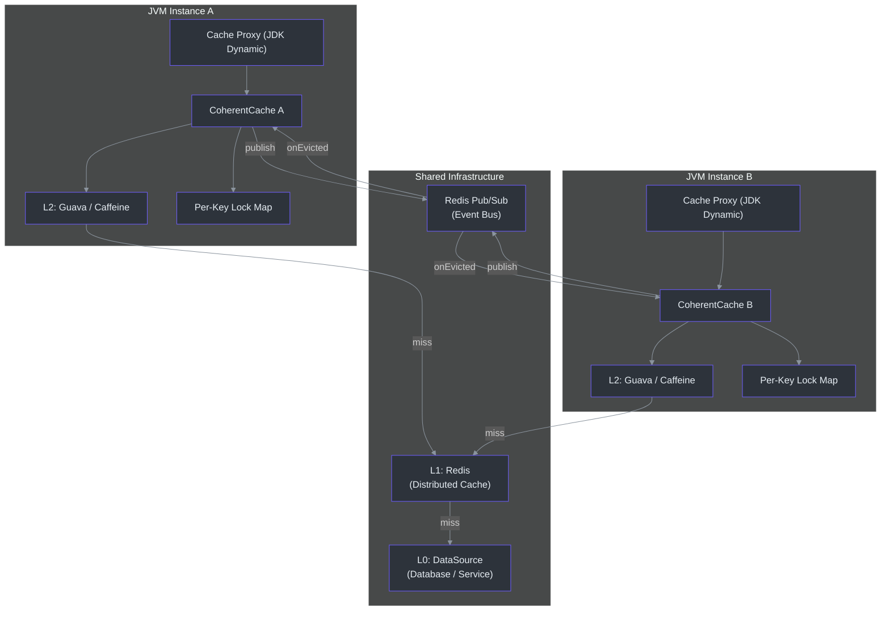
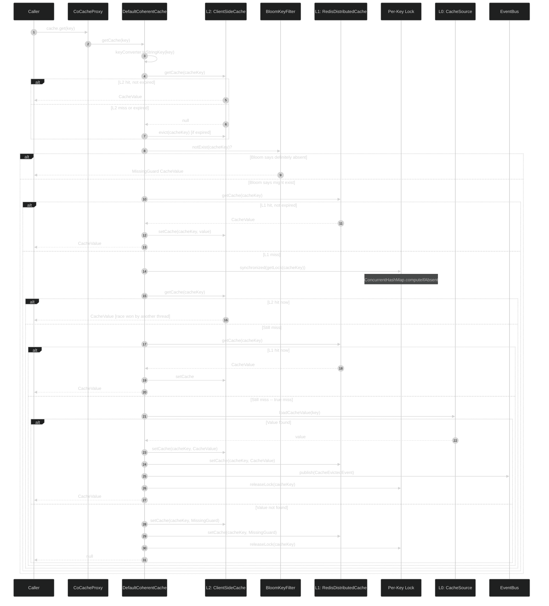
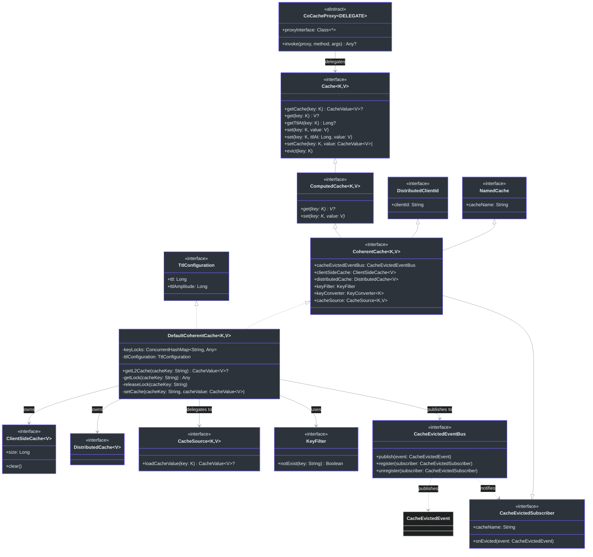
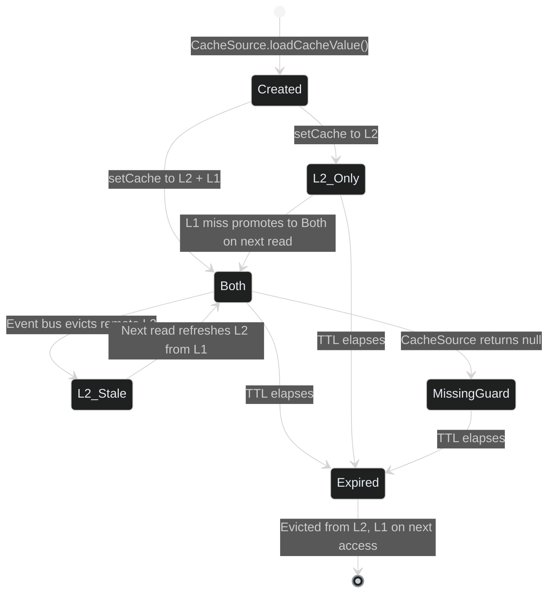
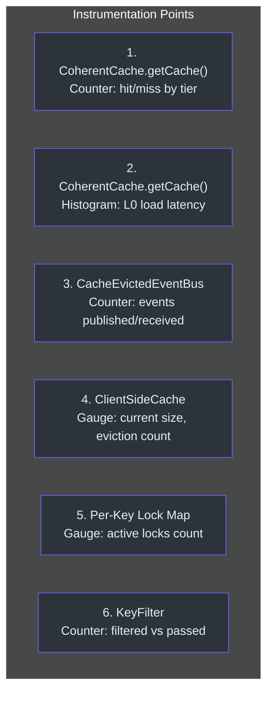

# Staff Engineer Onboarding Guide

This guide is for Staff and Principal Engineers evaluating or extending CoCache.
It distills the single most important architectural insight, maps the full system,
examines design tradeoffs, and provides a language-neutral pseudocode model of the
core caching pattern.

---

## Table of Contents

- [The Core Architectural Insight](#the-core-architectural-insight)
- [System Architecture Diagram](#system-architecture-diagram)
- [Cache Read Sequence (Full Path)](#cache-read-sequence-full-path)
- [Class Model](#class-model)
- [Design Tradeoff Analysis](#design-tradeoff-analysis)
- [Decision Log](#decision-log)
- [Core Pattern in Pseudocode](#core-pattern-in-pseudocode)
- [Extension Points](#extension-points)
- [Performance Characteristics](#performance-characteristics)
- [Operational Considerations](#operational-considerations)

---

## The Core Architectural Insight

CoCache's architecture rests on a single insight: **a three-tier cache with
event-driven coherence and fine-grained per-key locking can deliver sub-millisecond
reads while preventing stampede, penetration, and breakdown -- without distributed
lock coordination between application instances.**

The three tiers are:

1. **L2 (Client-Side Cache)** -- In-process memory (Guava/Caffeine). Fastest path.
   Per-instance. Not shared. Invalidated via event bus when other instances modify
   entries.

2. **L1 (Distributed Cache)** -- Redis. Shared across all instances. Serves as the
   single source of truth for "cached" state. Provides coherence anchoring.

3. **L0 (Data Source)** -- Database or service. Only reached on true cache miss.
   Protected by per-key locks to prevent stampede.

The coherence model is **eventually consistent**: when Instance A writes to L1 and
publishes an eviction event, Instance B receives the event asynchronously and
invalidates its local L2. The window of inconsistency is bounded by Redis Pub/Sub
latency (typically < 1ms within a datacenter).

This design avoids distributed locks entirely. Each instance independently manages
its own L2, using L1 as the shared truth and the event bus as the invalidation
signal. There is no consensus protocol, no distributed lock manager, and no
cross-instance coordination on reads.

---

## System Architecture Diagram



Key observations from this diagram:

- Each JVM instance owns its own `ConcurrentHashMap<String, Any>` for per-key
  locks. These are **not** shared. The lock only prevents concurrent L0 lookups
  for the same key **within** the same instance.
- Redis serves dual roles: as the L1 cache store AND as the Pub/Sub transport
  for eviction events. These are logically separate concerns but share the same
  Redis infrastructure.
- The Cache Proxy is a JDK dynamic proxy implementing the user-defined cache
  interface. All method calls are intercepted and routed through `CoherentCache`.

---

## Cache Read Sequence (Full Path)

This sequence diagram shows the complete read path with all protection mechanisms:



### L0 Entry in the Sequence

Note that L0 (the data source) is only entered once per key per instance, protected
by the per-key lock. The comment in the source code at
[cocache-core/src/main/kotlin/me/ahoo/cache/consistency/DefaultCoherentCache.kt#L110](https://github.com/Ahoo-Wang/CoCache/blob/main/cocache-core/src/main/kotlin/me/ahoo/cache/consistency/DefaultCoherentCache.kt#L110)
makes this explicit:

```
/*
 * This is a heavy-duty operation.
 */
cacheSource.loadCacheValue(key)
```

After loading, the value is written to **both** L2 and L1 simultaneously, then an
eviction event is published. This "write-through-both" strategy ensures that the
next request on any instance will find the value in L1 even if the L2 of that
instance has not yet received the event.

---

## Class Model



### Key Design Patterns in the Class Model

**Composition over Inheritance**: `DefaultCoherentCache` composes L2, L1, L0,
event bus, key filter, and key converter. Each is an interface, allowing any
implementation to be plugged in.

**Delegation via Kotlin `by`**: `DefaultCoherentCache` delegates `DistributedClientId`
and `NamedCache` to its `CoherentCacheConfiguration` object, reducing boilerplate.

**Template Method via `ComputedCache`**: The `ComputedCache` interface provides
default implementations of `get()`, `getTtlAt()`, and `set()` that work with
`CacheValue` objects (handling missing guards, TTL computation). `CoherentCache`
inherits these defaults and only overrides `getCache()` (the raw lookup that
checks L2/L1/L0).

---

## Design Tradeoff Analysis

### Tradeoff 1: Per-Key Locks vs. Distributed Locks

| Dimension | Per-Key Locks (chosen) | Distributed Locks (Redisson, etc.) |
|-----------|----------------------|-------------------------------------|
| **Scope** | Single instance only | Cross-instance |
| **Mechanism** | `ConcurrentHashMap.computeIfAbsent` + `synchronized` | Redis SETNX / Redlock |
| **Latency** | ~nanoseconds | ~milliseconds (network round-trip) |
| **Consistency** | Prevents stampede within instance | Prevents stampede across all instances |
| **Complexity** | Zero external dependencies | Requires Redis lock infrastructure |
| **Failure mode** | Lock auto-released on thread exit | Lock TTL must be managed; risk of split-brain |

**Why CoCache chose per-key locks**: The key insight is that the event bus + L1
write-through already provides cross-instance coherence. If Instance A loads a
value from L0 and writes it to L1, Instance B will find it in L1 on its next
access (even before the eviction event arrives). The per-key lock only needs to
prevent multiple threads **within the same instance** from hitting L0
simultaneously.

Cross-instance stampede is prevented by the combination of:
1. L1 (Redis) serves as a shared "first writer wins" store
2. The eviction event triggers L2 invalidation on other instances
3. TTL amplitude (jitter) prevents synchronized expiration

The cost of per-key locks is that two instances can simultaneously hit L0 for the
same key. This is acceptable because:
- It is rare (requires both instances to miss L2 and L1 simultaneously)
- The database can handle this with normal connection pooling
- The value will be identical, so the second write is idempotent

### Tradeoff 2: Event Bus vs. Direct Invalidation

| Dimension | Event Bus (chosen) | Direct Invalidation (polling/CRDT) |
|-----------|-------------------|-------------------------------------|
| **Latency** | ~sub-ms (Redis Pub/Sub within datacenter) | Varies: polling interval or CRDT convergence |
| **Coupling** | Loose -- instances only know about the event | Tight -- instances must know about each other |
| **Consistency** | Eventually consistent (bounded by network) | Eventually consistent (bounded by poll interval) |
| **Failure mode** | Lost event = stale L2 (self-heals via TTL) | Poll failure = stale until next poll |
| **Scalability** | O(1) per event (broadcast) | O(N) polling or O(N) gossip protocol |
| **Complexity** | Simple publish/subscribe | Polling requires timer management; CRDTs are complex |

**Why CoCache chose the event bus**: Redis Pub/Sub provides near-instant
notification with zero coupling between instances. Instances do not need to know
about each other -- they only subscribe to a channel named after their cache.
If a Pub/Sub message is lost (Redis does not guarantee delivery), the L2 entry
simply remains until its TTL expires, at which point it self-heals by fetching
fresh data from L1/L0.

The critical property: **stale data is always bounded by the TTL**. Even in the
worst case (complete event bus failure), every L2 entry expires within its configured
TTL window. This makes the system self-healing.

### Tradeoff 3: JDK Proxy vs. AOP (AspectJ / Spring AOP)

| Dimension | JDK Dynamic Proxy (chosen) | Spring AOP | AspectJ |
|-----------|---------------------------|------------|---------|
| **Mechanism** | `java.lang.reflect.Proxy` + `InvocationHandler` | CGLIB/Proxy + `@Around` | Compile/load-time weaving |
| **Interface requirement** | Must be an interface | Can proxy classes | Can weave any class |
| **Performance** | ~nanoseconds overhead per call | Similar | Zero runtime overhead (compile-time) |
| **Debugging** | Clear stack trace through `InvocationHandler` | AOP advice can be hard to trace | Bytecode transformation can confuse debuggers |
| **Configuration** | Explicit: `@CoCache` on interface | Implicit: `@Cacheable` on method | Requires AspectJ compiler |
| **Multi-method support** | Interface-wide -- all methods proxied | Per-method annotation | Per-joinpoint |

**Why CoCache chose JDK dynamic proxies**: CoCache defines cache behavior at the
**interface level**, not the method level. A `UserCache` interface declares that
it IS a cache, not that individual methods happen to be cached. This is a
fundamentally different model from Spring's `@Cacheable`, which annotates
individual methods.

The proxy approach also enables:
- Clean separation: the user defines the interface, CoCache provides the implementation
- Type safety: `UserCache` is a typed `Cache<String, User>`, not a generic `CacheManager`
- Uniform behavior: all `Cache` methods (`get`, `set`, `evict`, `getTtlAt`) are
  consistently handled through the same coherent cache layer

The tradeoff is that JDK proxies require interfaces (no class proxying). This is
enforced by CoCache: the `@CoCache` annotation can only be placed on interfaces.

### Tradeoff 4: TTL Amplitude (Jitter) vs. Fixed TTL

| Dimension | TTL Amplitude (chosen) | Fixed TTL |
|-----------|----------------------|-----------|
| **Expiration pattern** | Staggered -- entries expire at slightly different times | Synchronized -- all entries fetched at the same time expire together |
| **Stampede risk** | Low -- spread of expiration times | High -- thundering herd on expiration |
| **Implementation** | `ttlAt = computedTtlAt + random(0, ttlAmplitude)` | `ttlAt = computedTtlAt` |
| **Complexity** | Minimal -- one random addition | None |

CoCache applies TTL amplitude by default (`DEFAULT_TTL_AMPLITUDE = 10` seconds).
This means a cache entry with TTL=120s will expire somewhere between 120s and 130s,
preventing all entries fetched during the same traffic spike from expiring
simultaneously.

---

## Decision Log

| Decision | Date/Rationale | Alternatives Considered | Outcome |
|----------|---------------|------------------------|---------|
| **Three-tier architecture (L2/L1/L0)** | Enables sub-ms reads while maintaining coherence | Two-tier (L1/L0 only), Two-tier (L2/L0 with broadcast) | Production-proven at scale |
| **Per-key in-process locking** | Nanosecond latency, zero external deps | Distributed locks (Redisson), No locking (allow stampede) | Acceptable within-instance stampede prevention; cross-instance prevented by L1 write-through |
| **Redis Pub/Sub for event bus** | Near-instant, zero coupling, leverages existing Redis | Kafka, RabbitMQ, Polling-based invalidation | Good enough latency; lossy delivery is acceptable because TTL provides self-healing |
| **JDK dynamic proxies** | Interface-level cache semantics, type safety | Spring AOP, CGLIB class proxies, Annotation processors (KSP) | Clean API: `interface UserCache : Cache<String, User>` |
| **MissingGuard sentinel values** | Prevents cache penetration without external state | TTL=0 for nulls, Separate null-cache store | Simple; works with all serialization formats |
| **Bloom filter as KeyFilter** | Probabilistic pre-filter before L1 lookup | No filter, Exact set membership | Prevents non-existent key lookups hitting Redis |
| **TTL amplitude (jitter)** | Prevents synchronized expiration thundering herd | Fixed TTL, Exponential backoff | 10-second default jitter; configurable per cache |
| **Kotlin as implementation language** | Concise, null-safe, extension functions, Java interop | Pure Java, Scala | `-Xjvm-default=all-compatibility` ensures Java interop |
| **`synchronized` over `ReentrantLock`** | Simpler, sufficient for the use case | `ReentrantLock`, `StampedLock` | No need for tryLock/timeout/interrupt -- critical sections are fast |
| **Write-through to both L2 and L1 simultaneously** | Ensures L1 always has latest value for other instances | Write L1 first, then L2; Write L2 first, then L1 | Both writes are fast; order does not matter much; parallel writes reduce window |
| **CacheName-based event routing** | Each cache gets its own Pub/Sub channel | Single global channel with filtering | Per-cache channels provide natural isolation; no cross-talk |

---

## Core Pattern in Pseudocode

The following Python pseudocode captures the essence of CoCache's caching pattern.
This is intentionally in Python (not Kotlin) to demonstrate that the pattern is
language-independent.

```python
import threading
from collections import defaultdict
from dataclasses import dataclass
from typing import Optional, Generic, TypeVar
import random

K = TypeVar("K")
V = TypeVar("V")


@dataclass
class CacheValue(Generic[V]):
    value: Optional[V]
    ttl_at: float       # absolute expiration timestamp
    is_missing_guard: bool = False

    @property
    def is_expired(self) -> bool:
        return time.time() > self.ttl_at


MISSING_GUARD = "_nil_"


class CoherentCache(Generic[K, V]):
    """
    Core CoCache pattern: three-tier cache with event-driven coherence
    and per-key fine-grained locking.
    """

    def __init__(
        self,
        cache_name: str,
        client_id: str,
        l2_cache,           # ClientSideCache: in-process memory
        l1_cache,           # DistributedCache: Redis
        cache_source,       # CacheSource: database loader
        event_bus,          # CacheEvictedEventBus: pub/sub
        key_filter,         # KeyFilter: bloom filter
        key_converter,      # KeyConverter: K -> str
        ttl: float,
        ttl_amplitude: float,
    ):
        self.cache_name = cache_name
        self.client_id = client_id
        self.l2 = l2_cache
        self.l1 = l1_cache
        self.source = cache_source
        self.event_bus = event_bus
        self.key_filter = key_filter
        self.key_converter = key_converter
        self.ttl = ttl
        self.ttl_amplitude = ttl_amplitude
        self._key_locks: dict[str, threading.Lock] = defaultdict(threading.Lock)

    def get(self, key: K) -> Optional[V]:
        """Main entry point: returns the cached value or None."""
        cache_value = self._get_cache(key)
        if cache_value is None or cache_value.is_missing_guard or cache_value.is_expired:
            return None
        return cache_value.value

    def _get_cache(self, key: K) -> Optional[CacheValue]:
        """
        Full three-tier lookup with double-check locking.

        This is the heart of CoCache. The algorithm:

        1. Check L2 (unlocked fast path)
        2. Check bloom filter (unlocked fast path)
        3. Check L1 (unlocked fast path)
        4. Acquire per-key lock
        5. Re-check L2 (double-check)
        6. Re-check L1 (double-check)
        7. Load from L0 (cache source)
        8. Write to L2 + L1
        9. Publish eviction event
        10. Release lock
        """
        cache_key = self.key_converter.to_string(key)

        # --- Step 1: L2 fast path (no lock) ---
        l2_result = self._check_l2(cache_key)
        if l2_result is not None:
            return l2_result

        # --- Step 2: Bloom filter gate ---
        if self.key_filter.not_exist(cache_key):
            return self._make_missing_guard()

        # --- Step 3: L1 fast path (no lock) ---
        l1_result = self.l1.get_cache(cache_key)
        if l1_result is not None and not l1_result.is_expired:
            self.l2.set_cache(cache_key, l1_result)  # promote to L2
            return l1_result

        # --- Step 4-7: Per-key locked path ---
        lock = self._key_locks[cache_key]
        with lock:
            # Double-check L2
            l2_result = self._check_l2(cache_key)
            if l2_result is not None:
                return l2_result

            # Double-check L1
            l1_result = self.l1.get_cache(cache_key)
            if l1_result is not None and not l1_result.is_expired:
                self.l2.set_cache(cache_key, l1_result)
                return l1_result

            # --- Step 7: Load from L0 (heavy operation) ---
            source_value = self.source.load_cache_value(key)
            if source_value is not None:
                self._set_both(cache_key, source_value)
                self.event_bus.publish(CacheEvictedEvent(
                    cache_name=self.cache_name,
                    key=cache_key,
                    publisher_id=self.client_id,
                ))
                return source_value

            # --- Step 8: Missing guard (prevent penetration) ---
            guard = self._make_missing_guard()
            self._set_both(cache_key, guard)
            return guard

    def set(self, key: K, value: V):
        """Write-through to both L2 and L1."""
        cache_key = self.key_converter.to_string(key)
        ttl_at = time.time() + self.ttl + random.uniform(0, self.ttl_amplitude)
        cache_value = CacheValue(value=value, ttl_at=ttl_at)
        self._set_both(cache_key, cache_value)
        self.event_bus.publish(CacheEvictedEvent(
            cache_name=self.cache_name,
            key=cache_key,
            publisher_id=self.client_id,
        ))

    def evict(self, key: K):
        """Remove from both layers and notify other instances."""
        cache_key = self.key_converter.to_string(key)
        self.l2.evict(cache_key)
        self.l1.evict(cache_key)
        self.event_bus.publish(CacheEvictedEvent(
            cache_name=self.cache_name,
            key=cache_key,
            publisher_id=self.client_id,
        ))

    def on_evicted(self, event):
        """
        Called when another instance evicts an entry.
        Only invalidates local L2 -- not L1 (which is already updated).
        """
        if event.cache_name != self.cache_name:
            return  # not my cache
        if event.publisher_id == self.client_id:
            return  # I published this -- already handled locally
        self.l2.evict(event.key)

    # --- Private helpers ---

    def _check_l2(self, cache_key: str) -> Optional[CacheValue]:
        cached = self.l2.get_cache(cache_key)
        if cached is not None:
            if not cached.is_expired:
                return cached
            self.l2.evict(cache_key)  # expired -- clean up
        return None

    def _set_both(self, cache_key: str, value: CacheValue):
        self.l2.set_cache(cache_key, value)
        self.l1.set_cache(cache_key, value)

    def _make_missing_guard(self) -> CacheValue:
        ttl_at = time.time() + self.ttl + random.uniform(0, self.ttl_amplitude)
        return CacheValue(
            value=MISSING_GUARD,
            ttl_at=ttl_at,
            is_missing_guard=True,
        )
```

### How to Read This Pseudocode

The `get()` method is the most important function. It implements the complete
three-tier lookup with all four protection mechanisms:

1. **L2 fast path** (line: "Step 1") -- Most reads return here in ~nanoseconds.
2. **Bloom filter gate** (line: "Step 2") -- Prevents L1 lookups for known-absent keys.
3. **L1 fast path** (line: "Step 3") -- Shared cache hit; promotes to L2.
4. **Per-key lock** (line: "Step 4-7") -- Double-check locking prevents stampede.
5. **L0 load** (line: "Step 7") -- Only one thread per key per instance reaches here.
6. **Missing guard** (line: "Step 8") -- Prevents cache penetration for absent keys.

The `on_evicted()` method implements the coherence protocol. It is called by the
event bus when another instance publishes an eviction event. The two guard checks
(cache name match, not self-published) prevent unnecessary work.

---

## Extension Points

CoCache is designed for extensibility through interface substitution:

| Extension Point | Interface | Default Implementation | How to Replace |
|----------------|-----------|----------------------|----------------|
| L2 Cache | `ClientSideCache<V>` | `GuavaClientSideCache`, `CaffeineClientSideCache`, `MapClientSideCache` | Implement `ClientSideCache` or provide a `@Bean` named `<CacheName>.ClientSideCache` |
| L1 Cache | `DistributedCache<V>` | `RedisDistributedCache` | Implement `DistributedCache` for non-Redis backends |
| Event Bus | `CacheEvictedEventBus` | `GuavaCacheEvictedEventBus`, `RedisCacheEvictedEventBus` | Implement for Kafka, RabbitMQ, etc. |
| Data Source | `CacheSource<K, V>` | `NoOpCacheSource` | Implement to load from any data store |
| Key Filter | `KeyFilter` | `NoOpKeyFilter`, `BloomKeyFilter` | Implement for different probabilistic structures |
| Key Converter | `KeyConverter<K>` | `ToStringKeyConverter`, `ExpKeyConverter` | Implement for custom key formatting |

The Spring integration resolves these via bean name matching: a bean named
`UserCache.ClientSideCache` will be injected as the L2 cache for `UserCache`.

---

## Performance Characteristics

### Expected Latency by Path

| Path | Latency | Frequency |
|------|---------|-----------|
| L2 hit (warm cache) | ~100ns - 1us | ~90-99% of reads |
| L1 hit (L2 miss, Redis hit) | ~0.5 - 2ms | ~1-9% of reads |
| L0 load (full miss) | ~5 - 100ms | <1% of reads |
| Eviction event processing | ~0.5 - 1ms | Proportional to write rate |

### Memory Considerations

- **Per-instance L2 memory**: Depends on `maximumSize` and entry size. For
  `GuavaCache(maximumSize = 1_000_000)` with average entry size 1KB, expect ~1GB
  heap.
- **Per-key lock map**: `ConcurrentHashMap` grows with the number of concurrent
  unique keys being fetched. Locks are released after L0 load completes.
- **Bloom filter**: ~1.2 bytes per element at 1% false positive rate.

### Scalability Model

- **Horizontal scaling**: Adding instances increases L2 capacity (more local caches)
  but also increases event bus traffic (each instance subscribes to all cache
  channels).
- **Redis Pub/Sub fan-out**: Each eviction event is broadcast to all subscribers.
  With N instances and W writes/sec, the event bus handles N*W messages/sec.
  Redis Pub/Sub can handle ~100K+ messages/sec per channel.

---

## Operational Considerations

### Redis Dependency

Redis is a **shared dependency** for both L1 caching and event bus. Redis failure
impacts:
- L1 cache reads (degraded to L0 direct hits)
- Coherence events (stale L2 until TTL expiry)
- No impact on L2 reads that are already cached locally

The system degrades gracefully: if Redis is down, reads still work through L2
(cache hits) and L0 (direct database). Writes and evictions continue to work
locally. The L2 caches across instances will diverge until Redis recovers, at
which point normal operation resumes.

### Monitoring Recommendations

| Metric | Source | Significance |
|--------|--------|-------------|
| L2 hit rate | `ClientSideCache` | Primary performance indicator; should be >90% |
| L1 hit rate | `DistributedCache` | Secondary hit rate; indicates L2 effectiveness |
| L0 call rate | `CacheSource` | Should be <1%; spikes indicate cache problems |
| Event bus latency | `CacheEvictedEventBus` | Coherence lag indicator |
| Per-key lock contention | `DefaultCoherentCache` | Thread contention indicator |
| Missing guard rate | `KeyFilter`/`CacheSource` | Penetration attack indicator |

### TTL Strategy

- **Set TTL based on data volatility**: Volatile data gets short TTL (e.g., 60s);
  static data gets long TTL (e.g., 3600s).
- **Always use TTL amplitude**: The default 10-second jitter prevents thundering
  herd. For high-traffic caches, increase amplitude to 20-30% of TTL.
- **Missing guard TTL should match data TTL**: A missing guard for a key that
  might appear later should expire around the same time as regular entries, so
  the system can re-check.

---

## CacheValue Lifecycle and Serialization

Understanding how cache values flow through the system is critical for capacity
planning and debugging.

### Value States



### Serialization in Redis

The `RedisDistributedCache` uses a `CodecExecutor` to serialize `CacheValue`
objects into Redis. The codec handles:
- Serialization of the value `V` to bytes/string
- Encoding of the `ttlAt` metadata alongside the value
- Deserialization back to `CacheValue<V>` on read

The Redis key includes the configured `keyPrefix` (e.g., `"user:123"`), and
the value includes both the payload and the expiration timestamp. Redis's own
TTL mechanism is also used (via `EXPIRE`) to auto-clean expired entries from
Redis itself.

### Memory Footprint per Cache Entry

| Component | Size (approximate) |
|-----------|-------------------|
| `CacheValue<V>` wrapper | ~32 bytes overhead |
| `ttlAt` (Long) | 8 bytes |
| Value payload | Depends on type (100B - 10KB typical) |
| L2 key (String) | ~50 bytes (e.g., `"user:abc-123"`) |
| ConcurrentHashMap lock entry | ~64 bytes (transient, only during L0 fetch) |
| **Total per entry in L2** | **~200B + payload size** |

For a cache with 100K entries averaging 500B payload: ~70MB L2 memory.

---

## Observability and Instrumentation

CoCache does not include built-in metrics instrumentation. To observe cache
behavior in production, teams must add instrumentation at the following points:

### Recommended Instrumentation Points



### Recommended Metrics (Micrometer/Prometheus format)

| Metric Name | Type | Labels | Purpose |
|-------------|------|--------|---------|
| `cocache.get.total` | Counter | `cache_name`, `tier` (L2/L1/L0/filtered/missing) | Hit/miss rates per tier |
| `cocache.get.duration` | Histogram | `cache_name`, `tier` | Latency per tier |
| `cocache.set.total` | Counter | `cache_name` | Write throughput |
| `cocache.evict.total` | Counter | `cache_name`, `source` (local/event) | Eviction rate and source |
| `cocache.event.published` | Counter | `cache_name` | Events published |
| `cocache.event.received` | Counter | `cache_name` | Events received (coherence) |
| `cocache.l2.size` | Gauge | `cache_name` | Current L2 cache size |
| `cocache.l2.eviction` | Counter | `cache_name` | L2 evictions (capacity or TTL) |
| `cocache.lock.active` | Gauge | `cache_name` | Active per-key locks |
| `cocache.keyfilter.filtered` | Counter | `cache_name` | Keys rejected by bloom filter |

### SLO Recommendations

| SLO | Target | Alert Threshold |
|-----|--------|----------------|
| L2 hit rate | >90% | <85% for 5 minutes |
| L1 hit rate (given L2 miss) | >80% | <70% for 5 minutes |
| L0 call rate | <1% of total reads | >2% for 5 minutes |
| L0 latency p99 | <100ms | >200ms for 5 minutes |
| Event bus delivery rate | >99% | <95% for 5 minutes |
| Missing guard rate | <5% of L0 calls | >10% for 5 minutes |

---

## Summary

CoCache solves the distributed caching problem with a clean three-tier architecture
that is both simple to understand and robust in production. The key architectural
decisions -- per-key locks, event bus coherence, JDK proxies, and TTL jitter --
combine to create a system that handles cache stampede, penetration, and breakdown
without requiring distributed coordination between instances.

The tradeoffs are well-chosen: accepting eventual consistency (bounded by TTL) in
exchange for simplicity, performance, and operational resilience. For systems that
require strict consistency, the architecture can be extended with stronger
invalidation mechanisms, but for the vast majority of caching use cases, CoCache's
approach is the right balance.
