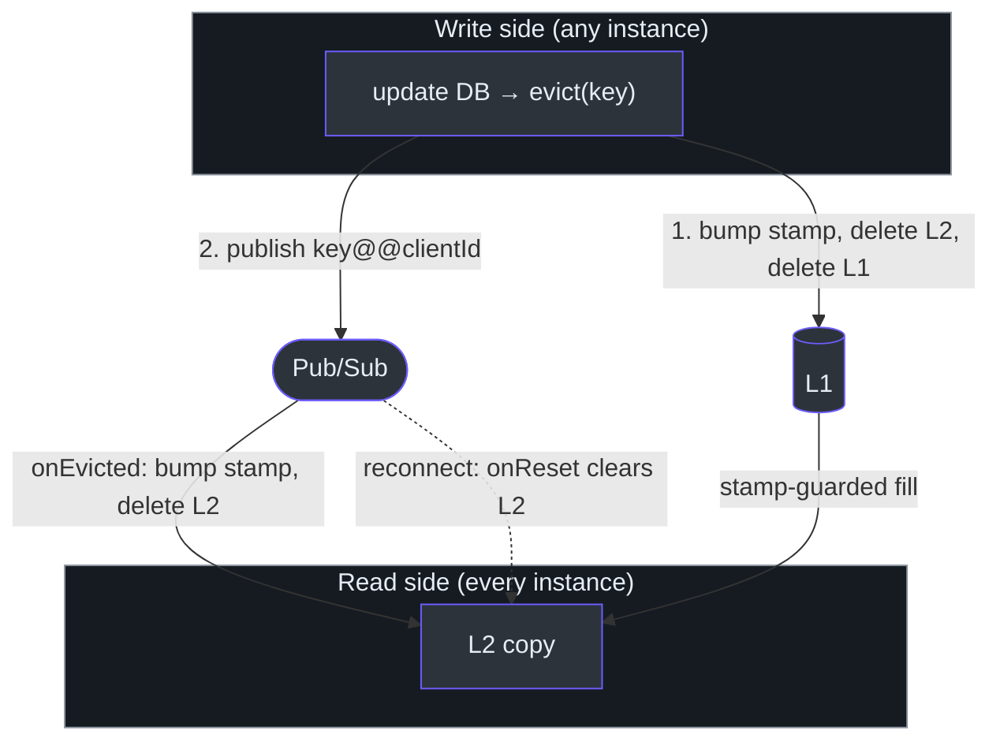

# Staff Engineer Guide

## Table of Contents

- [The Core Insight](#the-core-insight)
- [Consistency Model](#consistency-model)
- [Read Path](#read-path)
- [Design Tradeoffs](#design-tradeoffs)
- [Extension Points](#extension-points)
- [Performance Characteristics](#performance-characteristics)
- [Operational Considerations](#operational-considerations)

## The Core Insight

A two-level cache trades **staleness for latency**. Instead of claiming coherence, CoCache states three properties and builds each one from a specific mechanism:

| Property | Mechanism |
|----------|-----------|
| **Bounded staleness**: every inconsistency self-heals in finite time | Finite default `ttl` (3600 s); separate short `missingTtl` (60 s); L2 cleared on every event-channel (re)subscription |
| **No lost invalidation**: concurrent loads and out-of-order events never resurrect old values | `InvalidationStamps` guard every write-back; an L1 miss is never inferred as "not found" |
| **Cheap hit path** | Bounded Caffeine L2 (expiry checked on read, cached `CacheClock`); one atomic Lua round trip per L1 read; per-key `SingleFlight` |

No distributed locks and no consensus are involved. Each instance coalesces its own loads, and L1 absorbs duplicates across instances.

## Consistency Model

```mermaid
graph TB
    subgraph writers ["Write side (any instance)"]
        W["update DB → evict(key)"]
    end
    subgraph readers ["Read side (every instance)"]
        L2["L2 copy"]
    end
    W -->|"1. bump stamp, delete L2, delete L1"| L1[("L1")]
    W -->|"2. publish key@@clientId"| PS(["Pub/Sub"])
    PS -->|"onEvicted: bump stamp, delete L2"| L2
    PS -.->|"reconnect: onReset clears L2"| L2
    L1 -->|"stamp-guarded fill"| L2

    style W fill:#2d333b,stroke:#6d5dfc,color:#e6edf3
    style L2 fill:#2d333b,stroke:#6d5dfc,color:#e6edf3
    style L1 fill:#2d333b,stroke:#6d5dfc,color:#e6edf3
    style PS fill:#2d333b,stroke:#6d5dfc,color:#e6edf3
    style writers fill:#161b22,stroke:#8b949e,color:#e6edf3
    style readers fill:#161b22,stroke:#8b949e,color:#e6edf3
```

Staleness bounds per failure mode:

| Failure | Stale for at most | Why |
|---------|-------------------|-----|
| Event delayed | Pub/Sub latency | `onEvicted` evicts L2; a fill that raced with the event is undone |
| Event lost while connected | `ttl` | The connection is TCP, so loss implies a disconnect, which triggers a reset. Otherwise the TTL bounds it. |
| Disconnect / reconnect | Reconnect time | `onReset` clears L2 after resubscription |
| Slow load vs concurrent update (cache-aside race) | `ttl` in L1 | Inherent to cache-aside; undone in L2 when the event arrives, persists in L1 until expiry |
| Row created after a negative lookup | `missingTtl` | Negative entries use their own TTL |

Writers must **update the source, then evict**. Prefer evict over set unless the writer has the committed value at hand.

## Read Path

```mermaid
sequenceDiagram
autonumber
    participant App
    participant C as DefaultCoherentCache
    participant SF as SingleFlight
    participant L1 as Redis
    participant Src as CacheSource

    App->>C: getCache(key)
    C->>C: L2 hit? → return
    C->>C: keyFilter.notExist? → MissingValue
    C->>SF: execute(cacheKey)
    SF->>SF: stamp = current(cacheKey)
    SF->>L1: EVALSHA read-script → {TTL, value}
    alt hit
        SF->>C: fill L2 iff stamp unchanged (re-check after)
    else miss
        SF->>Src: loadCacheValue(key)
        Src-->>SF: value | null → MissingValue(missingTtl)
        SF->>L1: write iff stamp unchanged
        SF->>C: write L2; if stamp changed → undo L1+L2, publish
    end
    SF-->>App: value (followers share it)
```

## Design Tradeoffs

### Per-key SingleFlight vs distributed locks vs striped locks

| | SingleFlight (chosen) | Striped locks (4.x) | Distributed lock |
|---|---|---|---|
| Scope | Per instance, exact key | Per instance, hashed stripe | Cluster |
| Unrelated keys block each other | Never | On stripe collision | No |
| Failure propagation | Leader's original exception to all waiters | Each waiter retries the load | Lock TTL management |
| Cost | One `ConcurrentHashMap` entry while in flight | Fixed lock array | Network round trip |

Cross-instance duplicate loads are accepted: they are rare, idempotent, and absorbed by L1.

### Stamps vs per-key generation map vs locking writers

Stamps are a fixed `AtomicLongArray(4096)`. They need no allocation per key and no cleanup, and they cover **every** invalidation source, local ones included. A stripe collision only costs an extra skipped write-back.

### Reset-on-subscribe vs reliable messaging

Redis Pub/Sub is at-most-once. Rather than adding a durable broker, CoCache treats every (re)subscription as "messages may have been lost" and drops L2. The cost is a brief hit-rate dip after a reconnect.

### Explicit negative type vs in-band sentinel

4.x detected negative entries by the shape of the value (`"_nil_"`, `{"_nil_"}` ...), so real data could be misread as "not found". 5.0 uses a sealed `MissingValue`; the sentinel exists only as the Redis wire encoding.

### JDK proxy vs AOP

Caches are declared at the interface level (`UserCache : Cache<String, User>`), so a JDK proxy is enough. One `CacheInvocationHandler` dispatches calls and rethrows original exceptions.

## Extension Points

| Extension | SPI (cocache-api) | Defaults | Spring override |
|-----------|------------------|----------|-----------------|
| L2 | `ClientSideCache<V>` | `CaffeineClientSideCache` | bean `{cacheName}.ClientSideCache` |
| L1 | `DistributedCache<V>` | `RedisDistributedCache` | bean `{cacheName}.DistributedCache` |
| Channel | `CacheEvictedEventBus` | `RedisCacheEvictedEventBus` | `@Bean CacheEvictedEventBus` (must call `onReset` on (re)subscription) |
| Source | `CacheSource<K, V>` | `noOp()` | bean `{cacheName}.CacheSource` or unique typed bean |
| Key conversion | `KeyConverter<K>` | `ToStringKeyConverter` / `ExpKeyConverter` | bean `{cacheName}.KeyConverter` |
| Existence filter | `KeyFilter` | `KeyFilter.NO_OP` | via `CoherentCacheConfiguration` |

Verify any new implementation with the matching TCK spec in `cocache-test`.

## Performance Characteristics

| Path | Latency | Notes |
|------|---------|-------|
| L2 hit | ~100 ns – 1 µs | Caffeine lookup + expiry check |
| L1 hit | ~0.5 – 2 ms | One Lua round trip |
| L0 load | source latency | Coalesced per key |
| Write / evict | ~1 RTT + publish | Publish is fire-and-forget |

Memory: L2 is bounded by `maximumSize` (default 10 000 entries per cache). Expired entries are evicted when read, or by size-based eviction. In-flight loads cost one map entry each.

Fan-out: with N instances and W writes/s per cache, Pub/Sub delivers N·W messages/s on that cache's channel. Successful loads publish nothing.

## Operational Considerations

### Redis Dependency

- Read failures degrade to source loads; write failures log a warning (`cocache.redis.strict-failure=false`).
- During an outage, L2 keeps serving what it holds until `ttl`. After recovery, resubscription clears L2.

### Monitoring

| Signal | Where | Watch for |
|--------|-------|-----------|
| L2 size | `/actuator/cocacheClient/{name}` | Sustained `maximumSize` → raise it or shorten `ttl` |
| Cache composition and `ttlPolicy` | `/actuator/cocache/{name}` | Unexpected defaults |
| `Channel[...] subscribed - reset subscriber` (INFO) | logs | Frequent resets = unstable Redis connection |
| `Discard the loaded value ...` (WARN) | logs | High rate = write-heavy keys contending with loads |

### TTL Strategy

- `ttl`: the longest staleness you accept for a missed invalidation. Keep it finite.
- `ttlAmplitude`: about 2–10 % of `ttl`.
- `missingTtl`: short (seconds to a minute); it bounds the invisibility of new rows.

## Related Pages

- [Contributor Guide](./contributor.md)
- [Cache Coherence](../architecture/coherence.md)
- [Performance Patterns](../testing/performance-patterns.md)
