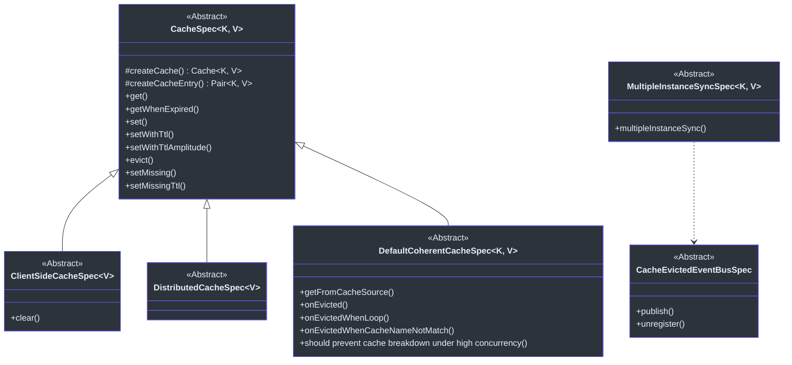
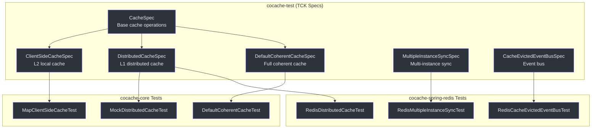
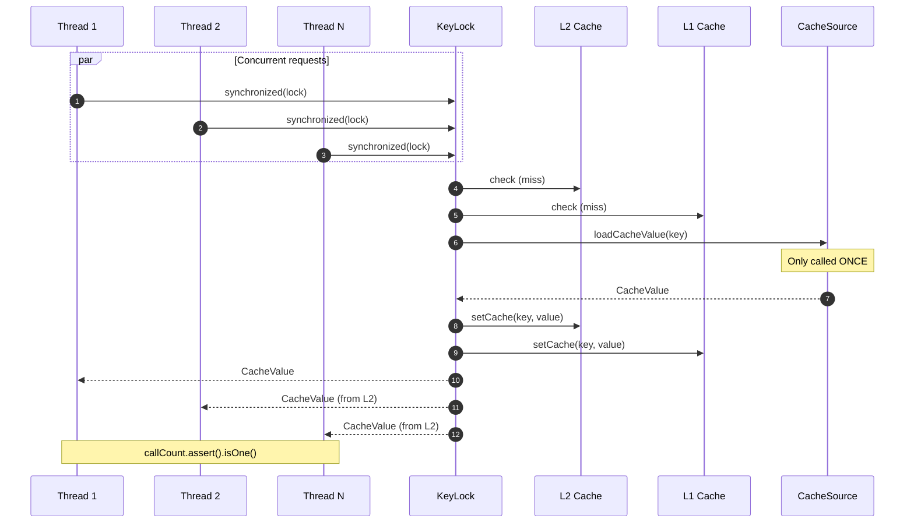

# Testing Overview

CoCache provides a comprehensive **Technology Compatibility Kit (TCK)** through the `cocache-test` module. These abstract test specifications ensure that any cache implementation -- whether built-in or custom -- behaves correctly across all standard operations.

## TCK Test Specifications

The `cocache-test` module contains abstract base classes that define the expected behavior of cache components. New implementations extend these classes and provide concrete factories.

## Specification Reference

### CacheSpec

The base specification for all cache implementations. Tests the fundamental `Cache<K, V>` contract.

| Test Method | Description | Source |
|-------------|-------------|--------|
| `get()` | Verifies that getting a non-existent key returns `null` | [CacheSpec.kt:36-39](https://github.com/Ahoo-Wang/CoCache/blob/main/cocache-test/src/main/kotlin/me/ahoo/cache/test/CacheSpec.kt#L36-L39) |
| `getWhenExpired()` | Verifies that expired entries are not returned and are cleaned up | [CacheSpec.kt:41-47](https://github.com/Ahoo-Wang/CoCache/blob/main/cocache-test/src/main/kotlin/me/ahoo/cache/test/CacheSpec.kt#L41-L47) |
| `set()` | Verifies basic set and get round-trip | [CacheSpec.kt:49-53](https://github.com/Ahoo-Wang/CoCache/blob/main/cocache-test/src/main/kotlin/me/ahoo/cache/test/CacheSpec.kt#L49-L53) |
| `setWithTtl()` | Verifies set with explicit TTL and that TTL is stored | [CacheSpec.kt:55-61](https://github.com/Ahoo-Wang/CoCache/blob/main/cocache-test/src/main/kotlin/me/ahoo/cache/test/CacheSpec.kt#L55-L61) |
| `setWithTtlAmplitude()` | Verifies set with TTL amplitude (jitter) | [CacheSpec.kt:63-68](https://github.com/Ahoo-Wang/CoCache/blob/main/cocache-test/src/main/kotlin/me/ahoo/cache/test/CacheSpec.kt#L63-L68) |
| `evict()` | Verifies that eviction removes the entry | [CacheSpec.kt:70-75](https://github.com/Ahoo-Wang/CoCache/blob/main/cocache-test/src/main/kotlin/me/ahoo/cache/test/CacheSpec.kt#L70-L75) |
| `setMissing()` | Verifies that missing guard values are treated as absent | [CacheSpec.kt:77-81](https://github.com/Ahoo-Wang/CoCache/blob/main/cocache-test/src/main/kotlin/me/ahoo/cache/test/CacheSpec.kt#L77-L81) |
| `setMissingTtl()` | Verifies that missing guard with TTL is treated as absent | [CacheSpec.kt:83-89](https://github.com/Ahoo-Wang/CoCache/blob/main/cocache-test/src/main/kotlin/me/ahoo/cache/test/CacheSpec.kt#L83-L89) |

Source: [cocache-test/.../CacheSpec.kt](https://github.com/Ahoo-Wang/CoCache/blob/main/cocache-test/src/main/kotlin/me/ahoo/cache/test/CacheSpec.kt)

### ClientSideCacheSpec

Extends `CacheSpec` and adds tests specific to the `ClientSideCache<V>` interface (L2 local cache).

| Test Method | Description | Source |
|-------------|-------------|--------|
| `clear()` | Verifies that `clear()` removes all entries and resets size to 0 | [ClientSideCacheSpec.kt:24-33](https://github.com/Ahoo-Wang/CoCache/blob/main/cocache-test/src/main/kotlin/me/ahoo/cache/test/ClientSideCacheSpec.kt#L24-L33) |
| (inherited) | All `CacheSpec` tests | [CacheSpec.kt](https://github.com/Ahoo-Wang/CoCache/blob/main/cocache-test/src/main/kotlin/me/ahoo/cache/test/CacheSpec.kt) |

Source: [cocache-test/.../ClientSideCacheSpec.kt](https://github.com/Ahoo-Wang/CoCache/blob/main/cocache-test/src/main/kotlin/me/ahoo/cache/test/ClientSideCacheSpec.kt)

### DistributedCacheSpec

Extends `CacheSpec` with `String` keys for the `DistributedCache<V>` interface (L1 distributed cache). Inherits all `CacheSpec` tests.

Source: [cocache-test/.../DistributedCacheSpec.kt](https://github.com/Ahoo-Wang/CoCache/blob/main/cocache-test/src/main/kotlin/me/ahoo/cache/test/DistributedCacheSpec.kt)

### DefaultCoherentCacheSpec

Tests the full `DefaultCoherentCache` with all three layers (L2 + L1 + DataSource). Includes concurrency and event-driven coherence tests.

| Test Method | Description | Source |
|-------------|-------------|--------|
| `getFromCacheSource()` | Verifies data is loaded from `CacheSource` on cache miss | [DefaultCoherentCacheSpec.kt:90-96](https://github.com/Ahoo-Wang/CoCache/blob/main/cocache-test/src/main/kotlin/me/ahoo/cache/test/DefaultCoherentCacheSpec.kt#L90-L96) |
| `onEvicted()` | Verifies that a remote evict event clears L2 but preserves L1 | [DefaultCoherentCacheSpec.kt:98-109](https://github.com/Ahoo-Wang/CoCache/blob/main/cocache-test/src/main/kotlin/me/ahoo/cache/test/DefaultCoherentCacheSpec.kt#L98-L109) |
| `onEvictedWhenLoop()` | Verifies that self-published events are ignored (no loop) | [DefaultCoherentCacheSpec.kt:111-122](https://github.com/Ahoo-Wang/CoCache/blob/main/cocache-test/src/main/kotlin/me/ahoo/cache/test/DefaultCoherentCacheSpec.kt#L111-L122) |
| `onEvictedWhenCacheNameNotMatch()` | Verifies that events for other caches are ignored | [DefaultCoherentCacheSpec.kt:124-136](https://github.com/Ahoo-Wang/CoCache/blob/main/cocache-test/src/main/kotlin/me/ahoo/cache/test/DefaultCoherentCacheSpec.kt#L124-L136) |
| `should prevent cache breakdown under high concurrency` | Parameterized test (10, 100, 1000 threads) verifying that per-key locking prevents multiple calls to `CacheSource` | [DefaultCoherentCacheSpec.kt:138-179](https://github.com/Ahoo-Wang/CoCache/blob/main/cocache-test/src/main/kotlin/me/ahoo/cache/test/DefaultCoherentCacheSpec.kt#L138-L179) |

Source: [cocache-test/.../DefaultCoherentCacheSpec.kt](https://github.com/Ahoo-Wang/CoCache/blob/main/cocache-test/src/main/kotlin/me/ahoo/cache/test/DefaultCoherentCacheSpec.kt)

### MultipleInstanceSyncSpec

Tests that two `CoherentCache` instances with different client IDs synchronize correctly through the event bus.

| Test Method | Description | Source |
|-------------|-------------|--------|
| `multipleInstanceSync()` | Simulates two instances: sets value on one, verifies the other's L2 is invalidated via the event bus; tests set and evict propagation | [MultipleInstanceSyncSpec.kt:86-138](https://github.com/Ahoo-Wang/CoCache/blob/main/cocache-test/src/main/kotlin/me/ahoo/cache/test/MultipleInstanceSyncSpec.kt#L86-L138) |

Source: [cocache-test/.../MultipleInstanceSyncSpec.kt](https://github.com/Ahoo-Wang/CoCache/blob/main/cocache-test/src/main/kotlin/me/ahoo/cache/test/MultipleInstanceSyncSpec.kt)

### CacheEvictedEventBusSpec

Tests the event bus publish/subscribe mechanism.

| Test Method | Description | Source |
|-------------|-------------|--------|
| `publish()` | Verifies that publishing an event delivers it to registered subscribers | [CacheEvictedEventBusSpec.kt:29-48](https://github.com/Ahoo-Wang/CoCache/blob/main/cocache-test/src/main/kotlin/me/ahoo/cache/test/consistency/CacheEvictedEventBusSpec.kt#L29-L48) |
| `unregister()` | Verifies that unregistering a subscriber stops event delivery | [CacheEvictedEventBusSpec.kt:50-73](https://github.com/Ahoo-Wang/CoCache/blob/main/cocache-test/src/main/kotlin/me/ahoo/cache/test/consistency/CacheEvictedEventBusSpec.kt#L50-L73) |

Source: [cocache-test/.../consistency/CacheEvictedEventBusSpec.kt](https://github.com/Ahoo-Wang/CoCache/blob/main/cocache-test/src/main/kotlin/me/ahoo/cache/test/consistency/CacheEvictedEventBusSpec.kt)

## Test Architecture

## Test Tools

| Tool | Usage | Source |
|------|-------|--------|
| JUnit 5 (Jupiter) | Test framework | -- |
| mockk | Kotlin mocking library | -- |
| fluent-assert | `import me.ahoo.test.asserts.assert` then `.assert()` on any value | -- |
| JUnit `@ParameterizedTest` | Concurrency tests with `@ValueSource(ints = [10, 100, 1000])` | -- |

## Concurrency Test Details

The `DefaultCoherentCacheSpec` includes a critical concurrency test that verifies the per-key locking mechanism:

Source: [DefaultCoherentCacheSpec.kt:138-179](https://github.com/Ahoo-Wang/CoCache/blob/main/cocache-test/src/main/kotlin/me/ahoo/cache/test/DefaultCoherentCacheSpec.kt#L138-L179)

## Related Pages

- [Unit Testing](./unit-testing.md) -- How to use cache spec base classes and write custom implementations
- [Integration Testing](./integration-testing.md) -- Redis service container setup in CI
- [Performance Patterns](./performance-patterns.md) -- Cache stampede, penetration, and avalanche prevention
- [Introduction](../guide/index.md) -- Architecture overview
