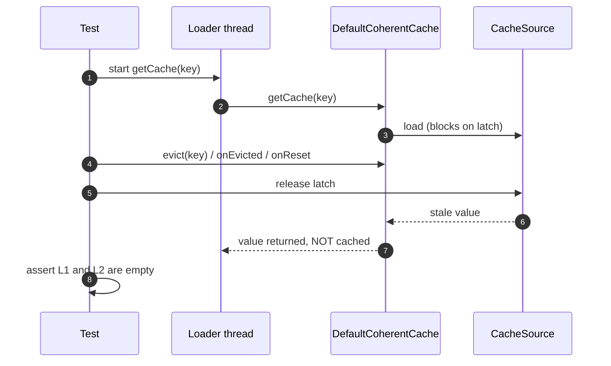

# Testing Overview

CoCache verifies every implementation against shared specifications in `cocache-test` (a Technology Compatibility Kit). A new store, cache, or event channel passes the same contract tests as the built-in ones.

## Spec Hierarchy

```mermaid
graph TB
    subgraph tck ["cocache-test (TCK)"]
        direction TB
        StoreSpec["CacheStoreSpec<br>store contract"]
        CSCSpec["ClientSideCacheSpec<br>+ clear / size"]
        DCSpec["DistributedCacheSpec"]
        CacheSpec["CacheSpec<br>Cache semantics"]
        CoherentSpec["DefaultCoherentCacheSpec<br>coherence invariants"]
        MISpec["MultipleInstanceSyncSpec<br>cross-instance sync"]
        EBSpec["CacheEvictedEventBusSpec<br>channel contract"]
    end

    subgraph core ["cocache-core tests"]
        Caffeine["CaffeineClientSideCacheTest"]
        Map["MapClientSideCacheTest"]
        InMem["InMemoryDistributedCacheTest"]
        Coherent["DefaultCoherentCacheTest"]
        Join["SimpleJoinCacheTest"]
        Local["LocalCacheEvictedEventBusTest"]
    end

    subgraph redis ["cocache-spring-redis tests"]
        RedisDC["RedisDistributedCachingTest"]
        RedisCoherent["RedisDefaultCoherentCacheTest"]
        RedisSync["RedisMultipleInstanceSyncTest"]
        RedisBus["RedisCacheEvictedEventBusTest"]
    end

    StoreSpec --> CSCSpec
    StoreSpec --> DCSpec
    CacheSpec --> CoherentSpec
    CSCSpec --> Caffeine
    CSCSpec --> Map
    DCSpec --> InMem
    DCSpec --> RedisDC
    CoherentSpec --> Coherent
    CoherentSpec --> RedisCoherent
    CacheSpec --> Join
    MISpec --> RedisSync
    EBSpec --> Local
    EBSpec --> RedisBus

    style StoreSpec fill:#2d333b,stroke:#6d5dfc,color:#e6edf3
    style CSCSpec fill:#2d333b,stroke:#6d5dfc,color:#e6edf3
    style DCSpec fill:#2d333b,stroke:#6d5dfc,color:#e6edf3
    style CacheSpec fill:#2d333b,stroke:#6d5dfc,color:#e6edf3
    style CoherentSpec fill:#2d333b,stroke:#6d5dfc,color:#e6edf3
    style MISpec fill:#2d333b,stroke:#6d5dfc,color:#e6edf3
    style EBSpec fill:#2d333b,stroke:#6d5dfc,color:#e6edf3
    style Caffeine fill:#2d333b,stroke:#6d5dfc,color:#e6edf3
    style Map fill:#2d333b,stroke:#6d5dfc,color:#e6edf3
    style InMem fill:#2d333b,stroke:#6d5dfc,color:#e6edf3
    style Coherent fill:#2d333b,stroke:#6d5dfc,color:#e6edf3
    style Join fill:#2d333b,stroke:#6d5dfc,color:#e6edf3
    style Local fill:#2d333b,stroke:#6d5dfc,color:#e6edf3
    style RedisDC fill:#2d333b,stroke:#6d5dfc,color:#e6edf3
    style RedisCoherent fill:#2d333b,stroke:#6d5dfc,color:#e6edf3
    style RedisSync fill:#2d333b,stroke:#6d5dfc,color:#e6edf3
    style RedisBus fill:#2d333b,stroke:#6d5dfc,color:#e6edf3
    style tck fill:#161b22,stroke:#8b949e,color:#e6edf3
    style core fill:#161b22,stroke:#8b949e,color:#e6edf3
    style redis fill:#161b22,stroke:#8b949e,color:#e6edf3
```

## Specs

| Spec | Verifies | Source |
|------|----------|--------|
| `CacheStoreSpec` | absent key → `null`; forever / `ttlAt` round trip; expired write evicts; negative-cache round trip; evict | [CacheStoreSpec.kt](https://github.com/Ahoo-Wang/CoCache/blob/main/cocache-test/src/main/kotlin/me/ahoo/cache/test/CacheStoreSpec.kt) |
| `ClientSideCacheSpec` | + `clear()`, `size` | [ClientSideCacheSpec.kt](https://github.com/Ahoo-Wang/CoCache/blob/main/cocache-test/src/main/kotlin/me/ahoo/cache/test/ClientSideCacheSpec.kt) |
| `DistributedCacheSpec` | store contract for L1 | [DistributedCacheSpec.kt](https://github.com/Ahoo-Wang/CoCache/blob/main/cocache-test/src/main/kotlin/me/ahoo/cache/test/DistributedCacheSpec.kt) |
| `CacheSpec` | `get`/`set`/`getTtlAt`/`evict`, negative cache via `setCache` | [CacheSpec.kt](https://github.com/Ahoo-Wang/CoCache/blob/main/cocache-test/src/main/kotlin/me/ahoo/cache/test/CacheSpec.kt) |
| `DefaultCoherentCacheSpec` | read-through, `missingTtl`, L1 → L2 fill, event handling, `onReset`, single load under concurrency, original exception propagation, recursive-load fail-fast, and every in-flight invalidation race | [DefaultCoherentCacheSpec.kt](https://github.com/Ahoo-Wang/CoCache/blob/main/cocache-test/src/main/kotlin/me/ahoo/cache/test/DefaultCoherentCacheSpec.kt) |
| `MultipleInstanceSyncSpec` | two instances sharing L1 + channel converge after set / evict | [MultipleInstanceSyncSpec.kt](https://github.com/Ahoo-Wang/CoCache/blob/main/cocache-test/src/main/kotlin/me/ahoo/cache/test/MultipleInstanceSyncSpec.kt) |
| `CacheEvictedEventBusSpec` | `register` triggers `onReset`; publish routing by cache name; unregister | [CacheEvictedEventBusSpec.kt](https://github.com/Ahoo-Wang/CoCache/blob/main/cocache-test/src/main/kotlin/me/ahoo/cache/test/consistency/CacheEvictedEventBusSpec.kt) |

## Race-Condition Tests

Every coherence defect fixed in 5.0 has a reproducing test in `DefaultCoherentCacheSpec`:

| Test | Reproduces |
|------|-----------|
| `local evict during in-flight load discards stale write-back` | 4.x: a local `evict` did not stop a concurrent load from writing an old value back |
| `local set during in-flight load keeps the newer value` | A concurrent load cannot overwrite an explicit `set` |
| `remote eviction during in-flight load discards ...` | A remote event that arrives during a load wins |
| `reset during in-flight load discards stale write-back` | A channel reset invalidates in-flight loads |
| `remote eviction during distributed read discards client side fill` | The L1 → L2 fill is guarded too |
| `CodecExecutorSpec.absentKeyIsMiss` (Redis) | 4.x: a key deleted mid-read was decoded as a negative cache |

```mermaid
sequenceDiagram
autonumber
    participant Test
    participant Loader as Loader thread
    participant Cache as DefaultCoherentCache
    participant Src as CacheSource

    Test->>Loader: start getCache(key)
    Loader->>Cache: getCache(key)
    Cache->>Src: load (blocks on latch)
    Test->>Cache: evict(key) / onEvicted / onReset
    Test->>Src: release latch
    Src-->>Cache: stale value
    Cache-->>Loader: value returned, NOT cached
    Test->>Test: assert L1 and L2 are empty
```

Conventions:

- Orchestrate with latches; never use sleeps to create an interleaving.
- Wait on a `finished` latch so a dead background thread fails the test instead of passing vacuously.
- Assert eventual cross-instance effects by polling with a timeout.

## Test Tools

| Tool | Usage |
|------|-------|
| JUnit 5 | Framework; `@ParameterizedTest` for concurrency levels |
| mockk | Mocking |
| fluent-assert | `import me.ahoo.test.asserts.assert`, then `.assert()` (never AssertJ `assertThat`) |

## Related Pages

- [Unit Testing](./unit-testing.md)
- [Integration Testing](./integration-testing.md)
- [Performance Patterns](./performance-patterns.md)
